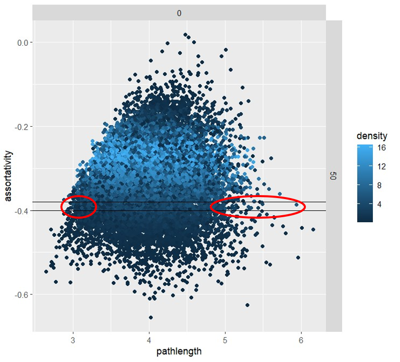

```{r setup, include=FALSE}

## Knitting options:
knitr::opts_chunk$set(echo=FALSE, warning=FALSE, message=FALSE,   
                      fig.pos = "!H", # default code chunk options
                      fig.width=12, fig.height=8, fig.align="center", comment=NA, # default figure dimensions
                      fig.path="./Figures/",                                      # save images to ./figures/
                      dpi=70, dev="jpeg",                                         # please set dpi=300 and comment out dev="jpeg" for high resolution but very big images
                      cache=FALSE, autodep=TRUE)                                  # cache chunks

## Various folders:
if( !dir.exists("./Figures") ) dir.create("./Figures", showWarnings=FALSE) # figures are saved here

set.seed(25)
```


# INTRODUCTION

This `HTML` document contains all the results and plots supporting the paper **network structure shapes languages: disentangling the factors driving variation in communicative agents**. All the data and scripts needed to reproduce this document are available in the [GitHub](https://github.com/mathjoss/NetworkStructure_ABM) repository.

## Typographic conventions

This `HTML` document uses the following font and color conventions:

- variables' name are represented using *italic text*
- emphasis is represented using **bold text**
- software or programming concepts (e.g., applications, packages or function names) are represented using `fixed font text`
- hyperlinks to sections of this document and to external resources on the web are represented as [link to the Introduction](#introduction) or [link to R project's website](https://www.r-project.org/)


## Software and hardware info

The full information about the version of `R` [@r2022]. 
The packages used to obtain this `html` file can be seen when opening the corresponding `Rmarkdown` file.

To perform the simulations, we used two different machines:

- Latitude 7400, DEll, with a processor Intel64 Family 6 Model 142 Stepping 12 GenuineIntel, x64bits, 16.0 Go RAM. R was used with version 4.2.1 and 4.3.0
- PO145, with a processor Intel(R) Core(TM) i5-8365U CPU @ 1.60GHz 1.90 GHz, x64bits, and 16.0 Go RAM. R was used with version 4.2.1. 


```{r, echo=FALSE, message=FALSE, warning=FALSE }

# Path with all (already cleaned) files 
path = "C:/Users/Mathilde JOSSERAND/Documents/NetworkStructure_ABM-main/Inputfiles/"
path_cr = "C:/Users/Mathilde JOSSERAND/Documents/NetworkStructure_ABM-main/cached_results/"

# Upload libraries
library(data.table)
library(ggplot2)
library(tidyr)
require(data.table)
library(stringi)
require(gridExtra)
library(caret)
library(heatmaply)
library(dplyr)
library(tidyverse)
library(entropy)
library(car)
library(corrplot)
library(knitr)
library(effsize)
library(FactoMineR)
library(factoextra)
library(sjPlot)
library(ggpubr)
library(randomForest)
library(pbapply)
library(rsample)
library(partykit)


# Function for density plots
get_density <- function(x, y, ...) {
  dens <- MASS::kde2d(x, y, ...)
  ix <- findInterval(x, dens$x)
  iy <- findInterval(y, dens$y)
  ii <- cbind(ix, iy)
  return(dens$z[ii])
}

# Path for files
pathfileout <- '.csv'
pathfile_output <- paste(path, "xxxx", sep="")

# Function to order correlation matrix
reorder_cormat <- function(cormat){
  dd <- as.dist((1-cormat)/2)
  hc <- hclust(dd)
  cormat <-cormat[hc$order, hc$order]
}

# Get lower triangle in correlation matrix
get_lower_tri<-function(cormat){
  cormat[upper.tri(cormat)] <- NA
  return(cormat)
}

# Get upper triangle in correlation matrix
get_upper_tri <- function(cormat){
  cormat[lower.tri(cormat)]<- NA
  return(cormat)
}

# Function to normalize data between 0 and 1
normalize_variable <- function(x) {
  (x - min(x)) / (max(x) - min(x))
}

# Function for standard error
se <- function(x) sd(x)/sqrt(length(x))


# Figure and Table caption adapted from https://stackoverflow.com/questions/37116632/rmarkdown-html-number-figures: 
outputFormat = opts_knit$get("rmarkdown.pandoc.to") # determine the output format of the document
if( is.null(outputFormat) ) outputFormat = "" # probably not run within knittr
capTabNo = 1 
capFigNo = 1 # figure and table caption numbering, for HTML do it manually

#Function to add the Figure Number
capTab = function(x){
  if(outputFormat == 'html'){
    x = paste0("**Table ",capTabNo,".** ",x,"")
    capTabNo <<- capTabNo + 1
  }; x
}

#Function to add the Figure Number
capFig = function(x, show_R_version=FALSE, show_package_versions=NULL, is_map=FALSE)
{
  if(outputFormat == 'html')
  {
    x <- paste0("**Figure ",capFigNo,".** ",x,"");
    if( show_R_version || (!is.null(show_package_versions) && length(show_package_versions) > 0) )
    {
      x <- paste0(x, " Figure generated using ");
      if( show_R_version ) x <- paste0(x, stringr::str_replace(R.version.string, stringr::fixed("R "), "[`R`](https://www.r-project.org/) "));
      if( !is.null(show_package_versions) && length(show_package_versions) > 0 )
      {
        x <- paste0(x, ifelse( show_R_version, " and ", " "));
        x <- paste0(x, ifelse( length(show_package_versions) > 1, "packages ", "package "));
        x <- paste0(x, paste0(vapply(show_package_versions, function(x) paste0("`",x,"`", " (version ", packageVersion(x),")"), character(1)), collapse=", "), ".");
      }
      if( is_map ) x <- paste0(x, " Maps are using public domain data from the [Natural Earth project](https://www.naturalearthdata.com/) as provided by the `R` package `maps`.");
    }
    capFigNo <<- capFigNo + 1;
  }; 
  x;
}


# Compute partial R²
compute_partial_r_squared <- function(full_model, reduced_model) {
  full_r_squared <- summary(full_model)$r.squared
  reduced_r_squared <- summary(reduced_model)$r.squared
  partial_r_squared <- full_r_squared - reduced_r_squared
  return(partial_r_squared)
}


find_info_cohend <- function(cohend){
  # find cohen's d
  d = abs(round(cohend$estimate,3))
  # find magnitude
  magn = cohend$magnitude
  
  # find confidence interval
  CI_inf = abs(round(as.numeric(cohend$conf.int[1]),3))
  CI_sup = abs(round(as.numeric(cohend$conf.int[2]),3))
  
  # treat special case when the confidence interval includes 0
  # case where the mean is negative
  if (as.numeric(cohend$conf.int[1]) < 0 & round(cohend$estimate,3) < 0 & as.numeric(cohend$conf.int[2]) > 0){
    del_inf <- abs(round(as.numeric(cohend$conf.int[1]),3)) - d
    del_sup <- round(as.numeric(cohend$conf.int[2]),3) - round(cohend$estimate,3)
    CI_inf = d - del_inf
    CI_sup = d + del_sup
  } 
  # case where the mean is positive
  if (as.numeric(cohend$conf.int[1]) < 0 & round(cohend$estimate,3) > 0 & as.numeric(cohend$conf.int[2]) > 0){
    del_inf <- d - round(as.numeric(cohend$conf.int[1]),3)
    del_sup <- abs(round(as.numeric(cohend$conf.int[2]),3)) - d
    CI_inf = d - del_inf
    CI_sup = d + del_sup
  } 
  my_list <- c(d, magn, CI_inf, CI_sup)
  return(my_list)
}


```

# DATA

For more information on the model, refer to the main paper.

## The procedure


We conducted three types of simulations: 

 - *DATASET 1*. In the first, we **systematically compared two sets of networks differing in exactly one metric**. 
 
 - *DATASET 2*. In the second, we used other datasets (with automatically generated random, scale-free, and small-world networks using a wide range of parameters) to complement these results and look at:
      - the **correlations** between the different metrics
      - the **relative contribution** of the  metrics by applying different types of models (machine learning models, such as random forests and support vector machines, as well as linear regression) using the different metrics normalized as predictors. These models help understand the relative contribution of each of these metrics in several network types. We expect to reach similar conclusions between network types and between methods. 
 
 - *DATASET 3*. In the third, we looked at the language value **and** variation in heterogeneous populations (where some agents are locally biased) in all types of networks.


## Step 1: generating datasets using Netlogo program

The Netlogo program is available in  the *GitHub* repository associated to this Supplementary Materials (see my [github](https://github.com/mathjoss/NetworkStructure_ABM) under the name `Netlogo_program_dirichlet.nlogo`. This is an extension of the Netlogo program available in our previous paper ["Interindividual variation refuses to go away: a Bayesian computer model of language change in communicative networks"](https://www.frontiersin.org/journals/psychology/articles/10.3389/fpsyg.2021.626118/full) (2021) published in *Frontiers in Psychology*, and available in the Supplementary Materials of this paper [here](https://github.com/mathjoss/bayes-in-network). While the model is the same, a few functions have been added (for example, it is now possible to study multinomial language features).

To understand how to use our Netlogo code and parameters, please refer to the Netlogo guide, a pdf file that can be found in the same [github](https://github.com/mathjoss/NetworkStructure_ABM) folder (see `appendix_netlogo.pdf` file)

Using this Netlogo file, we generated networks with specific properties. The results of the simulations are stored in a `Raw` folder. They have the following name: `DN_typesimulation_networktype`:

 - `N` can take the values *1*, *2*, or *3* depending on the dataset number
 - `typesimulation` can take the values *continuous* or *multinomial* depending on the language studied
 - `networktype` can take the values *scalefree*, *smallworld*, or *random* based on the network used to generate the simulations.
 
For example, a file `D1_dirichlet_random.csv` present in the folder `Raw` is the raw file obtained from Netlogo (using the code called `D1_dir_random` in Behavioral Space), and includes data obtained using *random* networks, a *multinomial* language, for the *dataset 1* (comparing sets of networks).

### Parameters

Below are the specific parameters used to generate networks on Netlogo. 

In Dataset 1, we conducted 100 replications for each combination of parameters. In Dataset 2, we generated 900 networks for each network type. This entailed 10 replications per combination for random networks, 5 replications per combination for small-world networks, and 100 replications per combination for scale-free networks. This choice was guided by the aim to maintain models with a similar amount of data. However, it is important to note that we also tried to study models with 100 replications for each combination of parameters within each network type (so much more data for small-world compared to scale-free networks), but this change did not impact any of our conclusions.

For *scale-free* networks:

| Dataset number | Size network | Init value Dirichlet |
| ----- |  ------ | ------ |
| Dataset 1 | 50; 100 | 0; 5; 20 |
| Dataset 2 | 50; 150; 300 |  0; 5; 20 | 
| Dataset 3 | 150 |   0; 5; 20 |


For *random* networks:

| Dataset number | Size network |  Connection probability | Init value Dirichlet |
| ----- |  ------ | ------ | ------ | 
| Dataset 1 | 50; 100 | 0.06; 0.24; 0.2;5 0.26 | 0; 5; 20 |
| Dataset 2 | 50; 150; 300 |  0.05; 0.15; 0.25; 0.35; 0.45; 0.55; 0.65; 0.75; 0.85; 0.95 |  0; 5; 20 |
| Dataset 3 | 150 | 0.08 |  0; 5; 20 |

For *small-world* networks:

| Dataset number | Size network | Number neighbors | Rewiring probability | Init value Dirichlet |
| ----- |  ------ | ------ | ------ | ------ | 
| Dataset 1 | 150 | 24 | 0.1; 0.9 | 0; 5; 20 |
| Dataset 2 | 50 150 | 2; 4; 8; 24 | 0.1; 0.3; 0.5; 0.7; 0.9 | 0 5 20 |
| Dataset 3 | 150 | 2 | 0.1; 0.9 | 0; 5; 20 |

### Note on Initial language exposure terminology

The value for initial language exposure (which we refer here as *init_lang_exp*) tells the number of utterance that have been heard after the agent is born. Since the agents are born with a vector = [1, 1, 1, 1, 1, 1, 1, 1, 1, 1], then their value in $u_4$ becomes 6 (5+1) or 21 (20+1). 

In the datasets, this variable has three modalities:

 - *init_lang_exp = 0* (so $u_4$ at first = 1, similar to other values of the Dirichlet parameters): we call this condition **without** initial language exposure. In the paper, we refer to this situation as **language emergence** scenario.
 - *init_lang_exp = 5* (so $u_4$ at first = 6, contrary to other Dirichlet values which = 1): we call this condition **with (weak)** initial language exposure. In the paper, we refer to this situation as **language change** scenario.
  - *init_lang_exp = 20* (so $u_4$ at first = 21, contrary to other Dirichlet values which = 1): we call this condition **with (strong)** initial language exposure. In the paper, we do not refer to this condition, but that it is also a scenario of language change.
  
In these Supplementary Materials, we preferentially refer to this variable with the modalities "Without", "With (weak)", and "With (strong)" (instead of language change and emergence) because it allows us to contrast between the two language change conditions (weak: $u_4$=6 and strong: $u_4$=21).

## Step 2: cleaning netlogo output files

After we performed the analysis in Netlogo, we obtained files which often contain thousands of simulations. Thus, these files are very heavy and hard to read, containing many unecessary informations (useless column, etc). (For example, for each network, we stored the final value of the Dirichlet vector for all agents!). We used **another Rmarkdown file** to clean this data (see `CleanData.RmD` in the [GitHub](https://github.com/mathjoss/NetworkStructure_ABM) folder). This file first selects only the columns containing meaningful information. Then, it computes the following:

### *DATASET 1*

 - **first**, it computes the exponent of the scale-free distribution given its degree distribution (thus, this step was only performed in scale-free networks). This exponent is what we will call the variable *"degree distribution"* (important note: we called it so for simplicity reasons, but this variable does not actually refer to the degree distribution! it shows the exponent, which is an indicator of the shape of the degree distribution). All values are usually included between 2 and 3 as the scale-free networks were generated using Barabasi-Albert algorithm. However, networks with an exponent of 2 have a distribution less skewed compared to network with an exponent of 3. 

 - **second**, it shows the density plots for the intersection of our different metrics (*pathlength*, *assortativity*, *size*, *clustering coefficient*, *degree distribution*): for example, we plot the values of the different simulations of *pathlength* in the *x* axis and the value of *assortativity* in the *y* axis. Thanks to these  plots, we could visualize what values of the different metrics to select while keeping one constant. Then, we selected sets of 100 networks with the desired values (see the method in the main paper for more information). Please note that we used several types of networks to investigate the effect of all metrics. Indeed, it is not that easy to find networks where only one metric differs from the others! Thus, we used scale-free network to investigate the effects of *pathlength*, *assortativity*, *size*, and *degree distribution*, random network to disentangle the effects of *mean degree* and *pathlength*, and small-world network to investigate the effect of *clustering coefficient.* 
 
 For example: for a network with a size of 50 people and an initial language exposure = with (weak), here is what looks like the plot with pathlength in x and assortiativty in y (one point is the average value for one network). 
 

To determine the thickness between the two black lines and the diameter of the red circles, we manually adjusted the values until we identified the smallest possible differences between our sets. It's important to note that other values could also be suitable. We experimented with various alternatives, such as smaller values for the control variables, resulting in smaller differences in the variables of interest. However, these adjustments did not alter the main conclusions.

 - **third**, it computes the mean of each metric for each condition. This data is gathered in a table, which is then exported under a file ending by `_tab_merge.csv`. 
 
 - **fourth**, we checked the maximum language value for each participant, for all replication. We save this dataframe in files ending by `_lang_merge.csv`.
 
 - **fifth**, we computed the measure of inter-individual variability (by estimating the Kullback-Leibler divergence on all pairs of agents) and intra-individual variability (by estimating the entropy for all agents, and then applying the mean or the standard deviation). We save this dataframe in file ending by `_merge.csv`. Please note that the computation of Kullback-Leibler divergence is quite long.
 
All these datasets were exported in a folder called `Multinomial` for simulations that used a multinomial language, and in a `Continuous` folder for simulations that used a continuous language.

### *DATASET 2* and *DATASET 3*
 
 - **first**, it computes the exponent of the scale-free distribution given its degree distribution.
 
 - **second**, we computed the measure of inter-individual variability (by estimating the Kullback-Leibler divergence on all pairs of agents) and intra-individual variability (by estimating the entropy for all agents, and then applying the mean or the standard deviation).  We save this dataframe in files ending by `_merge.csv` (note that the computation of Kullback-Leibler divergence is quite long).
 
In these datasets, we did not manually selected sets of networks.


### Summary of the results

Then, we aggregated these datasets into the same files. These files are the one used in this analysis and are available in the `Summary` folder:

| Input file |  Dataset | Type simulations | Type network | Information type |
|------------|-------------|-------------|-------------| -------------| -------------|
| `TIMELINE_continuous_scalefree.csv`  | Timeline | *continuous* language | *scale-free* | show the *variation* and *language* **at each round** in a few populations | 
| `TIMELINE_dirichlet_scalefree.csv`  | Timeline | *dirichlet* language | *scale-free* | show the *variation* and *language* **at each round** in a few populations | 
| `DATASET1_continuous_table.csv`  | Dataset **1** | *continuous* language | *scale-free*, *small-world*, *random* | gather information about the *metrics values for each set* in a table | 
| `DATASET1_continuous_variation.csv`  | Dataset **1** | *continuous* language | *scale-free*, *small-world*, *random* | gather information about the *language* and *variation* (inter and intra) for each simulation | 
| `DATASET1_dirichlet_table.csv`  | Dataset **1** | *dirichlet* language | *scale-free*, *small-world*, *random* | gather information about the *metrics values for each set* in a table | 
| `DATASET1_dirichlet_variation.csv`  | Dataset **1** | *dirichlet* language | *scale-free*, *small-world*, *random* | gather information about the *variation* (inter and intra) for each simulation | 
| `DATASET1_dirichlet_language.csv`  | Dataset **1** | *dirichlet* language | *scale-free*, *small-world*, *random* | gather information about the *language* for each agent in each simulation  | 
| `DATASET2_dirichlet.csv`  | Dataset **2** | *dirichlet* language | *scale-free*, *small-world* (with different rewire probability and average number of neighbors), *random* (with different connection probability) | gather information about the *variation* (inter and intra) for each simulation  | 
| `DATASET3_dirichlet_variation.csv`  | Dataset **3** | *dirichlet* language | *scale-free*, *small-world* (with two differnt probability of rewire), *random* | gather information about the *variation* (inter and intra) for each simulation  | 
| `DATASET3_dirichlet_language.csv`  | Dataset **3** | *dirichlet* language | *scale-free*, *small-world* (with two differnt probability of rewire), *random* | gather information about the *language*  for each simulation  | 
| `DATASET3_dirichlet_language_2.csv`  | Dataset **3** | *dirichlet* language | *scale-free*, *small-world* (with two differnt probability of rewire), *random* | gather information about the *language* (different type of language data) for each simulation  | 
| `DATASET3_supplementary.csv`  | Dataset **3** | *dirichlet* language | *scale-free*, *small-world* (with two differnt probability of rewire), *random* | structural information about the local metrics when the network is first build (no evolution of language with time)  | 


# RESULTS

Before looking at the results from the three datasets, we perform a preliminary analysis aiming at understanding when we should stop the simulations.

## Timeline

As a reminder, here, time is discretized into **iterations**, starting with iteration 0 (the initial condition of the simulation) in increments of 1. At each new iteration, i > 0, all agents produce one utterance using their own internal representation of language and production mechanism (as described in the method section of the main paper). Thus, the language of the population evolves at each iterations. We first aim to look how to the language evolves over the course of iterations. This allows us to choose after which iterations we stop the simulations.

The stabilization time was already explored in our previous paper [@josserand_interindividual_2021], thus we did not go into detail in this process here.  Stabilization time captures how long (in terms of interaction cycles) it takes for the language of a given network to reach a stable state. In our previous paper, we estimated the stabilization time based on the method developed in (@jannsen_let_2018) (p. 79). To do so, we used a fixed-size sliding window within which we estimate the change in the language value, we multiply this number by 10,000, round it, and stop if this number is equal to zero (i.e., the slope is within ±0.00001 of 0.0) for 50 consecutive steps. Practically speaking, the maximum number of ticks of our model is nIterations = 5000, and the size of the sliding window is $W = nIterations/10$. For a given window, we estimated the change, $t(e_g)$ using the following formula, where $g$ is the number of iterations.
$$t(e_g)=\frac{(e_{g+w}-e_g)}{W}*10000$$
On the rounded $t(e_g)$ values, we find the first value of $g$, $g_{stabilization}$, when the rounded value of $t(e_g) = 0$, and we stop if for 50 consecutive steps (i.e., $g \in [g_{stabilization}..(g_{stabilization}+50)]$), there is no change, $t(e_g) = 0$ in this case, the stabilization time is the first moment where there was no change, namely $g_{stabilization}$.

In our previous paper, Figure 13 shows the stabilization time for different network types (random, scale-free, and small-world). In this paper, we observed the stabilization time for two groups of agents (biased and unbiased). Overall, we observed that the stabilization time was never higher than 1000 iterations for any of the networks or any of the groups.

Since the model used in this paper is very similar (except that the language used is not *binary* anymore but *multinomial* or *continuous*), we expect similar results. However, due to the change in the type of language, we ran a few extra simulations to make sure these conclusions are transferable.


### Multinomial

```{r , echo=FALSE, message=FALSE, warning=FALSE}

mypath = "Summary/TIMELINE_dirichlet_scalefree"
pathfile <- paste(path, mypath, pathfileout, sep="")
var <- read.csv(pathfile)

```

We observe what happens with time (from round 1 to round 4000) in a scale-free network containing 150 nodes. We chose to look specifically at scale-free networks because it was the type of network that requires the most time to stabilize (see our previous paper -@josserand_interindividual_2021). We observe the evolution of different measures: inter-individual variation, the mean intra-individual variation and the std of intra-individual variation.

We look here at 10 different simulations : 

 - 5 simulations in networks with 50 agents
 - 5 simulations in networks with 150 agents
 
In the following graph, each simulation is characterized by its color. The vertical plain lines shows the stabilization value based on the method presented above. The vertical black dashed line shows our choice for selecting the final value of the language. 

```{r print timeline, echo=FALSE, message=FALSE, warning=FALSE, fig.cap=capFig('Looking at the evolution of our different measures (top: inter-individual variability middle: mean of intra-individual variability bottom: std of intra-individual variability) with time. All agents speaks once in one interaction. We observe here 10 different simulations. Each simulation has a specific color. The plain vertical line shows the stabilization time for each replication (corresponding colors). The dashed black line shows our choice for selecting the final value of the language.'), fig.height=10, fig.width=7}

var %>%
  mutate(size = case_when(size==50 ~ "Size:50",
                         size==150 ~ "Size:150")) -> var

var_agg <- aggregate(list(stab_inter = var$stab_inter,
                          stab_mean_intra = var$stab_mean_intra,
                          stab_std_intra = var$stab_std_intra), 
                     by=list(rep_id = var$rep_id,
                             size = var$size), FUN=mean)

var$rep_id <- as.factor(var$rep_id)
var_agg$rep_id <- as.factor(var_agg$rep_id)

p1 <- ggplot(var, aes(x=time, y=mean_intra_var, color=rep_id))+
  geom_point(size=0.5, alpha=0.8) +
  #geom_line()+
  guides(color=FALSE) +
  theme_bw(base_size=15) +
  facet_grid(. ~ size)+
  labs(y = "Mean Intra-Ind variation", x="Iterations") +
  scale_color_viridis_d()+
  geom_vline(xintercept = 3000, linetype="dashed") +
  geom_vline(data = var_agg, mapping = aes(xintercept = stab_mean_intra, color=rep_id))

p2 <- ggplot(data=var, aes(x=time, y=std_intra_var, color=rep_id))+
  #geom_line()+
  geom_point(size=0.5, alpha=0.8) +
  guides(color=FALSE) +
  facet_grid(. ~ size)+
  theme_bw(base_size=15) +
  scale_color_viridis_d()+
  labs(y = "Std Intra-Ind variation", x="Iterations") +
  geom_vline(xintercept = 3000, linetype="dashed") +
  geom_vline(data = var_agg, mapping = aes(xintercept = stab_std_intra, color=rep_id))

p3 <- ggplot(var, aes(x=time, y=inter_var, color=rep_id))+
  geom_point(size=0.5, alpha=0.8) +
  #geom_line()+
  guides(color=FALSE) +
  facet_grid(. ~ size)+
  theme_bw(base_size=15) +
  scale_color_viridis_d()+
  labs(y = "Inter-Ind variation", x="Iterations") +
  geom_vline(xintercept = 3000, linetype="dashed")  +
  geom_vline(data = var_agg, mapping = aes(xintercept = stab_inter, color=rep_id))

grid.arrange(p3, p1, p2, nrow=3)

```


According to this data, our measures of variation have always stabilized after *1500 interations.*

However, we decided here to study the language after agents have interacted during **3000 iterations**. Indeed, it does not require much more time to compute, and we make sure that the language will indeed be stabilized in all our simulations.

### Continuous

We did exactly the same but using the language simulations where language is repsented as a continuous feature..

```{r read timeline 2, echo=FALSE, message=FALSE, warning=FALSE}

mypath = "Summary/TIMELINE_continuous_scalefree"
pathfile <- paste(path, mypath, pathfileout, sep="")
var <- read.csv(pathfile)

```

We observe the evolution of different measures: inter-individual variation, the mean intra-individual variation and the std of intra-individual variation.

We look here at 10 different simulations : 

 - 5 simulations in networks with 50 agents
 - 5 simulations in networks with 150 agents
 
In the following graph, each simulation is characterized by its color.

Please note that in the first graph below (inter-individual variation), it seems that there is only one simulation (one color), but this is only the case because all simulations have almost the same values, so the points are superimposed.

```{r print timeline2, echo=FALSE, message=FALSE, warning=FALSE, fig.cap=capFig('Looking at the evolution of our different measures (top: inter-individual variability middle: mean of intra-individual variability bottom: std of intra-individual variability) with time. All agents speaks once in one interaction. We observe here 10 different simulations. Each simulation has a specific color. The plain vertical line shows the stabilization time for each replication (corresponding colors). The dashed black line shows our choice for selecting the final value of the language.'), fig.height=10, fig.width=7}

var %>%
  mutate(size = case_when(size==50 ~ "Size:50",
                         size==150 ~ "Size:150")) -> var

var_agg <- aggregate(list(stab_inter = var$stab_inter,
                          stab_mean_intra = var$stab_mean_intra,
                          stab_std_intra = var$stab_std_intra), 
                     by=list(rep_id = var$rep_id,
                             size = var$size), FUN=mean)

var$rep_id <- as.factor(var$rep_id)
var_agg$rep_id <- as.factor(var_agg$rep_id)

p1 <- ggplot(var, aes(x=time, y=mean_intra_var, color=rep_id))+
  geom_point(size=0.5, alpha=0.8) +
  #geom_line()+
  guides(color=FALSE) +
  theme_bw(base_size=15) +
  facet_grid(. ~ size)+
  labs(y = "Mean Intra-Ind variation", x="Iterations") +
  scale_color_viridis_d()+
  geom_vline(xintercept = 3000, linetype="dashed") +
  geom_vline(data = var_agg, mapping = aes(xintercept = stab_mean_intra, color=rep_id))

p2 <- ggplot(data=var, aes(x=time, y=std_intra_var, color=rep_id))+
  #geom_line()+
  geom_point(size=0.5, alpha=0.8) +
  guides(color=FALSE) +
  facet_grid(. ~ size)+
  theme_bw(base_size=15) +
  scale_color_viridis_d()+
  labs(y = "Std Intra-Ind variation", x="Iterations") +
  geom_vline(xintercept = 3000, linetype="dashed") +
  geom_vline(data = var_agg, mapping = aes(xintercept = stab_std_intra, color=rep_id))

p3 <- ggplot(var, aes(x=time, y=inter_var, color=rep_id))+
  geom_point(size=0.5, alpha=0.8) +
  #geom_line()+
  guides(color=FALSE) +
  facet_grid(. ~ size)+
  theme_bw(base_size=15) +
  scale_color_viridis_d()+
  labs(y = "Inter-Ind variation", x="Iterations") +
  geom_vline(xintercept = 3000, linetype="dashed")  +
  geom_vline(data = var_agg, mapping = aes(xintercept = stab_inter, color=rep_id))

grid.arrange(p3, p1, p2, nrow=3)

```

Popualtions with continuous language take way less time to stabilize. For simplicity reasons, we use the same threshold as for multinomial language.


**Summary**:

We record the final value of the language after 3000 iterations.

## DATASET 1: comparing sets of networks


### Multinomial

This part first presents the detailed results for each metric. However, you can refer to the [Summary multinomial] part, where you can see all the information in one plot. 

```{r , echo=FALSE, message=FALSE, warning=FALSE}

# read the file with information about final value of language
mypath = "Summary/DATASET1_dirichlet_language"
pathfile <- paste(path, mypath, pathfileout, sep="")
lang <- read.csv(pathfile)

# read the file with information about final value of variation
mypath = "Summary/DATASET1_dirichlet_variation"
pathfile <- paste(path, mypath, pathfileout, sep="")
var <- read.csv(pathfile)

# read the file with summary information about the metrics value in the sets
mypath = "Summary/DATASET1_dirichlet_table"
pathfile <- paste(path, mypath, pathfileout, sep="")
tab <- read.csv(pathfile, row.names=1)

# reformat for beautiful printing
var %>% 
  mutate(path_type = case_when(path_type=="High" ~ "High pathlength",
                              path_type=="Low" ~ "Low pathlength",
                               path_type=="None" ~ "None"),
         ass_type = case_when(ass_type=="High" ~ "High assortativity",
                                ass_type=="Low" ~ "Low assortativity",
                                ass_type=="None" ~ "None"),
         exp_type = case_when(exp_type=="High" ~ "High exponent",
                                exp_type=="Low" ~ "Low exponent",
                                exp_type=="None" ~ "None"),
         size_type = case_when(size_type=="High" ~ "Big network",
                                size_type=="Low" ~ "Small network",
                                size_type=="None" ~ "None"),
         clus_type = case_when(clus_type=="High" ~ "High clustering",
                                clus_type=="Low" ~ "Low clustering",
                                clus_type=="None" ~ "None"),
         neigh_type = case_when(neigh_type=="High" ~ "High node degree",
                                neigh_type=="Low" ~ "Low node degree",
                                neigh_type=="None" ~ "None")) -> var_print

# reformat the language value 
lang_all <- merge(lang, var[,c("rep_id", "path_type", "ass_type", "exp_type", "size_type", "clus_type", "neigh_type", "network_type")], by=c("rep_id", "network_type"))
lang_all$most_used_utt <- as.factor(lang_all$most_used_utt)

# store this for further plotting
var_ok <- var


```


#### Pathlength

These sets of networks were obtained using **scale-free** networks.

```{r , echo=FALSE, message=FALSE, warning=FALSE}

var_sf <- var[var$network_type=="Scalefree",]
var_sf_print <- var_print[var_print$network_type=="Scalefree",]
lang_sf <- lang[lang$network_type=="Scalefree",]
lang_sf_all <- lang_all[lang_all$network_type=="Scalefree",]
tab_sf <- tab[tab$network_type=="Scalefree",]


```

We first observe the values of the two sets:

```{r , echo=FALSE, message=FALSE, warning=FALSE}

tab_sf_path <- tab_sf[c("path_small", "path_high"),]
rownames(tab_sf_path) <- c("Low pathlength set", "High pathlength set")
knitr::kable(tab_sf_path)
```

This should be interpreted in the following way:

- there is a difference of `r round(tab_sf[c("diff_path"),c("pathlength")],4)` between the two sets concerning *pathlength*
- there are differences of `r round(tab_sf[c("diff_path"),c("neighbors")],4)` for the *neighbors*, `r round(tab_sf[c("diff_path"),c("clustering")],4)` for the *clustering* coefficient, `r round(tab_sf[c("diff_path"),c("assortativity")],4)` for the *assortativity*, `r round(tab_sf[c("diff_path"),c("exponent")],4)` for the *exponent*, and `r round(tab_sf[c("diff_path"),c("size")],4)` for the *size*

Thus, we compare the differences in inter and intra-individual variation between the two sets. We believe that these differences will reflect the differences in *pathlength*, as the other metrics are kept (almost) constant. 

We look at the differences between the two sets:

```{r , echo=FALSE, message=FALSE, warning=FALSE,  fig.cap=capFig('Looking at the variability inter- and intra-individual in sets varying in *pathlength*. The first graph shows the value of the language: it shows the favorite utterance for each agents in the three types of population (variable initial language exposure). The second graph shows the  inter-individual variation (the x scale is the average Kullback-Leibler divergence on all pairs of agents). The third and fourth graph show respectively the mean and standard deviation on the intra-individual variation for all agents (the x scale shows respectively the mean and the std of the entropy on the Dirichlet internal representation of agents). In all the following graphs, green shows high value in the metrics while yellow shows low value in the metric.'), fig.height=16, fig.width=7}

p0 <- ggplot(data=lang_sf_all[lang_sf_all$path_type!="None",], aes(x=most_used_utt, fill=path_type)) +
  geom_histogram(stat="count", position="dodge") +
  facet_grid(init_lang_exp ~ .) +
  theme_bw(base_size=15) +
  #guides(fill=FALSE) +
  labs(x="Favorite utterance", y="Number of agents", fill="Pathlength set") +
  scale_fill_viridis_d(begin = 0.5, end=0.98) 


p1 <- ggplot(data=var_sf_print[var_sf_print$path_type != "None",], aes(x=path_type, y=inter_var, fill=path_type)) +
  #geom_hline(yintercept = 0.5, linetype="dotted") + 
  geom_boxplot() +
  facet_grid(init_lang_exp ~ .) +
  theme_bw(base_size=15) +
  guides(fill=FALSE) +
  labs(x="", y="Inter-individual variation") +
  #ylim(0, 1)+
  scale_fill_viridis_d(begin = 0.5, end=0.98) +
  coord_flip()

p2 <- ggplot(data=var_sf_print[var_sf_print$path_type != "None",], aes(x=path_type, y=mean_intra_var, fill=path_type)) +
  #geom_hline(yintercept = 0.5, linetype="dotted") + 
  geom_boxplot() +
  facet_grid(init_lang_exp ~ .) +
  theme_bw(base_size=15) +
  guides(fill=FALSE) +
  labs(x="", y="Mean Intra-individual variation") +
  #ylim(0, 1)+
  scale_fill_viridis_d(begin = 0.5, end=0.98) +
  coord_flip() 


p3 <- ggplot(data=var_sf_print[var_sf_print$path_type != "None",], aes(x=path_type, y=std_intra_var, fill=path_type)) +
  #geom_hline(yintercept = 0.5, linetype="dotted") + 
  geom_boxplot() +
  facet_grid(init_lang_exp ~ .) +
  theme_bw(base_size=15) +
  guides(fill=FALSE) +
  labs(x="", y="Sd Intra-individual variation") +
  #ylim(0, 1)+
  scale_fill_viridis_d(begin = 0.5, end=0.98) +
  coord_flip()

#grid.arrange(p0, p1, p2, p3, nrow=4)

grid.arrange(p0, p1, p2, p3, nrow=4)

```


Here, we want to understand whether the effect size under these differences is high or low. 


We apply Cohen's d test and a classic t.test, in networks **without** language exposure, **with (weak)** language exposure, and **with (strong)** language exposure. We gathered the results in a summary table:


Cohen's *D*:
```{r , echo=FALSE, message=FALSE, warning=FALSE}

summary_cohend_path <- data.frame()
summary_ttest_path <- data.frame()

## INTER

for (type_lang in c("Without", "With (weak)", "With (strong)")){
  
  cohend <-cohen.d(var_sf$inter_var[var_sf$path_type == "High" & var_sf$init_lang_exp == type_lang], var_sf$inter_var[var_sf$path_type == "Low" & var_sf$init_lang_exp == type_lang])
  list_info <- find_info_cohend(cohend)
  subdf <- data.frame(Measure = c("pathlength"), TypeVariation = "Inter", TypeLangage=type_lang, CohenD = list_info[1], Magnitude = list_info[2], CI_Inf = list_info[3], CI_Sup = list_info[4])
  summary_cohend_path <- rbind(summary_cohend_path, subdf)

  
  ttest = t.test(var_sf$inter_var[var_sf$path_type == "High" & var_sf$init_lang_exp == type_lang], var_sf$inter_var[var_sf$path_type == "Low" & var_sf$init_lang_exp == type_lang])
  t = round(as.numeric(ttest$statistic),3)
  df = round(as.numeric(ttest$parameter),3)
  pvalue = as.numeric(ttest$p.value)
  CI_inf = round(as.numeric(cohend$conf.int[1]),3)
  CI_sup = round(as.numeric(cohend$conf.int[2]),3)
  
    subdf <- data.frame(Measure = c("pathlength"), TypeVariation = "Inter", TypeLangage=type_lang, T_value = t, DF = df, PValue = pvalue, CI_Inf = CI_inf, CI_Sup = CI_sup)
  summary_ttest_path <- rbind(summary_ttest_path, subdf)

}

## MEAN INTRA

for (type_lang in c("Without", "With (weak)", "With (strong)")){
  
  cohend <-cohen.d(var_sf$mean_intra_var[var_sf$path_type == "High" & var_sf$init_lang_exp == type_lang], var_sf$mean_intra_var[var_sf$path_type == "Low" & var_sf$init_lang_exp == type_lang])
  list_info <- find_info_cohend(cohend)
  subdf <- data.frame(Measure = c("pathlength"), TypeVariation = "Mean Intra", TypeLangage=type_lang, CohenD = list_info[1], Magnitude = list_info[2], CI_Inf = list_info[3], CI_Sup = list_info[4])
  summary_cohend_path <- rbind(summary_cohend_path, subdf)

  
  ttest = t.test(var_sf$mean_intra_var[var_sf$path_type == "High" & var_sf$init_lang_exp == type_lang], var_sf$mean_intra_var[var_sf$path_type == "Low" & var_sf$init_lang_exp == type_lang])
  t = round(as.numeric(ttest$statistic),3)
  df = round(as.numeric(ttest$parameter),3)
  pvalue = as.numeric(ttest$p.value)
  CI_inf = round(as.numeric(cohend$conf.int[1]),3)
  CI_sup = round(as.numeric(cohend$conf.int[2]),3)
  
    subdf <- data.frame(Measure = c("pathlength"), TypeVariation = "Mean Intra", TypeLangage=type_lang, T_value = t, DF = df, PValue = pvalue, CI_Inf = CI_inf, CI_Sup = CI_sup)
  summary_ttest_path <- rbind(summary_ttest_path, subdf)

}

## STD INTRA

for (type_lang in c("Without", "With (weak)", "With (strong)")){
  
  cohend <-cohen.d(var_sf$std_intra_var[var_sf$path_type == "High" & var_sf$init_lang_exp == type_lang], var_sf$std_intra_var[var_sf$path_type == "Low" & var_sf$init_lang_exp == type_lang])
  list_info <- find_info_cohend(cohend)
  subdf <- data.frame(Measure = c("pathlength"), TypeVariation = "Std Intra", TypeLangage=type_lang, CohenD = list_info[1], Magnitude = list_info[2], CI_Inf = list_info[3], CI_Sup = list_info[4])
  summary_cohend_path <- rbind(summary_cohend_path, subdf)

  
  ttest = t.test(var_sf$std_intra_var[var_sf$path_type == "High" & var_sf$init_lang_exp == type_lang], var_sf$std_intra_var[var_sf$path_type == "Low" & var_sf$init_lang_exp == type_lang])
  t = round(as.numeric(ttest$statistic),3)
  df = round(as.numeric(ttest$parameter),3)
  pvalue = as.numeric(ttest$p.value)
  CI_inf = round(as.numeric(cohend$conf.int[1]),3)
  CI_sup = round(as.numeric(cohend$conf.int[2]),3)
  
    subdf <- data.frame(Measure = c("pathlength"), TypeVariation = "Std Intra", TypeLangage=type_lang, T_value = t, DF = df, PValue = pvalue, CI_Inf = CI_inf, CI_Sup = CI_sup)
  summary_ttest_path <- rbind(summary_ttest_path, subdf)

}

kable(summary_cohend_path)
```

*T*-Test:
```{r , echo=FALSE, message=FALSE, warning=FALSE}

kable(summary_ttest_path)
```


#### Assortativity 

These sets of networks were obtained using **scale-free** networks.

We first observe the values of the two sets:

```{r , echo=FALSE, message=FALSE, warning=FALSE}

tab_sf_ass <- tab_sf[c("ass_small", "ass_high"),]
rownames(tab_sf_ass) <- c("Low assortativity set", "High assortativity set")
knitr::kable(tab_sf_ass)

```

This should be interpreted in the following way:

- there is a difference of `r round(tab_sf[c("diff_ass"),c("assortativity")],4)` between the two sets concerning *assortativity*
- there are differences of `r round(tab_sf[c("diff_ass"),c("neighbors")],4)` for the *neighbors*, `r round(tab_sf[c("diff_ass"),c("clustering")],4)` for the *clustering* coefficient, `r round(tab_sf[c("diff_ass"),c("pathlength")],4)` for the *pathlength*, `r round(tab_sf[c("diff_ass"),c("exponent")],4)` for the *exponent*, and `r round(tab_sf[c("diff_ass"),c("size")],4)` for the *size*

Thus, we compare the differences in inter and intra-individual variation between the two sets. We believe that these differences will reflect the differences in *assortativity*, as the other metrics are kept (almost) constant. 

We look at the differences between the two sets:

```{r , echo=FALSE, message=FALSE, warning=FALSE,  fig.cap=capFig('Looking at the variability inter- and intra-individual in sets varying in *assortativity*. The first graph shows the value of the language: it shows the favorite utterance for each agents in the three types of population (variable initial language exposure). The second graph shows the  inter-individual variation (the x scale is the average Kullback-Leibler divergence on all pairs of agents). The third and fourth graph show respectively the mean and standard deviation on the intra-individual variation for all agents (the x scale shows respectively the mean and the std of the entropy on the Dirichlet internal representation of agents). In all the following graphs, green shows high value in the metrics while yellow shows low value in the metric.'), fig.height=16, fig.width=7}

p0 <- ggplot(data=lang_sf_all[lang_sf_all$ass_type!="None",], aes(x=most_used_utt, fill=ass_type)) +
  geom_histogram(stat="count", position="dodge") +
  facet_grid(init_lang_exp ~ .) +
  theme_bw(base_size=15) +
  #guides(fill=FALSE) +
  labs(x="Favorite utterance", y="Number of agents", fill="Assortativity set") +
  scale_fill_viridis_d(begin = 0.5, end=0.98) 

p1 <- ggplot(data=var_sf_print[var_sf_print$ass_type != "None",], aes(x=ass_type, y=inter_var, fill=ass_type)) +
  #geom_hline(yintercept = 0.5, linetype="dotted") + 
  geom_boxplot() +
  facet_grid(init_lang_exp ~ .) +
  theme_bw(base_size=15) +
  guides(fill=FALSE) +
  labs(x="", y="Inter-individual variation") +
  #ylim(0, 1)+
  scale_fill_viridis_d(begin = 0.5, end=0.98) +
  coord_flip()

p2 <- ggplot(data=var_sf_print[var_sf_print$ass_type != "None",], aes(x=ass_type, y=mean_intra_var, fill=ass_type)) +
  #geom_hline(yintercept = 0.5, linetype="dotted") + 
  geom_boxplot() +
  facet_grid(init_lang_exp ~ .) +
  theme_bw(base_size=15) +
  guides(fill=FALSE) +
  labs(x="", y="Mean Intra-individual variation") +
  #ylim(0, 1)+
  scale_fill_viridis_d(begin = 0.5, end=0.98) +
  coord_flip() 

p3 <- ggplot(data=var_sf_print[var_sf_print$ass_type != "None",], aes(x=ass_type, y=std_intra_var, fill=ass_type)) +
  #geom_hline(yintercept = 0.5, linetype="dotted") + 
  geom_boxplot() +
  facet_grid(init_lang_exp ~ .) +
  theme_bw(base_size=15) +
  guides(fill=FALSE) +
  labs(x="", y="Sd Intra-individual variation") +
  #ylim(0, 1)+
  scale_fill_viridis_d(begin = 0.5, end=0.98) +
  coord_flip()


grid.arrange(p0, p1, p2, p3, nrow=4)

```

We want to understand whether the effect size under these differences is high or low. 

We apply Cohen's d test and a classic t.test, in networks **without** language exposure, **with (weak)** language exposure, and **with (strong)** language exposure. We gathered the results in a summary table:

Cohen's *D*:
```{r , echo=FALSE, message=FALSE, warning=FALSE}

summary_cohend_ass <- data.frame()
summary_ttest_ass <- data.frame()

## INTER

for (type_lang in c("Without", "With (weak)", "With (strong)")){
  
  cohend <-cohen.d(var_sf$inter_var[var_sf$ass_type == "High" & var_sf$init_lang_exp == type_lang], var_sf$inter_var[var_sf$ass_type == "Low" & var_sf$init_lang_exp == type_lang])
  list_info <- find_info_cohend(cohend)
  subdf <- data.frame(Measure = c("assortativity"), TypeVariation = "Inter", TypeLangage=type_lang, CohenD = list_info[1], Magnitude = list_info[2], CI_Inf = list_info[3], CI_Sup = list_info[4])
  summary_cohend_ass <- rbind(summary_cohend_ass, subdf)

  
  ttest = t.test(var_sf$inter_var[var_sf$ass_type == "High" & var_sf$init_lang_exp == type_lang], var_sf$inter_var[var_sf$ass_type == "Low" & var_sf$init_lang_exp == type_lang])
  t = round(as.numeric(ttest$statistic),3)
  df = round(as.numeric(ttest$parameter),3)
  pvalue = as.numeric(ttest$p.value)
  CI_inf = round(as.numeric(cohend$conf.int[1]),3)
  CI_sup = round(as.numeric(cohend$conf.int[2]),3)
  
    subdf <- data.frame(Measure = c("assortativity"), TypeVariation = "Inter", TypeLangage=type_lang, T_value = t, DF = df, PValue = pvalue, CI_Inf = CI_inf, CI_Sup = CI_sup)
  summary_ttest_ass <- rbind(summary_ttest_ass, subdf)

}

## MEAN INTRA

for (type_lang in c("Without", "With (weak)", "With (strong)")){
  
  cohend <-cohen.d(var_sf$mean_intra_var[var_sf$ass_type == "High" & var_sf$init_lang_exp == type_lang], var_sf$mean_intra_var[var_sf$ass_type == "Low" & var_sf$init_lang_exp == type_lang])
  list_info <- find_info_cohend(cohend)
  subdf <- data.frame(Measure = c("assortativity"), TypeVariation = "Mean Intra", TypeLangage=type_lang, CohenD = list_info[1], Magnitude = list_info[2], CI_Inf = list_info[3], CI_Sup = list_info[4])
  summary_cohend_ass <- rbind(summary_cohend_ass, subdf)
  
  ttest = t.test(var_sf$mean_intra_var[var_sf$ass_type == "High" & var_sf$init_lang_exp == type_lang], var_sf$mean_intra_var[var_sf$ass_type == "Low" & var_sf$init_lang_exp == type_lang])
  t = round(as.numeric(ttest$statistic),3)
  df = round(as.numeric(ttest$parameter),3)
  pvalue = as.numeric(ttest$p.value)
  CI_inf = round(as.numeric(cohend$conf.int[1]),3)
  CI_sup = round(as.numeric(cohend$conf.int[2]),3)
  
    subdf <- data.frame(Measure = c("assortativity"), TypeVariation = "Mean Intra", TypeLangage=type_lang, T_value = t, DF = df, PValue = pvalue, CI_Inf = CI_inf, CI_Sup = CI_sup)
  summary_ttest_ass <- rbind(summary_ttest_ass, subdf)

}

## MEAN INTRA

for (type_lang in c("Without", "With (weak)", "With (strong)")){
  
  cohend <-cohen.d(var_sf$std_intra_var[var_sf$ass_type == "High" & var_sf$init_lang_exp == type_lang], var_sf$std_intra_var[var_sf$ass_type == "Low" & var_sf$init_lang_exp == type_lang])
  list_info <- find_info_cohend(cohend)
  subdf <- data.frame(Measure = c("assortativity"), TypeVariation = "Std Intra", TypeLangage=type_lang, CohenD = list_info[1], Magnitude = list_info[2], CI_Inf = list_info[3], CI_Sup = list_info[4])
  summary_cohend_ass <- rbind(summary_cohend_ass, subdf)

  
  ttest = t.test(var_sf$std_intra_var[var_sf$ass_type == "High" & var_sf$init_lang_exp == type_lang], var_sf$std_intra_var[var_sf$ass_type == "Low" & var_sf$init_lang_exp == type_lang])
  t = round(as.numeric(ttest$statistic),3)
  df = round(as.numeric(ttest$parameter),3)
  pvalue = as.numeric(ttest$p.value)
  CI_inf = round(as.numeric(cohend$conf.int[1]),3)
  CI_sup = round(as.numeric(cohend$conf.int[2]),3)
  
    subdf <- data.frame(Measure = c("assortativity"), TypeVariation = "Std Intra", TypeLangage=type_lang, T_value = t, DF = df, PValue = pvalue, CI_Inf = CI_inf, CI_Sup = CI_sup)
  summary_ttest_ass <- rbind(summary_ttest_ass, subdf)

}

kable(summary_cohend_ass)
```

*T*-Test:
```{r , echo=FALSE, message=FALSE, warning=FALSE}

kable(summary_ttest_ass)
```


#### Exponent - Degree distribution

These sets of networks were obtained using **scale-free** networks.

We first observe the values of the two sets:

```{r , echo=FALSE, message=FALSE, warning=FALSE}

tab_sf_exp <- tab_sf[c("exp_small", "exp_high"),]
rownames(tab_sf_exp) <- c("Low exponent set", "High exponent set")
knitr::kable(tab_sf_exp)

```

This should be interpreted in the following way:

- there is a difference of `r round(tab_sf[c("diff_exp"),c("exponent")],4)` between the two sets concerning *exponent*
- there are differences of `r round(tab_sf[c("diff_exp"),c("neighbors")],4)` for the *neighbors*, `r round(tab_sf[c("diff_exp"),c("clustering")],4)` for the *clustering* coefficient, `r round(tab_sf[c("diff_exp"),c("pathlength")],4)` for the *pathlength*, `r round(tab_sf[c("diff_exp"),c("assortativity")],4)` for the *assortativity*, and `r round(tab_sf[c("diff_exp"),c("size")],4)` for the *size*

Thus, we compare the differences in inter and intra-individual variation between the two sets. We believe that these differences will reflect the differences in exponent, as the other metrics are kept (almost) constant. 

We look at the differences between the two sets:

```{r , echo=FALSE, message=FALSE, warning=FALSE,  fig.cap=capFig('Looking at the variability inter- and intra-individual in sets varying in *exponent*. The first graph shows the value of the language: it shows the favorite utterance for each agents in the three types of population (variable initial language exposure). The second graph shows the  inter-individual variation (the x scale is the average Kullback-Leibler divergence on all pairs of agents). The third and fourth graph show respectively the mean and standard deviation on the intra-individual variation for all agents (the x scale shows respectively the mean and the std of the entropy on the Dirichlet internal representation of agents). In all the following graphs, green shows high value in the metrics while yellow shows low value in the metric.'), fig.height=16, fig.width=7}

p0 <- ggplot(data=lang_sf_all[lang_sf_all$exp_type!="None",], aes(x=most_used_utt, fill=exp_type)) +
  geom_histogram(stat="count", position="dodge") +
  facet_grid(init_lang_exp ~ .) +
  theme_bw(base_size=15) +
  #guides(fill=FALSE) +
  labs(x="Favorite utterance", y="Number of agents", fill="Exponent set") +
  scale_fill_viridis_d(begin = 0.5, end=0.98) 

p1 <- ggplot(data=var_sf_print[var_sf_print$exp_type != "None",], aes(x=exp_type, y=inter_var, fill=exp_type)) +
  #geom_hline(yintercept = 0.5, linetype="dotted") + 
  geom_boxplot() +
  facet_grid(init_lang_exp ~ .) +
  theme_bw(base_size=15) +
  guides(fill=FALSE) +
  labs(x="", y="Inter-individual variation") +
  #ylim(0, 1)+
  scale_fill_viridis_d(begin = 0.5, end=0.98) +
  coord_flip()

p2 <- ggplot(data=var_sf_print[var_sf_print$exp_type != "None",], aes(x=exp_type, y=mean_intra_var, fill=exp_type)) +
  #geom_hline(yintercept = 0.5, linetype="dotted") + 
  geom_boxplot() +
  facet_grid(init_lang_exp ~ .) +
  theme_bw(base_size=15) +
  guides(fill=FALSE) +
  labs(x="", y="Mean Intra-individual variation") +
  #ylim(0, 1)+
  scale_fill_viridis_d(begin = 0.5, end=0.98) +
  coord_flip() 

p3 <- ggplot(data=var_sf_print[var_sf_print$exp_type != "None",], aes(x=exp_type, y=std_intra_var, fill=exp_type)) +
  #geom_hline(yintercept = 0.5, linetype="dotted") + 
  geom_boxplot() +
  facet_grid(init_lang_exp ~ .) +
  theme_bw(base_size=15) +
  guides(fill=FALSE) +
  labs(x="", y="Sd Intra-individual variation") +
  #ylim(0, 1)+
  scale_fill_viridis_d(begin = 0.5, end=0.98) +
  coord_flip()


grid.arrange(p0, p1, p2, p3, nrow=4)

```

Here, we want to understand whether the effect size under these differences is high or low. 

We apply Cohen's d test and a classic t.test, in networks **without** language exposure, **with (weak)** language exposure, and **with (strong)** language exposure. We gathered the results in a summary table:

Cohen's *D*:
```{r , echo=FALSE, message=FALSE, warning=FALSE}

summary_cohend_exp <- data.frame()
summary_ttest_exp <- data.frame()

## INTER

for (type_lang in c("Without", "With (weak)", "With (strong)")){
  
  cohend <-cohen.d(var_sf$inter_var[var_sf$exp_type == "High" & var_sf$init_lang_exp == type_lang], var_sf$inter_var[var_sf$exp_type == "Low" & var_sf$init_lang_exp == type_lang])
  list_info <- find_info_cohend(cohend)
  subdf <- data.frame(Measure = c("exponent"), TypeVariation = "Inter", TypeLangage=type_lang, CohenD = list_info[1], Magnitude = list_info[2], CI_Inf = list_info[3], CI_Sup = list_info[4])
  summary_cohend_exp <- rbind(summary_cohend_exp, subdf)

  
  ttest = t.test(var_sf$inter_var[var_sf$exp_type == "High" & var_sf$init_lang_exp == type_lang], var_sf$inter_var[var_sf$exp_type == "Low" & var_sf$init_lang_exp == type_lang])
  t = round(as.numeric(ttest$statistic),3)
  df = round(as.numeric(ttest$parameter),3)
  pvalue = as.numeric(ttest$p.value)
  CI_inf = round(as.numeric(cohend$conf.int[1]),3)
  CI_sup = round(as.numeric(cohend$conf.int[2]),3)
  
    subdf <- data.frame(Measure = c("exponent"), TypeVariation = "Inter", TypeLangage=type_lang, T_value = t, DF = df, PValue = pvalue, CI_Inf = CI_inf, CI_Sup = CI_sup)
  summary_ttest_exp <- rbind(summary_ttest_exp, subdf)

}

## MEAN INTRA

for (type_lang in c("Without", "With (weak)", "With (strong)")){
  
  cohend <-cohen.d(var_sf$mean_intra_var[var_sf$exp_type == "High" & var_sf$init_lang_exp == type_lang], var_sf$mean_intra_var[var_sf$exp_type == "Low" & var_sf$init_lang_exp == type_lang])
  list_info <- find_info_cohend(cohend)
  subdf <- data.frame(Measure = c("exponent"), TypeVariation = "Mean Intra", TypeLangage=type_lang, CohenD = list_info[1], Magnitude = list_info[2], CI_Inf = list_info[3], CI_Sup = list_info[4])
  summary_cohend_exp <- rbind(summary_cohend_exp, subdf)

  
  ttest = t.test(var_sf$mean_intra_var[var_sf$exp_type == "High" & var_sf$init_lang_exp == type_lang], var_sf$mean_intra_var[var_sf$exp_type == "Low" & var_sf$init_lang_exp == type_lang])
  t = round(as.numeric(ttest$statistic),3)
  df = round(as.numeric(ttest$parameter),3)
  pvalue = as.numeric(ttest$p.value)
  CI_inf = round(as.numeric(cohend$conf.int[1]),3)
  CI_sup = round(as.numeric(cohend$conf.int[2]),3)
  
    subdf <- data.frame(Measure = c("exponent"), TypeVariation = "Mean Intra", TypeLangage=type_lang, T_value = t, DF = df, PValue = pvalue, CI_Inf = CI_inf, CI_Sup = CI_sup)
  summary_ttest_exp <- rbind(summary_ttest_exp, subdf)

}

## MEAN INTRA

for (type_lang in c("Without", "With (weak)", "With (strong)")){
  
  cohend <-cohen.d(var_sf$std_intra_var[var_sf$exp_type == "High" & var_sf$init_lang_exp == type_lang], var_sf$std_intra_var[var_sf$exp_type == "Low" & var_sf$init_lang_exp == type_lang])
  list_info <- find_info_cohend(cohend)
  subdf <- data.frame(Measure = c("exponent"), TypeVariation = "Std Intra", TypeLangage=type_lang, CohenD = list_info[1], Magnitude = list_info[2], CI_Inf = list_info[3], CI_Sup = list_info[4])
  summary_cohend_exp <- rbind(summary_cohend_exp, subdf)

  
  ttest = t.test(var_sf$std_intra_var[var_sf$exp_type == "High" & var_sf$init_lang_exp == type_lang], var_sf$std_intra_var[var_sf$exp_type == "Low" & var_sf$init_lang_exp == type_lang])
  t = round(as.numeric(ttest$statistic),3)
  df = round(as.numeric(ttest$parameter),3)
  pvalue = as.numeric(ttest$p.value)
  CI_inf = round(as.numeric(cohend$conf.int[1]),3)
  CI_sup = round(as.numeric(cohend$conf.int[2]),3)
  
    subdf <- data.frame(Measure = c("exponent"), TypeVariation = "Std Intra", TypeLangage=type_lang, T_value = t, DF = df, PValue = pvalue, CI_Inf = CI_inf, CI_Sup = CI_sup)
  summary_ttest_exp <- rbind(summary_ttest_exp, subdf)

}

kable(summary_cohend_exp)
```

*T*-Test:
```{r , echo=FALSE, message=FALSE, warning=FALSE}

kable(summary_ttest_exp)
```

#### Size

These sets of networks were obtained using **scale-free** networks.

We first observe the values of the two sets:

```{r , echo=FALSE, message=FALSE, warning=FALSE}

tab_sf_size <- tab_sf[c("size_small", "size_high"),]
rownames(tab_sf_size) <- c("Low size set", "High size set")
knitr::kable(tab_sf_size)

```

This should be interpreted in the following way:

- there is a difference of `r round(tab_sf[c("diff_size"),c("size")],4)` between the two sets concerning *size*
- there are differences of `r round(tab_sf[c("diff_size"),c("neighbors")],4)` for the *neighbors*, `r round(tab_sf[c("diff_size"),c("clustering")],4)` for the *clustering* coefficient, `r round(tab_sf[c("diff_size"),c("pathlength")],4)` for the *pathlength*, `r round(tab_sf[c("diff_size"),c("assortativity")],4)` for the *assortativity*, and `r round(tab_sf[c("diff_size"),c("exponent")],4)` for the *exponent*

Thus, we compare the differences in inter and intra-individual variation between the two sets. We believe that these differences will reflect the differences in *size*, as the other metrics are kept (almost) constant. 

We look at the differences between the two sets:

```{r , echo=FALSE, message=FALSE, warning=FALSE,  fig.cap=capFig('Looking at the variability inter- and intra-individual in sets varying in *size*. The first graph shows the value of the language: it shows the favorite utterance for each agents in the three types of population (variable initial language exposure). The second graph shows the  inter-individual variation (the x scale is the average Kullback-Leibler divergence on all pairs of agents). The third and fourth graph show respectively the mean and standard deviation on the intra-individual variation for all agents (the x scale shows respectively the mean and the std of the entropy on the Dirichlet internal representation of agents). In all the following graphs, green shows high value in the metrics while yellow shows low value in the metric.'), fig.height=16, fig.width=7}

p0 <- ggplot(data=lang_sf_all[lang_sf_all$size_type!="None",], aes(x=most_used_utt, fill=size_type)) +
  geom_histogram(stat="count", position="dodge") +
  facet_grid(init_lang_exp ~ .) +
  theme_bw(base_size=15) +
  #guides(fill=FALSE) +
  labs(x="Favorite utterance", y="Number of agents", fill="Size set") +
  scale_fill_viridis_d(begin = 0.5, end=0.98) 

p1 <- ggplot(data=var_sf_print[var_sf_print$size_type != "None",], aes(x=size_type, y=inter_var, fill=size_type)) +
  #geom_hline(yintercept = 0.5, linetype="dotted") + 
  geom_boxplot() +
  facet_grid(init_lang_exp ~ .) +
  theme_bw(base_size=15) +
  guides(fill=FALSE) +
  labs(x="", y="Inter-individual variation") +
  #ylim(0, 1)+
  scale_fill_viridis_d(begin = 0.5, end=0.98) +
  coord_flip()

p2 <- ggplot(data=var_sf_print[var_sf_print$size_type != "None",], aes(x=size_type, y=mean_intra_var, fill=size_type)) +
  #geom_hline(yintercept = 0.5, linetype="dotted") + 
  geom_boxplot() +
  facet_grid(init_lang_exp ~ .) +
  theme_bw(base_size=15) +
  guides(fill=FALSE) +
  labs(x="", y="Mean Intra-individual variation") +
  #ylim(0, 1)+
  scale_fill_viridis_d(begin = 0.5, end=0.98) +
  coord_flip() 

p3 <- ggplot(data=var_sf_print[var_sf_print$size_type != "None",], aes(x=size_type, y=std_intra_var, fill=size_type)) +
  #geom_hline(yintercept = 0.5, linetype="dotted") + 
  geom_boxplot() +
  facet_grid(init_lang_exp ~ .) +
  theme_bw(base_size=15) +
  guides(fill=FALSE) +
  labs(x="", y="Sd Intra-individual variation") +
  #ylim(0, 1)+
  scale_fill_viridis_d(begin = 0.5, end=0.98) +
  coord_flip()


grid.arrange(p0, p1, p2, p3, nrow=4)

```

Here, we want to understand whether the effect size under these differences is high or low. 

We apply Cohen's d test and a classic t.test, in networks **without** language exposure, **with (weak)** language exposure, and **with (strong)** language exposure. We gathered the results in a summary table:

Cohen's *D*:
```{r , echo=FALSE, message=FALSE, warning=FALSE}

summary_cohend_size <- data.frame()
summary_ttest_size <- data.frame()

## INTER

for (type_lang in c("Without", "With (weak)", "With (strong)")){
  
  cohend <-cohen.d(var_sf$inter_var[var_sf$size_type == "High" & var_sf$init_lang_exp == type_lang], var_sf$inter_var[var_sf$size_type == "Low" & var_sf$init_lang_exp == type_lang])
  list_info <- find_info_cohend(cohend)
  subdf <- data.frame(Measure = c("size"), TypeVariation = "Inter", TypeLangage=type_lang, CohenD = list_info[1], Magnitude = list_info[2], CI_Inf = list_info[3], CI_Sup = list_info[4])
  summary_cohend_size <- rbind(summary_cohend_size, subdf)

  ttest = t.test(var_sf$inter_var[var_sf$size_type == "High" & var_sf$init_lang_exp == type_lang], var_sf$inter_var[var_sf$size_type == "Low" & var_sf$init_lang_exp == type_lang])
  t = round(as.numeric(ttest$statistic),3)
  df = round(as.numeric(ttest$parameter),3)
  pvalue = as.numeric(ttest$p.value)
  CI_inf = round(as.numeric(cohend$conf.int[1]),3)
  CI_sup = round(as.numeric(cohend$conf.int[2]),3)
  
    subdf <- data.frame(Measure = c("size"), TypeVariation = "Inter", TypeLangage=type_lang, T_value = t, DF = df, PValue = pvalue, CI_Inf = CI_inf, CI_Sup = CI_sup)
  summary_ttest_size <- rbind(summary_ttest_size, subdf)

}

## MEAN INTRA

for (type_lang in c("Without", "With (weak)", "With (strong)")){
  
  cohend <-cohen.d(var_sf$mean_intra_var[var_sf$size_type == "High" & var_sf$init_lang_exp == type_lang], var_sf$mean_intra_var[var_sf$size_type == "Low" & var_sf$init_lang_exp == type_lang])
  list_info <- find_info_cohend(cohend)
  subdf <- data.frame(Measure = c("size"), TypeVariation = "Mean Intra", TypeLangage=type_lang, CohenD = list_info[1], Magnitude = list_info[2], CI_Inf = list_info[3], CI_Sup = list_info[4])
  summary_cohend_size <- rbind(summary_cohend_size, subdf)

  
  ttest = t.test(var_sf$mean_intra_var[var_sf$size_type == "High" & var_sf$init_lang_exp == type_lang], var_sf$mean_intra_var[var_sf$size_type == "Low" & var_sf$init_lang_exp == type_lang])
  t = round(as.numeric(ttest$statistic),3)
  df = round(as.numeric(ttest$parameter),3)
  pvalue = as.numeric(ttest$p.value)
  CI_inf = round(as.numeric(cohend$conf.int[1]),3)
  CI_sup = round(as.numeric(cohend$conf.int[2]),3)
  
    subdf <- data.frame(Measure = c("size"), TypeVariation = "Mean Intra", TypeLangage=type_lang, T_value = t, DF = df, PValue = pvalue, CI_Inf = CI_inf, CI_Sup = CI_sup)
  summary_ttest_size <- rbind(summary_ttest_size, subdf)

}

## MEAN INTRA

for (type_lang in c("Without", "With (weak)", "With (strong)")){
  
  cohend <-cohen.d(var_sf$std_intra_var[var_sf$size_type == "High" & var_sf$init_lang_exp == type_lang], var_sf$std_intra_var[var_sf$size_type == "Low" & var_sf$init_lang_exp == type_lang])
  list_info <- find_info_cohend(cohend)
  subdf <- data.frame(Measure = c("size"), TypeVariation = "Std Intra", TypeLangage=type_lang, CohenD = list_info[1], Magnitude = list_info[2], CI_Inf = list_info[3], CI_Sup = list_info[4])
  summary_cohend_size <- rbind(summary_cohend_size, subdf)

  
  ttest = t.test(var_sf$std_intra_var[var_sf$size_type == "High" & var_sf$init_lang_exp == type_lang], var_sf$std_intra_var[var_sf$size_type == "Low" & var_sf$init_lang_exp == type_lang])
  t = round(as.numeric(ttest$statistic),3)
  df = round(as.numeric(ttest$parameter),3)
  pvalue = as.numeric(ttest$p.value)
  CI_inf = round(as.numeric(cohend$conf.int[1]),3)
  CI_sup = round(as.numeric(cohend$conf.int[2]),3)
  
    subdf <- data.frame(Measure = c("size"), TypeVariation = "Std Intra", TypeLangage=type_lang, T_value = t, DF = df, PValue = pvalue, CI_Inf = CI_inf, CI_Sup = CI_sup)
  summary_ttest_size <- rbind(summary_ttest_size, subdf)

}

kable(summary_cohend_size)
```

*T*-Test:
```{r , echo=FALSE, message=FALSE, warning=FALSE}

kable(summary_ttest_size)
```

#### Clustering coefficient 

These sets of networks were obtained using **small-world** networks, and varying the parameters `rewire`.

```{r , echo=FALSE, message=FALSE, warning=FALSE}

var_sw <- var[var$network_type=="Small-world",]
var_sw_print <- var_print[var_print$network_type=="Small-world",]
lang_sw <- lang[lang$network_type=="Small-world",]
lang_sw_all <- lang_all[lang_all$network_type=="Small-world",]
tab_sw <- tab[tab$network_type=="Small-world",]


```

We first observe the values of the two sets:

```{r , echo=FALSE, message=FALSE, warning=FALSE}

tab_sw_cl <- tab_sw[c("clus_small", "clus_high"),]
rownames(tab_sw_cl) <- c("Low clustering set", "High clustering set")
knitr::kable(tab_sw_cl)
```

This should be interpreted in the following way:

- there is a difference of `r round(tab_sw[c("diff_path"),c("clustering")],4)` between the two sets concerning *clustering* coefficient
- there are differences of `r round(tab_sw[c("diff_path"),c("neighbors")],4)` for the *neighbors*, `r round(tab_sw[c("diff_path"),c("pathlength")],4)` for the *pathlength* coefficient, `r round(tab_sw[c("diff_path"),c("assortativity")],4)` for the *assortativity*, `r round(tab_sw[c("diff_path"),c("exponent")],4)` for the *exponent*, and `r round(tab_sw[c("diff_path"),c("size")],4)` for the *size*

Thus, we compare the differences in inter and intra-individual variation between the two sets. We believe that these differences will reflect the differences in clustering, as the other metrics are kept (almost) constant. 

We look at the differences between the two sets:

```{r , echo=FALSE, message=FALSE, warning=FALSE,  fig.cap=capFig('Looking at the variability inter- and intra-individual in sets varying in *clustering*. The first graph shows the value of the language: it shows the favorite utterance for each agents in the three types of population (variable initial language exposure). The second graph shows the  inter-individual variation (the x scale is the average Kullback-Leibler divergence on all pairs of agents). The third and fourth graph show respectively the mean and standard deviation on the intra-individual variation for all agents (the x scale shows respectively the mean and the std of the entropy on the Dirichlet internal representation of agents). In all the following graphs, green shows high value in the metrics while yellow shows low value in the metric.'), fig.height=16, fig.width=7}

p0 <- ggplot(data=lang_sw_all[lang_sw_all$clus_type!="None",], aes(x=most_used_utt, fill=clus_type)) +
  geom_histogram(stat="count", position="dodge") +
  facet_grid(init_lang_exp ~ .) +
  theme_bw(base_size=15) +
  #guides(fill=FALSE) +
  labs(x="Favorite utterance", y="Number of agents", fill="Clustering set") +
  scale_fill_viridis_d(begin = 0.5, end=0.98) 


p1 <- ggplot(data=var_sw_print[var_sw_print$clus_type != "None",], aes(x=clus_type, y=inter_var, fill=clus_type)) +
  #geom_hline(yintercept = 0.5, linetype="dotted") + 
  geom_boxplot() +
  facet_grid(init_lang_exp ~ .) +
  theme_bw(base_size=15) +
  guides(fill=FALSE) +
  labs(x="", y="Inter-individual variation") +
  #ylim(0, 1)+
  scale_fill_viridis_d(begin = 0.5, end=0.98) +
  coord_flip()

p2 <- ggplot(data=var_sw_print[var_sw_print$clus_type != "None",], aes(x=clus_type, y=mean_intra_var, fill=clus_type)) +
  #geom_hline(yintercept = 0.5, linetype="dotted") + 
  geom_boxplot() +
  facet_grid(init_lang_exp ~ .) +
  theme_bw(base_size=15) +
  guides(fill=FALSE) +
  labs(x="", y="Mean Intra-individual variation") +
  #ylim(0, 1)+
  scale_fill_viridis_d(begin = 0.5, end=0.98) +
  coord_flip() 


p3 <- ggplot(data=var_sw_print[var_sw_print$clus_type != "None",], aes(x=clus_type, y=std_intra_var, fill=clus_type)) +
  #geom_hline(yintercept = 0.5, linetype="dotted") + 
  geom_boxplot() +
  facet_grid(init_lang_exp ~ .) +
  theme_bw(base_size=15) +
  guides(fill=FALSE) +
  labs(x="", y="Sd Intra-individual variation") +
  #ylim(0, 1)+
  scale_fill_viridis_d(begin = 0.5, end=0.98) +
  coord_flip()

grid.arrange(p0, p1, p2, p3, nrow=4)

```


Please note that the `x` scale here is different due to differences in the network type. 

Here, we want to understand whether the effect size under these differences is high or low. 

We apply Cohen's d test and a classic t.test, in networks **without** language exposure, **with (weak)** language exposure, and **with (strong)** language exposure. We gathered the results in a summary table:

Cohen's *D*:
```{r , echo=FALSE, message=FALSE, warning=FALSE}

summary_cohend_clus <- data.frame()
summary_ttest_clus <- data.frame()

## INTER

for (type_lang in c("Without", "With (weak)", "With (strong)")){
  
  cohend <-cohen.d(var_sw$inter_var[var_sw$clus_type == "High" & var_sw$init_lang_exp == type_lang], var_sw$inter_var[var_sw$clus_type == "Low" & var_sw$init_lang_exp == type_lang])
  list_info <- find_info_cohend(cohend)
  subdf <- data.frame(Measure = c("clustering"), TypeVariation = "Inter", TypeLangage=type_lang, CohenD = list_info[1], Magnitude = list_info[2], CI_Inf = list_info[3], CI_Sup = list_info[4])
  summary_cohend_clus <- rbind(summary_cohend_clus, subdf)

  
  ttest = t.test(var_sw$inter_var[var_sw$clus_type == "High" & var_sw$init_lang_exp == type_lang], var_sw$inter_var[var_sw$clus_type == "Low" & var_sw$init_lang_exp == type_lang])
  t = round(as.numeric(ttest$statistic),3)
  df = round(as.numeric(ttest$parameter),3)
  pvalue = as.numeric(ttest$p.value)
  CI_inf = round(as.numeric(cohend$conf.int[1]),3)
  CI_sup = round(as.numeric(cohend$conf.int[2]),3)
  
    subdf <- data.frame(Measure = c("clustering"), TypeVariation = "Inter", TypeLangage=type_lang, T_value = t, DF = df, PValue = pvalue, CI_Inf = CI_inf, CI_Sup = CI_sup)
  summary_ttest_clus <- rbind(summary_ttest_clus, subdf)

}

## MEAN INTRA

for (type_lang in c("Without", "With (weak)", "With (strong)")){
  
  cohend <-cohen.d(var_sw$mean_intra_var[var_sw$clus_type == "High" & var_sw$init_lang_exp == type_lang], var_sw$mean_intra_var[var_sw$clus_type == "Low" & var_sw$init_lang_exp == type_lang])
  list_info <- find_info_cohend(cohend)
  subdf <- data.frame(Measure = c("clustering"), TypeVariation = "Mean Intra", TypeLangage=type_lang, CohenD = list_info[1], Magnitude = list_info[2], CI_Inf = list_info[3], CI_Sup = list_info[4])
  summary_cohend_clus <- rbind(summary_cohend_clus, subdf)

  
  ttest = t.test(var_sw$mean_intra_var[var_sw$clus_type == "High" & var_sw$init_lang_exp == type_lang], var_sw$mean_intra_var[var_sw$clus_type == "Low" & var_sw$init_lang_exp == type_lang])
  t = round(as.numeric(ttest$statistic),3)
  df = round(as.numeric(ttest$parameter),3)
  pvalue = as.numeric(ttest$p.value)
  CI_inf = round(as.numeric(cohend$conf.int[1]),3)
  CI_sup = round(as.numeric(cohend$conf.int[2]),3)
  
    subdf <- data.frame(Measure = c("clustering"), TypeVariation = "Mean Intra", TypeLangage=type_lang, T_value = t, DF = df, PValue = pvalue, CI_Inf = CI_inf, CI_Sup = CI_sup)
  summary_ttest_clus <- rbind(summary_ttest_clus, subdf)

}

## MEAN INTRA

for (type_lang in c("Without", "With (weak)", "With (strong)")){
  
  cohend <-cohen.d(var_sw$std_intra_var[var_sw$clus_type == "High" & var_sw$init_lang_exp == type_lang], var_sw$std_intra_var[var_sw$clus_type == "Low" & var_sw$init_lang_exp == type_lang])
  list_info <- find_info_cohend(cohend)
  subdf <- data.frame(Measure = c("clustering"), TypeVariation = "Std Intra", TypeLangage=type_lang, CohenD = list_info[1], Magnitude = list_info[2], CI_Inf = list_info[3], CI_Sup = list_info[4])
  summary_cohend_clus <- rbind(summary_cohend_clus, subdf)

  
  ttest = t.test(var_sw$std_intra_var[var_sw$clus_type == "High" & var_sw$init_lang_exp == type_lang], var_sw$std_intra_var[var_sw$clus_type == "Low" & var_sw$init_lang_exp == type_lang])
  t = round(as.numeric(ttest$statistic),3)
  df = round(as.numeric(ttest$parameter),3)
  pvalue = as.numeric(ttest$p.value)
  CI_inf = round(as.numeric(cohend$conf.int[1]),3)
  CI_sup = round(as.numeric(cohend$conf.int[2]),3)
  
    subdf <- data.frame(Measure = c("clustering"), TypeVariation = "Std Intra", TypeLangage=type_lang, T_value = t, DF = df, PValue = pvalue, CI_Inf = CI_inf, CI_Sup = CI_sup)
  summary_ttest_clus <- rbind(summary_ttest_clus, subdf)

}

kable(summary_cohend_clus)
```

*T*-Test:
```{r , echo=FALSE, message=FALSE, warning=FALSE}

kable(summary_ttest_clus)
```


#### Node degree 

These sets of networks were obtained using **random** networks.

```{r , echo=FALSE, message=FALSE, warning=FALSE}

var_ran <- var[var$network_type=="Random",]
var_ran_print <- var_print[var_print$network_type=="Random",]
lang_ran <- lang[lang$network_type=="Random",]
lang_ran_all <- lang_all[lang_all$network_type=="Random",]
tab_ran <- tab[tab$network_type=="Random",]


```

We first observe the values of the two sets:

```{r , echo=FALSE, message=FALSE, warning=FALSE}

# there were a little mistake when writing this summary table (only wrote the low but not the high) Then, I show the good values below:

node_high <- mean(var_ran_print$node_degree[var_ran_print$neigh_type == "High node degree"])
node_low <- mean(var_ran_print$node_degree[var_ran_print$neigh_type == "Low node degree"])

ass_high <- mean(var_ran_print$assortativity[var_ran_print$neigh_type == "High node degree"])
ass_low <- mean(var_ran_print$assortativity[var_ran_print$neigh_type == "Low node degree"])

pl_high <- mean(var_ran_print$pathlength[var_ran_print$neigh_type == "High node degree"])
pl_low <- mean(var_ran_print$pathlength[var_ran_print$neigh_type == "Low node degree"])

clus_high <- mean(var_ran_print$clustering[var_ran_print$neigh_type == "High node degree"])
clus_low <- mean(var_ran_print$clustering[var_ran_print$neigh_type == "Low node degree"])

tab_ran_neigh <- tab_ran[c("neigh_small", "neigh_small"),]

tab_ran_neigh[2, c("neighbors")] <- node_high
tab_ran_neigh[2, c("assortativity")] <- ass_high
tab_ran_neigh[2, c("pathlength")] <- pl_high
tab_ran_neigh[2, c("clustering")] <- clus_high
tab_ran_neigh[1, c("neighbors")] <- node_low
tab_ran_neigh[1, c("assortativity")] <- ass_low
tab_ran_neigh[1, c("pathlength")] <- pl_low
tab_ran_neigh[1, c("clustering")] <- clus_low

rownames(tab_ran_neigh) <- c("Low node degree set", "High node degree set")
knitr::kable(tab_ran_neigh)

```

This should be interpreted in the following way:

- there is a difference of `r round(tab_ran[c("diff_path"),c("neighbors")],4)` between the two sets concerning *node degree*
- there are differences of `r round(tab_ran[c("diff_path"),c("clustering")],4)` for the *clustering* coefficient, `r round(tab_ran[c("diff_path"),c("pathlength")],4)` for the *pathlength* coefficient, `r round(tab_ran[c("diff_path"),c("assortativity")],4)` for the *assortativity*, `r round(tab_ran[c("diff_path"),c("exponent")],4)` for the *exponent*, and `r round(tab_ran[c("diff_path"),c("size")],4)` for the *size*

Thus, we compare the differences in inter and intra-individual variation between the two sets. We believe that these differences will reflect the differences in node degree, as the other metrics are kept (almost) constant. 

We look at the differences between the two sets:

```{r , echo=FALSE, message=FALSE, warning=FALSE,  fig.cap=capFig('Looking at the variability inter- and intra-individual in sets varying in *node degree*. The first graph shows the value of the language: it shows the favorite utterance for each agents in the three types of population (variable initial language exposure). The second graph shows the  inter-individual variation (the x scale is the average Kullback-Leibler divergence on all pairs of agents). The third and fourth graph show respectively the mean and standard deviation on the intra-individual variation for all agents (the x scale shows respectively the mean and the std of the entropy on the Dirichlet internal representation of agents). In all the following graphs, green shows high value in the metrics while yellow shows low value in the metric.'), fig.height=16, fig.width=7}

p0 <- ggplot(data=lang_ran_all[lang_ran_all$neigh_type!="None",], aes(x=most_used_utt, fill=neigh_type)) +
  geom_histogram(stat="count", position="dodge") +
  facet_grid(init_lang_exp ~ .) +
  theme_bw(base_size=15) +
  #guides(fill=FALSE) +
  labs(x="Favorite utterance", y="Number of agents", fill="Node degree set") +
  scale_fill_viridis_d(begin = 0.5, end=0.98) 


p1 <- ggplot(data=var_ran_print[var_ran_print$neigh_type != "None",], aes(x=neigh_type, y=inter_var, fill=neigh_type)) +
  #geom_hline(yintercept = 0.5, linetype="dotted") + 
  geom_boxplot() +
  facet_grid(init_lang_exp ~ .) +
  theme_bw(base_size=15) +
  guides(fill=FALSE) +
  labs(x="", y="Inter-individual variation") +
  #ylim(0, 1)+
  scale_fill_viridis_d(begin = 0.5, end=0.98) +
  coord_flip()

p2 <- ggplot(data=var_ran_print[var_ran_print$neigh_type != "None",], aes(x=neigh_type, y=mean_intra_var, fill=neigh_type)) +
  #geom_hline(yintercept = 0.5, linetype="dotted") + 
  geom_boxplot() +
  facet_grid(init_lang_exp ~ .) +
  theme_bw(base_size=15) +
  guides(fill=FALSE) +
  labs(x="", y="Mean Intra-individual variation") +
  #ylim(0, 1)+
  scale_fill_viridis_d(begin = 0.5, end=0.98) +
  coord_flip() 


p3 <- ggplot(data=var_ran_print[var_ran_print$neigh_type != "None",], aes(x=neigh_type, y=std_intra_var, fill=neigh_type)) +
  #geom_hline(yintercept = 0.5, linetype="dotted") + 
  geom_boxplot() +
  facet_grid(init_lang_exp ~ .) +
  theme_bw(base_size=15) +
  guides(fill=FALSE) +
  labs(x="", y="Sd Intra-individual variation") +
  #ylim(0, 1)+
  scale_fill_viridis_d(begin = 0.5, end=0.98) +
  coord_flip()

grid.arrange(p0, p1, p2, p3, nrow=4)

```

Please note that the `x` scale here is different due to differences in the network type. 

Here, we want to understand whether the effect size under these differences is high or low. 

We apply Cohen's d test and a classic t.test, in networks **without** language exposure, **with (weak)** language exposure, and **with (strong)** language exposure. We gathered the results in a summary table:

```{r , echo=FALSE, message=FALSE, warning=FALSE}

summary_cohend_neigh <- data.frame()
summary_ttest_neigh <- data.frame()

## INTER

for (type_lang in c("Without", "With (weak)", "With (strong)")){
  
  cohend <-cohen.d(var_ran$inter_var[var_ran$neigh_type == "High" & var_ran$init_lang_exp == type_lang], var_ran$inter_var[var_ran$neigh_type == "Low" & var_ran$init_lang_exp == type_lang])
  list_info <- find_info_cohend(cohend)
  subdf <- data.frame(Measure = c("node_degree"), TypeVariation = "Inter", TypeLangage=type_lang, CohenD = list_info[1], Magnitude = list_info[2], CI_Inf = list_info[3], CI_Sup = list_info[4])
  summary_cohend_neigh <- rbind(summary_cohend_neigh, subdf)

  
  ttest = t.test(var_ran$inter_var[var_ran$neigh_type == "High" & var_ran$init_lang_exp == type_lang], var_ran$inter_var[var_ran$neigh_type == "Low" & var_ran$init_lang_exp == type_lang])
  t = round(as.numeric(ttest$statistic),3)
  df = round(as.numeric(ttest$parameter),3)
  pvalue = as.numeric(ttest$p.value)
  CI_inf = round(as.numeric(cohend$conf.int[1]),3)
  CI_sup = round(as.numeric(cohend$conf.int[2]),3)
  
    subdf <- data.frame(Measure = c("node_degree"), TypeVariation = "Inter", TypeLangage=type_lang, T_value = t, DF = df, PValue = pvalue, CI_Inf = CI_inf, CI_Sup = CI_sup)
  summary_ttest_neigh <- rbind(summary_ttest_neigh, subdf)

}

## MEAN INTRA

for (type_lang in c("Without", "With (weak)", "With (strong)")){
  
  cohend <-cohen.d(var_ran$mean_intra_var[var_ran$neigh_type == "High" & var_ran$init_lang_exp == type_lang], var_ran$mean_intra_var[var_ran$neigh_type == "Low" & var_ran$init_lang_exp == type_lang])
  list_info <- find_info_cohend(cohend)
  subdf <- data.frame(Measure = c("node_degree"), TypeVariation = "Mean Intra", TypeLangage=type_lang, CohenD = list_info[1], Magnitude = list_info[2], CI_Inf = list_info[3], CI_Sup = list_info[4])
  summary_cohend_neigh <- rbind(summary_cohend_neigh, subdf)

  
  ttest = t.test(var_ran$mean_intra_var[var_ran$neigh_type == "High" & var_ran$init_lang_exp == type_lang], var_ran$mean_intra_var[var_ran$neigh_type == "Low" & var_ran$init_lang_exp == type_lang])
  t = round(as.numeric(ttest$statistic),3)
  df = round(as.numeric(ttest$parameter),3)
  pvalue = as.numeric(ttest$p.value)
  CI_inf = round(as.numeric(cohend$conf.int[1]),3)
  CI_sup = round(as.numeric(cohend$conf.int[2]),3)
  
    subdf <- data.frame(Measure = c("node_degree"), TypeVariation = "Mean Intra", TypeLangage=type_lang, T_value = t, DF = df, PValue = pvalue, CI_Inf = CI_inf, CI_Sup = CI_sup)
  summary_ttest_neigh <- rbind(summary_ttest_neigh, subdf)

}

## MEAN INTRA

for (type_lang in c("Without", "With (weak)", "With (strong)")){
  
  cohend <-cohen.d(var_ran$std_intra_var[var_ran$neigh_type == "High" & var_ran$init_lang_exp == type_lang], var_ran$std_intra_var[var_ran$neigh_type == "Low" & var_ran$init_lang_exp == type_lang])
  list_info <- find_info_cohend(cohend)
  subdf <- data.frame(Measure = c("node_degree"), TypeVariation = "Std Intra", TypeLangage=type_lang, CohenD = list_info[1], Magnitude = list_info[2], CI_Inf = list_info[3], CI_Sup = list_info[4])
  summary_cohend_neigh <- rbind(summary_cohend_neigh, subdf)

  
  ttest = t.test(var_ran$std_intra_var[var_ran$neigh_type == "High" & var_ran$init_lang_exp == type_lang], var_ran$std_intra_var[var_ran$neigh_type == "Low" & var_ran$init_lang_exp == type_lang])
  t = round(as.numeric(ttest$statistic),3)
  df = round(as.numeric(ttest$parameter),3)
  pvalue = as.numeric(ttest$p.value)
  CI_inf = round(as.numeric(cohend$conf.int[1]),3)
  CI_sup = round(as.numeric(cohend$conf.int[2]),3)
  
    subdf <- data.frame(Measure = c("node_degree"), TypeVariation = "Std Intra", TypeLangage=type_lang, T_value = t, DF = df, PValue = pvalue, CI_Inf = CI_inf, CI_Sup = CI_sup)
  summary_ttest_neigh <- rbind(summary_ttest_neigh, subdf)

}

kable(summary_cohend_neigh)
```

*T*-Test:
```{r , echo=FALSE, message=FALSE, warning=FALSE}

kable(summary_ttest_neigh)
```


#### Pathlength (using random)

These sets of networks were obtained using **random** networks. Pathlength was already explored using *scale-free* networks, and controlling for many metrics Here, we just want to observe the effect of *pathlength* in opposite to the effect of *mean degree*, in random network.

We first observe the values of the two sets:

```{r , echo=FALSE, message=FALSE, warning=FALSE}

tab_ran_pl <- tab_ran[c("path_small", "path_small"),]
rownames(tab_ran_pl) <- c("Low pathlength set", "High pathlength set")
knitr::kable(tab_ran_pl)

```

This should be interpreted in the following way:

- there is a difference of `r round(tab_ran[c("diff_path"),c("pathlength")],4)` between the two sets concerning *pathlength*
- there are differences of `r round(tab_ran[c("diff_path"),c("clustering")],4)` for the *clustering* coefficient, `r round(tab_ran[c("diff_path"),c("neighbors")],4)` for the *node degree* coefficient, `r round(tab_ran[c("diff_path"),c("assortativity")],4)` for the *assortativity*, and `r round(tab_ran[c("diff_path"),c("size")],4)` for the *size*

Thus, we compare the differences in inter and intra-individual variation between the two sets. We believe that these differences will reflect the differences in node degree, as the other metrics are kept (almost) constant. 

We look at the differences between the two sets:

```{r , echo=FALSE, message=FALSE, warning=FALSE,  fig.cap=capFig('Looking at the variability inter- and intra-individual in sets varying in *pathlength* (using random networks, and not scale-free networks). The first graph shows the value of the language: it shows the favorite utterance for each agents in the three types of population (variable initial language exposure). The second graph shows the  inter-individual variation (the x scale is the average Kullback-Leibler divergence on all pairs of agents). The third and fourth graph show respectively the mean and standard deviation on the intra-individual variation for all agents (the x scale shows respectively the mean and the std of the entropy on the Dirichlet internal representation of agents). In all the following graphs, green shows high value in the metrics while yellow shows low value in the metric.'), fig.height=16, fig.width=7}

p0 <- ggplot(data=lang_ran_all[lang_ran_all$path_type!="None",], aes(x=most_used_utt, fill=path_type)) +
  geom_histogram(stat="count", position="dodge") +
  facet_grid(init_lang_exp ~ .) +
  theme_bw(base_size=15) +
  #guides(fill=FALSE) +
  labs(x="Favorite utterance", y="Number of agents", fill="Pathlength set") +
  scale_fill_viridis_d(begin = 0.5, end=0.98) 


p1 <- ggplot(data=var_ran_print[var_ran_print$path_type != "None",], aes(x=path_type, y=inter_var, fill=path_type)) +
  #geom_hline(yintercept = 0.5, linetype="dotted") + 
  geom_boxplot() +
  facet_grid(init_lang_exp ~ .) +
  theme_bw(base_size=15) +
  guides(fill=FALSE) +
  labs(x="", y="Inter-individual variation") +
  #ylim(0, 1)+
  scale_fill_viridis_d(begin = 0.5, end=0.98) +
  coord_flip()

p2 <- ggplot(data=var_ran_print[var_ran_print$path_type != "None",], aes(x=path_type, y=mean_intra_var, fill=path_type)) +
  #geom_hline(yintercept = 0.5, linetype="dotted") + 
  geom_boxplot() +
  facet_grid(init_lang_exp ~ .) +
  theme_bw(base_size=15) +
  guides(fill=FALSE) +
  labs(x="", y="Mean Intra-individual variation") +
  #ylim(0, 1)+
  scale_fill_viridis_d(begin = 0.5, end=0.98) +
  coord_flip() 


p3 <- ggplot(data=var_ran_print[var_ran_print$path_type != "None",], aes(x=path_type, y=std_intra_var, fill=path_type)) +
  #geom_hline(yintercept = 0.5, linetype="dotted") + 
  geom_boxplot() +
  facet_grid(init_lang_exp ~ .) +
  theme_bw(base_size=15) +
  guides(fill=FALSE) +
  labs(x="", y="Sd Intra-individual variation") +
  #ylim(0, 1)+
  scale_fill_viridis_d(begin = 0.5, end=0.98) +
  coord_flip()

grid.arrange(p0, p1, p2, p3, nrow=4)

```

Please note that the `x` scale here is different due to differences in the network type. 

Here, we want to understand whether the effect size under these differences is high or low. 

We apply Cohen's d test and a classic t.test, in networks **without** language exposure, **with (weak)** language exposure, and **with (strong)** language exposure. We gathered the results in a summary table:

Cohen's *D*:
```{r , echo=FALSE, message=FALSE, warning=FALSE}

summary_cohend_path2 <- data.frame()
summary_ttest_path2 <- data.frame()

## INTER

for (type_lang in c("Without", "With (weak)", "With (strong)")){
  
  cohend <-cohen.d(var_ran$inter_var[var_ran$path_type == "High" & var_ran$init_lang_exp == type_lang], var_ran$inter_var[var_ran$path_type == "Low" & var_ran$init_lang_exp == type_lang])
  list_info <- find_info_cohend(cohend)
  subdf <- data.frame(Measure = c("pathlength_ran"), TypeVariation = "Inter", TypeLangage=type_lang, CohenD = list_info[1], Magnitude = list_info[2], CI_Inf = list_info[3], CI_Sup = list_info[4])
  summary_cohend_path2 <- rbind(summary_cohend_path2, subdf)

  
  ttest = t.test(var_ran$inter_var[var_ran$path_type == "High" & var_ran$init_lang_exp == type_lang], var_ran$inter_var[var_ran$path_type == "Low" & var_ran$init_lang_exp == type_lang])
  t = round(as.numeric(ttest$statistic),3)
  df = round(as.numeric(ttest$parameter),3)
  pvalue = as.numeric(ttest$p.value)
  CI_inf = round(as.numeric(cohend$conf.int[1]),3)
  CI_sup = round(as.numeric(cohend$conf.int[2]),3)
  
    subdf <- data.frame(Measure = c("pathlength_ran"), TypeVariation = "Inter", TypeLangage=type_lang, T_value = t, DF = df, PValue = pvalue, CI_Inf = CI_inf, CI_Sup = CI_sup)
  summary_ttest_path2 <- rbind(summary_ttest_path2, subdf)

}

## MEAN INTRA

for (type_lang in c("Without", "With (weak)", "With (strong)")){
  
  cohend <-cohen.d(var_ran$mean_intra_var[var_ran$path_type == "High" & var_ran$init_lang_exp == type_lang], var_ran$mean_intra_var[var_ran$path_type == "Low" & var_ran$init_lang_exp == type_lang])
  list_info <- find_info_cohend(cohend)
  subdf <- data.frame(Measure = c("pathlength_ran"), TypeVariation = "Mean Intra", TypeLangage=type_lang, CohenD = list_info[1], Magnitude = list_info[2], CI_Inf = list_info[3], CI_Sup = list_info[4])
  summary_cohend_path2 <- rbind(summary_cohend_path2, subdf)

  
  ttest = t.test(var_ran$mean_intra_var[var_ran$path_type == "High" & var_ran$init_lang_exp == type_lang], var_ran$mean_intra_var[var_ran$path_type == "Low" & var_ran$init_lang_exp == type_lang])
  t = round(as.numeric(ttest$statistic),3)
  df = round(as.numeric(ttest$parameter),3)
  pvalue = as.numeric(ttest$p.value)
  CI_inf = round(as.numeric(cohend$conf.int[1]),3)
  CI_sup = round(as.numeric(cohend$conf.int[2]),3)
  
    subdf <- data.frame(Measure = c("pathlength_ran"), TypeVariation = "Mean Intra", TypeLangage=type_lang, T_value = t, DF = df, PValue = pvalue, CI_Inf = CI_inf, CI_Sup = CI_sup)
  summary_ttest_path2 <- rbind(summary_ttest_path2, subdf)

}

## MEAN INTRA

for (type_lang in c("Without", "With (weak)", "With (strong)")){
  
  cohend <-cohen.d(var_ran$std_intra_var[var_ran$path_type == "High" & var_ran$init_lang_exp == type_lang], var_ran$std_intra_var[var_ran$path_type == "Low" & var_ran$init_lang_exp == type_lang])
  list_info <- find_info_cohend(cohend)
  subdf <- data.frame(Measure = c("pathlength_ran"), TypeVariation = "Std Intra", TypeLangage=type_lang, CohenD = list_info[1], Magnitude = list_info[2], CI_Inf = list_info[3], CI_Sup = list_info[4])
  summary_cohend_path2 <- rbind(summary_cohend_path2, subdf)

  
  ttest = t.test(var_ran$std_intra_var[var_ran$path_type == "High" & var_ran$init_lang_exp == type_lang], var_ran$std_intra_var[var_ran$path_type == "Low" & var_ran$init_lang_exp == type_lang])
  t = round(as.numeric(ttest$statistic),3)
  df = round(as.numeric(ttest$parameter),3)
  pvalue = as.numeric(ttest$p.value)
  CI_inf = round(as.numeric(cohend$conf.int[1]),3)
  CI_sup = round(as.numeric(cohend$conf.int[2]),3)
  
    subdf <- data.frame(Measure = c("pathlength_ran"), TypeVariation = "Std Intra", TypeLangage=type_lang, T_value = t, DF = df, PValue = pvalue, CI_Inf = CI_inf, CI_Sup = CI_sup)
  summary_ttest_path2 <- rbind(summary_ttest_path2, subdf)

}

kable(summary_cohend_path2)
```

*T*-Test:
```{r , echo=FALSE, message=FALSE, warning=FALSE}

kable(summary_ttest_path2)
```

#### Summary multinomial

Plot with full data:

```{r, echo=FALSE, message=FALSE, warning=FALSE, fig.height = 7, fig.width=10}

# merge file from all metrics (cohens'd)
summary_cohend_mult = rbind(summary_cohend_path, summary_cohend_ass, summary_cohend_exp, summary_cohend_size, summary_cohend_clus, summary_cohend_neigh, summary_cohend_path2)

# merge file from all metric (ttest)
summary_ttest_mult = rbind(summary_ttest_path, summary_ttest_ass, summary_ttest_exp, summary_ttest_size, summary_ttest_clus, summary_ttest_neigh, summary_ttest_path2)
summary_ttest_mult$Significance <- ifelse(summary_ttest_mult$PValue<0.01, "yes", "no")

# merge cohens'd and ttest file
summary_cohend_mult <- merge(summary_cohend_mult, summary_ttest_mult[,c("Measure", "TypeVariation", "TypeLangage", "Significance")], by=c("Measure", "TypeVariation", "TypeLangage"))

# convert magnitude to real scale (negligible < small < medium < large)
summary_cohend_mult$Magnitude <- ifelse(summary_cohend_mult$Magnitude == 1, "Negligible", ifelse(summary_cohend_mult$Magnitude == 2, "Small", ifelse(summary_cohend_mult$Magnitude == 3, "Medium", ifelse(summary_cohend_mult$Magnitude == 4, "Large", ""))))

# rename a few variable for better plotting
summary_cohend_mult <- summary_cohend_mult %>%
  mutate(TypeVariation = case_when(TypeVariation == "Inter" ~ "Inter-Ind. variation",
                                   TypeVariation == "Mean Intra" ~ "Mean Intra-Ind. variation",
                                   TypeVariation == "Std Intra" ~ "Std Intra-Ind. variation"))
summary_cohend_mult$Measure <- as.character(summary_cohend_mult$Measure)
summary_cohend_mult$Measure[summary_cohend_mult$Measure=="node_degree"] <- "degree"


# order variables
summary_cohend_mult$Measure <- factor(summary_cohend_mult$Measure, levels=c("clustering", "pathlength", "pathlength_ran", "degree", "size", "assortativity",  "exponent" ))
summary_cohend_mult$TypeLangage <- factor(summary_cohend_mult$TypeLangage, levels=c("Without", "With (weak)", "With (strong)"))
#summary_cohend_mult$Magnitude <- factor(summary_cohend_mult$Magnitude, levels=c("Negligible", "Small", "Medium", "Large"))
summary_cohend_mult$Magnitude <- factor(summary_cohend_mult$Magnitude, levels=c("Large", "Medium", "Small", "Negligible"))

# draw confidence interval
summary_cohend_mult$sd_inf <- summary_cohend_mult$CohenD - summary_cohend_mult$CI_Inf
summary_cohend_mult$sd_sup <- summary_cohend_mult$CI_Sup - summary_cohend_mult$CohenD 

# Plot
ggplot(summary_cohend_mult[summary_cohend_mult$Measure!="pathlength_ran" ,], aes(x=Measure, y=CohenD, color=Magnitude, alpha=Significance))+
  geom_hline(yintercept=0, linetype="dashed") +
  facet_grid(TypeLangage ~ TypeVariation) +
  geom_point() +
  theme_bw(base_size=15) +
  geom_errorbar(aes(ymin=CohenD-sd_inf, ymax=CohenD+sd_sup), width=.2) +
  coord_flip() +
  scale_color_viridis_d(end=0.9) +
  labs(x="", y="Cohen's D")


```


You can find below the plot used in the main paper, which shows exactly the same information except that we do not present the results for *initial language exposure* = *With (Strong)*. Also, we renamed the *initial language exposure* with type of language scenario (*without initial language exposure* -> Language emergence and *with (weak) initial language exposure* -> Language change). See [Note on Initial language exposure terminology] for more information.

```{r, echo=FALSE, message=FALSE, warning=FALSE, fig.height = 7, fig.width=10}

summary_cohend_mult <- summary_cohend_mult %>%
  mutate(TypeLangage = case_when(TypeLangage == "Without" ~ "Emergence",
                                 TypeLangage == "With (weak)" ~ "Change",
                                 TypeLangage == "With (strong)" ~ "Change (strong)"))

ggplot(summary_cohend_mult[summary_cohend_mult$Measure!="pathlength_ran" & summary_cohend_mult$TypeLangage != "Change (strong)",], aes(x=Measure, y=CohenD, color=Magnitude, alpha=Significance))+
  geom_hline(yintercept=0, linetype="dashed") +
  facet_grid(TypeLangage ~ TypeVariation) +
  geom_point() +
  theme_bw(base_size=15) +
  geom_errorbar(aes(ymin=CohenD-sd_inf, ymax=CohenD+sd_sup), width=.2) +
  coord_flip() +
  scale_color_viridis_d(end=0.9) +
  labs(x="", y="Cohen's D")


```

### Continuous

This part shows exactly the same type of results, except that here language is continuous and not multinomial. 
We present the detailed results for each metric. However, you can refer to the [Summary continuous] part, where you can see all the information in one plot.
Please also note that we do not contrast language emergence and language change here.

```{r , echo=FALSE, message=FALSE, warning=FALSE}

# read the file with information about final value of variation
mypath = "Summary/DATASET1_continuous_variation"
pathfile <- paste(path, mypath, pathfileout, sep="")
var <- read.csv(pathfile)

# select only one condition, when initial language exposure = 0.1 (with = strong)
# indeed, this method used for varying initial language exposure does not work
# we could not find a proper solution in continuous networks....

var <- var[var$init_lang_exp=="With (strong)",]

# read the file with summary information about the metrics value in the sets
mypath = "Summary/DATASET1_continuous_table"
pathfile <- paste(path, mypath, pathfileout, sep="")
tab <- read.csv(pathfile, row.names=1)


# reformat one table for printing
var %>% 
  mutate(path_type = case_when(path_type=="High" ~ "High pathlength",
                              path_type=="Low" ~ "Low pathlength",
                               path_type=="None" ~ "None"),
         ass_type = case_when(ass_type=="High" ~ "High assortativity",
                                ass_type=="Low" ~ "Low assortativity",
                                ass_type=="None" ~ "None"),
         exp_type = case_when(exp_type=="High" ~ "High exponent",
                                exp_type=="Low" ~ "Low exponent",
                                exp_type=="None" ~ "None"),
         size_type = case_when(size_type=="High" ~ "Big network",
                                size_type=="Low" ~ "Small network",
                                size_type=="None" ~ "None"),
         clus_type = case_when(clus_type=="High" ~ "High clustering",
                                clus_type=="Low" ~ "Low clustering",
                                clus_type=="None" ~ "None"),
         neigh_type = case_when(neigh_type=="High" ~ "High node degree",
                                neigh_type=="Low" ~ "Low node degree",
                                neigh_type=="None" ~ "None")) -> var_print


```

#### Pathlength

These sets of networks were obtained using **scale-free** networks.

```{r , echo=FALSE, message=FALSE, warning=FALSE}

var_sf <- var[var$network_type=="Scalefree",]
var_sf_print <- var_print[var_print$network_type=="Scalefree",]
lang_sf <- lang[lang$network_type=="Scalefree",]
lang_sf_all <- lang_all[lang_all$network_type=="Scalefree",]
tab_sf <- tab[tab$network_type=="Scalefree",]


```

We first observe the values of the two sets:

```{r , echo=FALSE, message=FALSE, warning=FALSE}

tab_sf_path <- tab_sf[c("path_small", "path_high"),]
rownames(tab_sf_path) <- c("Low pathlength set", "High pathlength set")
knitr::kable(tab_sf_path)
```

This should be interpreted in the following way:

- there is a difference of `r round(tab_sf[c("diff_path"),c("pathlength")],4)` between the two sets concerning *pathlength*
- there are differences of `r round(tab_sf[c("diff_path"),c("neighbors")],4)` for the *neighbors*, `r round(tab_sf[c("diff_path"),c("clustering")],4)` for the *clustering* coefficient, `r round(tab_sf[c("diff_path"),c("assortativity")],4)` for the *assortativity*, `r round(tab_sf[c("diff_path"),c("exponent")],4)` for the *exponent*, and `r round(tab_sf[c("diff_path"),c("size")],4)` for the *size*

Thus, we compare the differences in inter and intra-individual variation between the two sets. We believe that these differences will reflect the differences in pathlength, as the other metrics are kept (almost) constant. 

We look at the differences between the two sets:

```{r , echo=FALSE, message=FALSE, warning=FALSE,  fig.cap=capFig('Looking at the variability inter- and intra-individual in sets varying in *pathlength* in network with a continuous language. The first graph shows the value of the language: it shows the favorite utterance for each agents in the three types of population (variable initial language exposure). The second graph shows the  inter-individual variation (the x scale is the average Kullback-Leibler divergence on all pairs of agents). The third and fourth graph show respectively the mean and standard deviation on the intra-individual variation for all agents (the x scale shows respectively the mean and the std of the entropy on the Dirichlet internal representation of agents). In all the following graphs, green shows high value in the metrics while yellow shows low value in the metric.'), fig.height=9, fig.width=7}


p0 <- ggplot(data=var_sf_print[var_sf_print$path_type != "None",], aes(x=mean_lang, fill=path_type)) +
  #geom_hline(yintercept = 0.5, linetype="dotted") + 
  geom_density(alpha=0.7) +
  #facet_grid(init_lang_exp ~ .) +
  theme_bw(base_size=15) +
  #guides(fill=FALSE) +
  labs(x="Favorite type of utterance (Mean value language)", y="Density of agents", fill="Pathlength set") +
  xlim(0, 1)+
  scale_fill_viridis_d(begin = 0.5, end=0.98) 

p1 <- ggplot(data=var_sf_print[var_sf_print$path_type != "None",], aes(x=path_type, y=inter_var, fill=path_type)) +
  #geom_hline(yintercept = 0.5, linetype="dotted") + 
  geom_boxplot() +
  #facet_grid(init_lang_exp ~ .) +
  theme_bw(base_size=15) +
  guides(fill=FALSE) +
  labs(x="", y="Inter-individual variation") +
  #ylim(0, 1)+
  scale_fill_viridis_d(begin = 0.5, end=0.98) +
  coord_flip()

p2 <- ggplot(data=var_sf_print[var_sf_print$path_type != "None",], aes(x=path_type, y=mean_intra_var, fill=path_type)) +
  #geom_hline(yintercept = 0.5, linetype="dotted") + 
  geom_boxplot() +
  #facet_grid(init_lang_exp ~ .) +
  theme_bw(base_size=15) +
  guides(fill=FALSE) +
  labs(x="", y="Mean Intra-individual variation") +
  #ylim(0, 1)+
  scale_fill_viridis_d(begin = 0.5, end=0.98) +
  coord_flip() 


p3 <- ggplot(data=var_sf_print[var_sf_print$path_type != "None",], aes(x=path_type, y=std_intra_var, fill=path_type)) +
  #geom_hline(yintercept = 0.5, linetype="dotted") + 
  geom_boxplot() +
  #facet_grid(init_lang_exp ~ .) +
  theme_bw(base_size=15) +
  guides(fill=FALSE) +
  labs(x="", y="Sd Intra-individual variation") +
  #ylim(0, 1)+
  scale_fill_viridis_d(begin = 0.5, end=0.98) +
  coord_flip()

#grid.arrange(p0, p1, p2, p3, nrow=4)

grid.arrange(p0, p1, p2, p3, nrow=4)

```

Here, we want to understand whether the effect size under these differences is high or low. 

We apply Cohen's d test and a classic t.test, in networks **without** language exposure, **with (weak)** language exposure, and **with (strong)** language exposure. We gathered the results in a summary table:

Cohen's *D*:
```{r , echo=FALSE, message=FALSE, warning=FALSE}

summary_cohend_path <- data.frame()
summary_ttest_path <- data.frame()

## INTER

for (type_lang in c("None")){
  
  cohend <-cohen.d(var_sf$inter_var[var_sf$path_type == "High" ], var_sf$inter_var[var_sf$path_type == "Low" ])
  d = abs(round(cohend$estimate,3))
  magn = cohend$magnitude
  if (((as.numeric(cohend$conf.int[1]))*(as.numeric(cohend$conf.int[2])))>0){
    CI_inf = abs(round(as.numeric(cohend$conf.int[1]),3))
    CI_sup = abs(round(as.numeric(cohend$conf.int[2]),3))
  } else {
    CI_inf = round(as.numeric(cohend$conf.int[1]),3)
    CI_sup = round(as.numeric(cohend$conf.int[2]),3)
  }
  
  subdf <- data.frame(Measure = c("pathlength"), TypeVariation = "Inter", TypeLangage=type_lang, CohenD = d, Magnitude = magn, CI_Inf = CI_inf, CI_Sup = CI_sup)
  summary_cohend_path <- rbind(summary_cohend_path, subdf)

  
  ttest = t.test(var_sf$inter_var[var_sf$path_type == "High"], var_sf$inter_var[var_sf$path_type == "Low" ])
  t = round(as.numeric(ttest$statistic),3)
  df = round(as.numeric(ttest$parameter),3)
  pvalue = as.numeric(ttest$p.value)
  if (((as.numeric(cohend$conf.int[1]))*(as.numeric(cohend$conf.int[2])))>0){
    CI_inf = abs(round(as.numeric(cohend$conf.int[1]),3))
    CI_sup = abs(round(as.numeric(cohend$conf.int[2]),3))
  } else {
    CI_inf = round(as.numeric(cohend$conf.int[1]),3)
    CI_sup = round(as.numeric(cohend$conf.int[2]),3)
  }
  
    subdf <- data.frame(Measure = c("pathlength"), TypeVariation = "Inter", TypeLangage=type_lang, T_value = t, DF = df, PValue = pvalue, CI_Inf = CI_inf, CI_Sup = CI_sup)
  summary_ttest_path <- rbind(summary_ttest_path, subdf)

}

## MEAN INTRA

for (type_lang in c("None")){
  
  cohend <-cohen.d(var_sf$mean_intra_var[var_sf$path_type == "High" ], var_sf$mean_intra_var[var_sf$path_type == "Low" ])
  d = abs(round(cohend$estimate,3))
  magn = cohend$magnitude
  CI_inf = abs(round(as.numeric(cohend$conf.int[1]),3))
  CI_sup = abs(round(as.numeric(cohend$conf.int[2]),3))
  
  subdf <- data.frame(Measure = c("pathlength"), TypeVariation = "Mean Intra", TypeLangage=type_lang, CohenD = d, Magnitude = magn, CI_Inf = CI_inf, CI_Sup = CI_sup)
  summary_cohend_path <- rbind(summary_cohend_path, subdf)

  
  ttest = t.test(var_sf$mean_intra_var[var_sf$path_type == "High" ], var_sf$mean_intra_var[var_sf$path_type == "Low" ])
  t = round(as.numeric(ttest$statistic),3)
  df = round(as.numeric(ttest$parameter),3)
  pvalue = as.numeric(ttest$p.value)
  if (((as.numeric(cohend$conf.int[1]))*(as.numeric(cohend$conf.int[2])))>0){
    CI_inf = abs(round(as.numeric(cohend$conf.int[1]),3))
    CI_sup = abs(round(as.numeric(cohend$conf.int[2]),3))
  } else {
    CI_inf = round(as.numeric(cohend$conf.int[1]),3)
    CI_sup = round(as.numeric(cohend$conf.int[2]),3)
  }
  
    subdf <- data.frame(Measure = c("pathlength"), TypeVariation = "Mean Intra", TypeLangage=type_lang, T_value = t, DF = df, PValue = pvalue, CI_Inf = CI_inf, CI_Sup = CI_sup)
  summary_ttest_path <- rbind(summary_ttest_path, subdf)

}

## MEAN INTRA

for (type_lang in c("None")){
  
  cohend <-cohen.d(var_sf$std_intra_var[var_sf$path_type == "High"], var_sf$std_intra_var[var_sf$path_type == "Low" ])
  d = abs(round(cohend$estimate,3))
  magn = cohend$magnitude
  if (((as.numeric(cohend$conf.int[1]))*(as.numeric(cohend$conf.int[2])))>0){
    CI_inf = abs(round(as.numeric(cohend$conf.int[1]),3))
    CI_sup = abs(round(as.numeric(cohend$conf.int[2]),3))
  } else {
    CI_inf = round(as.numeric(cohend$conf.int[1]),3)
    CI_sup = round(as.numeric(cohend$conf.int[2]),3)
  }
  
  subdf <- data.frame(Measure = c("pathlength"), TypeVariation = "Std Intra", TypeLangage=type_lang, CohenD = d, Magnitude = magn, CI_Inf = CI_inf, CI_Sup = CI_sup)
  summary_cohend_path <- rbind(summary_cohend_path, subdf)

  
  ttest = t.test(var_sf$std_intra_var[var_sf$path_type == "High"], var_sf$std_intra_var[var_sf$path_type == "Low" ])
  t = round(as.numeric(ttest$statistic),3)
  df = round(as.numeric(ttest$parameter),3)
  pvalue = as.numeric(ttest$p.value)
  if (((as.numeric(cohend$conf.int[1]))*(as.numeric(cohend$conf.int[2])))>0){
    CI_inf = abs(round(as.numeric(cohend$conf.int[1]),3))
    CI_sup = abs(round(as.numeric(cohend$conf.int[2]),3))
  } else {
    CI_inf = round(as.numeric(cohend$conf.int[1]),3)
    CI_sup = round(as.numeric(cohend$conf.int[2]),3)
  }
  
    subdf <- data.frame(Measure = c("pathlength"), TypeVariation = "Std Intra", TypeLangage=type_lang, T_value = t, DF = df, PValue = pvalue, CI_Inf = CI_inf, CI_Sup = CI_sup)
  summary_ttest_path <- rbind(summary_ttest_path, subdf)

}

kable(summary_cohend_path)
```

*T*-Test:
```{r , echo=FALSE, message=FALSE, warning=FALSE}

kable(summary_ttest_path)
```


#### Assortativity 

These sets of networks were obtained using **scale-free** networks.

We first observe the values of the two sets:

```{r , echo=FALSE, message=FALSE, warning=FALSE}

tab_sf_ass <- tab_sf[c("ass_small", "ass_high"),]
rownames(tab_sf_ass) <- c("Low assortativity set", "High assortativity set")
knitr::kable(tab_sf_ass)

```

This should be interpreted in the following way:

- there is a difference of `r round(tab_sf[c("diff_ass"),c("assortativity")],4)` between the two sets concerning *assortativity*
- there are differences of `r round(tab_sf[c("diff_ass"),c("neighbors")],4)` for the *neighbors*, `r round(tab_sf[c("diff_ass"),c("clustering")],4)` for the *clustering* coefficient, `r round(tab_sf[c("diff_ass"),c("pathlength")],4)` for the *pathlength*, `r round(tab_sf[c("diff_ass"),c("exponent")],4)` for the *exponent*, and `r round(tab_sf[c("diff_ass"),c("size")],4)` for the *size*

Thus, we compare the differences in inter and intra-individual variation between the two sets. We believe that these differences will reflect the differences in assortativity, as the other metrics are kept (almost) constant. 

We look at the differences between the two sets:

```{r , echo=FALSE, message=FALSE, warning=FALSE,  fig.cap=capFig('Looking at the variability inter- and intra-individual in sets varying in *assortativity* in network with a continuous language. The first graph shows the value of the language: it shows the favorite utterance for each agents in the three types of population (variable initial language exposure). The second graph shows the  inter-individual variation (the x scale is the average Kullback-Leibler divergence on all pairs of agents). The third and fourth graph show respectively the mean and standard deviation on the intra-individual variation for all agents (the x scale shows respectively the mean and the std of the entropy on the Dirichlet internal representation of agents). In all the following graphs, green shows high value in the metrics while yellow shows low value in the metric.'), fig.height=9, fig.width=7}

p0 <- ggplot(data=var_sf_print[var_sf_print$ass_type != "None",], aes(x=mean_lang, fill=ass_type)) +
  #geom_hline(yintercept = 0.5, linetype="dotted") + 
  geom_density(alpha=0.7) +
  #facet_grid(init_lang_exp ~ .) +
  theme_bw(base_size=15) +
  #guides(fill=FALSE) +
  labs(x="Favorite type of utterance (Mean value language)", y="Density of agents", fill="Assortativity set") +
  xlim(0, 1)+
  scale_fill_viridis_d(begin = 0.5, end=0.98) 

p1 <- ggplot(data=var_sf_print[var_sf_print$ass_type != "None",], aes(x=ass_type, y=inter_var, fill=ass_type)) +
  #geom_hline(yintercept = 0.5, linetype="dotted") + 
  geom_boxplot() +
  #facet_grid(init_lang_exp ~ .) +
  theme_bw(base_size=15) +
  guides(fill=FALSE) +
  labs(x="", y="Inter-individual variation") +
  #ylim(0, 1)+
  scale_fill_viridis_d(begin = 0.5, end=0.98) +
  coord_flip()

p2 <- ggplot(data=var_sf_print[var_sf_print$ass_type != "None",], aes(x=ass_type, y=mean_intra_var, fill=ass_type)) +
  #geom_hline(yintercept = 0.5, linetype="dotted") + 
  geom_boxplot() +
  #facet_grid(init_lang_exp ~ .) +
  theme_bw(base_size=15) +
  guides(fill=FALSE) +
  labs(x="", y="Mean Intra-individual variation") +
  #ylim(0, 1)+
  scale_fill_viridis_d(begin = 0.5, end=0.98) +
  coord_flip() 

p3 <- ggplot(data=var_sf_print[var_sf_print$ass_type != "None",], aes(x=ass_type, y=std_intra_var, fill=ass_type)) +
  #geom_hline(yintercept = 0.5, linetype="dotted") + 
  geom_boxplot() +
  #facet_grid(init_lang_exp ~ .) +
  theme_bw(base_size=15) +
  guides(fill=FALSE) +
  labs(x="", y="Sd Intra-individual variation") +
  #ylim(0, 1)+
  scale_fill_viridis_d(begin = 0.5, end=0.98) +
  coord_flip()


grid.arrange(p0, p1, p2, p3, nrow=4)

```

Here, we want to understand whether the effect size under these differences is high or low. 

We apply Cohen's d test and a classic t.test, in networks **without** language exposure, **with (weak)** language exposure, and **with (strong)** language exposure. We gathered the results in a summary table:

COhen's *D*:
```{r , echo=FALSE, message=FALSE, warning=FALSE}

summary_cohend_ass <- data.frame()
summary_ttest_ass <- data.frame()

## INTER

for (type_lang in c("None")){
  
  cohend <-cohen.d(var_sf$inter_var[var_sf$ass_type == "High"], var_sf$inter_var[var_sf$ass_type == "Low"])
  d = abs(round(cohend$estimate,3))
  magn = cohend$magnitude
  CI_inf = abs(round(as.numeric(cohend$conf.int[1]),3))
  CI_sup = abs(round(as.numeric(cohend$conf.int[2]),3))
  
  subdf <- data.frame(Measure = c("assortativity"), TypeVariation = "Inter", TypeLangage=type_lang, CohenD = d, Magnitude = magn, CI_Inf = CI_inf, CI_Sup = CI_sup)
  summary_cohend_ass <- rbind(summary_cohend_ass, subdf)

  
  ttest = t.test(var_sf$inter_var[var_sf$ass_type == "High"], var_sf$inter_var[var_sf$ass_type == "Low"])
  t = round(as.numeric(ttest$statistic),3)
  df = round(as.numeric(ttest$parameter),3)
  pvalue = as.numeric(ttest$p.value)
  CI_inf = abs(round(as.numeric(ttest$conf.int[1]),3))
  CI_sup = round(as.numeric(ttest$conf.int[2]),3)
  
    subdf <- data.frame(Measure = c("assortativity"), TypeVariation = "Inter", TypeLangage=type_lang, T_value = t, DF = df, PValue = pvalue, CI_Inf = CI_inf, CI_Sup = CI_sup)
  summary_ttest_ass <- rbind(summary_ttest_ass, subdf)

}

## MEAN INTRA

for (type_lang in c("None")){
  
  cohend <-cohen.d(var_sf$mean_intra_var[var_sf$ass_type == "High"], var_sf$mean_intra_var[var_sf$ass_type == "Low"])
  d = abs(round(cohend$estimate,3))
  magn = cohend$magnitude
  CI_inf = abs(round(as.numeric(cohend$conf.int[1]),3))
  CI_sup = abs(round(as.numeric(cohend$conf.int[2]),3))
  
  subdf <- data.frame(Measure = c("assortativity"), TypeVariation = "Mean Intra", TypeLangage=type_lang, CohenD = d, Magnitude = magn, CI_Inf = CI_inf, CI_Sup = CI_sup)
  summary_cohend_ass <- rbind(summary_cohend_ass, subdf)

  
  ttest = t.test(var_sf$mean_intra_var[var_sf$ass_type == "High"], var_sf$mean_intra_var[var_sf$ass_type == "Low"])
  t = round(as.numeric(ttest$statistic),3)
  df = round(as.numeric(ttest$parameter),3)
  pvalue = as.numeric(ttest$p.value)
  CI_inf = abs(round(as.numeric(ttest$conf.int[1]),3))
  CI_sup = round(as.numeric(ttest$conf.int[2]),3)
  
    subdf <- data.frame(Measure = c("assortativity"), TypeVariation = "Mean Intra", TypeLangage=type_lang, T_value = t, DF = df, PValue = pvalue, CI_Inf = CI_inf, CI_Sup = CI_sup)
  summary_ttest_ass <- rbind(summary_ttest_ass, subdf)

}

## MEAN INTRA

for (type_lang in c("None")){
  
  cohend <-cohen.d(var_sf$std_intra_var[var_sf$ass_type == "High"], var_sf$std_intra_var[var_sf$ass_type == "Low"])
  d = abs(round(cohend$estimate,3))
  magn = cohend$magnitude
  CI_inf = abs(round(as.numeric(cohend$conf.int[1]),3))
  CI_sup = abs(round(as.numeric(cohend$conf.int[2]),3))
  
  subdf <- data.frame(Measure = c("assortativity"), TypeVariation = "Std Intra", TypeLangage=type_lang, CohenD = d, Magnitude = magn, CI_Inf = CI_inf, CI_Sup = CI_sup)
  summary_cohend_ass <- rbind(summary_cohend_ass, subdf)

  
  ttest = t.test(var_sf$std_intra_var[var_sf$ass_type == "High"], var_sf$std_intra_var[var_sf$ass_type == "Low"])
  t = round(as.numeric(ttest$statistic),3)
  df = round(as.numeric(ttest$parameter),3)
  pvalue = as.numeric(ttest$p.value)
  CI_inf = abs(round(as.numeric(ttest$conf.int[1]),3))
  CI_sup = round(as.numeric(ttest$conf.int[2]),3)
  
    subdf <- data.frame(Measure = c("assortativity"), TypeVariation = "Std Intra", TypeLangage=type_lang, T_value = t, DF = df, PValue = pvalue, CI_Inf = CI_inf, CI_Sup = CI_sup)
  summary_ttest_ass <- rbind(summary_ttest_ass, subdf)

}

kable(summary_cohend_ass)
```

*T*-Test:
```{r , echo=FALSE, message=FALSE, warning=FALSE}

kable(summary_ttest_ass)
```

#### Exponent

These sets of networks were obtained using **scale-free** networks.

We first observe the values of the two sets:

```{r , echo=FALSE, message=FALSE, warning=FALSE}

tab_sf_exp <- tab_sf[c("exp_small", "exp_high"),]
rownames(tab_sf_exp) <- c("Low exponent set", "High exponent set")
knitr::kable(tab_sf_exp)

```

This should be interpreted in the following way:

- there is a difference of `r round(tab_sf[c("diff_exp"),c("exponent")],4)` between the two sets concerning *exponent*
- there are differences of `r round(tab_sf[c("diff_exp"),c("neighbors")],4)` for the *neighbors*, `r round(tab_sf[c("diff_exp"),c("clustering")],4)` for the *clustering* coefficient, `r round(tab_sf[c("diff_exp"),c("pathlength")],4)` for the *pathlength*, `r round(tab_sf[c("diff_exp"),c("assortativity")],4)` for the *assortativity*, and `r round(tab_sf[c("diff_exp"),c("size")],4)` for the *size*

Thus, we compare the differences in inter and intra-individual variation between the two sets. We believe that these differences will reflect the differences in exponent, as the other metrics are kept (almost) constant. 

We look at the differences between the two sets:

```{r , echo=FALSE, message=FALSE, warning=FALSE,  fig.cap=capFig('Looking at the variability inter- and intra-individual in sets varying in *exponent* in network with a continuous language. The first graph shows the value of the language: it shows the favorite utterance for each agents in the three types of population (variable initial language exposure). The second graph shows the  inter-individual variation (the x scale is the average Kullback-Leibler divergence on all pairs of agents). The third and fourth graph show respectively the mean and standard deviation on the intra-individual variation for all agents (the x scale shows respectively the mean and the std of the entropy on the Dirichlet internal representation of agents). In all the following graphs, green shows high value in the metrics while yellow shows low value in the metric.'), fig.height=9, fig.width=7}

p0 <- ggplot(data=var_sf_print[var_sf_print$exp_type != "None",], aes(x=mean_lang, fill=exp_type)) +
  #geom_hline(yintercept = 0.5, linetype="dotted") + 
  geom_density(alpha=0.7) +
  facet_grid(init_lang_exp ~ .) +
  theme_bw(base_size=15) +
  #guides(fill=FALSE) +
  labs(x="Favorite type of utterance (Mean value language)", y="Density of agents", fill="Exponent set") +
  xlim(0, 1)+
  scale_fill_viridis_d(begin = 0.5, end=0.98) 

p1 <- ggplot(data=var_sf_print[var_sf_print$exp_type != "None",], aes(x=exp_type, y=inter_var, fill=exp_type)) +
  #geom_hline(yintercept = 0.5, linetype="dotted") + 
  geom_boxplot() +
  facet_grid(init_lang_exp ~ .) +
  theme_bw(base_size=15) +
  guides(fill=FALSE) +
  labs(x="", y="Inter-individual variation") +
  #ylim(0, 1)+
  scale_fill_viridis_d(begin = 0.5, end=0.98) +
  coord_flip()

p2 <- ggplot(data=var_sf_print[var_sf_print$exp_type != "None",], aes(x=exp_type, y=mean_intra_var, fill=exp_type)) +
  #geom_hline(yintercept = 0.5, linetype="dotted") + 
  geom_boxplot() +
  facet_grid(init_lang_exp ~ .) +
  theme_bw(base_size=15) +
  guides(fill=FALSE) +
  labs(x="", y="Mean Intra-individual variation") +
  #ylim(0, 1)+
  scale_fill_viridis_d(begin = 0.5, end=0.98) +
  coord_flip() 

p3 <- ggplot(data=var_sf_print[var_sf_print$exp_type != "None",], aes(x=exp_type, y=std_intra_var, fill=exp_type)) +
  #geom_hline(yintercept = 0.5, linetype="dotted") + 
  geom_boxplot() +
  facet_grid(init_lang_exp ~ .) +
  theme_bw(base_size=15) +
  guides(fill=FALSE) +
  labs(x="", y="Sd Intra-individual variation") +
  #ylim(0, 1)+
  scale_fill_viridis_d(begin = 0.5, end=0.98) +
  coord_flip()


grid.arrange(p0, p1, p2, p3, nrow=4)

```

Here, we want to understand whether the effect size under these differences is high or low. 

We apply Cohen's d test and a classic t.test, in networks **without** language exposure, **with (weak)** language exposure, and **with (strong)** language exposure. We gathered the results in a summary table:

Cohen's *D*:
```{r , echo=FALSE, message=FALSE, warning=FALSE}

summary_cohend_exp <- data.frame()
summary_ttest_exp <- data.frame()

## INTER

for (type_lang in c("None")){
  
  cohend <-cohen.d(var_sf$inter_var[var_sf$exp_type == "High"], var_sf$inter_var[var_sf$exp_type == "Low"])
  d = abs(round(cohend$estimate,3))
  magn = cohend$magnitude
  CI_inf = abs(round(as.numeric(cohend$conf.int[1]),3))
  CI_sup = abs(round(as.numeric(cohend$conf.int[2]),3))
  
  subdf <- data.frame(Measure = c("exponent"), TypeVariation = "Inter", TypeLangage=type_lang, CohenD = d, Magnitude = magn, CI_Inf = CI_inf, CI_Sup = CI_sup)
  summary_cohend_exp <- rbind(summary_cohend_exp, subdf)

  
  ttest = t.test(var_sf$inter_var[var_sf$exp_type == "High"], var_sf$inter_var[var_sf$exp_type == "Low"])
  t = round(as.numeric(ttest$statistic),3)
  df = round(as.numeric(ttest$parameter),3)
  pvalue = as.numeric(ttest$p.value)
  CI_inf = abs(round(as.numeric(ttest$conf.int[1]),3))
  CI_sup = round(as.numeric(ttest$conf.int[2]),3)
  
    subdf <- data.frame(Measure = c("exponent"), TypeVariation = "Inter", TypeLangage=type_lang, T_value = t, DF = df, PValue = pvalue, CI_Inf = CI_inf, CI_Sup = CI_sup)
  summary_ttest_exp <- rbind(summary_ttest_exp, subdf)

}

## MEAN INTRA

for (type_lang in c("None")){
  
  cohend <-cohen.d(var_sf$mean_intra_var[var_sf$exp_type == "High"], var_sf$mean_intra_var[var_sf$exp_type == "Low"])
  d = abs(round(cohend$estimate,3))
  magn = cohend$magnitude
  CI_inf = abs(round(as.numeric(cohend$conf.int[1]),3))
  CI_sup = abs(round(as.numeric(cohend$conf.int[2]),3))
  
  subdf <- data.frame(Measure = c("exponent"), TypeVariation = "Mean Intra", TypeLangage=type_lang, CohenD = d, Magnitude = magn, CI_Inf = CI_inf, CI_Sup = CI_sup)
  summary_cohend_exp <- rbind(summary_cohend_exp, subdf)

  
  ttest = t.test(var_sf$mean_intra_var[var_sf$exp_type == "High"], var_sf$mean_intra_var[var_sf$exp_type == "Low"])
  t = round(as.numeric(ttest$statistic),3)
  df = round(as.numeric(ttest$parameter),3)
  pvalue = as.numeric(ttest$p.value)
  CI_inf = abs(round(as.numeric(ttest$conf.int[1]),3))
  CI_sup = round(as.numeric(ttest$conf.int[2]),3)
  
    subdf <- data.frame(Measure = c("exponent"), TypeVariation = "Mean Intra", TypeLangage=type_lang, T_value = t, DF = df, PValue = pvalue, CI_Inf = CI_inf, CI_Sup = CI_sup)
  summary_ttest_exp <- rbind(summary_ttest_exp, subdf)

}

## MEAN INTRA

for (type_lang in c("None")){
  
  cohend <-cohen.d(var_sf$std_intra_var[var_sf$exp_type == "High"], var_sf$std_intra_var[var_sf$exp_type == "Low"])
  d = abs(round(cohend$estimate,3))
  magn = cohend$magnitude
  CI_inf = abs(round(as.numeric(cohend$conf.int[1]),3))
  CI_sup = abs(round(as.numeric(cohend$conf.int[2]),3))
  
  subdf <- data.frame(Measure = c("exponent"), TypeVariation = "Std Intra", TypeLangage=type_lang, CohenD = d, Magnitude = magn, CI_Inf = CI_inf, CI_Sup = CI_sup)
  summary_cohend_exp <- rbind(summary_cohend_exp, subdf)

  
  ttest = t.test(var_sf$std_intra_var[var_sf$exp_type == "High"], var_sf$std_intra_var[var_sf$exp_type == "Low"])
  t = round(as.numeric(ttest$statistic),3)
  df = round(as.numeric(ttest$parameter),3)
  pvalue = as.numeric(ttest$p.value)
  CI_inf = abs(round(as.numeric(ttest$conf.int[1]),3))
  CI_sup = round(as.numeric(ttest$conf.int[2]),3)
  
    subdf <- data.frame(Measure = c("exponent"), TypeVariation = "Std Intra", TypeLangage=type_lang, T_value = t, DF = df, PValue = pvalue, CI_Inf = CI_inf, CI_Sup = CI_sup)
  summary_ttest_exp <- rbind(summary_ttest_exp, subdf)

}

kable(summary_cohend_exp)
```

*T*-Test:
```{r , echo=FALSE, message=FALSE, warning=FALSE}

kable(summary_ttest_exp)
```


#### Size


These sets of networks were obtained using **scale-free** networks.

We first observe the values of the two sets:

```{r , echo=FALSE, message=FALSE, warning=FALSE}

tab_sf_size <- tab_sf[c("size_small", "size_high"),]
rownames(tab_sf_size) <- c("Low size set", "High size set")
knitr::kable(tab_sf_size)

```

This should be interpreted in the following way:

- there is a difference of `r round(tab_sf[c("diff_size"),c("size")],4)` between the two sets concerning *size*
- there are differences of `r round(tab_sf[c("diff_size"),c("neighbors")],4)` for the *neighbors*, `r round(tab_sf[c("diff_size"),c("clustering")],4)` for the *clustering* coefficient, `r round(tab_sf[c("diff_size"),c("pathlength")],4)` for the *pathlength*, `r round(tab_sf[c("diff_size"),c("assortativity")],4)` for the *assortativity*, and `r round(tab_sf[c("diff_size"),c("exponent")],4)` for the *exponent*

Thus, we compare the differences in inter and intra-individual variation between the two sets. We believe that these differences will reflect the differences in size, as the other metrics are kept (almost) constant. 

We look at the differences between the two sets:

```{r , echo=FALSE, message=FALSE, warning=FALSE,  fig.cap=capFig('Looking at the variability inter- and intra-individual in sets varying in *size* in network with a continuous language. The first graph shows the value of the language: it shows the favorite utterance for each agents in the three types of population (variable initial language exposure). The second graph shows the  inter-individual variation (the x scale is the average Kullback-Leibler divergence on all pairs of agents). The third and fourth graph show respectively the mean and standard deviation on the intra-individual variation for all agents (the x scale shows respectively the mean and the std of the entropy on the Dirichlet internal representation of agents). In all the following graphs, green shows high value in the metrics while yellow shows low value in the metric.'), fig.height=9, fig.width=7}

p0 <- ggplot(data=var_sf_print[var_sf_print$size_type != "None",], aes(x=mean_lang, fill=size_type)) +
  #geom_hline(yintercept = 0.5, linetype="dotted") + 
  geom_density(alpha=0.7) +
  facet_grid(init_lang_exp ~ .) +
  theme_bw(base_size=15) +
  #guides(fill=FALSE) +
  labs(x="Favorite type of utterance (Mean value language)", y="Density of agents", fill="Size set") +
  xlim(0, 1)+
  scale_fill_viridis_d(begin = 0.5, end=0.98) 

p1 <- ggplot(data=var_sf_print[var_sf_print$size_type != "None",], aes(x=size_type, y=inter_var, fill=size_type)) +
  #geom_hline(yintercept = 0.5, linetype="dotted") + 
  geom_boxplot() +
  facet_grid(init_lang_exp ~ .) +
  theme_bw(base_size=15) +
  guides(fill=FALSE) +
  labs(x="", y="Inter-individual variation") +
  #ylim(0, 1)+
  scale_fill_viridis_d(begin = 0.5, end=0.98) +
  coord_flip()

p2 <- ggplot(data=var_sf_print[var_sf_print$size_type != "None",], aes(x=size_type, y=mean_intra_var, fill=size_type)) +
  #geom_hline(yintercept = 0.5, linetype="dotted") + 
  geom_boxplot() +
  facet_grid(init_lang_exp ~ .) +
  theme_bw(base_size=15) +
  guides(fill=FALSE) +
  labs(x="", y="Mean Intra-individual variation") +
  #ylim(0, 1)+
  scale_fill_viridis_d(begin = 0.5, end=0.98) +
  coord_flip() 

p3 <- ggplot(data=var_sf_print[var_sf_print$size_type != "None",], aes(x=size_type, y=std_intra_var, fill=size_type)) +
  #geom_hline(yintercept = 0.5, linetype="dotted") + 
  geom_boxplot() +
  facet_grid(init_lang_exp ~ .) +
  theme_bw(base_size=15) +
  guides(fill=FALSE) +
  labs(x="", y="Sd Intra-individual variation") +
  #ylim(0, 1)+
  scale_fill_viridis_d(begin = 0.5, end=0.98) +
  coord_flip()


grid.arrange(p0, p1, p2, p3, nrow=4)

```

Here, we want to understand whether the effect size under these differences is high or low. 

We apply Cohen's d test and a classic t.test, in networks **without** language exposure, **with (weak)** language exposure, and **with (strong)** language exposure. We gathered the results in a summary table:

Cohen's *D*:
```{r , echo=FALSE, message=FALSE, warning=FALSE}

summary_cohend_size <- data.frame()
summary_ttest_size <- data.frame()

## INTER

for (type_lang in c("None")){
  
  cohend <-cohen.d(var_sf$inter_var[var_sf$size_type == "High"], var_sf$inter_var[var_sf$size_type == "Low"])
  d = abs(round(cohend$estimate,3))
  magn = cohend$magnitude
  CI_inf = abs(round(as.numeric(cohend$conf.int[1]),3))
  CI_sup = abs(round(as.numeric(cohend$conf.int[2]),3))
  
  subdf <- data.frame(Measure = c("size"), TypeVariation = "Inter", TypeLangage=type_lang, CohenD = d, Magnitude = magn, CI_Inf = CI_inf, CI_Sup = CI_sup)
  summary_cohend_size <- rbind(summary_cohend_size, subdf)

  
  ttest = t.test(var_sf$inter_var[var_sf$size_type == "High"], var_sf$inter_var[var_sf$size_type == "Low"])
  t = round(as.numeric(ttest$statistic),3)
  df = round(as.numeric(ttest$parameter),3)
  pvalue = as.numeric(ttest$p.value)
  CI_inf = abs(round(as.numeric(ttest$conf.int[1]),3))
  CI_sup = round(as.numeric(ttest$conf.int[2]),3)
  
    subdf <- data.frame(Measure = c("size"), TypeVariation = "Inter", TypeLangage=type_lang, T_value = t, DF = df, PValue = pvalue, CI_Inf = CI_inf, CI_Sup = CI_sup)
  summary_ttest_size <- rbind(summary_ttest_size, subdf)

}

## MEAN INTRA

for (type_lang in c("None")){
  
  cohend <-cohen.d(var_sf$mean_intra_var[var_sf$size_type == "High"], var_sf$mean_intra_var[var_sf$size_type == "Low"])
  d = abs(round(cohend$estimate,3))
  magn = cohend$magnitude
  CI_inf = abs(round(as.numeric(cohend$conf.int[1]),3))
  CI_sup = abs(round(as.numeric(cohend$conf.int[2]),3))
  
  subdf <- data.frame(Measure = c("size"), TypeVariation = "Mean Intra", TypeLangage=type_lang, CohenD = d, Magnitude = magn, CI_Inf = CI_inf, CI_Sup = CI_sup)
  summary_cohend_size <- rbind(summary_cohend_size, subdf)

  
  ttest = t.test(var_sf$mean_intra_var[var_sf$size_type == "High"], var_sf$mean_intra_var[var_sf$size_type == "Low"])
  t = round(as.numeric(ttest$statistic),3)
  df = round(as.numeric(ttest$parameter),3)
  pvalue = as.numeric(ttest$p.value)
  CI_inf = abs(round(as.numeric(ttest$conf.int[1]),3))
  CI_sup = round(as.numeric(ttest$conf.int[2]),3)
  
    subdf <- data.frame(Measure = c("size"), TypeVariation = "Mean Intra", TypeLangage=type_lang, T_value = t, DF = df, PValue = pvalue, CI_Inf = CI_inf, CI_Sup = CI_sup)
  summary_ttest_size <- rbind(summary_ttest_size, subdf)

}

## MEAN INTRA

for (type_lang in c("None")){
  
  cohend <-cohen.d(var_sf$std_intra_var[var_sf$size_type == "High"], var_sf$std_intra_var[var_sf$size_type == "Low"])
  d = abs(round(cohend$estimate,3))
  magn = cohend$magnitude
  CI_inf = abs(round(as.numeric(cohend$conf.int[1]),3))
  CI_sup = abs(round(as.numeric(cohend$conf.int[2]),3))
  
  subdf <- data.frame(Measure = c("size"), TypeVariation = "Std Intra", TypeLangage=type_lang, CohenD = d, Magnitude = magn, CI_Inf = CI_inf, CI_Sup = CI_sup)
  summary_cohend_size <- rbind(summary_cohend_size, subdf)

  
  ttest = t.test(var_sf$std_intra_var[var_sf$size_type == "High"], var_sf$std_intra_var[var_sf$size_type == "Low" ])
  t = round(as.numeric(ttest$statistic),3)
  df = round(as.numeric(ttest$parameter),3)
  pvalue = as.numeric(ttest$p.value)
  CI_inf = abs(round(as.numeric(ttest$conf.int[1]),3))
  CI_sup = round(as.numeric(ttest$conf.int[2]),3)
  
    subdf <- data.frame(Measure = c("size"), TypeVariation = "Std Intra", TypeLangage=type_lang, T_value = t, DF = df, PValue = pvalue, CI_Inf = CI_inf, CI_Sup = CI_sup)
  summary_ttest_size <- rbind(summary_ttest_size, subdf)

}

kable(summary_cohend_size)
```

*T*-Test:
```{r , echo=FALSE, message=FALSE, warning=FALSE}

kable(summary_ttest_size)
```

#### Clustering coefficient 

These sets of networks were obtained using **small-world** networks, and varying the parameters `rewire`.

```{r , echo=FALSE, message=FALSE, warning=FALSE}

var_sw <- var[var$network_type=="Small-world",]
var_sw_print <- var_print[var_print$network_type=="Small-world",]
lang_sw <- lang[lang$network_type=="Small-world",]
lang_sw_all <- lang_all[lang_all$network_type=="Small-world",]
tab_sw <- tab[tab$network_type=="Small-world",]


```

We first observe the values of the two sets:

```{r , echo=FALSE, message=FALSE, warning=FALSE}

tab_sw_cl <- tab_sw[c("clus_small", "clus_high"),]
rownames(tab_sw_cl) <- c("Low clustering set", "High clustering set")
knitr::kable(tab_sw_cl)
```

This should be interpreted in the following way:

- there is a difference of `r round(tab_sw[c("diff_path"),c("clustering")],4)` between the two sets concerning *clustering* coefficient
- there are differences of `r round(tab_sw[c("diff_path"),c("neighbors")],4)` for the *neighbors*, `r round(tab_sw[c("diff_path"),c("pathlength")],4)` for the *pathlength* coefficient, `r round(tab_sw[c("diff_path"),c("assortativity")],4)` for the *assortativity*, `r round(tab_sw[c("diff_path"),c("exponent")],4)` for the *exponent*, and `r round(tab_sw[c("diff_path"),c("size")],4)` for the *size*

Thus, we compare the differences in inter and intra-individual variation between the two sets. We believe that these differences will reflect the differences in clustering, as the other metrics are kept (almost) constant. 

We look at the differences between the two sets:

```{r , echo=FALSE, message=FALSE, warning=FALSE,  fig.cap=capFig('Looking at the variability inter- and intra-individual in sets varying in *clustering coefficient* in network with a continuous language. The first graph shows the value of the language: it shows the favorite utterance for each agents in the three types of population (variable initial language exposure). The second graph shows the  inter-individual variation (the x scale is the average Kullback-Leibler divergence on all pairs of agents). The third and fourth graph show respectively the mean and standard deviation on the intra-individual variation for all agents (the x scale shows respectively the mean and the std of the entropy on the Dirichlet internal representation of agents). In all the following graphs, green shows high value in the metrics while yellow shows low value in the metric.'), fig.height=9, fig.width=7}

p0 <- ggplot(data=var_sf_print[var_sf_print$clus_type != "None",], aes(x=mean_lang, fill=clus_type)) +
  #geom_hline(yintercept = 0.5, linetype="dotted") + 
  geom_density(alpha=0.7) +
  facet_grid(init_lang_exp ~ .) +
  theme_bw(base_size=15) +
  #guides(fill=FALSE) +
  labs(x="Favorite type of utterance (Mean value language)", y="Density of agents", fill="Clustering set") +
  xlim(0, 1)+
  scale_fill_viridis_d(begin = 0.5, end=0.98) 


p1 <- ggplot(data=var_sw_print[var_sw_print$clus_type != "None",], aes(x=clus_type, y=inter_var, fill=clus_type)) +
  #geom_hline(yintercept = 0.5, linetype="dotted") + 
  geom_boxplot() +
  facet_grid(init_lang_exp ~ .) +
  theme_bw(base_size=15) +
  guides(fill=FALSE) +
  labs(x="", y="Inter-individual variation") +
  #ylim(0, 1)+
  scale_fill_viridis_d(begin = 0.5, end=0.98) +
  coord_flip()

p2 <- ggplot(data=var_sw_print[var_sw_print$clus_type != "None",], aes(x=clus_type, y=mean_intra_var, fill=clus_type)) +
  #geom_hline(yintercept = 0.5, linetype="dotted") + 
  geom_boxplot() +
  facet_grid(init_lang_exp ~ .) +
  theme_bw(base_size=15) +
  guides(fill=FALSE) +
  labs(x="", y="Mean Intra-individual variation") +
  #ylim(0, 1)+
  scale_fill_viridis_d(begin = 0.5, end=0.98) +
  coord_flip() 


p3 <- ggplot(data=var_sw_print[var_sw_print$clus_type != "None",], aes(x=clus_type, y=std_intra_var, fill=clus_type)) +
  #geom_hline(yintercept = 0.5, linetype="dotted") + 
  geom_boxplot() +
  facet_grid(init_lang_exp ~ .) +
  theme_bw(base_size=15) +
  guides(fill=FALSE) +
  labs(x="", y="Sd Intra-individual variation") +
  #ylim(0, 1)+
  scale_fill_viridis_d(begin = 0.5, end=0.98) +
  coord_flip()

grid.arrange(p0, p1, p2, p3, nrow=4)

```

Please note that the `x` scale here is different due to differences in the network type. 

Here, we want to understand whether the effect size under these differences is high or low. 

We apply Cohen's d test and a classic t.test, in networks **without** language exposure, **with (weak)** language exposure, and **with (strong)** language exposure. We gathered the results in a summary table:

Cohen's *D*:
```{r , echo=FALSE, message=FALSE, warning=FALSE}

summary_cohend_clus <- data.frame()
summary_ttest_clus <- data.frame()

## INTER

for (type_lang in c("None")){
  
  cohend <-cohen.d(var_sw$inter_var[var_sw$clus_type == "High" ], var_sw$inter_var[var_sw$clus_type == "Low" ])
  d = abs(round(cohend$estimate,3))
  magn = cohend$magnitude
  CI_inf = abs(round(as.numeric(cohend$conf.int[1]),3))
  CI_sup = abs(round(as.numeric(cohend$conf.int[2]),3))
  
  subdf <- data.frame(Measure = c("clustering"), TypeVariation = "Inter", TypeLangage=type_lang, CohenD = d, Magnitude = magn, CI_Inf = CI_inf, CI_Sup = CI_sup)
  summary_cohend_clus <- rbind(summary_cohend_clus, subdf)

  
  ttest = t.test(var_sw$inter_var[var_sw$clus_type == "High" ], var_sw$inter_var[var_sw$clus_type == "Low" ])
  t = round(as.numeric(ttest$statistic),3)
  df = round(as.numeric(ttest$parameter),3)
  pvalue = as.numeric(ttest$p.value)
  CI_inf = abs(round(as.numeric(ttest$conf.int[1]),3))
  CI_sup = round(as.numeric(ttest$conf.int[2]),3)
  
    subdf <- data.frame(Measure = c("clustering"), TypeVariation = "Inter", TypeLangage=type_lang, T_value = t, DF = df, PValue = pvalue, CI_Inf = CI_inf, CI_Sup = CI_sup)
  summary_ttest_clus <- rbind(summary_ttest_clus, subdf)

}

## MEAN INTRA

for (type_lang in c("None")){
  
  cohend <-cohen.d(var_sw$mean_intra_var[var_sw$clus_type == "High" ], var_sw$mean_intra_var[var_sw$clus_type == "Low" ])
  d = abs(round(cohend$estimate,3))
  magn = cohend$magnitude
  CI_inf = abs(round(as.numeric(cohend$conf.int[1]),3))
  CI_sup = abs(round(as.numeric(cohend$conf.int[2]),3))
  
  subdf <- data.frame(Measure = c("clustering"), TypeVariation = "Mean Intra", TypeLangage=type_lang, CohenD = d, Magnitude = magn, CI_Inf = CI_inf, CI_Sup = CI_sup)
  summary_cohend_clus <- rbind(summary_cohend_clus, subdf)

  
  ttest = t.test(var_sw$mean_intra_var[var_sw$clus_type == "High" ], var_sw$mean_intra_var[var_sw$clus_type == "Low" ])
  t = round(as.numeric(ttest$statistic),3)
  df = round(as.numeric(ttest$parameter),3)
  pvalue = as.numeric(ttest$p.value)
  CI_inf = abs(round(as.numeric(ttest$conf.int[1]),3))
  CI_sup = round(as.numeric(ttest$conf.int[2]),3)
  
    subdf <- data.frame(Measure = c("clustering"), TypeVariation = "Mean Intra", TypeLangage=type_lang, T_value = t, DF = df, PValue = pvalue, CI_Inf = CI_inf, CI_Sup = CI_sup)
  summary_ttest_clus <- rbind(summary_ttest_clus, subdf)

}

## MEAN INTRA

for (type_lang in c("None")){
  
  cohend <-cohen.d(var_sw$std_intra_var[var_sw$clus_type == "High" ], var_sw$std_intra_var[var_sw$clus_type == "Low" ])
  d = abs(round(cohend$estimate,3))
  magn = cohend$magnitude
  CI_inf = abs(round(as.numeric(cohend$conf.int[1]),3))
  CI_sup = abs(round(as.numeric(cohend$conf.int[2]),3))
  
  subdf <- data.frame(Measure = c("clustering"), TypeVariation = "Std Intra", TypeLangage=type_lang, CohenD = d, Magnitude = magn, CI_Inf = CI_inf, CI_Sup = CI_sup)
  summary_cohend_clus <- rbind(summary_cohend_clus, subdf)

  
  ttest = t.test(var_sw$std_intra_var[var_sw$clus_type == "High" ], var_sw$std_intra_var[var_sw$clus_type == "Low" ])
  t = round(as.numeric(ttest$statistic),3)
  df = round(as.numeric(ttest$parameter),3)
  pvalue = as.numeric(ttest$p.value)
  CI_inf = abs(round(as.numeric(ttest$conf.int[1]),3))
  CI_sup = round(as.numeric(ttest$conf.int[2]),3)
  
    subdf <- data.frame(Measure = c("clustering"), TypeVariation = "Std Intra", TypeLangage=type_lang, T_value = t, DF = df, PValue = pvalue, CI_Inf = CI_inf, CI_Sup = CI_sup)
  summary_ttest_clus <- rbind(summary_ttest_clus, subdf)

}

kable(summary_cohend_clus)
```

*T*-Test:
```{r , echo=FALSE, message=FALSE, warning=FALSE}

kable(summary_ttest_clus)
```


#### Node degree 


These sets of networks were obtained using **random** networks.

```{r , echo=FALSE, message=FALSE, warning=FALSE}

var_ran <- var[var$network_type=="Random",]
var_ran_print <- var_print[var_print$network_type=="Random",]
lang_ran <- lang[lang$network_type=="Random",]
lang_ran_all <- lang_all[lang_all$network_type=="Random",]
tab_ran <- tab[tab$network_type=="Random",]


```

We first observe the values of the two sets:

```{r , echo=FALSE, message=FALSE, warning=FALSE}

tab_ran_neigh <- tab_ran[c("neigh_small", "neigh_small"),]
rownames(tab_ran_neigh) <- c("Low node degree set", "High node degree set")
knitr::kable(tab_ran_neigh)
```

This should be interpreted in the following way:

- there is a difference of `r round(tab_ran[c("diff_path"),c("neighbors")],4)` between the two sets concerning *node degree*
- there are differences of `r round(tab_ran[c("diff_path"),c("clustering")],4)` for the *clustering* coefficient, `r round(tab_ran[c("diff_path"),c("pathlength")],4)` for the *pathlength* coefficient, `r round(tab_ran[c("diff_path"),c("assortativity")],4)` for the *assortativity*, `r round(tab_ran[c("diff_path"),c("exponent")],4)` for the *exponent*, and `r round(tab_ran[c("diff_path"),c("size")],4)` for the *size*

Thus, we compare the differences in inter and intra-individual variation between the two sets. We believe that these differences will reflect the differences in node degree, as the other metrics are kept (almost) constant. 

We look at the differences between the two sets:

```{r , echo=FALSE, message=FALSE, warning=FALSE,  fig.cap=capFig('Looking at the variability inter- and intra-individual in sets varying in *node degree* in network with a continuous language. The first graph shows the value of the language: it shows the favorite utterance for each agents in the three types of population (variable initial language exposure). The second graph shows the  inter-individual variation (the x scale is the average Kullback-Leibler divergence on all pairs of agents). The third and fourth graph show respectively the mean and standard deviation on the intra-individual variation for all agents (the x scale shows respectively the mean and the std of the entropy on the Dirichlet internal representation of agents). In all the following graphs, green shows high value in the metrics while yellow shows low value in the metric.'), fig.height=9, fig.width=7}

p0 <- ggplot(data=var_sf_print[var_sf_print$neigh_type != "None",], aes(x=mean_lang, fill=neigh_type)) +
  #geom_hline(yintercept = 0.5, linetype="dotted") + 
  geom_density(alpha=0.7) +
  facet_grid(init_lang_exp ~ .) +
  theme_bw(base_size=15) +
  #guides(fill=FALSE) +
  labs(x="Favorite type of utterance (Mean value language)", y="Density of agents", fill="Node degree set") +
  xlim(0, 1)+
  scale_fill_viridis_d(begin = 0.5, end=0.98) 


p1 <- ggplot(data=var_ran_print[var_ran_print$neigh_type != "None",], aes(x=neigh_type, y=inter_var, fill=neigh_type)) +
  #geom_hline(yintercept = 0.5, linetype="dotted") + 
  geom_boxplot() +
  facet_grid(init_lang_exp ~ .) +
  theme_bw(base_size=15) +
  guides(fill=FALSE) +
  labs(x="", y="Inter-individual variation") +
  #ylim(0, 1)+
  scale_fill_viridis_d(begin = 0.5, end=0.98) +
  coord_flip()

p2 <- ggplot(data=var_ran_print[var_ran_print$neigh_type != "None",], aes(x=neigh_type, y=mean_intra_var, fill=neigh_type)) +
  #geom_hline(yintercept = 0.5, linetype="dotted") + 
  geom_boxplot() +
  facet_grid(init_lang_exp ~ .) +
  theme_bw(base_size=15) +
  guides(fill=FALSE) +
  labs(x="", y="Mean Intra-individual variation") +
  #ylim(0, 1)+
  scale_fill_viridis_d(begin = 0.5, end=0.98) +
  coord_flip() 


p3 <- ggplot(data=var_ran_print[var_ran_print$neigh_type != "None",], aes(x=neigh_type, y=std_intra_var, fill=neigh_type)) +
  #geom_hline(yintercept = 0.5, linetype="dotted") + 
  geom_boxplot() +
  facet_grid(init_lang_exp ~ .) +
  theme_bw(base_size=15) +
  guides(fill=FALSE) +
  labs(x="", y="Sd Intra-individual variation") +
  #ylim(0, 1)+
  scale_fill_viridis_d(begin = 0.5, end=0.98) +
  coord_flip()

grid.arrange(p0, p1, p2, p3, nrow=4)

```

Please note that the `x` scale here is different due to differences in the network type. 

Here, we want to understand whether the effect size under these differences is high or low. 

We apply Cohen's d test and a classic t.test, in networks **without** language exposure, **with (weak)** language exposure, and **with (strong)** language exposure. We gathered the results in a summary table:

Cohen's *D*:
```{r , echo=FALSE, message=FALSE, warning=FALSE}

summary_cohend_neigh <- data.frame()
summary_ttest_neigh <- data.frame()

## INTER

for (type_lang in c("None")){
  
  cohend <-cohen.d(var_ran$inter_var[var_ran$neigh_type == "High" ], var_ran$inter_var[var_ran$neigh_type == "Low" ])
  d = abs(round(cohend$estimate,3))
  magn = cohend$magnitude
  CI_inf = abs(round(as.numeric(cohend$conf.int[1]),3))
  CI_sup = abs(round(as.numeric(cohend$conf.int[2]),3))
  
  subdf <- data.frame(Measure = c("node_degree"), TypeVariation = "Inter", TypeLangage=type_lang, CohenD = d, Magnitude = magn, CI_Inf = CI_inf, CI_Sup = CI_sup)
  summary_cohend_neigh <- rbind(summary_cohend_neigh, subdf)

  
  ttest = t.test(var_ran$inter_var[var_ran$neigh_type == "High" ], var_ran$inter_var[var_ran$neigh_type == "Low" ])
  t = round(as.numeric(ttest$statistic),3)
  df = round(as.numeric(ttest$parameter),3)
  pvalue = as.numeric(ttest$p.value)
  CI_inf = abs(round(as.numeric(ttest$conf.int[1]),3))
  CI_sup = round(as.numeric(ttest$conf.int[2]),3)
  
    subdf <- data.frame(Measure = c("node_degree"), TypeVariation = "Inter", TypeLangage=type_lang, T_value = t, DF = df, PValue = pvalue, CI_Inf = CI_inf, CI_Sup = CI_sup)
  summary_ttest_neigh <- rbind(summary_ttest_neigh, subdf)

}

## MEAN INTRA

for (type_lang in c("None")){
  
  cohend <-cohen.d(var_ran$mean_intra_var[var_ran$neigh_type == "High" ], var_ran$mean_intra_var[var_ran$neigh_type == "Low" ])
  d = abs(round(cohend$estimate,3))
  magn = cohend$magnitude
  CI_inf = abs(round(as.numeric(cohend$conf.int[1]),3))
  CI_sup = abs(round(as.numeric(cohend$conf.int[2]),3))
  
  subdf <- data.frame(Measure = c("node_degree"), TypeVariation = "Mean Intra", TypeLangage=type_lang, CohenD = d, Magnitude = magn, CI_Inf = CI_inf, CI_Sup = CI_sup)
  summary_cohend_neigh <- rbind(summary_cohend_neigh, subdf)

  
  ttest = t.test(var_ran$mean_intra_var[var_ran$neigh_type == "High" ], var_ran$mean_intra_var[var_ran$neigh_type == "Low" ])
  t = round(as.numeric(ttest$statistic),3)
  df = round(as.numeric(ttest$parameter),3)
  pvalue = as.numeric(ttest$p.value)
  CI_inf = abs(round(as.numeric(ttest$conf.int[1]),3))
  CI_sup = round(as.numeric(ttest$conf.int[2]),3)
  
    subdf <- data.frame(Measure = c("node_degree"), TypeVariation = "Mean Intra", TypeLangage=type_lang, T_value = t, DF = df, PValue = pvalue, CI_Inf = CI_inf, CI_Sup = CI_sup)
  summary_ttest_neigh <- rbind(summary_ttest_neigh, subdf)

}

## MEAN INTRA

for (type_lang in c("None")){
  
  cohend <-cohen.d(var_ran$std_intra_var[var_ran$neigh_type == "High" ], var_ran$std_intra_var[var_ran$neigh_type == "Low" ])
  d = abs(round(cohend$estimate,3))
  magn = cohend$magnitude
  CI_inf = abs(round(as.numeric(cohend$conf.int[1]),3))
  CI_sup = abs(round(as.numeric(cohend$conf.int[2]),3))
  
  subdf <- data.frame(Measure = c("node_degree"), TypeVariation = "Std Intra", TypeLangage=type_lang, CohenD = d, Magnitude = magn, CI_Inf = CI_inf, CI_Sup = CI_sup)
  summary_cohend_neigh <- rbind(summary_cohend_neigh, subdf)

  
  ttest = t.test(var_ran$std_intra_var[var_ran$neigh_type == "High" ], var_ran$std_intra_var[var_ran$neigh_type == "Low" ])
  t = round(as.numeric(ttest$statistic),3)
  df = round(as.numeric(ttest$parameter),3)
  pvalue = as.numeric(ttest$p.value)
  CI_inf = abs(round(as.numeric(ttest$conf.int[1]),3))
  CI_sup = round(as.numeric(ttest$conf.int[2]),3)
  
    subdf <- data.frame(Measure = c("node_degree"), TypeVariation = "Std Intra", TypeLangage=type_lang, T_value = t, DF = df, PValue = pvalue, CI_Inf = CI_inf, CI_Sup = CI_sup)
  summary_ttest_neigh <- rbind(summary_ttest_neigh, subdf)

}

kable(summary_cohend_neigh)
```

*T*-Test:
```{r , echo=FALSE, message=FALSE, warning=FALSE}

kable(summary_ttest_neigh)
```

#### Summary continuous


```{r, echo=FALSE, message=FALSE, warning=FALSE, fig.height = 5, fig.width=10}

# merge file from all metrics (cohens'd)
summary_cohend_mult = rbind(summary_cohend_path, summary_cohend_ass, summary_cohend_exp, summary_cohend_size, summary_cohend_clus, summary_cohend_neigh, summary_cohend_path2)

# merge file from all metric (ttest)
summary_ttest_mult = rbind(summary_ttest_path, summary_ttest_ass, summary_ttest_exp, summary_ttest_size, summary_ttest_clus, summary_ttest_neigh, summary_ttest_path2)
summary_ttest_mult$Significance <- ifelse(summary_ttest_mult$PValue<0.01, "yes", "no")

# merge cohens'd and ttest file
summary_cohend_mult <- merge(summary_cohend_mult, summary_ttest_mult[,c("Measure", "TypeVariation", "TypeLangage", "Significance")], by=c("Measure", "TypeVariation", "TypeLangage"))

# convert magnitude to real scale (negligible < small < medium < large)
#summary_cohend_mult$Magnitude <- ifelse(summary_cohend_mult$Magnitude == 1, "Negligible", ifelse(summary_cohend_mult$Magnitude == 2, "Small", ifelse(summary_cohend_mult$Magnitude == 3, "Medium", ifelse(summary_cohend_mult$Magnitude == 4, "Large", ""))))

# rename a few variable for better plotting
summary_cohend_mult <- summary_cohend_mult %>%
  mutate(TypeVariation = case_when(TypeVariation == "Inter" ~ "Inter-Ind. variation",
                                   TypeVariation == "Mean Intra" ~ "Mean Intra-Ind. variation",
                                   TypeVariation == "Std Intra" ~ "Std Intra-Ind. variation"))
summary_cohend_mult$Measure <- as.character(summary_cohend_mult$Measure)
summary_cohend_mult$Measure[summary_cohend_mult$Measure=="node_degree"] <- "degree"


# order variables
summary_cohend_mult$Measure <- factor(summary_cohend_mult$Measure, levels=c("clustering", "pathlength", "pathlength_ran", "degree", "size", "assortativity",  "exponent" ))
#summary_cohend_mult$Magnitude <- factor(summary_cohend_mult$Magnitude, levels=c("Negligible", "Small", "Medium", "Large"))
summary_cohend_mult$Magnitude <- factor(summary_cohend_mult$Magnitude, levels=c("large", "medium", "small", "negligible"))

# draw confidence interval
summary_cohend_mult$sd_inf <- summary_cohend_mult$CohenD - summary_cohend_mult$CI_Inf
summary_cohend_mult$sd_sup <- summary_cohend_mult$CI_Sup - summary_cohend_mult$CohenD 

# Plot
ggplot(summary_cohend_mult[summary_cohend_mult$Measure!="pathlength_ran" ,], aes(x=Measure, y=CohenD, color=Magnitude, alpha=Significance))+
  geom_hline(yintercept=0, linetype="dashed") +
  facet_grid(. ~ TypeVariation) +
  geom_point() +
  theme_bw(base_size=15) +
  geom_errorbar(aes(ymin=CohenD-sd_inf, ymax=CohenD+sd_sup), width=.2) +
  coord_flip() +
  scale_color_viridis_d(end=0.9) +
  labs(x="", y="Cohen's D")


```


```{r, echo=FALSE, message=FALSE, warning=FALSE, fig.height = 5, fig.width=8}

# summary_cohend_mult <- summary_cohend_mult %>%
#   mutate(TypeLangage = case_when(TypeLangage == "Without" ~ "Emergence",
#                                  TypeLangage == "With (weak)" ~ "Change",
#                                  TypeLangage == "With (strong)" ~ "Change (strong)"))
# 
# ggplot(summary_cohend_mult[summary_cohend_mult$Measure!="pathlength_ran" & summary_cohend_mult$TypeLangage != "Change strong",], aes(x=Measure, y=CohenD, color=Magnitude, alpha=Significance))+
#   geom_hline(yintercept=0, linetype="dashed") +
#   facet_grid(TypeLangage ~ TypeVariation) +
#   geom_point() +
#   theme_bw(base_size=15) +
#   geom_errorbar(aes(ymin=CohenD-sd_inf, ymax=CohenD+sd_sup), width=.2) +
#   coord_flip() +
#   scale_color_viridis_d(end=0.9) +
#   labs(x="", y="Cohen's D")


```

## DATASET 2: looking at correlations and models

In this dataset, we generated thousands of simulations using *random*, *small-world* and *scalefree* networks. Using this dataset, we aim to:

 - look at the correlations between our metrics
 - investigate the relative strength of each metric using models
 
While in dataset 1 we use specific sets of networks (which can be seen as "unnatural"), in Dataset 2, we observe "natural" networks (namely, we did not choose to exclude any of the networks generated). Please note that here we only analyzed a *multinomial* language (contrary to Dataset 1, we do not study data from networks with continuous language). You can refer to [Parameters] to know more about the parameters which were investigated, but please note that a summary (and data distribution) of the results is also presented below.

```{r , echo=FALSE, message=FALSE, warning=FALSE}

mypath = "Summary/DATASET2_dirichlet"
pathfile <- paste(path, mypath, pathfileout, sep="")
dtt <- read.csv(pathfile)

dt_ran <- dtt[dtt$network_type == "Random",]
dt_sw <- dtt[dtt$network_type == "Small-world",]
dt_sf <- dtt[dtt$network_type == "Scalefree",]

```


### Data distribution

Please note that  *exponent* is a metric considered only in scale-free networks. Additionnally, *node degree* and *clustering coefficient* are considered only in small-world and random network, since they do not vary in scale-free networks. We look at the data for each network type.

**Random networks**

```{r , echo=FALSE, message=FALSE, warning=FALSE}

subdf <- dt_ran[,c("size", "clustering", "node_degree", "pathlength", "assortativity", "init_lang_exp", "connection_prob", "inter_var", "mean_intra_var", "std_intra_var")]

# change format
subdf$pathlength <- as.numeric(subdf$pathlength)

# remove NA (because sometimes random generate networks with several components, which we don't want)
subdf <- subdf[is.na(subdf$pathlength)==FALSE,]

# show values
subdf_plot <- subdf
subdf_plot$init_lang_exp <- as.factor(subdf_plot$init_lang_exp)
subdf_plot$size <- as.factor(subdf_plot$size)
knitr::kable(summary(subdf_plot))

```

Quick note: the number of random network is not exactly equal to 900 because we removed a few networks where there were isolated components.

In random networks, the only structural parameters we manipulated were the *connection probability* (from 0.05 to 0.95 in steps of 0.05) and the *size* (50, 150, and 300).

```{r , echo=FALSE, message=FALSE, warning=FALSE, fig.cap=capFig('Distribution of the data in random networks.'), fig.height = 17, fig.width=8}

# plot correlation plot
subsubdf <- subdf[,c("clustering", "node_degree", "pathlength", "assortativity", "size", "connection_prob")]
subsubdf$connection_prob <- as.factor(subsubdf$connection_prob)
subsubdf$size <- as.factor(subsubdf$size)

p1 <- ggplot(subsubdf, aes(x=clustering, fill=connection_prob))+
  geom_density(alpha=0.5) +
  theme_bw(base_size=15) +
  scale_fill_viridis_d() +
  facet_grid(. ~ size)
p2 <- ggplot(subsubdf, aes(x=node_degree, fill=connection_prob))+
  geom_density(alpha=0.5) +
  theme_bw(base_size=15) +
  scale_fill_viridis_d() +
  facet_grid(. ~ size)
p3 <- ggplot(subsubdf, aes(x=pathlength, fill=connection_prob))+
  geom_density(alpha=0.5) +
  theme_bw(base_size=15) +
  scale_fill_viridis_d() +
  facet_grid(. ~ size)
p4 <- ggplot(subsubdf, aes(x=assortativity, fill=connection_prob))+
  geom_density(alpha=0.5) +
  theme_bw(base_size=15) +
  scale_fill_viridis_d() +
  facet_grid(. ~ size)
# p5 <- ggplot(subsubdf, aes(x=size, fill=connection_prob))+
#   geom_histogram() +
#   theme_bw(base_size=15)

ggarrange(p1, p2, p3, p4, nrow=4, labels="AUTO", common.legend = TRUE, legend="bottom", font.label = list(size = 16, color = "black"))


```

**Scale-free networks**

```{r , echo=FALSE, message=FALSE, warning=FALSE}

subdf <- dt_sf[,c("size", "exponent", "pathlength", "assortativity", "init_lang_exp", "inter_var", "mean_intra_var", "std_intra_var")]

# change format
subdf$pathlength <- as.numeric(subdf$pathlength)

# remove NA (because sometimes random generate networks with several components, which we don't want)
subdf <- subdf[is.na(subdf$pathlength)==FALSE,]

# show values
subdf_plot <- subdf
subdf_plot$init_lang_exp <- as.factor(subdf_plot$init_lang_exp)
subdf_plot$size <- as.factor(subdf_plot$size)
knitr::kable(summary(subdf_plot))

```

In scale-free networks, the only structural parameter we manipulated was the *size* (50, 150, and 300).

```{r , echo=FALSE, message=FALSE, warning=FALSE, fig.cap=capFig('Distribution of the data in scale-free networks.'), fig.height = 14, fig.width=8}

# plot correlation plot
subsubdf <- subdf[,c("exponent",  "pathlength", "assortativity", "size")]

p1 <- ggplot(subsubdf, aes(x=exponent))+
  geom_density(alpha=0.8) +
  theme_bw(base_size=15) +
  facet_grid(. ~ size)
p2 <- ggplot(subsubdf, aes(x=pathlength))+
  geom_density(alpha=0.8) +
  theme_bw(base_size=15) +
  facet_grid(. ~ size)

p3 <- ggplot(subsubdf, aes(x=assortativity))+
  geom_density(alpha=0.8) +
  theme_bw(base_size=15) +
  facet_grid(. ~ size)

# p4 <- ggplot(subsubdf, aes(x=size))+
#   geom_histogram() +
#   theme_bw(base_size=15)

grid.arrange(p1, p2, p3, nrow=3)


```

**Small-world networks**

```{r , echo=FALSE, message=FALSE, warning=FALSE}

subdf <- dt_sw[,c("size", "clustering", "node_degree", "pathlength", "assortativity", "init_lang_exp", "rewire", "inter_var", "mean_intra_var", "std_intra_var")]

# change format
subdf$pathlength <- as.numeric(subdf$pathlength)

# remove NA (because sometimes random generate networks with several components, which we don't want)
subdf <- subdf[is.na(subdf$pathlength)==FALSE,]

# show values
subdf_plot <- subdf
subdf_plot$init_lang_exp <- as.factor(subdf_plot$init_lang_exp)
subdf_plot$size <- as.factor(subdf_plot$size)
knitr::kable(summary(subdf_plot))

```

In small-world networks, the only structural parameters we manipulated were the *rewiring* probability (0.1, 0.3, 0.5, 0.7, 0.9), the *node degree* (4, 8, 16, 48 neighbors), and the *size* (50, 150, and 300).

For simplicity reasons, we do not plot here the node degree as a facet.
```{r , echo=FALSE, message=FALSE, warning=FALSE, fig.cap=capFig('Distribution of the data in small-world networks.'), fig.height = 15, fig.width=8}

# plot correlation plot
subsubdf <- subdf[,c("clustering", "node_degree", "pathlength", "assortativity", "size", "rewire")]
subsubdf$rewire <- as.factor(subsubdf$rewire)
#subsubdf$node_degree <- as.factor(subsubdf$node_degree)

p1 <- ggplot(subsubdf, aes(x=clustering, fill=rewire))+
  geom_density(alpha=0.4) +
  theme_bw(base_size=15) +
  scale_fill_viridis_d() +
  facet_grid(. ~ size)
# p2 <- ggplot(subsubdf, aes(x=node_degree, fill=rewire))+
#   geom_density(alpha=0.4) +
#   theme_bw(base_size=15) +
#   scale_fill_viridis_d()+
#   facet_grid(. ~ size)
p3 <- ggplot(subsubdf, aes(x=pathlength, fill=rewire))+
  geom_density(alpha=0.4) +
  theme_bw(base_size=15) +
  scale_fill_viridis_d()+
  facet_grid(. ~ size)
p4 <- ggplot(subsubdf, aes(x=assortativity, fill=rewire))+
  geom_density(alpha=0.4) +
  theme_bw(base_size=15) +
  scale_fill_viridis_d()+
  facet_grid(. ~ size)
# p5 <- ggplot(subsubdf, aes(x=size, fill=rewire))+
#   geom_histogram() +
#   theme_bw(base_size=15)

ggarrange(p1, p3, p4, nrow=3, labels="AUTO", common.legend = TRUE, legend="bottom", font.label = list(size = 16, color = "black"))


```


### Correlations

The data is ***not*** normally distributed. So we should use Spearman's correlations instead of Pearson's correlations. Since it does not cost much to compute both, you can find below both of them :)

Please note that I didn't manage to put them in grid.arrange all together.

**Pearson's correlations**:

```{r , echo=FALSE, message=FALSE, warning=FALSE, fig.height=5, fig.width=5, fig.cap=capFig('Pearsons correlations.')}

subdf_sf <- dt_sf[,c("pathlength", "assortativity", "size", "exponent")]
subdf_sf = as.data.frame(sapply(subdf_sf, as.numeric))
subdf_ran <- dt_ran[,c("pathlength", "assortativity", "size", "clustering", "node_degree")]
subdf_ran = as.data.frame(sapply(subdf_ran, as.numeric))
subdf_ran <- na.omit(subdf_ran)
subdf_sw <- dt_sw[,c("pathlength", "assortativity", "size", "clustering", "node_degree")]
subdf_sw = as.data.frame(sapply(subdf_sw, as.numeric))

subdf_sf2 <- subdf_sf
subdf_ran2 <- subdf_ran
subdf_sw2 <- subdf_sw
colnames(subdf_sf2) <- c("Pathlength","Assortativity", "Size","Degree distrib" )
colnames(subdf_ran2) <- c("Pathlength","Assortativity", "Size","Clustering", "Degree" )
colnames(subdf_sw2) <- c("Pathlength","Assortativity", "Size","Clustering", "Degree" )

mcor <- cor(subdf_sf2)
col <- colorRampPalette(c("#BB4444", "#EE9988", "#FFFFFF", "#77AADD", "#4477AA"))
corrplot(mcor, method="color", col=col(200),
         type="upper", order="original",
         addCoef.col = "black",
         tl.col="black", tl.srt=45,
         diag=FALSE, title="Scale-free (Pearson)")


mcor <- cor(subdf_ran2)
col <- colorRampPalette(c("#BB4444", "#EE9988", "#FFFFFF", "#77AADD", "#4477AA"))
corrplot(mcor, method="color", col=col(200),  
         type="upper", order="original", 
         addCoef.col = "black", # Ajout du coefficient de corrélation
         tl.col="black", tl.srt=45, #Rotation des etiquettes de textes
         # Cacher les coefficients de corrélation sur la diagonale
         diag=FALSE, title="Random (Pearson)")

mcor <- cor(subdf_sw2)
col <- colorRampPalette(c("#BB4444", "#EE9988", "#FFFFFF", "#77AADD", "#4477AA"))
 corrplot(mcor, method="color", col=col(200),  
         type="upper", order="original", 
         addCoef.col = "black", # Ajout du coefficient de corrélation
         tl.col="black", tl.srt=45, #Rotation des etiquettes de textes
         # Cacher les coefficients de corrélation sur la diagonale
         diag=FALSE, title="Small-world (Pearson)")


```


**Spearman's correlations**:

```{r , echo=FALSE, message=FALSE, warning=FALSE,  fig.height=5, fig.width=5, fig.cap=capFig('Spearmans correlations.')}

#par(mfrow = c(2, 3))


mcor <- cor(subdf_ran2, method="spearman")
col <- colorRampPalette(c("#BB4444", "#EE9988", "#FFFFFF", "#77AADD", "#4477AA"))
corrplot(mcor, method="color", col=col(200),  
         type="upper", order="original", 
         addCoef.col = "black", # Ajout du coefficient de corrélation
         tl.col="black", tl.srt=45, #Rotation des etiquettes de textes
         # Cacher les coefficients de corrélation sur la diagonale
         diag=FALSE, title="Random")

mcor <- cor(subdf_sw2, method="spearman")
col <- colorRampPalette(c("#BB4444", "#EE9988", "#FFFFFF", "#77AADD", "#4477AA"))
corrplot(mcor, method="color", col=col(200),  
         type="upper", order="original", 
         addCoef.col = "black", # Ajout du coefficient de corrélation
         tl.col="black", tl.srt=45, #Rotation des etiquettes de textes
         # Cacher les coefficients de corrélation sur la diagonale
         diag=FALSE, title="Small-world")


mcor <- cor(subdf_sf2, method="spearman")
col <- colorRampPalette(c("#BB4444", "#EE9988", "#FFFFFF", "#77AADD", "#4477AA"))
corrplot(mcor, method="color", col=col(200),  
         type="upper", order="original", 
         addCoef.col = "black", # Ajout du coefficient de corrélation
         tl.col="black", tl.srt=45, #Rotation des etiquettes de textes
         # Cacher les coefficients de corrélation sur la diagonale
         diag=FALSE, title="Scale-free")

```


We found high correlations between some variables. In order to understand the direction of correlation, we graphically print the relationships between the metrics in all types of networks. Size will always be printed in a color layer.

**Random networks**:

```{r, echo=FALSE, message=FALSE, warning=FALSE, fig.cap=capFig('Graphical visualization of the relationship between the metrics using a range of random networks.')}

# Select only relevant metrics in random networks
subsubdf <- subdf_ran[,c( "clustering", "node_degree", "pathlength", "assortativity", "size")]

# plot each combination of metrics
p1 <- ggplot(subsubdf, aes(x=pathlength, y=clustering, color=as.factor(size))) +
  geom_point(alpha=0.3)+
  theme_bw(base_size=15) +
  scale_color_viridis_d() +
  labs(color="Size")

p2 <- ggplot(subsubdf, aes(x=pathlength, y=node_degree, color=as.factor(size))) +
  geom_point(alpha=0.3)+
  theme_bw(base_size=15) +
  scale_color_viridis_d() +
  labs(color="Size")

p3 <- ggplot(subsubdf, aes(x=clustering, y=node_degree, color=as.factor(size))) +
  geom_point(alpha=0.3)+
  theme_bw(base_size=15) +
  scale_color_viridis_d() +
  labs(color="Size")

p4 <- ggplot(subsubdf, aes(x=clustering, y=assortativity, color=as.factor(size))) +
  geom_point(alpha=0.3)+
  theme_bw(base_size=15) +
  scale_color_viridis_d() +
  labs(color="Size")

p5 <- ggplot(subsubdf, aes(x=pathlength, y=assortativity, color=as.factor(size))) +
  geom_point(alpha=0.3)+
  theme_bw(base_size=15) +
  scale_color_viridis_d() +
  labs(color="Size")

p6 <- ggplot(subsubdf, aes(x=node_degree, y=assortativity, color=as.factor(size))) +
  geom_point(alpha=0.3)+
  theme_bw(base_size=15) +
  scale_color_viridis_d() +
  labs(color="Size")

ggarrange(p1, p2, p3, p4, p5, p6, nrow=2, ncol=3, labels="AUTO", common.legend = TRUE, legend="bottom", font.label = list(size = 16, color = "black"))

```

Please note that we ran several simulation with random network using different connection probability and size of the network, which correspond to the different bumps in the visualization.  

**Small-world networks**:

```{r, echo=FALSE, message=FALSE, warning=FALSE, fig.cap=capFig('Graphical visualization of the relationship between the metrics using a range of small-world networks.')}

# Select only relevant metrics in small-world networks
subsubdf <- subdf_sw[,c( "clustering", "node_degree", "pathlength", "assortativity", "size")]

# plot each combination of metrics
p1 <- ggplot(subsubdf, aes(x=pathlength, y=clustering, color=as.factor(size))) +
  geom_point(alpha=0.3)+
  theme_bw(base_size=15) +
  scale_color_viridis_d() +
  labs(color="Size")

p2 <- ggplot(subsubdf, aes(x=pathlength, y=node_degree, color=as.factor(size))) +
  geom_point(alpha=0.3)+
  theme_bw(base_size=15) +
  scale_color_viridis_d() +
  labs(color="Size")

p3 <- ggplot(subsubdf, aes(x=clustering, y=node_degree, color=as.factor(size))) +
  geom_point(alpha=0.3)+
  theme_bw(base_size=15) +
  scale_color_viridis_d() +
  labs(color="Size")

p4 <- ggplot(subsubdf, aes(x=clustering, y=assortativity, color=as.factor(size))) +
  geom_point(alpha=0.3)+
  theme_bw(base_size=15) +
  scale_color_viridis_d() +
  labs(color="Size")

p5 <- ggplot(subsubdf, aes(x=pathlength, y=assortativity, color=as.factor(size))) +
  geom_point(alpha=0.3)+
  theme_bw(base_size=15) +
  scale_color_viridis_d() +
  labs(color="Size")

p6 <- ggplot(subsubdf, aes(x=node_degree, y=assortativity, color=as.factor(size))) +
  geom_point(alpha=0.3)+
  theme_bw(base_size=15) +
  scale_color_viridis_d() +
  labs(color="Size")

ggarrange(p1, p2, p3, p4, p5, p6, nrow=2, ncol=3, labels="AUTO", common.legend = TRUE, legend="bottom", font.label = list(size = 16, color = "black"))


```

Please note that we ran several simulation with small-world network using different rewiring probability, node degree, and size of the network, which correspond to the different bumps in the visualization.  

**Scale-free networks**:

```{r , echo=FALSE, message=FALSE, warning=FALSE, fig.height=5, fig.width=12, fig.cap=capFig('Graphical visualization of the relationship between the metrics using a range of scale-free networks.')}

# Select only relevant metrics in small-world networks
subsubdf <- subdf_sf[,c("exponent",  "pathlength", "assortativity", "size")]

# plot each combination of metrics
p1 <- ggplot(subsubdf, aes(x=pathlength, y=exponent, color=as.factor(size))) +
  geom_point(alpha=0.3)+
  theme_bw(base_size=15) +
  scale_color_viridis_d() +
  labs(color="Size")

p2 <- ggplot(subsubdf, aes(x=pathlength, y=assortativity, color=as.factor(size))) +
  geom_point(alpha=0.3)+
  theme_bw(base_size=15) +
  scale_color_viridis_d() +
  labs(color="Size")

p3 <- ggplot(subsubdf, aes(x=exponent, y=assortativity, color=as.factor(size))) +
  geom_point(alpha=0.3)+
  theme_bw(base_size=15) +
  scale_color_viridis_d() +
  labs(color="Size")


ggarrange(p1, p2, p3, nrow=1, ncol=3, labels="AUTO", common.legend = TRUE, legend="bottom", font.label = list(size = 16, color = "black"))

```


### Principal Component Analysis

We also look at the PCA between these metrics in all types of networks.

**Random networks**:

```{r , echo=FALSE, message=FALSE, warning=FALSE, fig.cap=capFig('Histogram of the eigenvalues of the PCA between the metrics using a range of random networks.'), fig.height=5, fig.width=5}

dt_ran %>%
  mutate(pathlength = as.numeric(pathlength)) %>%
  dplyr::select(size, clustering, node_degree, pathlength, assortativity) -> subdf_pca

# compute PCA
res.pca <- PCA(subdf_pca, graph = FALSE)

# Look at eigenvalues:
eigenvalues <- res.pca$eig
barplot(eigenvalues[, 2], names.arg=1:nrow(eigenvalues), 
       main = "Variances",
       xlab = "Principal Components",
       ylab = "Percentage of variances",
       col ="steelblue")
# Add connected line segments to the plot
lines(x = 1:nrow(eigenvalues), eigenvalues[, 2], type="b", pch=19, col = "red")

```

```{r , echo=FALSE, message=FALSE, warning=FALSE, fig.cap=capFig('Contribution of the different metrics in the PCA using a range of random networks.'), fig.height=5, fig.width=5}

fviz_pca_var(res.pca, col.var="contrib")+
scale_color_gradient2(low="blue", mid="white", high="red", midpoint=55)+
  theme_bw()

```

```{r , echo=FALSE, message=FALSE, warning=FALSE, fig.cap=capFig('Individual factor map of the PCA using a range of random networks.'), fig.height=5, fig.width=5}


# fviz_pca_ind(res.pca, col.ind="cos2", label="none") +
# scale_color_gradient2(low="blue", mid="white", high="red", midpoint=0.50)

```

**Small-world networks**:

```{r , echo=FALSE, message=FALSE, warning=FALSE, fig.cap=capFig('Histogram of the eigenvalues of the PCA between the metrics using a range of small-world networks.'), fig.height=5, fig.width=5}

dt_sw %>%
  mutate(pathlength = as.numeric(pathlength)) %>%
  dplyr::select(size, clustering, node_degree, pathlength, assortativity) -> subdf_pca

# compute PCA
res.pca <- PCA(subdf_pca, graph = FALSE)

# Look at eigenvalues:
eigenvalues <- res.pca$eig
barplot(eigenvalues[, 2], names.arg=1:nrow(eigenvalues), 
       main = "Variances",
       xlab = "Principal Components",
       ylab = "Percentage of variances",
       col ="steelblue")
# Add connected line segments to the plot
lines(x = 1:nrow(eigenvalues), eigenvalues[, 2], type="b", pch=19, col = "red")

```

```{r , echo=FALSE, message=FALSE, warning=FALSE, fig.cap=capFig('Contribution of the different metrics in the PCA using a range of small-world networks.'), fig.height=5, fig.width=5}

fviz_pca_var(res.pca, col.var="contrib")+
scale_color_gradient2(low="blue", mid="white", high="red", midpoint=55)+
  theme_bw()

```

```{r , echo=FALSE, message=FALSE, warning=FALSE, fig.cap=capFig('Individual factor map of the PCA using a range of small-world networks.'), fig.height=5, fig.width=5}


# fviz_pca_ind(res.pca, col.ind="cos2", label="none") +
# scale_color_gradient2(low="blue", mid="white", high="red", midpoint=0.50)

```

**Scale-free networks**:

```{r , echo=FALSE, message=FALSE, warning=FALSE, fig.cap=capFig('Histogram of the eigenvalues of the PCA between the metrics using a range of scale-free networks.'), fig.height=5, fig.width=5}

# select relevant columns
dt_sf %>%
  mutate(pathlength = as.numeric(pathlength)) %>%
  dplyr::select(size, exponent, pathlength, assortativity) -> subdf_pca

# compute PCA
res.pca <- PCA(subdf_pca, graph = FALSE)

# Look at eigenvalues:
eigenvalues <- res.pca$eig
barplot(eigenvalues[, 2], names.arg=1:nrow(eigenvalues), 
       main = "Variances",
       xlab = "Principal Components",
       ylab = "Percentage of variances",
       col ="steelblue")
# Add connected line segments to the plot
lines(x = 1:nrow(eigenvalues), eigenvalues[, 2], 
      type="b", pch=19, col = "red")

```

```{r , echo=FALSE, message=FALSE, warning=FALSE, fig.cap=capFig('Contribution of the different metrics in the PCA using a range of scale-free networks.'), fig.height=5, fig.width=5}

fviz_pca_var(res.pca, col.var="contrib")+
scale_color_gradient2(low="blue", mid="white", 
                      high="red", midpoint=55)+theme_bw()

```

```{r , echo=FALSE, message=FALSE, warning=FALSE, fig.cap=capFig('Individual factor map of the PCA using a range of scale-free networks.'), fig.height=5, fig.width=5}


# fviz_pca_ind(res.pca, col.ind="cos2", label="none") +
# scale_color_gradient2(low="blue", mid="white", 
#                       high="red", midpoint=0.50)

```


### Machine learning (RF, CF & SVM)

We predict variation (inter, mean intra, and std intra) from a collection of potential predictors using three machine learning techniques: 

- **random forests (RF)**: as implemented by `randomForest()` in package `randomForest`. This function implements Breiman's random forest algorithm (based on Breiman and Cutler's original Fortran code); see [here](https://www.rdocumentation.org/packages/randomForest/versions/4.7-1.1/topics/randomForest) for more information. RF have been shown to be particularly relevant when predictors are inter-correlated (see Levshina, 2021, in the Chapter 25 "Conditional Inference Trees and Random Forests"). We extract the predictor importance using two indexes: the *accuracy-based* index and the *gini-based* index. The accuracy-based index measures the reduction in model accuracy if a particular predictor is removed or permuted. On the other hand, the Gini Index is a measure of impurity or purity in a decision tree. In the context of random forests, namely, it measures how often a randomly chosen element from the dataset would be incorrectly labeled if it was randomly labeled according to the distribution of labels in the node.

- **conditional random forests** (CF): as implemented by `cforest()` in package `partykit`. The number of trees is 200, and the number of permutations is 10. We measured the predictor importance using the *unconditional* index. The unconditional index for a given predictor measures how well that predictor alone, in isolation, can help to improve the predictive accuracy of the model.

- **support vector machines** (SVM): as implemented by `fit(...,model="svm")` in the `rminer` package; see [here](https://rdrr.io/cran/rminer/man/fit.html)). We used a regression task (since the output is continuous). This function uses `ksvm` from `kernlab` package; more information on this function can be found [here](https://www.rdocumentation.org/packages/kernlab/versions/0.9-32/topics/ksvm). We measured the predictor importance based on *sensitivity* analysis. The sensitivity method for predictor importance in SVM involves perturbing individual predictors to observe the resulting changes in the model's output, quantifying the impact, and ranking predictors based on their sensitivity scores to identify the most influential features in the SVM decision-making process.

For each method, we extract some success measures, here the *R²* and RMSE using `postResample` function of `rminer` package. Note that we z-scored all the predictors.

```{r}

# CREATE NEW DF with normalized variables

# Scale-free networks
dt_sf %>%
  dplyr::select(inter_var, mean_intra_var, std_intra_var, init_lang_exp, size, exponent, pathlength, assortativity) %>%
  mutate(pathlength = as.numeric(pathlength)) %>%
  mutate(pathlength_z = scale(pathlength)[,1],
         assortativity_z = scale(assortativity)[,1],
         size_z = scale(size)[,1],
         exponent_z = scale(exponent)[,1]) -> subdf_mod_sf
subdf_mod_sf <- na.omit(subdf_mod_sf)

# Small-world networks
dt_sw %>%
  dplyr::select(inter_var, mean_intra_var, std_intra_var, init_lang_exp, size, clustering, node_degree, pathlength, assortativity) %>%
  mutate(pathlength = as.numeric(pathlength)) %>%
  mutate(pathlength_z = scale(pathlength)[,1],
         assortativity_z = scale(assortativity)[,1],
         size_z = scale(size)[,1],
         clustering_z = scale(clustering)[,1],
         node_degree_z = scale(node_degree)[,1]) -> subdf_mod_sw
subdf_mod_sw <- na.omit(subdf_mod_sw)

# Random networks
dt_ran %>%
  dplyr::select(inter_var, mean_intra_var, std_intra_var, init_lang_exp, size, clustering, node_degree, pathlength, assortativity) %>%
  mutate(pathlength = as.numeric(pathlength)) %>%
  mutate(pathlength_z = scale(pathlength)[,1],
         assortativity_z = scale(assortativity)[,1],
         size_z = scale(size)[,1],
         clustering_z = scale(clustering)[,1],
         node_degree_z = scale(node_degree)[,1]) -> subdf_mod_ran
subdf_mod_ran <- na.omit(subdf_mod_ran)


```


#### Random networks

```{r}

##########################################

# ----------- RF and CF -----------------#

##########################################

# The data:
d <- subdf_mod_ran
d <- d %>%
  filter(init_lang_exp == "Without")

# Generate the training/testing splits into a training (80%) and a testing (20%) set stratified by size:
n_train <- 50 # the number of training/testing splits
train_test_splits <- lapply(1:n_train, function(i) rsample::initial_split(d, prop=0.80, strata="size"))

# find the cached results
file_name <- paste(path_cr, "rforest_zran_without.RData", sep="")

if( !all(file.exists(file_name)) )
{
  # Collect the success measures and the predictor importance based on the gini index (randomForest) and the accuracy indices (randomForest and cForest):
  n_replications <- n_train # the number of replications
  cf_ntree       <- 200 # the number of trees for cforest
  cf_nperm       <- 10  # number of permutations for cforest:varimp
  results <- pblapply(1:n_replications, function(i) # very computationally expensive
  {
    ### fit the random forests:
    rf_inter <- randomForest(inter_var ~  clustering_z  + pathlength_z + size_z + assortativity_z + node_degree_z  , data=d, importance=TRUE)
     rf_mintra <- randomForest(mean_intra_var ~  clustering_z  + pathlength_z + size_z + assortativity_z + node_degree_z  , data=d, importance=TRUE)
    rf_sintra <- randomForest(std_intra_var ~  clustering_z  + pathlength_z + size_z + assortativity_z + node_degree_z  , data=d, importance=TRUE)
   
    cf_inter <- cforest(inter_var ~  clustering_z  + pathlength_z + size_z + assortativity_z + node_degree_z  ,  data=d, ntree=cf_ntree)
    cf_mintra <- cforest(mean_intra_var ~  clustering_z  + pathlength_z + size_z + assortativity_z + node_degree_z  ,  data=d, ntree=cf_ntree)
    cf_sintra <- cforest(std_intra_var ~  clustering_z  + pathlength_z + size_z + assortativity_z + node_degree_z  ,  data=d, ntree=cf_ntree)
    
    ### performance:
    # -inter
    rf_r2 <- as.numeric(caret::postResample(rf_inter$predicted, obs=d$inter_var)[2])
    rf_rmse <- as.numeric(caret::postResample(rf_inter$predicted, obs=d$inter_var)[1])
    cf_r2 <- as.numeric(caret::postResample(predict(cf_inter), obs=d$inter_var)[2])
    cf_rmse <- as.numeric(caret::postResample(predict(cf_inter), obs=d$inter_var)[1])
    success_inter <- data.frame("replication"     =i,       # replication
                                "rf_R2"           =rf_r2,   # randomForest
                                "rf_RMSE"         =rf_rmse,
                                "cf_R2"           =cf_r2,   # cforest
                                "cf_RMSE"         =cf_rmse,
                                row.names=NULL)

    # -meanintra
    rf_r2 <- as.numeric(caret::postResample(rf_mintra$predicted, obs=d$mean_intra_var)[2])
    rf_rmse <- as.numeric(caret::postResample(rf_mintra$predicted, obs=d$mean_intra_var)[1])
    cf_r2 <- as.numeric(caret::postResample(predict(cf_mintra), obs=d$mean_intra_var)[2])
    cf_rmse <- as.numeric(caret::postResample(predict(cf_mintra), obs=d$mean_intra_var)[1])
    success_mintra <- data.frame("replication"     =i,       # replication
                                "rf_R2"           =rf_r2,   # randomForest
                                "rf_RMSE"         =rf_rmse,
                                "cf_R2"           =cf_r2,   # cforest
                                "cf_RMSE"         =cf_rmse,
                                row.names=NULL)

    # -sdintra
    rf_r2 <- as.numeric(caret::postResample(rf_sintra$predicted, obs=d$std_intra_var)[2])
    rf_rmse <- as.numeric(caret::postResample(rf_sintra$predicted, obs=d$std_intra_var)[1])
    cf_r2 <- as.numeric(caret::postResample(predict(cf_sintra), obs=d$std_intra_var)[2])
    cf_rmse <- as.numeric(caret::postResample(predict(cf_sintra), obs=d$std_intra_var)[1])
    success_sintra <- data.frame("replication"     =i,      # replication
                                "rf_R2"           =rf_r2,   # randomForest
                                "rf_RMSE"         =rf_rmse,
                                "cf_R2"           =cf_r2,   # cforest
                                "cf_RMSE"         =cf_rmse,
                                row.names=NULL)    
    ### predictor importance:
    # -inter
    pia_rf_inter <- importance(rf_inter, type=1) # accuracy-based
    pig_rf_inter <- importance(rf_inter, type=2) # gini-based
    piu_cf_inter <- varimp(cf_inter, conditional=FALSE, nperm=cf_nperm) # unconditional
    pi_df_inter <- data.frame("replication"      =i,          
                              "predictor"        =attr(cf_inter$terms,"term.labels"), 
                              "rf_accuracy_based"=pia_rf_inter,                       
                              "rf_gini_based"    =pig_rf_inter,                       
                              "cf_unconditional" =piu_cf_inter,                       
                              row.names=NULL)

    # -mintra
    pia_rf_mintra <- importance(rf_mintra, type=1) # accuracy-based
    pig_rf_mintra <- importance(rf_mintra, type=2) # gini-based
    piu_cf_mintra <- varimp(cf_mintra, conditional=FALSE, nperm=cf_nperm) # unconditional
    pi_df_mintra <- data.frame("replication"      =i, 
                              "predictor"        =attr(cf_mintra$terms,"term.labels"), 
                              "rf_accuracy_based"=pia_rf_mintra,                       
                              "rf_gini_based"    =pig_rf_mintra,                      
                              "cf_unconditional" =piu_cf_mintra,                      
                              row.names=NULL)
    
    # -sintra
    pia_rf_sintra <- importance(rf_sintra, type=1) # accuracy-based
    pig_rf_sintra <- importance(rf_sintra, type=2) # gini-based
    piu_cf_sintra <- varimp(cf_sintra, conditional=FALSE, nperm=cf_nperm) 
    pi_df_sintra <- data.frame("replication"      =i,                          
                              "predictor"        =attr(cf_sintra$terms,"term.labels"), 
                              "rf_accuracy_based"=pia_rf_sintra,                    
                              "rf_gini_based"    =pig_rf_sintra,                   
                              "cf_unconditional" =piu_cf_sintra,                   
                              row.names=NULL)
   

    return (list("replication" =i,
                 "performance" =list("success_inter"=success_inter, 
                                     "success_mintra" = success_mintra,
                                     "success_sintra" = success_sintra,
                                     "pred_importance_inter"=pi_df_inter,
                                     "pred_importance_mintra"=pi_df_mintra,
                                     "pred_importance_sintra"=pi_df_sintra)))
  }) 
  
    rforest_zran_without <- list("data"        =d,
                            "replications"=n_replications,
                            "results"=list("success_inter"=do.call(rbind, lapply(results, function(x) x$performance$success_inter)),   
                                           "success_mintra"=do.call(rbind, lapply(results, function(x) x$performance$success_mintra)), 
                                           "success_sintra"=do.call(rbind, lapply(results, function(x) x$performance$success_sintra)), 
                                           "pred_importance_inter"=do.call(rbind, lapply(results, function(x) x$performance$pred_importance_inter)),
                                           "pred_importance_mintra"=do.call(rbind, lapply(results, function(x) x$performance$pred_importance_mintra)),
                                           "pred_importance_sintra"=do.call(rbind, lapply(results, function(x) x$performance$pred_importance_sintra))))

    save(rforest_zran_without, file=file_name, compress="xz", compression_level=9)
} else
{
  load(file_name)
} 


##########################################

# ----------- SVM -----------------------#

##########################################


d <- subdf_mod_ran
d <- d %>%
  filter(init_lang_exp == "Without")

# Generate the training/testing splits into a training (80%) and a testing (20%) set stratified by size:
n_train <- 50 # the number of training/testing splits
train_test_splits <- lapply(1:n_train, function(i) rsample::initial_split(d, prop=0.80, strata="size"))

# The potential predictors:
list_vars <- c("clustering_z", "pathlength_z", "size_z", "assortativity_z", "node_degree_z") 

# formula:
f_svm_inter <- formula(paste0("inter_var ~ ", paste0(list_vars,collapse=" + ")))
f_svm_mintra <- formula(paste0("mean_intra_var ~ ", paste0(list_vars,collapse=" + ")))
f_svm_sintra <- formula(paste0("std_intra_var ~ ", paste0(list_vars,collapse=" + ")))

# # remove the NAs in the relevant variables as SVM complains...
# d_inter <- d[ complete.cases(d[,c("inter_var", list_vars)]), c("inter_var", list_vars)]
# d_mintra <- d[ complete.cases(d[,c("mean_intra_var", list_vars)]), c("mean_intra_var", list_vars)]
# d_sintra <- d[ complete.cases(d[,c("std_intra_var", list_vars)]), c("std_intra_var", list_vars)]
# 
# ## On the full data:
# # fit the SVMs:
# svm_fit_alldata <- rminer::fit(f_svm, d, model="svm", task="reg")
# 
# # success:
# (r2_all   <- 1.0 - (sum((d$inter_var - predict(svm_fit_alldata, d))^2)) / (sum((d$inter_var - mean(d$inter_var))^2)))
# (rmse_all <- sqrt(mean((d$inter_var - predict(svm_fit_alldata, d))^2)))
# 
# ### predictor importance (based on sensitivity analysis):
# tmp             <- rminer::Importance(svm_fit_alldata, d, method="sensv") 
# pia_svm_alldata <- tmp$imp 
# names(pia_svm_alldata) <- names(d) 
# pia_svm_alldata <- pia_svm_alldata[names(pia_svm_alldata) %in% list_vars]

# Using training/testing subsets:
results <- pblapply(1:n_train, function(i)
{
  # split the dataset into a training (80%) and a testing (20%) set stratified by exists_blue:
  data_train <- training(train_test_splits[[i]])
  data_test  <- testing(train_test_splits[[i]])
  
  # keep only the relevant columns and no NAs:
  data_train_inter <- data_train[ complete.cases(data_train[,c("inter_var", list_vars)]), c("inter_var", list_vars)]
  data_test_inter  <- data_test [ complete.cases(data_test [,c("inter_var", list_vars)]), c("inter_var", list_vars)]
  data_train_mintra <- data_train[ complete.cases(data_train[,c("mean_intra_var", list_vars)]), c("mean_intra_var", list_vars)]
  data_test_mintra  <- data_test [ complete.cases(data_test [,c("mean_intra_var", list_vars)]), c("mean_intra_var", list_vars)]
  data_train_sintra <- data_train[ complete.cases(data_train[,c("std_intra_var", list_vars)]), c("std_intra_var", list_vars)]
  data_test_sintra  <- data_test [ complete.cases(data_test [,c("std_intra_var", list_vars)]), c("std_intra_var", list_vars)]

      
  ### fit the SVM:
  svm_fit_train_inter <- rminer::fit(f_svm_inter, data_train_inter, model="svm", task="reg")
  svm_fit_train_mintra <- rminer::fit(f_svm_mintra, data_train_mintra, model="svm", task="reg")
  svm_fit_train_sintra <- rminer::fit(f_svm_sintra, data_train_sintra, model="svm", task="reg")
  
  
  ### success:
 
  # inter
  svm_r2 <- as.numeric(caret::postResample(rminer::predict(svm_fit_train_inter, data_test_inter), obs=data_test_inter$inter_var)[2])
  svm_rmse <- as.numeric(caret::postResample(rminer::predict(svm_fit_train_inter, data_test_inter), obs=data_test_inter$inter_var)[1])
  success_train_inter <- data.frame("replication"=i, # replication
                              "R2"  =svm_r2,
                              "RMSE"=svm_rmse,
                              row.names=NULL)
  
  # mintra
  svm_r2 <- as.numeric(caret::postResample(rminer::predict(svm_fit_train_mintra, data_test_mintra), obs=data_test_mintra$mean_intra_var)[2])
  svm_rmse <- as.numeric(caret::postResample(rminer::predict(svm_fit_train_mintra, data_test_mintra), obs=data_test_mintra$mean_intra_var)[1])
  success_train_mintra <- data.frame("replication"=i, # replication
                              "R2"  =svm_r2,
                              "RMSE"=svm_rmse,
                              row.names=NULL)
  
  # sintra
  svm_r2 <- as.numeric(caret::postResample(rminer::predict(svm_fit_train_sintra, data_test_sintra), obs=data_test_sintra$std_intra_var)[2])
  svm_rmse <- as.numeric(caret::postResample(rminer::predict(svm_fit_train_sintra, data_test_sintra), obs=data_test_sintra$std_intra_var)[1])
  success_train_sintra <- data.frame("replication"=i, # replication
                              "R2"  =svm_r2,
                              "RMSE"=svm_rmse,
                              row.names=NULL)

  ### predictor importance (based on sensitivity analysis):
  
  # inter
  tmp           <- rminer::Importance(svm_fit_train_inter, data_train_inter, method="sensv") 
  pia_svm_train_inter <- tmp$imp 
  names(pia_svm_train_inter) <- names(data_train_inter) 
  pia_svm_train_inter <- pia_svm_train_inter[names(pia_svm_train_inter) %in% list_vars]
  pi_df_train_inter   <- data.frame("replication"=i,                        # replication
                              "predictor"  =list_vars,                # predictors
                              "importance" =pia_svm_train_inter[list_vars], 
                              row.names=NULL)
  
  # mintra
  tmp           <- rminer::Importance(svm_fit_train_mintra, data_train_mintra, method="sensv")
  pia_svm_train_mintra <- tmp$imp 
  names(pia_svm_train_mintra) <- names(data_train_mintra) 
  pia_svm_train_mintra <- pia_svm_train_mintra[names(pia_svm_train_mintra) %in% list_vars]
  pi_df_train_mintra   <- data.frame("replication"=i,                        # replication
                              "predictor"  =list_vars,                # predictors
                              "importance" =pia_svm_train_mintra[list_vars],
                              row.names=NULL)

  # sintra
  tmp           <- rminer::Importance(svm_fit_train_sintra, data_train_sintra, method="sensv")
  pia_svm_train_sintra <- tmp$imp 
  names(pia_svm_train_sintra) <- names(data_train_sintra) 
  pia_svm_train_sintra <- pia_svm_train_sintra[names(pia_svm_train_sintra) %in% list_vars]
  pi_df_train_sintra   <- data.frame("replication"=i,                        # replication
                              "predictor"  =list_vars,                # predictors
                              "importance" =pia_svm_train_sintra[list_vars],
                              row.names=NULL)

  # return data
  return (list("replication"       =i,
               "data_train_indices"=train_test_splits[[i]]$in_id, 
               "data_test_indices" =setdiff(1:nrow(train_test_splits[[i]]$data), train_test_splits[[i]]$in_id),
               "performance"       =list("success_inter"=success_train_inter,
                                         "success_mintra"=success_train_mintra,
                                         "success_sintra"=success_train_sintra,
                                         "pred_importance_inter"=pi_df_train_inter,
                                         "pred_importance_mintra"=pi_df_train_mintra,
                                         "pred_importance_sintra"=pi_df_train_sintra)))
})

# Save to file:
svm_ran_without <- list("data"=d,
                      # "all_data"=list("model" =svm_fit_alldata, 
                      #                 "success"=data.frame("R2"=r2_all, "RMSE"=rmse_all), 
                      #                 "pred_importance"=data.frame("predictor"  =list_vars,               
                      #                                              "importance" =pia_svm_alldata[list_vars], row.names=NULL)), 
                      "training_testing"=list("replications"   =n_train,
                                              "performance"=list("success_inter" =do.call(rbind, lapply(results, function(x) x$performance$success_inter)),
                                                                 "success_mintra" =do.call(rbind, lapply(results, function(x) x$performance$success_mintra)),
                                                                 "success_sintra" =do.call(rbind, lapply(results, function(x) x$performance$success_sintra)),
                                                                 "pred_importance_inter"=do.call(rbind, lapply(results, function(x) x$performance$pred_importance_inter)),
                                                                 "pred_importance_mintra"=do.call(rbind, lapply(results, function(x) x$performance$pred_importance_mintra)),
                                                                 "pred_importance_sintra"=do.call(rbind, lapply(results, function(x) x$performance$pred_importance_sintra)))))


```

**Success** in language **emergence** context:

*Inter-individual variation*:

- random forests: `r sprintf("R^2^ = %.1f%% ±%.1f%%, RMSE = %.3f ±%.3f", mean(rforest_zran_without$results$success_inter$rf_R2*100), sd(rforest_zran_without$results$success_inter$rf_R2*100), mean(rforest_zran_without$results$success_inter$rf_RMSE), sd(rforest_zran_without$results$success_inter$rf_RMSE))`
- conditional random forests: `r sprintf("R^2^ = %.1f%% ±%.1f%%, RMSE = %.3f ±%.3f", mean(rforest_zran_without$results$success_inter$cf_R2*100), sd(rforest_zran_without$results$success_inter$cf_R2*100), mean(rforest_zran_without$results$success_inter$cf_RMSE), sd(rforest_zran_without$results$success_inter$cf_RMSE))`.
- support vector machines: `r sprintf("R^2^ = %.1f%% ±%.1f%%, RMSE = %.3f ±%.3f", mean(svm_ran_without$training_testing$performance$success_inter$R2*100), sd(svm_ran_without$training_testing$performance$success_inter$R2*100), mean(svm_ran_without$training_testing$performance$success_inter$RMSE), sd(svm_ran_without$training_testing$performance$success_inter$RMSE))`.


*Mean Intra-individual variation*:

- random forests: `r sprintf("R^2^ = %.1f%% ±%.1f%%, RMSE = %.3f ±%.3f", mean(rforest_zran_without$results$success_mintra$rf_R2*100), sd(rforest_zran_without$results$success_mintra$rf_R2*100), mean(rforest_zran_without$results$success_mintra$rf_RMSE), sd(rforest_zran_without$results$success_mintra$rf_RMSE))`
- conditional random forests: `r sprintf("R^2^ = %.1f%% ±%.1f%%, RMSE = %.3f ±%.3f", mean(rforest_zran_without$results$success_mintra$cf_R2*100), sd(rforest_zran_without$results$success_mintra$cf_R2*100), mean(rforest_zran_without$results$success_mintra$cf_RMSE), sd(rforest_zran_without$results$success_mintra$cf_RMSE))`.
- support vector machines: `r sprintf("R^2^ = %.1f%% ±%.1f%%, RMSE = %.3f ±%.3f", mean(svm_ran_without$training_testing$performance$success_mintra$R2*100), sd(svm_ran_without$training_testing$performance$success_mintra$R2*100), mean(svm_ran_without$training_testing$performance$success_mintra$RMSE), sd(svm_ran_without$training_testing$performance$success_mintra$RMSE))`.

*Std Intra-individual variation*:

- random forests: `r sprintf("R^2^ = %.1f%% ±%.1f%%, RMSE = %.3f ±%.3f", mean(rforest_zran_without$results$success_sintra$rf_R2*100), sd(rforest_zran_without$results$success_sintra$rf_R2*100), mean(rforest_zran_without$results$success_sintra$rf_RMSE), sd(rforest_zran_without$results$success_sintra$rf_RMSE))`
- conditional random forests: `r sprintf("R^2^ = %.1f%% ±%.1f%%, RMSE = %.3f ±%.3f", mean(rforest_zran_without$results$success_sintra$cf_R2*100), sd(rforest_zran_without$results$success_sintra$cf_R2*100), mean(rforest_zran_without$results$success_sintra$cf_RMSE), sd(rforest_zran_without$results$success_sintra$cf_RMSE))`.
- support vector machines: `r sprintf("R^2^ = %.1f%% ±%.1f%%, RMSE = %.3f ±%.3f", mean(svm_ran_without$training_testing$performance$success_sintra$R2*100), sd(svm_ran_without$training_testing$performance$success_sintra$R2*100), mean(svm_ran_without$training_testing$performance$success_sintra$RMSE), sd(svm_ran_without$training_testing$performance$success_sintra$RMSE))`.

Let's plot this data:

```{r , fig.cap=capFig('Success (using R² and RMSE indexes) in random networks in language emergence scenarios for each type of method.')}

## INTER

p1 <- ggarrange(ggplot(rforest_zran_without$results$success_inter, aes(y=rf_R2*100, x="")) +
               geom_jitter(alpha=0.50, color="steelblue") + geom_violin(alpha=0.25) + geom_boxplot(fill=alpha("blue",0.30)) +
               theme_bw() +
               ylim(c(0,100)) + xlab("RF") + ylab(expression("R"^2)) +
               theme(axis.text.x = element_text(size =14, face = "bold"),
                     axis.text.y = element_text(hjust = 1, size =14, face = "bold"),
                     axis.title=element_text(size=14),
                     legend.title=element_text(size =16),
                     legend.text=element_text(size =16),
                     legend.position="bottom") +
               theme(legend.position="right") +
             NULL,
             ggplot(rforest_zran_without$results$success_inter, aes(y=cf_R2*100, x="")) +
               geom_jitter(alpha=0.50, color="steelblue") + geom_violin(alpha=0.25) + geom_boxplot(fill=alpha("blue",0.30)) +
               theme_bw() +
               ylim(c(0,100)) + xlab("CRF") + ylab(expression("R"^2)) +
               theme(axis.text.x = element_text(size =14, face = "bold"),
                     axis.text.y = element_text(hjust = 1, size =14, face = "bold"),
                     axis.title=element_text(size=14),
                     legend.title=element_text(size =16),
                     legend.text=element_text(size =16),
                     legend.position="bottom") +
               theme(legend.position="right") +
             NULL,
             ggplot(svm_ran_without$training_testing$performance$success_inter, aes(y=R2*100, x="")) +
               geom_jitter(alpha=0.50, color="salmon") + geom_violin(alpha=0.25) + geom_boxplot(fill=alpha("red",0.30)) +
               theme_bw() +
               ylim(c(0.0,100)) + xlab("SVM") + ylab(expression("R"^2)) +
               theme(axis.text.x = element_text(size =14, face = "bold"),
                     axis.text.y = element_text(hjust = 1, size =14, face = "bold"),
                     axis.title=element_text(size=14),
                     legend.title=element_text(size =16),
                     legend.text=element_text(size =16),
                     legend.position="bottom") +
               NULL,
             ggplot(rforest_zran_without$results$success_inter, aes(y=rf_RMSE, x="")) +
               geom_jitter(alpha=0.50, color="salmon") + geom_violin(alpha=0.25) + geom_boxplot(fill=alpha("red",0.30)) +
               theme_bw() +
               ylim(c(0.0,0.1)) + xlab("RF") + ylab("RMSE") +
               theme(axis.text.x = element_text(size =14, face = "bold"),
                     axis.text.y = element_text(hjust = 1, size =14, face = "bold"),
                     axis.title=element_text(size=14),
                     legend.title=element_text(size =16),
                     legend.text=element_text(size =16),
                     legend.position="bottom") +
               NULL,
             ggplot(rforest_zran_without$results$success_inter, aes(y=cf_RMSE, x="")) +
               geom_jitter(alpha=0.50, color="salmon") + geom_violin(alpha=0.25) + geom_boxplot(fill=alpha("red",0.30)) +
               theme_bw() +
               ylim(c(0.0,0.1)) + xlab("CRF") + ylab("RMSE") +
               theme(axis.text.x = element_text(size =14, face = "bold"),
                     axis.text.y = element_text(hjust = 1, size =14, face = "bold"),
                     axis.title=element_text(size=14),
                     legend.title=element_text(size =16),
                     legend.text=element_text(size =16),
                     legend.position="bottom") +
               NULL,
             ggplot(svm_ran_without$training_testing$performance$success_inter, aes(y=RMSE, x="")) +
               geom_jitter(alpha=0.50, color="salmon") + geom_violin(alpha=0.25) + geom_boxplot(fill=alpha("red",0.30)) +
               theme_bw() +
               ylim(c(0.0,0.1)) + xlab("SVM") + ylab("RMSE") +
               theme(axis.text.x = element_text(size =14, face = "bold"),
                     axis.text.y = element_text(hjust = 1, size =14, face = "bold"),
                     axis.title=element_text(size=14),
                     legend.title=element_text(size =16),
                     legend.text=element_text(size =16),
                     legend.position="bottom") +
               NULL,
             ncol=6)

p1 <- annotate_figure(p1, top = text_grob("Inter-individual", 
               color = "black", face = "bold", size = 14))


## MEAN INTRA

p2 <- ggarrange(ggplot(rforest_zran_without$results$success_mintra, aes(y=rf_R2*100, x="")) +
               geom_jitter(alpha=0.50, color="steelblue") + geom_violin(alpha=0.25) + geom_boxplot(fill=alpha("blue",0.30)) +
               theme_bw() +
               ylim(c(0,100)) + xlab("RF") + ylab(expression("R"^2)) +
               theme(axis.text.x = element_text(size =14, face = "bold"),
                     axis.text.y = element_text(hjust = 1, size =14, face = "bold"),
                     axis.title=element_text(size=14),
                     legend.title=element_text(size =16),
                     legend.text=element_text(size =16),
                     legend.position="bottom") +
               theme(legend.position="right") +
             NULL,
             ggplot(rforest_zran_without$results$success_mintra, aes(y=cf_R2*100, x="")) +
               geom_jitter(alpha=0.50, color="steelblue") + geom_violin(alpha=0.25) + geom_boxplot(fill=alpha("blue",0.30)) +
               theme_bw() +
               ylim(c(0,100)) + xlab("CRF") + ylab(expression("R"^2)) +
               theme(axis.text.x = element_text(size =14, face = "bold"),
                     axis.text.y = element_text(hjust = 1, size =14, face = "bold"),
                     axis.title=element_text(size=14),
                     legend.title=element_text(size =16),
                     legend.text=element_text(size =16),
                     legend.position="bottom") +
               theme(legend.position="right") +
             NULL,
             ggplot(svm_ran_without$training_testing$performance$success_mintra, aes(y=R2*100, x="")) +
               geom_jitter(alpha=0.50, color="steelblue") + geom_violin(alpha=0.25) + geom_boxplot(fill=alpha("blue",0.30)) +
               theme_bw() +
               ylim(c(0,100)) + xlab("SVM") + ylab(expression("R"^2)) +
               theme(axis.text.x = element_text(size =14, face = "bold"),
                     axis.text.y = element_text(hjust = 1, size =14, face = "bold"),
                     axis.title=element_text(size=14),
                     legend.title=element_text(size =16),
                     legend.text=element_text(size =16),
                     legend.position="bottom") +
               theme(legend.position="right") +
             NULL,
             ggplot(rforest_zran_without$results$success_mintra, aes(y=rf_RMSE, x="")) +
               geom_jitter(alpha=0.50, color="salmon") + geom_violin(alpha=0.25) + geom_boxplot(fill=alpha("red",0.30)) +
               theme_bw() +
               ylim(c(0.0,0.1)) + xlab("RF") + ylab("RMSE") +
               theme(axis.text.x = element_text(size =14, face = "bold"),
                     axis.text.y = element_text(hjust = 1, size =14, face = "bold"),
                     axis.title=element_text(size=14),
                     legend.title=element_text(size =16),
                     legend.text=element_text(size =16),
                     legend.position="bottom") +
               NULL,
             ggplot(rforest_zran_without$results$success_mintra, aes(y=cf_RMSE, x="")) +
               geom_jitter(alpha=0.50, color="salmon") + geom_violin(alpha=0.25) + geom_boxplot(fill=alpha("red",0.30)) +
               theme_bw() +
               ylim(c(0.0,0.1)) + xlab("CRF") + ylab("RMSE") +
               theme(axis.text.x = element_text(size =14, face = "bold"),
                     axis.text.y = element_text(hjust = 1, size =14, face = "bold"),
                     axis.title=element_text(size=14),
                     legend.title=element_text(size =16),
                     legend.text=element_text(size =16),
                     legend.position="bottom") +
               NULL,
             ggplot(svm_ran_without$training_testing$performance$success_mintra, aes(y=RMSE, x="")) +
               geom_jitter(alpha=0.50, color="salmon") + geom_violin(alpha=0.25) + geom_boxplot(fill=alpha("red",0.30)) +
               theme_bw() +
               ylim(c(0.0,0.1)) + xlab("SVM") + ylab("RMSE") +
               theme(axis.text.x = element_text(size =14, face = "bold"),
                     axis.text.y = element_text(hjust = 1, size =14, face = "bold"),
                     axis.title=element_text(size=14),
                     legend.title=element_text(size =16),
                     legend.text=element_text(size =16),
                     legend.position="bottom") +
               NULL,
             ncol=6)

p2 <- annotate_figure(p2, top = text_grob("Mean intra-individual", 
               color = "black", face = "bold", size = 14))


## STD INTRA

p3 <- ggarrange(ggplot(rforest_zran_without$results$success_sintra, aes(y=rf_R2*100, x="")) +
               geom_jitter(alpha=0.50, color="steelblue") + geom_violin(alpha=0.25) + geom_boxplot(fill=alpha("blue",0.30)) +
               theme_bw() +
               ylim(c(0,100)) + xlab("RF") + ylab(expression("R"^2)) +
               theme(axis.text.x = element_text(size =14, face = "bold"),
                     axis.text.y = element_text(hjust = 1, size =14, face = "bold"),
                     axis.title=element_text(size=14),
                     legend.title=element_text(size =16),
                     legend.text=element_text(size =16),
                     legend.position="bottom") +
               theme(legend.position="right") +
             NULL,
             ggplot(rforest_zran_without$results$success_sintra, aes(y=cf_R2*100, x="")) +
               geom_jitter(alpha=0.50, color="steelblue") + geom_violin(alpha=0.25) + geom_boxplot(fill=alpha("blue",0.30)) +
               theme_bw() +
               ylim(c(0,100)) + xlab("CRF") + ylab(expression("R"^2)) +
               theme(axis.text.x = element_text(size =14, face = "bold"),
                     axis.text.y = element_text(hjust = 1, size =14, face = "bold"),
                     axis.title=element_text(size=14),
                     legend.title=element_text(size =16),
                     legend.text=element_text(size =16),
                     legend.position="bottom") +
               theme(legend.position="right") +
             NULL,
             ggplot(svm_ran_without$training_testing$performance$success_sintra, aes(y=R2*100, x="")) +
               geom_jitter(alpha=0.50, color="steelblue") + geom_violin(alpha=0.25) + geom_boxplot(fill=alpha("blue",0.30)) +
               theme_bw() +
               ylim(c(0,100)) + xlab("SVM") + ylab(expression("R"^2)) +
               theme(axis.text.x = element_text(size =14, face = "bold"),
                     axis.text.y = element_text(hjust = 1, size =14, face = "bold"),
                     axis.title=element_text(size=14),
                     legend.title=element_text(size =16),
                     legend.text=element_text(size =16),
                     legend.position="bottom") +
               theme(legend.position="right") +
             NULL,
             ggplot(rforest_zran_without$results$success_sintra, aes(y=rf_RMSE, x="")) +
               geom_jitter(alpha=0.50, color="salmon") + geom_violin(alpha=0.25) + geom_boxplot(fill=alpha("red",0.30)) +
               theme_bw() +
               ylim(c(0.0,0.1)) + xlab("RF") + ylab("RMSE") +
               theme(axis.text.x = element_text(size =14, face = "bold"),
                     axis.text.y = element_text(hjust = 1, size =14, face = "bold"),
                     axis.title=element_text(size=14),
                     legend.title=element_text(size =16),
                     legend.text=element_text(size =16),
                     legend.position="bottom") +
               NULL,
             ggplot(rforest_zran_without$results$success_sintra, aes(y=cf_RMSE, x="")) +
               geom_jitter(alpha=0.50, color="salmon") + geom_violin(alpha=0.25) + geom_boxplot(fill=alpha("red",0.30)) +
               theme_bw() +
               ylim(c(0.0,0.1)) + xlab("CRF") + ylab("RMSE") +
               theme(axis.text.x = element_text(size =14, face = "bold"),
                     axis.text.y = element_text(hjust = 1, size =14, face = "bold"),
                     axis.title=element_text(size=14),
                     legend.title=element_text(size =16),
                     legend.text=element_text(size =16),
                     legend.position="bottom") +
               NULL,
             ggplot(svm_ran_without$training_testing$performance$success_sintra, aes(y=RMSE, x="")) +
               geom_jitter(alpha=0.50, color="salmon") + geom_violin(alpha=0.25) + geom_boxplot(fill=alpha("red",0.30)) +
               theme_bw() +
               ylim(c(0.0,0.1)) + xlab("SVM") + ylab("RMSE") +
               theme(axis.text.x = element_text(size =14, face = "bold"),
                     axis.text.y = element_text(hjust = 1, size =14, face = "bold"),
                     axis.title=element_text(size=14),
                     legend.title=element_text(size =16),
                     legend.text=element_text(size =16),
                     legend.position="bottom") +
               NULL,
             ncol=6)

p3 <- annotate_figure(p3, top = text_grob("Std intra-individual", 
               color = "black", face = "bold", size = 14))

ggarrange(p1, p2, p3, nrow=3)

```

**Predictor importance** in language emergence context:

Important: note that the metrics are printed by decreasing importance, so their order may vary between the different methods!

```{r , echo=FALSE, message=FALSE, warning=FALSE, fig.cap=capFig('Predictor importance in random networks in language emergence scenarios for each type of method.')}

## Inter
p1 <- ggarrange(ggplot(rforest_zran_without$results$pred_importance_inter, 
                    aes(x=reorder(predictor, X.IncMSE, median), y=X.IncMSE)) +
               theme_bw() +
               geom_boxplot(fill="salmon", color="black") +
               labs(x="Predictors", y="Mean decrease accuracy") +
               theme(axis.text.y = element_text(angle=30, hjust=1, size=10), 
                     axis.text.x = element_text(hjust=1, size=10),
                     axis.title=element_text(size=16),
                     legend.position="none") +
               coord_flip() + 
               NULL,
             ggplot(rforest_zran_without$results$pred_importance_inter, 
                    aes(x=reorder(predictor, IncNodePurity, median), y=IncNodePurity)) +
               theme_bw() +
               geom_boxplot(fill="salmon", color="black") +
               labs(x="Predictors", y="Node purity") +
               theme(axis.text.y = element_text(angle=30, hjust=1, size=10), 
                     axis.text.x = element_text(hjust=1, size=10),
                     axis.title=element_text(size=16),
                     legend.position="none") +
               coord_flip() + 
               NULL,
             ggplot(rforest_zran_without$results$pred_importance_inter, 
                    aes(x=reorder(predictor, cf_unconditional, median), y=cf_unconditional)) +
               theme_bw() +
               geom_boxplot(fill="salmon", color="black") +
               labs(x="Predictors", y="Conditional") +
               theme(axis.text.y = element_text(angle=30, hjust=1, size=10), 
                     axis.text.x = element_text(hjust=1, size=10),
                     axis.title=element_text(size=16),
                     legend.position="none") +
               coord_flip() + 
               NULL,
             ggplot(svm_ran_without$training_testing$performance$pred_importance_inter, 
                    aes(x=reorder(predictor, importance, median), y=importance)) +
               theme_bw() +
               geom_boxplot(fill="salmon", color="black") +
               labs(x="Predictors", y="SVM") +
               theme(axis.text.y = element_text(angle=30, hjust=1, size=10), 
                     axis.text.x = element_text(hjust=1, size=10),
                     axis.title=element_text(size=16),
                     legend.position="none") +
               coord_flip() + 
               NULL,
             ncol=4)
p1 <- annotate_figure(p1, top = text_grob("Inter-individual", 
               color = "black", face = "bold", size = 14))


## Mean intra
p2 <- ggarrange(ggplot(rforest_zran_without$results$pred_importance_mintra, 
                    aes(x=reorder(predictor, X.IncMSE, median), y=X.IncMSE)) +
               theme_bw() +
               geom_boxplot(fill="salmon", color="black") +
               labs(x="Predictors", y="Mean decrease accuracy") +
               theme(axis.text.y = element_text(angle=30, hjust=1, size=10), 
                     axis.text.x = element_text(hjust=1, size=10),
                     axis.title=element_text(size=16),
                     legend.position="none") +
               coord_flip() + 
               NULL,
             ggplot(rforest_zran_without$results$pred_importance_mintra, 
                    aes(x=reorder(predictor, IncNodePurity, median), y=IncNodePurity)) +
               theme_bw() +
               geom_boxplot(fill="salmon", color="black") +
               labs(x="Predictors", y="Node purity") +
               theme(axis.text.y = element_text(angle=30, hjust=1, size=10), 
                     axis.text.x = element_text(hjust=1, size=10),
                     axis.title=element_text(size=16),
                     legend.position="none") +
               coord_flip() + 
               NULL,
             ggplot(rforest_zran_without$results$pred_importance_mintra, 
                    aes(x=reorder(predictor, cf_unconditional, median), y=cf_unconditional)) +
               theme_bw() +
               geom_boxplot(fill="salmon", color="black") +
               labs(x="Predictors", y="Conditional") +
               theme(axis.text.y = element_text(angle=30, hjust=1, size=10), 
                     axis.text.x = element_text(hjust=1, size=10),
                     axis.title=element_text(size=16),
                     legend.position="none") +
               coord_flip() + 
               NULL,
             ggplot(svm_ran_without$training_testing$performance$pred_importance_mintra, 
                    aes(x=reorder(predictor, importance, median), y=importance)) +
               theme_bw() +
               geom_boxplot(fill="salmon", color="black") +
               labs(x="Predictors", y="SVM") +
               theme(axis.text.y = element_text(angle=30, hjust=1, size=10), 
                     axis.text.x = element_text(hjust=1, size=10),
                     axis.title=element_text(size=16),
                     legend.position="none") +
               coord_flip() + 
               NULL,
             ncol=4)
p2 <- annotate_figure(p2, top = text_grob("Mean intra-individual", 
               color = "black", face = "bold", size = 14))


## Std intra
p3 <- ggarrange(ggplot(rforest_zran_without$results$pred_importance_sintra, 
                    aes(x=reorder(predictor, X.IncMSE, median), y=X.IncMSE)) +
               theme_bw() +
               geom_boxplot(fill="salmon", color="black") +
               labs(x="Predictors", y="Mean decrease accuracy") +
               theme(axis.text.y = element_text(angle=30, hjust=1, size=10), 
                     axis.text.x = element_text(hjust=1, size=10),
                     axis.title=element_text(size=16),
                     legend.position="none") +
               coord_flip() + 
               NULL,
             ggplot(rforest_zran_without$results$pred_importance_sintra, 
                    aes(x=reorder(predictor, IncNodePurity, median), y=IncNodePurity)) +
               theme_bw() +
               geom_boxplot(fill="salmon", color="black") +
               labs(x="Predictors", y="Node purity") +
               theme(axis.text.y = element_text(angle=30, hjust=1, size=10), 
                     axis.text.x = element_text(hjust=1, size=10),
                     axis.title=element_text(size=16),
                     legend.position="none") +
               coord_flip() + 
               NULL,
             ggplot(rforest_zran_without$results$pred_importance_sintra, 
                    aes(x=reorder(predictor, cf_unconditional, median), y=cf_unconditional)) +
               theme_bw() +
               geom_boxplot(fill="salmon", color="black") +
               labs(x="Predictors", y="Conditional") +
               theme(axis.text.y = element_text(angle=30, hjust=1, size=10), 
                     axis.text.x = element_text(hjust=1, size=10),
                     axis.title=element_text(size=16),
                     legend.position="none") +
               coord_flip() + 
               NULL,
             ggplot(svm_ran_without$training_testing$performance$pred_importance_sintra, 
                    aes(x=reorder(predictor, importance, median), y=importance)) +
               theme_bw() +
               geom_boxplot(fill="salmon", color="black") +
               labs(x="Predictors", y="SVM") +
               theme(axis.text.y = element_text(angle=30, hjust=1, size=10), 
                     axis.text.x = element_text(hjust=1, size=10),
                     axis.title=element_text(size=16),
                     legend.position="none") +
               coord_flip() + 
               NULL,
             ncol=4)
p3 <- annotate_figure(p3, top = text_grob("Std intra-individual", 
               color = "black", face = "bold", size = 14))

ggarrange(p1, p2, p3, nrow=3)

```


```{r}
# In language change scenario

##########################################

# ----------- RF and CF -----------------#

##########################################

# The data:
d <- subdf_mod_ran
d <- d %>%
  filter(init_lang_exp == "With (weak)")

# Generate the training/testing splits into a training (80%) and a testing (20%) set stratified by size:
n_train <- 50 # the number of training/testing splits
train_test_splits <- lapply(1:n_train, function(i) rsample::initial_split(d, prop=0.80, strata="size"))


file_name <- "C:/Users/Mathilde JOSSERAND/Documents/NetworkStructure_ABM-main/cached_results/rforest_zran_with.RData"
if( !all(file.exists(file_name)) )
{
  # Collect the success measures and the predictor importance based on the gini index (randomForest) and the accuracy indices (randomForest and cForest):
  n_replications <- n_train # the number of replications
  cf_ntree       <- 200 # the number of trees for cforest
  cf_nperm       <- 10  # number of permutations for cforest:varimp
  results <- pblapply(1:n_replications, function(i) # very computationally expensive
  {
    ### fit the random forests:
    rf_inter <- randomForest(inter_var ~  clustering_z  + pathlength_z + size_z + assortativity_z + node_degree_z  , data=d, importance=TRUE)
     rf_mintra <- randomForest(mean_intra_var ~  clustering_z  + pathlength_z + size_z + assortativity_z + node_degree_z  , data=d, importance=TRUE)
    rf_sintra <- randomForest(std_intra_var ~  clustering_z  + pathlength_z + size_z + assortativity_z + node_degree_z  , data=d, importance=TRUE)
   
    cf_inter <- cforest(inter_var ~  clustering_z  + pathlength_z + size_z + assortativity_z + node_degree_z  ,  data=d, ntree=cf_ntree)
    cf_mintra <- cforest(mean_intra_var ~  clustering_z  + pathlength_z + size_z + assortativity_z + node_degree_z  ,  data=d, ntree=cf_ntree)
    cf_sintra <- cforest(std_intra_var ~  clustering_z  + pathlength_z + size_z + assortativity_z + node_degree_z  ,  data=d, ntree=cf_ntree)
    
    ### performance:
    # -inter
    rf_r2 <- as.numeric(caret::postResample(rf_inter$predicted, obs=d$inter_var)[2])
    rf_rmse <- as.numeric(caret::postResample(rf_inter$predicted, obs=d$inter_var)[1])
    cf_r2 <- as.numeric(caret::postResample(predict(cf_inter), obs=d$inter_var)[2])
    cf_rmse <- as.numeric(caret::postResample(predict(cf_inter), obs=d$inter_var)[1])
    success_inter <- data.frame("replication"     =i,       # replication
                                "rf_R2"           =rf_r2,   # randomForest
                                "rf_RMSE"         =rf_rmse,
                                "cf_R2"           =cf_r2,   # cforest
                                "cf_RMSE"         =cf_rmse,
                                row.names=NULL)

    # -meanintra
    rf_r2 <- as.numeric(caret::postResample(rf_mintra$predicted, obs=d$mean_intra_var)[2])
    rf_rmse <- as.numeric(caret::postResample(rf_mintra$predicted, obs=d$mean_intra_var)[1])
    cf_r2 <- as.numeric(caret::postResample(predict(cf_mintra), obs=d$mean_intra_var)[2])
    cf_rmse <- as.numeric(caret::postResample(predict(cf_mintra), obs=d$mean_intra_var)[1])
    success_mintra <- data.frame("replication"     =i,       # replication
                                "rf_R2"           =rf_r2,   # randomForest
                                "rf_RMSE"         =rf_rmse,
                                "cf_R2"           =cf_r2,   # cforest
                                "cf_RMSE"         =cf_rmse,
                                row.names=NULL)

    # -sdintra
    rf_r2 <- as.numeric(caret::postResample(rf_sintra$predicted, obs=d$std_intra_var)[2])
    rf_rmse <- as.numeric(caret::postResample(rf_sintra$predicted, obs=d$std_intra_var)[1])
    cf_r2 <- as.numeric(caret::postResample(predict(cf_sintra), obs=d$std_intra_var)[2])
    cf_rmse <- as.numeric(caret::postResample(predict(cf_sintra), obs=d$std_intra_var)[1])
    success_sintra <- data.frame("replication"     =i,      # replication
                                "rf_R2"           =rf_r2,   # randomForest
                                "rf_RMSE"         =rf_rmse,
                                "cf_R2"           =cf_r2,   # cforest
                                "cf_RMSE"         =cf_rmse,
                                row.names=NULL)    
    ### predictor importance:
    # -inter
    pia_rf_inter <- importance(rf_inter, type=1) # accuracy-based
    pig_rf_inter <- importance(rf_inter, type=2) # gini-based
    piu_cf_inter <- varimp(cf_inter, conditional=FALSE, nperm=cf_nperm) # unconditional
    pi_df_inter <- data.frame("replication"      =i,                                  # replication
                              "predictor"        =attr(cf_inter$terms,"term.labels"), # predictors
                              "rf_accuracy_based"=pia_rf_inter,                       # randomForest accuracy-based
                              "rf_gini_based"    =pig_rf_inter,                       # randomForest gini-based
                              "cf_unconditional" =piu_cf_inter,                       # cforest unconditional
                              row.names=NULL)

    # -mintra
    pia_rf_mintra <- importance(rf_mintra, type=1) # accuracy-based
    pig_rf_mintra <- importance(rf_mintra, type=2) # gini-based
    piu_cf_mintra <- varimp(cf_mintra, conditional=FALSE, nperm=cf_nperm) # unconditional
    pi_df_mintra <- data.frame("replication"      =i, 
                              "predictor"        =attr(cf_mintra$terms,"term.labels"), 
                              "rf_accuracy_based"=pia_rf_mintra,                       
                              "rf_gini_based"    =pig_rf_mintra,                      
                              "cf_unconditional" =piu_cf_mintra,                      
                              row.names=NULL)
    
    # -sintra
    pia_rf_sintra <- importance(rf_sintra, type=1) # accuracy-based
    pig_rf_sintra <- importance(rf_sintra, type=2) # gini-based
    piu_cf_sintra <- varimp(cf_sintra, conditional=FALSE, nperm=cf_nperm) 
    pi_df_sintra <- data.frame("replication"      =i,                          
                              "predictor"        =attr(cf_sintra$terms,"term.labels"), 
                              "rf_accuracy_based"=pia_rf_sintra,                    
                              "rf_gini_based"    =pig_rf_sintra,                   
                              "cf_unconditional" =piu_cf_sintra,                   
                              row.names=NULL)
   

    return (list("replication" =i,
                 "performance" =list("success_inter"=success_inter, 
                                     "success_mintra" = success_mintra,
                                     "success_sintra" = success_sintra,
                                     "pred_importance_inter"=pi_df_inter,
                                     "pred_importance_mintra"=pi_df_mintra,
                                     "pred_importance_sintra"=pi_df_sintra)))
  }) 
  
    rforest_zran_with <- list("data"        =d,
                            "replications"=n_replications,
                            "results"=list("success_inter"=do.call(rbind, lapply(results, function(x) x$performance$success_inter)),   
                                           "success_mintra"=do.call(rbind, lapply(results, function(x) x$performance$success_mintra)), 
                                           "success_sintra"=do.call(rbind, lapply(results, function(x) x$performance$success_sintra)), 
                                           "pred_importance_inter"=do.call(rbind, lapply(results, function(x) x$performance$pred_importance_inter)),
                                           "pred_importance_mintra"=do.call(rbind, lapply(results, function(x) x$performance$pred_importance_mintra)),
                                           "pred_importance_sintra"=do.call(rbind, lapply(results, function(x) x$performance$pred_importance_sintra))))

    save(rforest_zran_with, file=file_name, compress="xz", compression_level=9)
} else
{
  load(file_name)
} 


##########################################

# ----------- SVM -----------------------#

##########################################


d <- subdf_mod_ran
d <- d %>%
  filter(init_lang_exp == "With (weak)")

# Generate the training/testing splits into a training (80%) and a testing (20%) set stratified by size:
n_train <- 50 # the number of training/testing splits
train_test_splits <- lapply(1:n_train, function(i) rsample::initial_split(d, prop=0.80, strata="size"))

# The potential predictors:
list_vars <- c("clustering_z", "pathlength_z", "size_z", "assortativity_z", "node_degree_z") 

# formula:
f_svm_inter <- formula(paste0("inter_var ~ ", paste0(list_vars,collapse=" + ")))
f_svm_mintra <- formula(paste0("mean_intra_var ~ ", paste0(list_vars,collapse=" + ")))
f_svm_sintra <- formula(paste0("std_intra_var ~ ", paste0(list_vars,collapse=" + ")))

# # remove the NAs in the relevant variables as SVM complains...
# d_inter <- d[ complete.cases(d[,c("inter_var", list_vars)]), c("inter_var", list_vars)]
# d_mintra <- d[ complete.cases(d[,c("mean_intra_var", list_vars)]), c("mean_intra_var", list_vars)]
# d_sintra <- d[ complete.cases(d[,c("std_intra_var", list_vars)]), c("std_intra_var", list_vars)]

# 
# ## On the full data:
# # fit the SVMs:
# svm_fit_alldata <- rminer::fit(f_svm, d, model="svm", task="reg")
# 
# # success:
# (r2_all   <- 1.0 - (sum((d$inter_var - predict(svm_fit_alldata, d))^2)) / (sum((d$inter_var - mean(d$inter_var))^2)))
# (rmse_all <- sqrt(mean((d$inter_var - predict(svm_fit_alldata, d))^2)))
# 
# ### predictor importance (based on sensitivity analysis):
# tmp             <- rminer::Importance(svm_fit_alldata, d, method="sensv") 
# pia_svm_alldata <- tmp$imp names(pia_svm_alldata) <- names(d) pia_svm_alldata <- pia_svm_alldata[names(pia_svm_alldata) %in% list_vars]

# Using training/testing subsets:
results <- pblapply(1:n_train, function(i)
{
  # split the dataset into a training (80%) and a testing (20%) set stratified by exists_blue:
  data_train <- training(train_test_splits[[i]])
  data_test  <- testing(train_test_splits[[i]])
  
  # keep only the relevant columns and no NAs:
  data_train_inter <- data_train[ complete.cases(data_train[,c("inter_var", list_vars)]), c("inter_var", list_vars)]
  data_test_inter  <- data_test [ complete.cases(data_test [,c("inter_var", list_vars)]), c("inter_var", list_vars)]
  data_train_mintra <- data_train[ complete.cases(data_train[,c("mean_intra_var", list_vars)]), c("mean_intra_var", list_vars)]
  data_test_mintra  <- data_test [ complete.cases(data_test [,c("mean_intra_var", list_vars)]), c("mean_intra_var", list_vars)]
  data_train_sintra <- data_train[ complete.cases(data_train[,c("std_intra_var", list_vars)]), c("std_intra_var", list_vars)]
  data_test_sintra  <- data_test [ complete.cases(data_test [,c("std_intra_var", list_vars)]), c("std_intra_var", list_vars)]

      
  ### fit the SVM:
  svm_fit_train_inter <- rminer::fit(f_svm_inter, data_train_inter, model="svm", task="reg")
  svm_fit_train_mintra <- rminer::fit(f_svm_mintra, data_train_mintra, model="svm", task="reg")
  svm_fit_train_sintra <- rminer::fit(f_svm_sintra, data_train_sintra, model="svm", task="reg")

  ### success:
  
  # inter
  svm_r2 <- as.numeric(caret::postResample(rminer::predict(svm_fit_train_inter, data_test_inter), obs=data_test_inter$inter_var)[2])
  svm_rmse <- as.numeric(caret::postResample(rminer::predict(svm_fit_train_inter, data_test_inter), obs=data_test_inter$inter_var)[1])
  success_train_inter <- data.frame("replication"=i, # replication
                              "R2"  =svm_r2,
                              "RMSE"=svm_rmse,
                              row.names=NULL)

  # mintra
  svm_r2 <- as.numeric(caret::postResample(rminer::predict(svm_fit_train_mintra, data_test_mintra), obs=data_test_mintra$mean_intra_var)[2])
  svm_rmse <- as.numeric(caret::postResample(rminer::predict(svm_fit_train_mintra, data_test_mintra), obs=data_test_mintra$mean_intra_var)[1])
  success_train_mintra <- data.frame("replication"=i, # replication
                              "R2"  =svm_r2,
                              "RMSE"=svm_rmse,
                              row.names=NULL)

  # sintra
  svm_r2 <- as.numeric(caret::postResample(rminer::predict(svm_fit_train_sintra, data_test_sintra), obs=data_test_sintra$std_intra_var)[2])
  svm_rmse <- as.numeric(caret::postResample(rminer::predict(svm_fit_train_sintra, data_test_sintra), obs=data_test_sintra$std_intra_var)[1])
  success_train_sintra <- data.frame("replication"=i, # replication
                              "R2"  =svm_r2,
                              "RMSE"=svm_rmse,
                              row.names=NULL)


  ### predictor importance (based on sensitivity analysis):
  
  # inter
  tmp           <- rminer::Importance(svm_fit_train_inter, data_train_inter, method="sensv") 
  pia_svm_train_inter <- tmp$imp 
  names(pia_svm_train_inter) <- names(data_train_inter) 
  pia_svm_train_inter <- pia_svm_train_inter[names(pia_svm_train_inter) %in% list_vars]
  pi_df_train_inter   <- data.frame("replication"=i,                        # replication
                              "predictor"  =list_vars,                # predictors
                              "importance" =pia_svm_train_inter[list_vars], 
                              row.names=NULL)
  
  # mintra
  tmp           <- rminer::Importance(svm_fit_train_mintra, data_train_mintra, method="sensv")
  pia_svm_train_mintra <- tmp$imp 
  names(pia_svm_train_mintra) <- names(data_train_mintra) 
  pia_svm_train_mintra <- pia_svm_train_mintra[names(pia_svm_train_mintra) %in% list_vars]
  pi_df_train_mintra   <- data.frame("replication"=i,                        # replication
                              "predictor"  =list_vars,                # predictors
                              "importance" =pia_svm_train_mintra[list_vars],
                              row.names=NULL)

  # sintra
  tmp           <- rminer::Importance(svm_fit_train_sintra, data_train_sintra, method="sensv")
  pia_svm_train_sintra <- tmp$imp 
  names(pia_svm_train_sintra) <- names(data_train_sintra) 
  pia_svm_train_sintra <- pia_svm_train_sintra[names(pia_svm_train_sintra) %in% list_vars]
  pi_df_train_sintra   <- data.frame("replication"=i,                        # replication
                              "predictor"  =list_vars,                # predictors
                              "importance" =pia_svm_train_sintra[list_vars],
                              row.names=NULL)

  
  return (list("replication"       =i,
               "data_train_indices"=train_test_splits[[i]]$in_id, 
               "data_test_indices" =setdiff(1:nrow(train_test_splits[[i]]$data), train_test_splits[[i]]$in_id),
               "performance"       =list("success_inter"=success_train_inter,
                                         "success_mintra"=success_train_mintra,
                                         "success_sintra"=success_train_sintra,
                                         "pred_importance_inter"=pi_df_train_inter,
                                         "pred_importance_mintra"=pi_df_train_mintra,
                                         "pred_importance_sintra"=pi_df_train_sintra)))
})

# Save to file:
svm_ran_with <- list("data"=d,
                      # "all_data"=list("model" =svm_fit_alldata, 
                      #                 "success"=data.frame("R2"=r2_all, "RMSE"=rmse_all), 
                      #                 "pred_importance"=data.frame("predictor"  =list_vars,               
                      #                                              "importance" =pia_svm_alldata[list_vars], row.names=NULL)), 
                      "training_testing"=list("replications"   =n_train,
                                              "performance"=list("success_inter" =do.call(rbind, lapply(results, function(x) x$performance$success_inter)),
                                                                 "success_mintra" =do.call(rbind, lapply(results, function(x) x$performance$success_mintra)),
                                                                 "success_sintra" =do.call(rbind, lapply(results, function(x) x$performance$success_sintra)),
                                                                 "pred_importance_inter"=do.call(rbind, lapply(results, function(x) x$performance$pred_importance_inter)),
                                                                 "pred_importance_mintra"=do.call(rbind, lapply(results, function(x) x$performance$pred_importance_mintra)),
                                                                 "pred_importance_sintra"=do.call(rbind, lapply(results, function(x) x$performance$pred_importance_sintra)))))


```


**Success** in language **change** context:

*Inter-individual variation*:

- random forests: `r sprintf("R^2^ = %.1f%% ±%.1f%%, RMSE = %.3f ±%.3f", mean(rforest_zran_with$results$success_inter$rf_R2*100), sd(rforest_zran_with$results$success_inter$rf_R2*100), mean(rforest_zran_with$results$success_inter$rf_RMSE), sd(rforest_zran_with$results$success_inter$rf_RMSE))`
- conditional random forests: `r sprintf("R^2^ = %.1f%% ±%.1f%%, RMSE = %.3f ±%.3f", mean(rforest_zran_with$results$success_inter$cf_R2*100), sd(rforest_zran_with$results$success_inter$cf_R2*100), mean(rforest_zran_with$results$success_inter$cf_RMSE), sd(rforest_zran_with$results$success_inter$cf_RMSE))`.
- support vector machines: `r sprintf("R^2^ = %.1f%% ±%.1f%%, RMSE = %.3f ±%.3f", mean(svm_ran_with$training_testing$performance$success_inter$R2*100), sd(svm_ran_with$training_testing$performance$success_inter$R2*100), mean(svm_ran_with$training_testing$performance$success_inter$RMSE), sd(svm_ran_with$training_testing$performance$success_inter$RMSE))`.


*Mean Intra-individual variation*:

- random forests: `r sprintf("R^2^ = %.1f%% ±%.1f%%, RMSE = %.3f ±%.3f", mean(rforest_zran_with$results$success_mintra$rf_R2*100), sd(rforest_zran_with$results$success_mintra$rf_R2*100), mean(rforest_zran_with$results$success_mintra$rf_RMSE), sd(rforest_zran_with$results$success_mintra$rf_RMSE))`
- conditional random forests: `r sprintf("R^2^ = %.1f%% ±%.1f%%, RMSE = %.3f ±%.3f", mean(rforest_zran_with$results$success_mintra$cf_R2*100), sd(rforest_zran_with$results$success_mintra$cf_R2*100), mean(rforest_zran_with$results$success_mintra$cf_RMSE), sd(rforest_zran_with$results$success_mintra$cf_RMSE))`.
- support vector machines: `r sprintf("R^2^ = %.1f%% ±%.1f%%, RMSE = %.3f ±%.3f", mean(svm_ran_with$training_testing$performance$success_mintra$R2*100), sd(svm_ran_with$training_testing$performance$success_mintra$R2*100), mean(svm_ran_with$training_testing$performance$success_mintra$RMSE), sd(svm_ran_with$training_testing$performance$success_mintra$RMSE))`.

*Std Intra-individual variation*:

- random forests: `r sprintf("R^2^ = %.1f%% ±%.1f%%, RMSE = %.3f ±%.3f", mean(rforest_zran_with$results$success_sintra$rf_R2*100), sd(rforest_zran_with$results$success_sintra$rf_R2*100), mean(rforest_zran_with$results$success_sintra$rf_RMSE), sd(rforest_zran_with$results$success_sintra$rf_RMSE))`
- conditional random forests: `r sprintf("R^2^ = %.1f%% ±%.1f%%, RMSE = %.3f ±%.3f", mean(rforest_zran_with$results$success_sintra$cf_R2*100), sd(rforest_zran_with$results$success_sintra$cf_R2*100), mean(rforest_zran_with$results$success_sintra$cf_RMSE), sd(rforest_zran_with$results$success_sintra$cf_RMSE))`.
- support vector machines: `r sprintf("R^2^ = %.1f%% ±%.1f%%, RMSE = %.3f ±%.3f", mean(svm_ran_with$training_testing$performance$success_sintra$R2*100), sd(svm_ran_with$training_testing$performance$success_sintra$R2*100), mean(svm_ran_with$training_testing$performance$success_sintra$RMSE), sd(svm_ran_with$training_testing$performance$success_sintra$RMSE))`.


```{r echo=FALSE, message=FALSE, warning=FALSE, fig.cap=capFig('Success (using R² and RMSE indexes) in random networks in language change scenario for each type of method.')}

## INTER

p1 <- ggarrange(ggplot(rforest_zran_with$results$success_inter, aes(y=rf_R2*100, x="")) +
               geom_jitter(alpha=0.50, color="steelblue") + geom_violin(alpha=0.25) + geom_boxplot(fill=alpha("blue",0.30)) +
               theme_bw() +
               ylim(c(0,100)) + xlab("RF") + ylab(expression("R"^2)) +
               theme(axis.text.x = element_text(size =14, face = "bold"),
                     axis.text.y = element_text(hjust = 1, size =14, face = "bold"),
                     axis.title=element_text(size=14),
                     legend.title=element_text(size =16),
                     legend.text=element_text(size =16),
                     legend.position="bottom") +
               theme(legend.position="right") +
             NULL,
             ggplot(rforest_zran_with$results$success_inter, aes(y=cf_R2*100, x="")) +
               geom_jitter(alpha=0.50, color="steelblue") + geom_violin(alpha=0.25) + geom_boxplot(fill=alpha("blue",0.30)) +
               theme_bw() +
               ylim(c(0,100)) + xlab("CRF") + ylab(expression("R"^2)) +
               theme(axis.text.x = element_text(size =14, face = "bold"),
                     axis.text.y = element_text(hjust = 1, size =14, face = "bold"),
                     axis.title=element_text(size=14),
                     legend.title=element_text(size =16),
                     legend.text=element_text(size =16),
                     legend.position="bottom") +
               theme(legend.position="right") +
             NULL,
             ggplot(svm_ran_with$training_testing$performance$success_inter, aes(y=R2*100, x="")) +
               geom_jitter(alpha=0.50, color="salmon") + geom_violin(alpha=0.25) + geom_boxplot(fill=alpha("red",0.30)) +
               theme_bw() +
               ylim(c(0.0,100)) + xlab("SVM") + ylab(expression("R"^2)) +
               theme(axis.text.x = element_text(size =14, face = "bold"),
                     axis.text.y = element_text(hjust = 1, size =14, face = "bold"),
                     axis.title=element_text(size=14),
                     legend.title=element_text(size =16),
                     legend.text=element_text(size =16),
                     legend.position="bottom") +
               NULL,
             ggplot(rforest_zran_with$results$success_inter, aes(y=rf_RMSE, x="")) +
               geom_jitter(alpha=0.50, color="salmon") + geom_violin(alpha=0.25) + geom_boxplot(fill=alpha("red",0.30)) +
               theme_bw() +
               ylim(c(0.0,0.1)) + xlab("RF") + ylab("RMSE") +
               theme(axis.text.x = element_text(size =14, face = "bold"),
                     axis.text.y = element_text(hjust = 1, size =14, face = "bold"),
                     axis.title=element_text(size=14),
                     legend.title=element_text(size =16),
                     legend.text=element_text(size =16),
                     legend.position="bottom") +
               NULL,
             ggplot(rforest_zran_with$results$success_inter, aes(y=cf_RMSE, x="")) +
               geom_jitter(alpha=0.50, color="salmon") + geom_violin(alpha=0.25) + geom_boxplot(fill=alpha("red",0.30)) +
               theme_bw() +
               ylim(c(0.0,0.1)) + xlab("CRF") + ylab("RMSE") +
               theme(axis.text.x = element_text(size =14, face = "bold"),
                     axis.text.y = element_text(hjust = 1, size =14, face = "bold"),
                     axis.title=element_text(size=14),
                     legend.title=element_text(size =16),
                     legend.text=element_text(size =16),
                     legend.position="bottom") +
               NULL,
             ggplot(svm_ran_with$training_testing$performance$success_inter, aes(y=RMSE, x="")) +
               geom_jitter(alpha=0.50, color="salmon") + geom_violin(alpha=0.25) + geom_boxplot(fill=alpha("red",0.30)) +
               theme_bw() +
               ylim(c(0.0,0.1)) + xlab("SVM") + ylab("RMSE") +
               theme(axis.text.x = element_text(size =14, face = "bold"),
                     axis.text.y = element_text(hjust = 1, size =14, face = "bold"),
                     axis.title=element_text(size=14),
                     legend.title=element_text(size =16),
                     legend.text=element_text(size =16),
                     legend.position="bottom") +
               NULL,
             ncol=6)

p1 <- annotate_figure(p1, top = text_grob("Inter-individual", 
               color = "black", face = "bold", size = 14))


## MEAN INTRA

p2 <- ggarrange(ggplot(rforest_zran_with$results$success_mintra, aes(y=rf_R2*100, x="")) +
               geom_jitter(alpha=0.50, color="steelblue") + geom_violin(alpha=0.25) + geom_boxplot(fill=alpha("blue",0.30)) +
               theme_bw() +
               ylim(c(0,100)) + xlab("RF") + ylab(expression("R"^2)) +
               theme(axis.text.x = element_text(size =14, face = "bold"),
                     axis.text.y = element_text(hjust = 1, size =14, face = "bold"),
                     axis.title=element_text(size=14),
                     legend.title=element_text(size =16),
                     legend.text=element_text(size =16),
                     legend.position="bottom") +
               theme(legend.position="right") +
             NULL,
             ggplot(rforest_zran_with$results$success_mintra, aes(y=cf_R2*100, x="")) +
               geom_jitter(alpha=0.50, color="steelblue") + geom_violin(alpha=0.25) + geom_boxplot(fill=alpha("blue",0.30)) +
               theme_bw() +
               ylim(c(0,100)) + xlab("CRF") + ylab(expression("R"^2)) +
               theme(axis.text.x = element_text(size =14, face = "bold"),
                     axis.text.y = element_text(hjust = 1, size =14, face = "bold"),
                     axis.title=element_text(size=14),
                     legend.title=element_text(size =16),
                     legend.text=element_text(size =16),
                     legend.position="bottom") +
               theme(legend.position="right") +
             NULL,
             ggplot(svm_ran_with$training_testing$performance$success_mintra, aes(y=R2*100, x="")) +
               geom_jitter(alpha=0.50, color="steelblue") + geom_violin(alpha=0.25) + geom_boxplot(fill=alpha("blue",0.30)) +
               theme_bw() +
               ylim(c(0,100)) + xlab("SVM") + ylab(expression("R"^2)) +
               theme(axis.text.x = element_text(size =14, face = "bold"),
                     axis.text.y = element_text(hjust = 1, size =14, face = "bold"),
                     axis.title=element_text(size=14),
                     legend.title=element_text(size =16),
                     legend.text=element_text(size =16),
                     legend.position="bottom") +
               theme(legend.position="right") +
             NULL,
             ggplot(rforest_zran_with$results$success_mintra, aes(y=rf_RMSE, x="")) +
               geom_jitter(alpha=0.50, color="salmon") + geom_violin(alpha=0.25) + geom_boxplot(fill=alpha("red",0.30)) +
               theme_bw() +
               ylim(c(0.0,0.1)) + xlab("RF") + ylab("RMSE") +
               theme(axis.text.x = element_text(size =14, face = "bold"),
                     axis.text.y = element_text(hjust = 1, size =14, face = "bold"),
                     axis.title=element_text(size=14),
                     legend.title=element_text(size =16),
                     legend.text=element_text(size =16),
                     legend.position="bottom") +
               NULL,
             ggplot(rforest_zran_with$results$success_mintra, aes(y=cf_RMSE, x="")) +
               geom_jitter(alpha=0.50, color="salmon") + geom_violin(alpha=0.25) + geom_boxplot(fill=alpha("red",0.30)) +
               theme_bw() +
               ylim(c(0.0,0.1)) + xlab("CRF") + ylab("RMSE") +
               theme(axis.text.x = element_text(size =14, face = "bold"),
                     axis.text.y = element_text(hjust = 1, size =14, face = "bold"),
                     axis.title=element_text(size=14),
                     legend.title=element_text(size =16),
                     legend.text=element_text(size =16),
                     legend.position="bottom") +
               NULL,
             ggplot(svm_ran_with$training_testing$performance$success_mintra, aes(y=RMSE, x="")) +
               geom_jitter(alpha=0.50, color="salmon") + geom_violin(alpha=0.25) + geom_boxplot(fill=alpha("red",0.30)) +
               theme_bw() +
               ylim(c(0.0,0.1)) + xlab("SVM") + ylab("RMSE") +
               theme(axis.text.x = element_text(size =14, face = "bold"),
                     axis.text.y = element_text(hjust = 1, size =14, face = "bold"),
                     axis.title=element_text(size=14),
                     legend.title=element_text(size =16),
                     legend.text=element_text(size =16),
                     legend.position="bottom") +
               NULL,
             ncol=6)

p2 <- annotate_figure(p2, top = text_grob("Mean intra-individual", 
               color = "black", face = "bold", size = 14))


## STD INTRA

p3 <- ggarrange(ggplot(rforest_zran_with$results$success_sintra, aes(y=rf_R2*100, x="")) +
               geom_jitter(alpha=0.50, color="steelblue") + geom_violin(alpha=0.25) + geom_boxplot(fill=alpha("blue",0.30)) +
               theme_bw() +
               ylim(c(0,100)) + xlab("RF") + ylab(expression("R"^2)) +
               theme(axis.text.x = element_text(size =14, face = "bold"),
                     axis.text.y = element_text(hjust = 1, size =14, face = "bold"),
                     axis.title=element_text(size=14),
                     legend.title=element_text(size =16),
                     legend.text=element_text(size =16),
                     legend.position="bottom") +
               theme(legend.position="right") +
             NULL,
             ggplot(rforest_zran_with$results$success_sintra, aes(y=cf_R2*100, x="")) +
               geom_jitter(alpha=0.50, color="steelblue") + geom_violin(alpha=0.25) + geom_boxplot(fill=alpha("blue",0.30)) +
               theme_bw() +
               ylim(c(0,100)) + xlab("CRF") + ylab(expression("R"^2)) +
               theme(axis.text.x = element_text(size =14, face = "bold"),
                     axis.text.y = element_text(hjust = 1, size =14, face = "bold"),
                     axis.title=element_text(size=14),
                     legend.title=element_text(size =16),
                     legend.text=element_text(size =16),
                     legend.position="bottom") +
               theme(legend.position="right") +
             NULL,
             ggplot(svm_ran_with$training_testing$performance$success_sintra, aes(y=R2*100, x="")) +
               geom_jitter(alpha=0.50, color="steelblue") + geom_violin(alpha=0.25) + geom_boxplot(fill=alpha("blue",0.30)) +
               theme_bw() +
               ylim(c(0,100)) + xlab("SVM") + ylab(expression("R"^2)) +
               theme(axis.text.x = element_text(size =14, face = "bold"),
                     axis.text.y = element_text(hjust = 1, size =14, face = "bold"),
                     axis.title=element_text(size=14),
                     legend.title=element_text(size =16),
                     legend.text=element_text(size =16),
                     legend.position="bottom") +
               theme(legend.position="right") +
             NULL,
             ggplot(rforest_zran_with$results$success_sintra, aes(y=rf_RMSE, x="")) +
               geom_jitter(alpha=0.50, color="salmon") + geom_violin(alpha=0.25) + geom_boxplot(fill=alpha("red",0.30)) +
               theme_bw() +
               ylim(c(0.0,0.1)) + xlab("RF") + ylab("RMSE") +
               theme(axis.text.x = element_text(size =14, face = "bold"),
                     axis.text.y = element_text(hjust = 1, size =14, face = "bold"),
                     axis.title=element_text(size=14),
                     legend.title=element_text(size =16),
                     legend.text=element_text(size =16),
                     legend.position="bottom") +
               NULL,
             ggplot(rforest_zran_with$results$success_sintra, aes(y=cf_RMSE, x="")) +
               geom_jitter(alpha=0.50, color="salmon") + geom_violin(alpha=0.25) + geom_boxplot(fill=alpha("red",0.30)) +
               theme_bw() +
               ylim(c(0.0,0.1)) + xlab("CRF") + ylab("RMSE") +
               theme(axis.text.x = element_text(size =14, face = "bold"),
                     axis.text.y = element_text(hjust = 1, size =14, face = "bold"),
                     axis.title=element_text(size=14),
                     legend.title=element_text(size =16),
                     legend.text=element_text(size =16),
                     legend.position="bottom") +
               NULL,
             ggplot(svm_ran_with$training_testing$performance$success_sintra, aes(y=RMSE, x="")) +
               geom_jitter(alpha=0.50, color="salmon") + geom_violin(alpha=0.25) + geom_boxplot(fill=alpha("red",0.30)) +
               theme_bw() +
               ylim(c(0.0,0.1)) + xlab("SVM") + ylab("RMSE") +
               theme(axis.text.x = element_text(size =14, face = "bold"),
                     axis.text.y = element_text(hjust = 1, size =14, face = "bold"),
                     axis.title=element_text(size=14),
                     legend.title=element_text(size =16),
                     legend.text=element_text(size =16),
                     legend.position="bottom") +
               NULL,
             ncol=6)

p3 <- annotate_figure(p3, top = text_grob("Std intra-individual", 
               color = "black", face = "bold", size = 14))

ggarrange(p1, p2, p3, nrow=3)

```

**Predictor importance** in language change context:

Important: note that the metrics are printed by decreasing importance, so their order may vary between the different methods!

```{r echo=FALSE, message=FALSE, warning=FALSE, fig.cap=capFig('Predictor importance in random networks in language change scenario for each type of method.')}

## Inter-individual
p1 <- ggarrange(ggplot(rforest_zran_with$results$pred_importance_inter, 
                    aes(x=reorder(predictor, X.IncMSE, median), y=X.IncMSE)) +
               theme_bw() +
               geom_boxplot(fill="salmon", color="black") +
               labs(x="Predictors", y="Mean decrease accuracy") +
               theme(axis.text.y = element_text(angle=30, hjust=1, size=10), 
                     axis.text.x = element_text(hjust=1, size=10),
                     axis.title=element_text(size=16),
                     legend.position="none") +
               coord_flip() + 
               NULL,
             ggplot(rforest_zran_with$results$pred_importance_inter, 
                    aes(x=reorder(predictor, IncNodePurity, median), y=IncNodePurity)) +
               theme_bw() +
               geom_boxplot(fill="salmon", color="black") +
               labs(x="Predictors", y="Node purity") +
               theme(axis.text.y = element_text(angle=30, hjust=1, size=10), 
                     axis.text.x = element_text(hjust=1, size=10),
                     axis.title=element_text(size=16),
                     legend.position="none") +
               coord_flip() + 
               NULL,
             ggplot(rforest_zran_with$results$pred_importance_inter, 
                    aes(x=reorder(predictor, cf_unconditional, median), y=cf_unconditional)) +
               theme_bw() +
               geom_boxplot(fill="salmon", color="black") +
               labs(x="Predictors", y="Conditional") +
               theme(axis.text.y = element_text(angle=30, hjust=1, size=10), 
                     axis.text.x = element_text(hjust=1, size=10),
                     axis.title=element_text(size=16),
                     legend.position="none") +
               coord_flip() + 
               NULL,
             ggplot(svm_ran_with$training_testing$performance$pred_importance_inter, 
                    aes(x=reorder(predictor, importance, median), y=importance)) +
               theme_bw() +
               geom_boxplot(fill="salmon", color="black") +
               labs(x="Predictors", y="SVM") +
               theme(axis.text.y = element_text(angle=30, hjust=1, size=10), 
                     axis.text.x = element_text(hjust=1, size=10),
                     axis.title=element_text(size=16),
                     legend.position="none") +
               coord_flip() + 
               NULL,
             ncol=4)
p1 <- annotate_figure(p1, top = text_grob("Inter-individual", 
               color = "black", face = "bold", size = 14))


## Mean intra-individual
p2 <- ggarrange(ggplot(rforest_zran_with$results$pred_importance_mintra, 
                    aes(x=reorder(predictor, X.IncMSE, median), y=X.IncMSE)) +
               theme_bw() +
               geom_boxplot(fill="salmon", color="black") +
               labs(x="Predictors", y="Mean decrease accuracy") +
               theme(axis.text.y = element_text(angle=30, hjust=1, size=10), 
                     axis.text.x = element_text(hjust=1, size=10),
                     axis.title=element_text(size=16),
                     legend.position="none") +
               coord_flip() + 
               NULL,
             ggplot(rforest_zran_with$results$pred_importance_mintra, 
                    aes(x=reorder(predictor, IncNodePurity, median), y=IncNodePurity)) +
               theme_bw() +
               geom_boxplot(fill="salmon", color="black") +
               labs(x="Predictors", y="Node purity") +
               theme(axis.text.y = element_text(angle=30, hjust=1, size=10), 
                     axis.text.x = element_text(hjust=1, size=10),
                     axis.title=element_text(size=16),
                     legend.position="none") +
               coord_flip() + 
               NULL,
             ggplot(rforest_zran_with$results$pred_importance_mintra, 
                    aes(x=reorder(predictor, cf_unconditional, median), y=cf_unconditional)) +
               theme_bw() +
               geom_boxplot(fill="salmon", color="black") +
               labs(x="Predictors", y="Conditional") +
               theme(axis.text.y = element_text(angle=30, hjust=1, size=10), 
                     axis.text.x = element_text(hjust=1, size=10),
                     axis.title=element_text(size=16),
                     legend.position="none") +
               coord_flip() + 
               NULL,
             ggplot(svm_ran_with$training_testing$performance$pred_importance_mintra, 
                    aes(x=reorder(predictor, importance, median), y=importance)) +
               theme_bw() +
               geom_boxplot(fill="salmon", color="black") +
               labs(x="Predictors", y="SVM") +
               theme(axis.text.y = element_text(angle=30, hjust=1, size=10), 
                     axis.text.x = element_text(hjust=1, size=10),
                     axis.title=element_text(size=16),
                     legend.position="none") +
               coord_flip() + 
               NULL,
             ncol=4)
p2 <- annotate_figure(p2, top = text_grob("Mean intra-individual", 
               color = "black", face = "bold", size = 14))


## Std intra-individual
p3 <- ggarrange(ggplot(rforest_zran_with$results$pred_importance_sintra, 
                    aes(x=reorder(predictor, X.IncMSE, median), y=X.IncMSE)) +
               theme_bw() +
               geom_boxplot(fill="salmon", color="black") +
               labs(x="Predictors", y="Mean decrease accuracy") +
               theme(axis.text.y = element_text(angle=30, hjust=1, size=10), 
                     axis.text.x = element_text(hjust=1, size=10),
                     axis.title=element_text(size=16),
                     legend.position="none") +
               coord_flip() + 
               NULL,
             ggplot(rforest_zran_with$results$pred_importance_sintra, 
                    aes(x=reorder(predictor, IncNodePurity, median), y=IncNodePurity)) +
               theme_bw() +
               geom_boxplot(fill="salmon", color="black") +
               labs(x="Predictors", y="Node purity") +
               theme(axis.text.y = element_text(angle=30, hjust=1, size=10), 
                     axis.text.x = element_text(hjust=1, size=10),
                     axis.title=element_text(size=16),
                     legend.position="none") +
               coord_flip() + 
               NULL,
             ggplot(rforest_zran_with$results$pred_importance_sintra, 
                    aes(x=reorder(predictor, cf_unconditional, median), y=cf_unconditional)) +
               theme_bw() +
               geom_boxplot(fill="salmon", color="black") +
               labs(x="Predictors", y="Conditional") +
               theme(axis.text.y = element_text(angle=30, hjust=1, size=10), 
                     axis.text.x = element_text(hjust=1, size=10),
                     axis.title=element_text(size=16),
                     legend.position="none") +
               coord_flip() + 
               NULL,
             ggplot(svm_ran_with$training_testing$performance$pred_importance_sintra, 
                    aes(x=reorder(predictor, importance, median), y=importance)) +
               theme_bw() +
               geom_boxplot(fill="salmon", color="black") +
               labs(x="Predictors", y="SVM") +
               theme(axis.text.y = element_text(angle=30, hjust=1, size=10), 
                     axis.text.x = element_text(hjust=1, size=10),
                     axis.title=element_text(size=16),
                     legend.position="none") +
               coord_flip() + 
               NULL,
             ncol=4)
p3 <- annotate_figure(p3, top = text_grob("Std intra-individual", 
               color = "black", face = "bold", size = 14))

ggarrange(p1, p2, p3, nrow=3)

```


#### Small-world networks


```{r}
# In language emergence scenario

##########################################

# ----------- RF and CF -----------------#

##########################################


# The data:
d <- subdf_mod_sw
d <- d %>%
  filter(init_lang_exp == "Without")

# Generate the training/testing splits into a training (80%) and a testing (20%) set stratified by size:
n_train <- 50 # the number of training/testing splits
train_test_splits <- lapply(1:n_train, function(i) rsample::initial_split(d, prop=0.80, strata="size"))


file_name <- "C:/Users/Mathilde JOSSERAND/Documents/NetworkStructure_ABM-main/cached_results/rforest_zsw_without.RData"
if( !all(file.exists(file_name)) )
{
  # Collect the success measures and the predictor importance based on the gini index (randomForest) and the accuracy indices (randomForest and cForest):
  n_replications <- n_train # the number of replications
  cf_ntree       <- 200 # the number of trees for cforest
  cf_nperm       <- 10  # number of permutations for cforest:varimp
  results <- pblapply(1:n_replications, function(i) # very computationally expensive
  {
    ### fit the random forests:
    rf_inter <- randomForest(inter_var ~  clustering_z  + pathlength_z + size_z + assortativity_z + node_degree_z  , data=d, importance=TRUE)
     rf_mintra <- randomForest(mean_intra_var ~  clustering_z  + pathlength_z + size_z + assortativity_z + node_degree_z  , data=d, importance=TRUE)
    rf_sintra <- randomForest(std_intra_var ~  clustering_z  + pathlength_z + size_z + assortativity_z + node_degree_z  , data=d, importance=TRUE)
   
    cf_inter <- cforest(inter_var ~  clustering_z  + pathlength_z + size_z + assortativity_z + node_degree_z  ,  data=d, ntree=cf_ntree)
    cf_mintra <- cforest(mean_intra_var ~  clustering_z  + pathlength_z + size_z + assortativity_z + node_degree_z  ,  data=d, ntree=cf_ntree)
    cf_sintra <- cforest(std_intra_var ~  clustering_z  + pathlength_z + size_z + assortativity_z + node_degree_z  ,  data=d, ntree=cf_ntree)
    
    ### performance:
    # -inter
    rf_r2 <- as.numeric(caret::postResample(rf_inter$predicted, obs=d$inter_var)[2])
    rf_rmse <- as.numeric(caret::postResample(rf_inter$predicted, obs=d$inter_var)[1])
    cf_r2 <- as.numeric(caret::postResample(predict(cf_inter), obs=d$inter_var)[2])
    cf_rmse <- as.numeric(caret::postResample(predict(cf_inter), obs=d$inter_var)[1])
    success_inter <- data.frame("replication"     =i,       # replication
                                "rf_R2"           =rf_r2,   # randomForest
                                "rf_RMSE"         =rf_rmse,
                                "cf_R2"           =cf_r2,   # cforest
                                "cf_RMSE"         =cf_rmse,
                                row.names=NULL)

    # -meanintra
    rf_r2 <- as.numeric(caret::postResample(rf_mintra$predicted, obs=d$mean_intra_var)[2])
    rf_rmse <- as.numeric(caret::postResample(rf_mintra$predicted, obs=d$mean_intra_var)[1])
    cf_r2 <- as.numeric(caret::postResample(predict(cf_mintra), obs=d$mean_intra_var)[2])
    cf_rmse <- as.numeric(caret::postResample(predict(cf_mintra), obs=d$mean_intra_var)[1])
    success_mintra <- data.frame("replication"     =i,       # replication
                                "rf_R2"           =rf_r2,   # randomForest
                                "rf_RMSE"         =rf_rmse,
                                "cf_R2"           =cf_r2,   # cforest
                                "cf_RMSE"         =cf_rmse,
                                row.names=NULL)

    # -sdintra
    rf_r2 <- as.numeric(caret::postResample(rf_sintra$predicted, obs=d$std_intra_var)[2])
    rf_rmse <- as.numeric(caret::postResample(rf_sintra$predicted, obs=d$std_intra_var)[1])
    cf_r2 <- as.numeric(caret::postResample(predict(cf_sintra), obs=d$std_intra_var)[2])
    cf_rmse <- as.numeric(caret::postResample(predict(cf_sintra), obs=d$std_intra_var)[1])
    success_sintra <- data.frame("replication"     =i,      # replication
                                "rf_R2"           =rf_r2,   # randomForest
                                "rf_RMSE"         =rf_rmse,
                                "cf_R2"           =cf_r2,   # cforest
                                "cf_RMSE"         =cf_rmse,
                                row.names=NULL)    
    ### predictor importance:
    # -inter
    pia_rf_inter <- importance(rf_inter, type=1) # accuracy-based
    pig_rf_inter <- importance(rf_inter, type=2) # gini-based
    piu_cf_inter <- varimp(cf_inter, conditional=FALSE, nperm=cf_nperm) # unconditional
    pi_df_inter <- data.frame("replication"      =i,                     
                              "predictor"        =attr(cf_inter$terms,"term.labels"), 
                              "rf_accuracy_based"=pia_rf_inter,                       
                              "rf_gini_based"    =pig_rf_inter,                       
                              "cf_unconditional" =piu_cf_inter,                       
                              row.names=NULL)

    # -meanintra
    pia_rf_mintra <- importance(rf_mintra, type=1) # accuracy-based
    pig_rf_mintra <- importance(rf_mintra, type=2) # gini-based
    piu_cf_mintra <- varimp(cf_mintra, conditional=FALSE, nperm=cf_nperm) # unconditional
    pi_df_mintra <- data.frame("replication"      =i,                                 
                              "predictor"        =attr(cf_mintra$terms,"term.labels"), 
                              "rf_accuracy_based"=pia_rf_mintra,                       
                              "rf_gini_based"    =pig_rf_mintra,                       
                              "cf_unconditional" =piu_cf_mintra,                       
                              row.names=NULL)
    
    # -stdintra
    pia_rf_sintra <- importance(rf_sintra, type=1) # accuracy-based
    pig_rf_sintra <- importance(rf_sintra, type=2) # gini-based
    piu_cf_sintra <- varimp(cf_sintra, conditional=FALSE, nperm=cf_nperm) # unconditional
    pi_df_sintra <- data.frame("replication"      =i,                                  
                              "predictor"        =attr(cf_sintra$terms,"term.labels"), 
                              "rf_accuracy_based"=pia_rf_sintra,                       
                              "rf_gini_based"    =pig_rf_sintra,                       
                              "cf_unconditional" =piu_cf_sintra,                       
                              row.names=NULL)
   

    
    return (list("replication" =i,
                 "performance" =list("success_inter"=success_inter, 
                                     "success_mintra" = success_mintra,
                                     "success_sintra" = success_sintra,
                                     "pred_importance_inter"=pi_df_inter,
                                     "pred_importance_mintra"=pi_df_mintra,
                                     "pred_importance_sintra"=pi_df_sintra)))
  }) 
  
    rforest_zsw_without <- list("data"        =d,
                            "replications"=n_replications,
                            "results"=list("success_inter"=do.call(rbind, lapply(results, function(x) x$performance$success_inter)),   
                                           "success_mintra"=do.call(rbind, lapply(results, function(x) x$performance$success_mintra)), 
                                           "success_sintra"=do.call(rbind, lapply(results, function(x) x$performance$success_sintra)), 
                                           "pred_importance_inter"=do.call(rbind, lapply(results, function(x) x$performance$pred_importance_inter)),
                                           "pred_importance_mintra"=do.call(rbind, lapply(results, function(x) x$performance$pred_importance_mintra)),
                                           "pred_importance_sintra"=do.call(rbind, lapply(results, function(x) x$performance$pred_importance_sintra))))

    save(rforest_zsw_without, file=file_name, compress="xz", compression_level=9)
} else
{
  load(file_name)
} 


##########################################

# ----------- SVM -----------------#

##########################################

d <- subdf_mod_sw
d <- d %>%
  filter(init_lang_exp == "With (weak)")

# Generate the training/testing splits into a training (80%) and a testing (20%) set stratified by size:
n_train <- 50 # the number of training/testing splits
train_test_splits <- lapply(1:n_train, function(i) rsample::initial_split(d, prop=0.80, strata="size"))

# The potential predictors:
list_vars <- c("clustering_z", "pathlength_z", "size_z", "assortativity_z", "node_degree_z") 

# formula:
f_svm_inter <- formula(paste0("inter_var ~ ", paste0(list_vars,collapse=" + ")))
f_svm_mintra <- formula(paste0("mean_intra_var ~ ", paste0(list_vars,collapse=" + ")))
f_svm_sintra <- formula(paste0("std_intra_var ~ ", paste0(list_vars,collapse=" + ")))

# # remove the NAs in the relevant variables as SVM complains...
# d_inter <- d[ complete.cases(d[,c("inter_var", list_vars)]), c("inter_var", list_vars)]
# d_mintra <- d[ complete.cases(d[,c("mean_intra_var", list_vars)]), c("mean_intra_var", list_vars)]
# d_sintra <- d[ complete.cases(d[,c("std_intra_var", list_vars)]), c("std_intra_var", list_vars)]

# 
# ## On the full data:
# # fit the SVMs:
# svm_fit_alldata <- rminer::fit(f_svm, d, model="svm", task="reg")
# 
# # success:
# (r2_all   <- 1.0 - (sum((d$inter_var - predict(svm_fit_alldata, d))^2)) / (sum((d$inter_var - mean(d$inter_var))^2)))
# (rmse_all <- sqrt(mean((d$inter_var - predict(svm_fit_alldata, d))^2)))
# 
# ### predictor importance (based on sensitivity analysis):
# tmp             <- rminer::Importance(svm_fit_alldata, d, method="sensv") 
# pia_svm_alldata <- tmp$imp names(pia_svm_alldata) <- names(d) pia_svm_alldata <- pia_svm_alldata[names(pia_svm_alldata) %in% list_vars]

# Using training/testing subsets:
results <- pblapply(1:n_train, function(i)
{
  # split the dataset into a training (80%) and a testing (20%) set stratified by exists_blue:
  data_train <- training(train_test_splits[[i]])
  data_test  <- testing(train_test_splits[[i]])
  
  # keep only the relevant columns and no NAs:
  data_train_inter <- data_train[ complete.cases(data_train[,c("inter_var", list_vars)]), c("inter_var", list_vars)]
  data_test_inter  <- data_test [ complete.cases(data_test [,c("inter_var", list_vars)]), c("inter_var", list_vars)]
  data_train_mintra <- data_train[ complete.cases(data_train[,c("mean_intra_var", list_vars)]), c("mean_intra_var", list_vars)]
  data_test_mintra  <- data_test [ complete.cases(data_test [,c("mean_intra_var", list_vars)]), c("mean_intra_var", list_vars)]
  data_train_sintra <- data_train[ complete.cases(data_train[,c("std_intra_var", list_vars)]), c("std_intra_var", list_vars)]
  data_test_sintra  <- data_test [ complete.cases(data_test [,c("std_intra_var", list_vars)]), c("std_intra_var", list_vars)]

      
  ### fit the SVM:
  svm_fit_train_inter <- rminer::fit(f_svm_inter, data_train_inter, model="svm", task="reg")
  svm_fit_train_mintra <- rminer::fit(f_svm_mintra, data_train_mintra, model="svm", task="reg")
  svm_fit_train_sintra <- rminer::fit(f_svm_sintra, data_train_sintra, model="svm", task="reg")
  
  ### success:
  
  # inter
  svm_r2 <- as.numeric(caret::postResample(rminer::predict(svm_fit_train_inter, data_test_inter), obs=data_test_inter$inter_var)[2])
  svm_rmse <- as.numeric(caret::postResample(rminer::predict(svm_fit_train_inter, data_test_inter), obs=data_test_inter$inter_var)[1])
  success_train_inter <- data.frame("replication"=i, # replication
                              "R2"  =svm_r2,
                              "RMSE"=svm_rmse,
                              row.names=NULL)
  # mintra
  svm_r2 <- as.numeric(caret::postResample(rminer::predict(svm_fit_train_mintra, data_test_mintra), obs=data_test_mintra$mean_intra_var)[2])
  svm_rmse <- as.numeric(caret::postResample(rminer::predict(svm_fit_train_mintra, data_test_mintra), obs=data_test_mintra$mean_intra_var)[1])
  success_train_mintra <- data.frame("replication"=i, # replication
                              "R2"  =svm_r2,
                              "RMSE"=svm_rmse,
                              row.names=NULL)

  # sintra
  svm_r2 <- as.numeric(caret::postResample(rminer::predict(svm_fit_train_sintra, data_test_sintra), obs=data_test_sintra$std_intra_var)[2])
  svm_rmse <- as.numeric(caret::postResample(rminer::predict(svm_fit_train_sintra, data_test_sintra), obs=data_test_sintra$std_intra_var)[1])
  success_train_sintra <- data.frame("replication"=i, # replication
                              "R2"  =svm_r2,
                              "RMSE"=svm_rmse,
                              row.names=NULL)


  ### predictor importance (based on sensitivity analysis):
  
  # inter
  tmp           <- rminer::Importance(svm_fit_train_inter, data_train_inter, method="sensv") 
  pia_svm_train_inter <- tmp$imp 
  names(pia_svm_train_inter) <- names(data_train_inter) 
  pia_svm_train_inter <- pia_svm_train_inter[names(pia_svm_train_inter) %in% list_vars]
  pi_df_train_inter   <- data.frame("replication"=i,                        # replication
                              "predictor"  =list_vars,                # predictors
                              "importance" =pia_svm_train_inter[list_vars], 
                              row.names=NULL)
  
  # mintra
  tmp           <- rminer::Importance(svm_fit_train_mintra, data_train_mintra, method="sensv") 
  pia_svm_train_mintra <- tmp$imp 
  names(pia_svm_train_mintra) <- names(data_train_mintra) 
  pia_svm_train_mintra <- pia_svm_train_mintra[names(pia_svm_train_mintra) %in% list_vars]
  pi_df_train_mintra   <- data.frame("replication"=i,                        # replication
                              "predictor"  =list_vars,                # predictors
                              "importance" =pia_svm_train_mintra[list_vars],
                              row.names=NULL)

  # sintra
  tmp           <- rminer::Importance(svm_fit_train_sintra, data_train_sintra, method="sensv") 
  pia_svm_train_sintra <- tmp$imp 
  names(pia_svm_train_sintra) <- names(data_train_sintra) 
  pia_svm_train_sintra <- pia_svm_train_sintra[names(pia_svm_train_sintra) %in% list_vars]
  pi_df_train_sintra   <- data.frame("replication"=i,                        # replication
                              "predictor"  =list_vars,                # predictors
                              "importance" =pia_svm_train_sintra[list_vars],
                              row.names=NULL)


                              
  
  return (list("replication"       =i,
               "data_train_indices"=train_test_splits[[i]]$in_id, 
               "data_test_indices" =setdiff(1:nrow(train_test_splits[[i]]$data), train_test_splits[[i]]$in_id),
               "performance"       =list("success_inter"=success_train_inter,
                                         "success_mintra"=success_train_mintra,
                                         "success_sintra"=success_train_sintra,
                                         "pred_importance_inter"=pi_df_train_inter,
                                         "pred_importance_mintra"=pi_df_train_mintra,
                                         "pred_importance_sintra"=pi_df_train_sintra)))
})

# Save to file:
svm_sw_without <- list("data"=d,
                      # "all_data"=list("model" =svm_fit_alldata, 
                      #                 "success"=data.frame("R2"=r2_all, "RMSE"=rmse_all), 
                      #                 "pred_importance"=data.frame("predictor"  =list_vars,               
                      #                                              "importance" =pia_svm_alldata[list_vars], row.names=NULL)), 
                      "training_testing"=list("replications"   =n_train,
                                              "performance"=list("success_inter" =do.call(rbind, lapply(results, function(x) x$performance$success_inter)),
                                                                 "success_mintra" =do.call(rbind, lapply(results, function(x) x$performance$success_mintra)),
                                                                 "success_sintra" =do.call(rbind, lapply(results, function(x) x$performance$success_sintra)),
                                                                 "pred_importance_inter"=do.call(rbind, lapply(results, function(x) x$performance$pred_importance_inter)),
                                                                 "pred_importance_mintra"=do.call(rbind, lapply(results, function(x) x$performance$pred_importance_mintra)),
                                                                 "pred_importance_sintra"=do.call(rbind, lapply(results, function(x) x$performance$pred_importance_sintra)))))


```

**Success** in language **emergence** context:

*Inter-individual variation*:

- random forests: `r sprintf("R^2^ = %.1f%% ±%.1f%%, RMSE = %.3f ±%.3f", mean(rforest_zsw_without$results$success_inter$rf_R2*100), sd(rforest_zsw_without$results$success_inter$rf_R2*100), mean(rforest_zsw_without$results$success_inter$rf_RMSE), sd(rforest_zsw_without$results$success_inter$rf_RMSE))`
- conditional random forests: `r sprintf("R^2^ = %.1f%% ±%.1f%%, RMSE = %.3f ±%.3f", mean(rforest_zsw_without$results$success_inter$cf_R2*100), sd(rforest_zsw_without$results$success_inter$cf_R2*100), mean(rforest_zsw_without$results$success_inter$cf_RMSE), sd(rforest_zsw_without$results$success_inter$cf_RMSE))`.
- support vector machines: `r sprintf("R^2^ = %.1f%% ±%.1f%%, RMSE = %.3f ±%.3f", mean(svm_sw_without$training_testing$performance$success_inter$R2*100), sd(svm_sw_without$training_testing$performance$success_inter$R2*100), mean(svm_sw_without$training_testing$performance$success_inter$RMSE), sd(svm_sw_without$training_testing$performance$success_inter$RMSE))`.


*Mean Intra-individual variation*:

- random forests: `r sprintf("R^2^ = %.1f%% ±%.1f%%, RMSE = %.3f ±%.3f", mean(rforest_zsw_without$results$success_mintra$rf_R2*100), sd(rforest_zsw_without$results$success_mintra$rf_R2*100), mean(rforest_zsw_without$results$success_mintra$rf_RMSE), sd(rforest_zsw_without$results$success_mintra$rf_RMSE))`
- conditional random forests: `r sprintf("R^2^ = %.1f%% ±%.1f%%, RMSE = %.3f ±%.3f", mean(rforest_zsw_without$results$success_mintra$cf_R2*100), sd(rforest_zsw_without$results$success_mintra$cf_R2*100), mean(rforest_zsw_without$results$success_mintra$cf_RMSE), sd(rforest_zsw_without$results$success_mintra$cf_RMSE))`.
- support vector machines: `r sprintf("R^2^ = %.1f%% ±%.1f%%, RMSE = %.3f ±%.3f", mean(svm_sw_without$training_testing$performance$success_mintra$R2*100), sd(svm_sw_without$training_testing$performance$success_mintra$R2*100), mean(svm_sw_without$training_testing$performance$success_mintra$RMSE), sd(svm_sw_without$training_testing$performance$success_mintra$RMSE))`.

*Std Intra-individual variation*:

- random forests: `r sprintf("R^2^ = %.1f%% ±%.1f%%, RMSE = %.3f ±%.3f", mean(rforest_zsw_without$results$success_sintra$rf_R2*100), sd(rforest_zsw_without$results$success_sintra$rf_R2*100), mean(rforest_zsw_without$results$success_sintra$rf_RMSE), sd(rforest_zsw_without$results$success_sintra$rf_RMSE))`
- conditional random forests: `r sprintf("R^2^ = %.1f%% ±%.1f%%, RMSE = %.3f ±%.3f", mean(rforest_zsw_without$results$success_sintra$cf_R2*100), sd(rforest_zsw_without$results$success_sintra$cf_R2*100), mean(rforest_zsw_without$results$success_sintra$cf_RMSE), sd(rforest_zsw_without$results$success_sintra$cf_RMSE))`.
- support vector machines: `r sprintf("R^2^ = %.1f%% ±%.1f%%, RMSE = %.3f ±%.3f", mean(svm_sw_without$training_testing$performance$success_sintra$R2*100), sd(svm_sw_without$training_testing$performance$success_sintra$R2*100), mean(svm_sw_without$training_testing$performance$success_sintra$RMSE), sd(svm_sw_without$training_testing$performance$success_sintra$RMSE))`.

```{r echo=FALSE, message=FALSE, warning=FALSE, fig.cap=capFig('Success (using R² and RMSE indexes) in small-world networks in language emergence scenario for each type of method.')}

## INTER

p1 <- ggarrange(ggplot(rforest_zsw_without$results$success_inter, aes(y=rf_R2*100, x="")) +
               geom_jitter(alpha=0.50, color="steelblue") + geom_violin(alpha=0.25) + geom_boxplot(fill=alpha("blue",0.30)) +
               theme_bw() +
               ylim(c(0,100)) + xlab("RF") + ylab(expression("R"^2)) +
               theme(axis.text.x = element_text(size =14, face = "bold"),
                     axis.text.y = element_text(hjust = 1, size =14, face = "bold"),
                     axis.title=element_text(size=14),
                     legend.title=element_text(size =16),
                     legend.text=element_text(size =16),
                     legend.position="bottom") +
               theme(legend.position="right") +
             NULL,
             ggplot(rforest_zsw_without$results$success_inter, aes(y=cf_R2*100, x="")) +
               geom_jitter(alpha=0.50, color="steelblue") + geom_violin(alpha=0.25) + geom_boxplot(fill=alpha("blue",0.30)) +
               theme_bw() +
               ylim(c(0,100)) + xlab("CRF") + ylab(expression("R"^2)) +
               theme(axis.text.x = element_text(size =14, face = "bold"),
                     axis.text.y = element_text(hjust = 1, size =14, face = "bold"),
                     axis.title=element_text(size=14),
                     legend.title=element_text(size =16),
                     legend.text=element_text(size =16),
                     legend.position="bottom") +
               theme(legend.position="right") +
             NULL,
             ggplot(svm_sw_without$training_testing$performance$success_inter, aes(y=R2*100, x="")) +
               geom_jitter(alpha=0.50, color="salmon") + geom_violin(alpha=0.25) + geom_boxplot(fill=alpha("red",0.30)) +
               theme_bw() +
               ylim(c(0.0,100)) + xlab("SVM") + ylab(expression("R"^2)) +
               theme(axis.text.x = element_text(size =14, face = "bold"),
                     axis.text.y = element_text(hjust = 1, size =14, face = "bold"),
                     axis.title=element_text(size=14),
                     legend.title=element_text(size =16),
                     legend.text=element_text(size =16),
                     legend.position="bottom") +
               NULL,
             ggplot(rforest_zsw_without$results$success_inter, aes(y=rf_RMSE, x="")) +
               geom_jitter(alpha=0.50, color="salmon") + geom_violin(alpha=0.25) + geom_boxplot(fill=alpha("red",0.30)) +
               theme_bw() +
               ylim(c(0.0,0.1)) + xlab("RF") + ylab("RMSE") +
               theme(axis.text.x = element_text(size =14, face = "bold"),
                     axis.text.y = element_text(hjust = 1, size =14, face = "bold"),
                     axis.title=element_text(size=14),
                     legend.title=element_text(size =16),
                     legend.text=element_text(size =16),
                     legend.position="bottom") +
               NULL,
             ggplot(rforest_zsw_without$results$success_inter, aes(y=cf_RMSE, x="")) +
               geom_jitter(alpha=0.50, color="salmon") + geom_violin(alpha=0.25) + geom_boxplot(fill=alpha("red",0.30)) +
               theme_bw() +
               ylim(c(0.0,0.1)) + xlab("CRF") + ylab("RMSE") +
               theme(axis.text.x = element_text(size =14, face = "bold"),
                     axis.text.y = element_text(hjust = 1, size =14, face = "bold"),
                     axis.title=element_text(size=14),
                     legend.title=element_text(size =16),
                     legend.text=element_text(size =16),
                     legend.position="bottom") +
               NULL,
             ggplot(svm_sw_without$training_testing$performance$success_inter, aes(y=RMSE, x="")) +
               geom_jitter(alpha=0.50, color="salmon") + geom_violin(alpha=0.25) + geom_boxplot(fill=alpha("red",0.30)) +
               theme_bw() +
               ylim(c(0.0,0.1)) + xlab("SVM") + ylab("RMSE") +
               theme(axis.text.x = element_text(size =14, face = "bold"),
                     axis.text.y = element_text(hjust = 1, size =14, face = "bold"),
                     axis.title=element_text(size=14),
                     legend.title=element_text(size =16),
                     legend.text=element_text(size =16),
                     legend.position="bottom") +
               NULL,
             ncol=6)

p1 <- annotate_figure(p1, top = text_grob("Inter-individual", 
               color = "black", face = "bold", size = 14))


## MEAN INTRA

p2 <- ggarrange(ggplot(rforest_zsw_without$results$success_mintra, aes(y=rf_R2*100, x="")) +
               geom_jitter(alpha=0.50, color="steelblue") + geom_violin(alpha=0.25) + geom_boxplot(fill=alpha("blue",0.30)) +
               theme_bw() +
               ylim(c(0,100)) + xlab("RF") + ylab(expression("R"^2)) +
               theme(axis.text.x = element_text(size =14, face = "bold"),
                     axis.text.y = element_text(hjust = 1, size =14, face = "bold"),
                     axis.title=element_text(size=14),
                     legend.title=element_text(size =16),
                     legend.text=element_text(size =16),
                     legend.position="bottom") +
               theme(legend.position="right") +
             NULL,
             ggplot(rforest_zsw_without$results$success_mintra, aes(y=cf_R2*100, x="")) +
               geom_jitter(alpha=0.50, color="steelblue") + geom_violin(alpha=0.25) + geom_boxplot(fill=alpha("blue",0.30)) +
               theme_bw() +
               ylim(c(0,100)) + xlab("CRF") + ylab(expression("R"^2)) +
               theme(axis.text.x = element_text(size =14, face = "bold"),
                     axis.text.y = element_text(hjust = 1, size =14, face = "bold"),
                     axis.title=element_text(size=14),
                     legend.title=element_text(size =16),
                     legend.text=element_text(size =16),
                     legend.position="bottom") +
               theme(legend.position="right") +
             NULL,
             ggplot(svm_sw_without$training_testing$performance$success_mintra, aes(y=R2*100, x="")) +
               geom_jitter(alpha=0.50, color="steelblue") + geom_violin(alpha=0.25) + geom_boxplot(fill=alpha("blue",0.30)) +
               theme_bw() +
               ylim(c(0,100)) + xlab("SVM") + ylab(expression("R"^2)) +
               theme(axis.text.x = element_text(size =14, face = "bold"),
                     axis.text.y = element_text(hjust = 1, size =14, face = "bold"),
                     axis.title=element_text(size=14),
                     legend.title=element_text(size =16),
                     legend.text=element_text(size =16),
                     legend.position="bottom") +
               theme(legend.position="right") +
             NULL,
             
             ggplot(rforest_zsw_without$results$success_mintra, aes(y=rf_RMSE, x="")) +
               geom_jitter(alpha=0.50, color="salmon") + geom_violin(alpha=0.25) + geom_boxplot(fill=alpha("red",0.30)) +
               theme_bw() +
               ylim(c(0.0,0.1)) + xlab("RF") + ylab("RMSE") +
               theme(axis.text.x = element_text(size =14, face = "bold"),
                     axis.text.y = element_text(hjust = 1, size =14, face = "bold"),
                     axis.title=element_text(size=14),
                     legend.title=element_text(size =16),
                     legend.text=element_text(size =16),
                     legend.position="bottom") +
               NULL,
             ggplot(rforest_zsw_without$results$success_mintra, aes(y=cf_RMSE, x="")) +
               geom_jitter(alpha=0.50, color="salmon") + geom_violin(alpha=0.25) + geom_boxplot(fill=alpha("red",0.30)) +
               theme_bw() +
               ylim(c(0.0,0.1)) + xlab("CRF") + ylab("RMSE") +
               theme(axis.text.x = element_text(size =14, face = "bold"),
                     axis.text.y = element_text(hjust = 1, size =14, face = "bold"),
                     axis.title=element_text(size=14),
                     legend.title=element_text(size =16),
                     legend.text=element_text(size =16),
                     legend.position="bottom") +
               NULL,
             ggplot(svm_sw_without$training_testing$performance$success_mintra, aes(y=RMSE, x="")) +
               geom_jitter(alpha=0.50, color="salmon") + geom_violin(alpha=0.25) + geom_boxplot(fill=alpha("red",0.30)) +
               theme_bw() +
               ylim(c(0.0,0.1)) + xlab("SVM") + ylab("RMSE") +
               theme(axis.text.x = element_text(size =14, face = "bold"),
                     axis.text.y = element_text(hjust = 1, size =14, face = "bold"),
                     axis.title=element_text(size=14),
                     legend.title=element_text(size =16),
                     legend.text=element_text(size =16),
                     legend.position="bottom") +
               NULL,
             ncol=6)

p2 <- annotate_figure(p2, top = text_grob("Mean intra-individual", 
               color = "black", face = "bold", size = 14))


## STD INTRA

p3 <- ggarrange(ggplot(rforest_zsw_without$results$success_sintra, aes(y=rf_R2*100, x="")) +
               geom_jitter(alpha=0.50, color="steelblue") + geom_violin(alpha=0.25) + geom_boxplot(fill=alpha("blue",0.30)) +
               theme_bw() +
               ylim(c(0,100)) + xlab("RF") + ylab(expression("R"^2)) +
               theme(axis.text.x = element_text(size =14, face = "bold"),
                     axis.text.y = element_text(hjust = 1, size =14, face = "bold"),
                     axis.title=element_text(size=14),
                     legend.title=element_text(size =16),
                     legend.text=element_text(size =16),
                     legend.position="bottom") +
               theme(legend.position="right") +
             NULL,
             ggplot(rforest_zsw_without$results$success_sintra, aes(y=cf_R2*100, x="")) +
               geom_jitter(alpha=0.50, color="steelblue") + geom_violin(alpha=0.25) + geom_boxplot(fill=alpha("blue",0.30)) +
               theme_bw() +
               ylim(c(0,100)) + xlab("CRF") + ylab(expression("R"^2)) +
               theme(axis.text.x = element_text(size =14, face = "bold"),
                     axis.text.y = element_text(hjust = 1, size =14, face = "bold"),
                     axis.title=element_text(size=14),
                     legend.title=element_text(size =16),
                     legend.text=element_text(size =16),
                     legend.position="bottom") +
               theme(legend.position="right") +
             NULL,
             ggplot(svm_sw_without$training_testing$performance$success_sintra, aes(y=R2*100, x="")) +
               geom_jitter(alpha=0.50, color="steelblue") + geom_violin(alpha=0.25) + geom_boxplot(fill=alpha("blue",0.30)) +
               theme_bw() +
               ylim(c(0,100)) + xlab("SVM") + ylab(expression("R"^2)) +
               theme(axis.text.x = element_text(size =14, face = "bold"),
                     axis.text.y = element_text(hjust = 1, size =14, face = "bold"),
                     axis.title=element_text(size=14),
                     legend.title=element_text(size =16),
                     legend.text=element_text(size =16),
                     legend.position="bottom") +
               theme(legend.position="right") +
             NULL,
             ggplot(rforest_zsw_without$results$success_sintra, aes(y=rf_RMSE, x="")) +
               geom_jitter(alpha=0.50, color="salmon") + geom_violin(alpha=0.25) + geom_boxplot(fill=alpha("red",0.30)) +
               theme_bw() +
               ylim(c(0.0,0.1)) + xlab("RF") + ylab("RMSE") +
               theme(axis.text.x = element_text(size =14, face = "bold"),
                     axis.text.y = element_text(hjust = 1, size =14, face = "bold"),
                     axis.title=element_text(size=14),
                     legend.title=element_text(size =16),
                     legend.text=element_text(size =16),
                     legend.position="bottom") +
               NULL,
             ggplot(rforest_zsw_without$results$success_sintra, aes(y=cf_RMSE, x="")) +
               geom_jitter(alpha=0.50, color="salmon") + geom_violin(alpha=0.25) + geom_boxplot(fill=alpha("red",0.30)) +
               theme_bw() +
               ylim(c(0.0,0.1)) + xlab("CRF") + ylab("RMSE") +
               theme(axis.text.x = element_text(size =14, face = "bold"),
                     axis.text.y = element_text(hjust = 1, size =14, face = "bold"),
                     axis.title=element_text(size=14),
                     legend.title=element_text(size =16),
                     legend.text=element_text(size =16),
                     legend.position="bottom") +
               NULL,
             ggplot(svm_sw_without$training_testing$performance$success_sintra, aes(y=RMSE, x="")) +
               geom_jitter(alpha=0.50, color="salmon") + geom_violin(alpha=0.25) + geom_boxplot(fill=alpha("red",0.30)) +
               theme_bw() +
               ylim(c(0.0,0.1)) + xlab("SVM") + ylab("RMSE") +
               theme(axis.text.x = element_text(size =14, face = "bold"),
                     axis.text.y = element_text(hjust = 1, size =14, face = "bold"),
                     axis.title=element_text(size=14),
                     legend.title=element_text(size =16),
                     legend.text=element_text(size =16),
                     legend.position="bottom") +
               NULL,
             ncol=6)

p3 <- annotate_figure(p3, top = text_grob("Std intra-individual", 
               color = "black", face = "bold", size = 14))

ggarrange(p1, p2, p3, nrow=3)

```

**Predictor importance** in language emergence context:

Important: note that the metrics are printed by decreasing importance, so their order may vary between the different methods!

```{r echo=FALSE, message=FALSE, warning=FALSE, fig.cap=capFig('Predictor importance in small-world networks in language emergence scenario for each type of method.')}

## Inter-individual
p1 <- ggarrange(ggplot(rforest_zsw_without$results$pred_importance_inter, 
                    aes(x=reorder(predictor, X.IncMSE, median), y=X.IncMSE)) +
               theme_bw() +
               geom_boxplot(fill="salmon", color="black") +
               labs(x="Predictors", y="Mean decrease accuracy") +
               theme(axis.text.y = element_text(angle=30, hjust=1, size=10), 
                     axis.text.x = element_text(hjust=1, size=10),
                     axis.title=element_text(size=16),
                     legend.position="none") +
               coord_flip() + 
               NULL,
             ggplot(rforest_zsw_without$results$pred_importance_inter, 
                    aes(x=reorder(predictor, IncNodePurity, median), y=IncNodePurity)) +
               theme_bw() +
               geom_boxplot(fill="salmon", color="black") +
               labs(x="Predictors", y="Node purity") +
               theme(axis.text.y = element_text(angle=30, hjust=1, size=10), 
                     axis.text.x = element_text(hjust=1, size=10),
                     axis.title=element_text(size=16),
                     legend.position="none") +
               coord_flip() + 
               NULL,
             ggplot(rforest_zsw_without$results$pred_importance_inter, 
                    aes(x=reorder(predictor, cf_unconditional, median), y=cf_unconditional)) +
               theme_bw() +
               geom_boxplot(fill="salmon", color="black") +
               labs(x="Predictors", y="Conditional") +
               theme(axis.text.y = element_text(angle=30, hjust=1, size=10), 
                     axis.text.x = element_text(hjust=1, size=10),
                     axis.title=element_text(size=16),
                     legend.position="none") +
               coord_flip() + 
               NULL,
             ggplot(svm_sw_without$training_testing$performance$pred_importance_inter, 
                    aes(x=reorder(predictor, importance, median), y=importance)) +
               theme_bw() +
               geom_boxplot(fill="salmon", color="black") +
               labs(x="Predictors", y="SVM") +
               theme(axis.text.y = element_text(angle=30, hjust=1, size=10), 
                     axis.text.x = element_text(hjust=1, size=10),
                     axis.title=element_text(size=16),
                     legend.position="none") +
               coord_flip() + 
               NULL,
             ncol=4)
p1 <- annotate_figure(p1, top = text_grob("Inter-individual", 
               color = "black", face = "bold", size = 14))


## Mean intra-individual
p2 <- ggarrange(ggplot(rforest_zsw_without$results$pred_importance_mintra, 
                    aes(x=reorder(predictor, X.IncMSE, median), y=X.IncMSE)) +
               theme_bw() +
               geom_boxplot(fill="salmon", color="black") +
               labs(x="Predictors", y="Mean decrease accuracy") +
               theme(axis.text.y = element_text(angle=30, hjust=1, size=10), 
                     axis.text.x = element_text(hjust=1, size=10),
                     axis.title=element_text(size=16),
                     legend.position="none") +
               coord_flip() + 
               NULL,
             ggplot(rforest_zsw_without$results$pred_importance_mintra, 
                    aes(x=reorder(predictor, IncNodePurity, median), y=IncNodePurity)) +
               theme_bw() +
               geom_boxplot(fill="salmon", color="black") +
               labs(x="Predictors", y="Node purity") +
               theme(axis.text.y = element_text(angle=30, hjust=1, size=10), 
                     axis.text.x = element_text(hjust=1, size=10),
                     axis.title=element_text(size=16),
                     legend.position="none") +
               coord_flip() + 
               NULL,
             ggplot(rforest_zsw_without$results$pred_importance_mintra, 
                    aes(x=reorder(predictor, cf_unconditional, median), y=cf_unconditional)) +
               theme_bw() +
               geom_boxplot(fill="salmon", color="black") +
               labs(x="Predictors", y="Conditional") +
               theme(axis.text.y = element_text(angle=30, hjust=1, size=10), 
                     axis.text.x = element_text(hjust=1, size=10),
                     axis.title=element_text(size=16),
                     legend.position="none") +
               coord_flip() + 
               NULL,
             ggplot(svm_sw_without$training_testing$performance$pred_importance_mintra, 
                    aes(x=reorder(predictor, importance, median), y=importance)) +
               theme_bw() +
               geom_boxplot(fill="salmon", color="black") +
               labs(x="Predictors", y="SVM") +
               theme(axis.text.y = element_text(angle=30, hjust=1, size=10), 
                     axis.text.x = element_text(hjust=1, size=10),
                     axis.title=element_text(size=16),
                     legend.position="none") +
               coord_flip() + 
               NULL,
             ncol=4)
p2 <- annotate_figure(p2, top = text_grob("Mean intra-individual", 
               color = "black", face = "bold", size = 14))


## Std intra-individual
p3 <- ggarrange(ggplot(rforest_zsw_without$results$pred_importance_sintra, 
                    aes(x=reorder(predictor, X.IncMSE, median), y=X.IncMSE)) +
               theme_bw() +
               geom_boxplot(fill="salmon", color="black") +
               labs(x="Predictors", y="Mean decrease accuracy") +
               theme(axis.text.y = element_text(angle=30, hjust=1, size=10), 
                     axis.text.x = element_text(hjust=1, size=10),
                     axis.title=element_text(size=16),
                     legend.position="none") +
               coord_flip() + 
               NULL,
             ggplot(rforest_zsw_without$results$pred_importance_sintra, 
                    aes(x=reorder(predictor, IncNodePurity, median), y=IncNodePurity)) +
               theme_bw() +
               geom_boxplot(fill="salmon", color="black") +
               labs(x="Predictors", y="Node purity") +
               theme(axis.text.y = element_text(angle=30, hjust=1, size=10), 
                     axis.text.x = element_text(hjust=1, size=10),
                     axis.title=element_text(size=16),
                     legend.position="none") +
               coord_flip() + 
               NULL,
             ggplot(rforest_zsw_without$results$pred_importance_sintra, 
                    aes(x=reorder(predictor, cf_unconditional, median), y=cf_unconditional)) +
               theme_bw() +
               geom_boxplot(fill="salmon", color="black") +
               labs(x="Predictors", y="Conditional") +
               theme(axis.text.y = element_text(angle=30, hjust=1, size=10), 
                     axis.text.x = element_text(hjust=1, size=10),
                     axis.title=element_text(size=16),
                     legend.position="none") +
               coord_flip() + 
               NULL,
             ggplot(svm_sw_without$training_testing$performance$pred_importance_sintra, 
                    aes(x=reorder(predictor, importance, median), y=importance)) +
               theme_bw() +
               geom_boxplot(fill="salmon", color="black") +
               labs(x="Predictors", y="SVM") +
               theme(axis.text.y = element_text(angle=30, hjust=1, size=10), 
                     axis.text.x = element_text(hjust=1, size=10),
                     axis.title=element_text(size=16),
                     legend.position="none") +
               coord_flip() + 
               NULL,
             ncol=4)
p3 <- annotate_figure(p3, top = text_grob("Std intra-individual", 
               color = "black", face = "bold", size = 14))

ggarrange(p1, p2, p3, nrow=3)

```


```{r}
# In language change context

##########################################

# ----------- RF and CF -----------------#

##########################################


# The data:
d <- subdf_mod_sw
d <- d %>%
  filter(init_lang_exp == "With (weak)")

# Generate the training/testing splits into a training (80%) and a testing (20%) set stratified by size:
n_train <- 50 # the number of training/testing splits
train_test_splits <- lapply(1:n_train, function(i) rsample::initial_split(d, prop=0.80, strata="size"))


file_name <- "C:/Users/Mathilde JOSSERAND/Documents/NetworkStructure_ABM-main/cached_results/rforest_zsw_with.RData"
if( !all(file.exists(file_name)) )
{
  # Collect the success measures and the predictor importance based on the gini index (randomForest) and the accuracy indices (randomForest and cForest):
  n_replications <- n_train # the number of replications
  cf_ntree       <- 200 # the number of trees for cforest
  cf_nperm       <- 10  # number of permutations for cforest:varimp
  results <- pblapply(1:n_replications, function(i) # very computationally expensive
  {
    ### fit the random forests:
    rf_inter <- randomForest(inter_var ~  clustering_z  + pathlength_z + size_z + assortativity_z + node_degree_z  , data=d, importance=TRUE)
     rf_mintra <- randomForest(mean_intra_var ~  clustering_z  + pathlength_z + size_z + assortativity_z + node_degree_z  , data=d, importance=TRUE)
    rf_sintra <- randomForest(std_intra_var ~  clustering_z  + pathlength_z + size_z + assortativity_z + node_degree_z  , data=d, importance=TRUE)
   
    cf_inter <- cforest(inter_var ~  clustering_z  + pathlength_z + size_z + assortativity_z + node_degree_z  ,  data=d, ntree=cf_ntree)
    cf_mintra <- cforest(mean_intra_var ~  clustering_z  + pathlength_z + size_z + assortativity_z + node_degree_z  ,  data=d, ntree=cf_ntree)
    cf_sintra <- cforest(std_intra_var ~  clustering_z  + pathlength_z + size_z + assortativity_z + node_degree_z  ,  data=d, ntree=cf_ntree)
    
    ### performance:
    # -inter
    rf_r2 <- as.numeric(caret::postResample(rf_inter$predicted, obs=d$inter_var)[2])
    rf_rmse <- as.numeric(caret::postResample(rf_inter$predicted, obs=d$inter_var)[1])
    cf_r2 <- as.numeric(caret::postResample(predict(cf_inter), obs=d$inter_var)[2])
    cf_rmse <- as.numeric(caret::postResample(predict(cf_inter), obs=d$inter_var)[1])
    success_inter <- data.frame("replication"     =i,       # replication
                                "rf_R2"           =rf_r2,   # randomForest
                                "rf_RMSE"         =rf_rmse,
                                "cf_R2"           =cf_r2,   # cforest
                                "cf_RMSE"         =cf_rmse,
                                row.names=NULL)

    # -meanintra
    rf_r2 <- as.numeric(caret::postResample(rf_mintra$predicted, obs=d$mean_intra_var)[2])
    rf_rmse <- as.numeric(caret::postResample(rf_mintra$predicted, obs=d$mean_intra_var)[1])
    cf_r2 <- as.numeric(caret::postResample(predict(cf_mintra), obs=d$mean_intra_var)[2])
    cf_rmse <- as.numeric(caret::postResample(predict(cf_mintra), obs=d$mean_intra_var)[1])
    success_mintra <- data.frame("replication"     =i,       # replication
                                "rf_R2"           =rf_r2,   # randomForest
                                "rf_RMSE"         =rf_rmse,
                                "cf_R2"           =cf_r2,   # cforest
                                "cf_RMSE"         =cf_rmse,
                                row.names=NULL)

    # -sdintra
    rf_r2 <- as.numeric(caret::postResample(rf_sintra$predicted, obs=d$std_intra_var)[2])
    rf_rmse <- as.numeric(caret::postResample(rf_sintra$predicted, obs=d$std_intra_var)[1])
    cf_r2 <- as.numeric(caret::postResample(predict(cf_sintra), obs=d$std_intra_var)[2])
    cf_rmse <- as.numeric(caret::postResample(predict(cf_sintra), obs=d$std_intra_var)[1])
    success_sintra <- data.frame("replication"     =i,      # replication
                                "rf_R2"           =rf_r2,   # randomForest
                                "rf_RMSE"         =rf_rmse,
                                "cf_R2"           =cf_r2,   # cforest
                                "cf_RMSE"         =cf_rmse,
                                row.names=NULL)    
    ### predictor importance:
    # -inter
    pia_rf_inter <- importance(rf_inter, type=1) # accuracy-based
    pig_rf_inter <- importance(rf_inter, type=2) # gini-based
    piu_cf_inter <- varimp(cf_inter, conditional=FALSE, nperm=cf_nperm) # unconditional
    pi_df_inter <- data.frame("replication"      =i,                     
                              "predictor"        =attr(cf_inter$terms,"term.labels"), 
                              "rf_accuracy_based"=pia_rf_inter,                       
                              "rf_gini_based"    =pig_rf_inter,                       
                              "cf_unconditional" =piu_cf_inter,                       
                              row.names=NULL)

    # -meanintra
    pia_rf_mintra <- importance(rf_mintra, type=1) # accuracy-based
    pig_rf_mintra <- importance(rf_mintra, type=2) # gini-based
    piu_cf_mintra <- varimp(cf_mintra, conditional=FALSE, nperm=cf_nperm) # unconditional
    pi_df_mintra <- data.frame("replication"      =i,                                 
                              "predictor"        =attr(cf_mintra$terms,"term.labels"), 
                              "rf_accuracy_based"=pia_rf_mintra,                       
                              "rf_gini_based"    =pig_rf_mintra,                       
                              "cf_unconditional" =piu_cf_mintra,                       
                              row.names=NULL)
    
    # -stdintra
    pia_rf_sintra <- importance(rf_sintra, type=1) # accuracy-based
    pig_rf_sintra <- importance(rf_sintra, type=2) # gini-based
    piu_cf_sintra <- varimp(cf_sintra, conditional=FALSE, nperm=cf_nperm) # unconditional
    pi_df_sintra <- data.frame("replication"      =i,                                  
                              "predictor"        =attr(cf_sintra$terms,"term.labels"), 
                              "rf_accuracy_based"=pia_rf_sintra,                       
                              "rf_gini_based"    =pig_rf_sintra,                       
                              "cf_unconditional" =piu_cf_sintra,                       
                              row.names=NULL)
   

    
    return (list("replication" =i,
                 "performance" =list("success_inter"=success_inter, 
                                     "success_mintra" = success_mintra,
                                     "success_sintra" = success_sintra,
                                     "pred_importance_inter"=pi_df_inter,
                                     "pred_importance_mintra"=pi_df_mintra,
                                     "pred_importance_sintra"=pi_df_sintra)))
  }) 
  
    rforest_zsw_with <- list("data"        =d,
                            "replications"=n_replications,
                            "results"=list("success_inter"=do.call(rbind, lapply(results, function(x) x$performance$success_inter)),   
                                           "success_mintra"=do.call(rbind, lapply(results, function(x) x$performance$success_mintra)), 
                                           "success_sintra"=do.call(rbind, lapply(results, function(x) x$performance$success_sintra)), 
                                           "pred_importance_inter"=do.call(rbind, lapply(results, function(x) x$performance$pred_importance_inter)),
                                           "pred_importance_mintra"=do.call(rbind, lapply(results, function(x) x$performance$pred_importance_mintra)),
                                           "pred_importance_sintra"=do.call(rbind, lapply(results, function(x) x$performance$pred_importance_sintra))))

    save(rforest_zsw_with, file=file_name, compress="xz", compression_level=9)
} else
{
  load(file_name)
} 


##########################################

# ----------- SVM -----------------#

##########################################

d <- subdf_mod_sw
d <- d %>%
  filter(init_lang_exp == "With (weak)")

# Generate the training/testing splits into a training (80%) and a testing (20%) set stratified by size:
n_train <- 50 # the number of training/testing splits
train_test_splits <- lapply(1:n_train, function(i) rsample::initial_split(d, prop=0.80, strata="size"))

# The potential predictors:
list_vars <- c("clustering_z", "pathlength_z", "size_z", "assortativity_z", "node_degree_z") 

# formula:
f_svm_inter <- formula(paste0("inter_var ~ ", paste0(list_vars,collapse=" + ")))
f_svm_mintra <- formula(paste0("mean_intra_var ~ ", paste0(list_vars,collapse=" + ")))
f_svm_sintra <- formula(paste0("std_intra_var ~ ", paste0(list_vars,collapse=" + ")))

# # remove the NAs in the relevant variables as SVM complains...
# d_inter <- d[ complete.cases(d[,c("inter_var", list_vars)]), c("inter_var", list_vars)]
# d_mintra <- d[ complete.cases(d[,c("mean_intra_var", list_vars)]), c("mean_intra_var", list_vars)]
# d_sintra <- d[ complete.cases(d[,c("std_intra_var", list_vars)]), c("std_intra_var", list_vars)]

# 
# ## On the full data:
# # fit the SVMs:
# svm_fit_alldata <- rminer::fit(f_svm, d, model="svm", task="reg")
# 
# # success:
# (r2_all   <- 1.0 - (sum((d$inter_var - predict(svm_fit_alldata, d))^2)) / (sum((d$inter_var - mean(d$inter_var))^2)))
# (rmse_all <- sqrt(mean((d$inter_var - predict(svm_fit_alldata, d))^2)))
# 
# ### predictor importance (based on sensitivity analysis):
# tmp             <- rminer::Importance(svm_fit_alldata, d, method="sensv") 
# pia_svm_alldata <- tmp$imp names(pia_svm_alldata) <- names(d) pia_svm_alldata <- pia_svm_alldata[names(pia_svm_alldata) %in% list_vars]

# Using training/testing subsets:
results <- pblapply(1:n_train, function(i)
{
  # split the dataset into a training (80%) and a testing (20%) set stratified by exists_blue:
  data_train <- training(train_test_splits[[i]])
  data_test  <- testing(train_test_splits[[i]])
  
  # keep only the relevant columns and no NAs:
  data_train_inter <- data_train[ complete.cases(data_train[,c("inter_var", list_vars)]), c("inter_var", list_vars)]
  data_test_inter  <- data_test [ complete.cases(data_test [,c("inter_var", list_vars)]), c("inter_var", list_vars)]
  data_train_mintra <- data_train[ complete.cases(data_train[,c("mean_intra_var", list_vars)]), c("mean_intra_var", list_vars)]
  data_test_mintra  <- data_test [ complete.cases(data_test [,c("mean_intra_var", list_vars)]), c("mean_intra_var", list_vars)]
  data_train_sintra <- data_train[ complete.cases(data_train[,c("std_intra_var", list_vars)]), c("std_intra_var", list_vars)]
  data_test_sintra  <- data_test [ complete.cases(data_test [,c("std_intra_var", list_vars)]), c("std_intra_var", list_vars)]

      
  ### fit the SVM:
  svm_fit_train_inter <- rminer::fit(f_svm_inter, data_train_inter, model="svm", task="reg")
  svm_fit_train_mintra <- rminer::fit(f_svm_mintra, data_train_mintra, model="svm", task="reg")
  svm_fit_train_sintra <- rminer::fit(f_svm_sintra, data_train_sintra, model="svm", task="reg")
  
  # success:
  
  # inter
  svm_r2 <- as.numeric(caret::postResample(rminer::predict(svm_fit_train_inter, data_test_inter), obs=data_test_inter$inter_var)[2])
  svm_rmse <- as.numeric(caret::postResample(rminer::predict(svm_fit_train_inter, data_test_inter), obs=data_test_inter$inter_var)[1])
  success_train_inter <- data.frame("replication"=i, # replication
                              "R2"  =svm_r2,
                              "RMSE"=svm_rmse,
                              row.names=NULL)

  # mintra
  svm_r2 <- as.numeric(caret::postResample(rminer::predict(svm_fit_train_mintra, data_test_mintra), obs=data_test_mintra$mean_intra_var)[2])
  svm_rmse <- as.numeric(caret::postResample(rminer::predict(svm_fit_train_mintra, data_test_mintra), obs=data_test_mintra$mean_intra_var)[1])
  success_train_mintra <- data.frame("replication"=i, # replication
                              "R2"  =svm_r2,
                              "RMSE"=svm_rmse,
                              row.names=NULL)

  # sintra
  svm_r2 <- as.numeric(caret::postResample(rminer::predict(svm_fit_train_sintra, data_test_sintra), obs=data_test_sintra$std_intra_var)[2])
  svm_rmse <- as.numeric(caret::postResample(rminer::predict(svm_fit_train_sintra, data_test_sintra), obs=data_test_sintra$std_intra_var)[1])
  success_train_sintra <- data.frame("replication"=i, # replication
                              "R2"  =svm_r2,
                              "RMSE"=svm_rmse,
                              row.names=NULL)

  ### predictor importance (based on sensitivity analysis):
  
  # inter
  tmp           <- rminer::Importance(svm_fit_train_inter, data_train_inter, method="sensv") 
  pia_svm_train_inter <- tmp$imp 
  names(pia_svm_train_inter) <- names(data_train_inter) 
  pia_svm_train_inter <- pia_svm_train_inter[names(pia_svm_train_inter) %in% list_vars]
  pi_df_train_inter   <- data.frame("replication"=i,                        # replication
                              "predictor"  =list_vars,                # predictors
                              "importance" =pia_svm_train_inter[list_vars], 
                              row.names=NULL)
  
  # mintra
  tmp           <- rminer::Importance(svm_fit_train_mintra, data_train_mintra, method="sensv") 
  pia_svm_train_mintra <- tmp$imp 
  names(pia_svm_train_mintra) <- names(data_train_mintra) 
  pia_svm_train_mintra <- pia_svm_train_mintra[names(pia_svm_train_mintra) %in% list_vars]
  pi_df_train_mintra   <- data.frame("replication"=i,                        # replication
                              "predictor"  =list_vars,                # predictors
                              "importance" =pia_svm_train_mintra[list_vars],
                              row.names=NULL)

  # sintra
  tmp           <- rminer::Importance(svm_fit_train_sintra, data_train_sintra, method="sensv") 
  pia_svm_train_sintra <- tmp$imp 
  names(pia_svm_train_sintra) <- names(data_train_sintra) 
  pia_svm_train_sintra <- pia_svm_train_sintra[names(pia_svm_train_sintra) %in% list_vars]
  pi_df_train_sintra   <- data.frame("replication"=i,                        # replication
                              "predictor"  =list_vars,                # predictors
                              "importance" =pia_svm_train_sintra[list_vars],
                              row.names=NULL)


                              
  
  return (list("replication"       =i,
               "data_train_indices"=train_test_splits[[i]]$in_id, 
               "data_test_indices" =setdiff(1:nrow(train_test_splits[[i]]$data), train_test_splits[[i]]$in_id),
               "performance"       =list("success_inter"=success_train_inter,
                                         "success_mintra"=success_train_mintra,
                                         "success_sintra"=success_train_sintra,
                                         "pred_importance_inter"=pi_df_train_inter,
                                         "pred_importance_mintra"=pi_df_train_mintra,
                                         "pred_importance_sintra"=pi_df_train_sintra)))
})

# Save to file:
svm_sw_with <- list("data"=d,
                      # "all_data"=list("model" =svm_fit_alldata, 
                      #                 "success"=data.frame("R2"=r2_all, "RMSE"=rmse_all), 
                      #                 "pred_importance"=data.frame("predictor"  =list_vars,               
                      #                                              "importance" =pia_svm_alldata[list_vars], row.names=NULL)), 
                      "training_testing"=list("replications"   =n_train,
                                              "performance"=list("success_inter" =do.call(rbind, lapply(results, function(x) x$performance$success_inter)),
                                                                 "success_mintra" =do.call(rbind, lapply(results, function(x) x$performance$success_mintra)),
                                                                 "success_sintra" =do.call(rbind, lapply(results, function(x) x$performance$success_sintra)),
                                                                 "pred_importance_inter"=do.call(rbind, lapply(results, function(x) x$performance$pred_importance_inter)),
                                                                 "pred_importance_mintra"=do.call(rbind, lapply(results, function(x) x$performance$pred_importance_mintra)),
                                                                 "pred_importance_sintra"=do.call(rbind, lapply(results, function(x) x$performance$pred_importance_sintra)))))


```

**Success** in language **change** context:

*Inter-individual variation*:

- random forests: `r sprintf("R^2^ = %.1f%% ±%.1f%%, RMSE = %.3f ±%.3f", mean(rforest_zsw_with$results$success_inter$rf_R2*100), sd(rforest_zsw_with$results$success_inter$rf_R2*100), mean(rforest_zsw_with$results$success_inter$rf_RMSE), sd(rforest_zsw_with$results$success_inter$rf_RMSE))`
- conditional random forests: `r sprintf("R^2^ = %.1f%% ±%.1f%%, RMSE = %.3f ±%.3f", mean(rforest_zsw_with$results$success_inter$cf_R2*100), sd(rforest_zsw_with$results$success_inter$cf_R2*100), mean(rforest_zsw_with$results$success_inter$cf_RMSE), sd(rforest_zsw_with$results$success_inter$cf_RMSE))`.
- support vector machines: `r sprintf("R^2^ = %.1f%% ±%.1f%%, RMSE = %.3f ±%.3f", mean(svm_sw_with$training_testing$performance$success_inter$R2*100), sd(svm_sw_with$training_testing$performance$success_inter$R2*100), mean(svm_sw_with$training_testing$performance$success_inter$RMSE), sd(svm_sw_with$training_testing$performance$success_inter$RMSE))`.


*Mean Intra-individual variation*:

- random forests: `r sprintf("R^2^ = %.1f%% ±%.1f%%, RMSE = %.3f ±%.3f", mean(rforest_zsw_with$results$success_mintra$rf_R2*100), sd(rforest_zsw_with$results$success_mintra$rf_R2*100), mean(rforest_zsw_with$results$success_mintra$rf_RMSE), sd(rforest_zsw_with$results$success_mintra$rf_RMSE))`
- conditional random forests: `r sprintf("R^2^ = %.1f%% ±%.1f%%, RMSE = %.3f ±%.3f", mean(rforest_zsw_with$results$success_mintra$cf_R2*100), sd(rforest_zsw_with$results$success_mintra$cf_R2*100), mean(rforest_zsw_with$results$success_mintra$cf_RMSE), sd(rforest_zsw_with$results$success_mintra$cf_RMSE))`.
- support vector machines: `r sprintf("R^2^ = %.1f%% ±%.1f%%, RMSE = %.3f ±%.3f", mean(svm_sw_with$training_testing$performance$success_mintra$R2*100), sd(svm_sw_with$training_testing$performance$success_mintra$R2*100), mean(svm_sw_with$training_testing$performance$success_mintra$RMSE), sd(svm_sw_with$training_testing$performance$success_mintra$RMSE))`.

*Std Intra-individual variation*:

- random forests: `r sprintf("R^2^ = %.1f%% ±%.1f%%, RMSE = %.3f ±%.3f", mean(rforest_zsw_with$results$success_sintra$rf_R2*100), sd(rforest_zsw_with$results$success_sintra$rf_R2*100), mean(rforest_zsw_with$results$success_sintra$rf_RMSE), sd(rforest_zsw_with$results$success_sintra$rf_RMSE))`
- conditional random forests: `r sprintf("R^2^ = %.1f%% ±%.1f%%, RMSE = %.3f ±%.3f", mean(rforest_zsw_with$results$success_sintra$cf_R2*100), sd(rforest_zsw_with$results$success_sintra$cf_R2*100), mean(rforest_zsw_with$results$success_sintra$cf_RMSE), sd(rforest_zsw_with$results$success_sintra$cf_RMSE))`.
- support vector machines: `r sprintf("R^2^ = %.1f%% ±%.1f%%, RMSE = %.3f ±%.3f", mean(svm_sw_with$training_testing$performance$success_sintra$R2*100), sd(svm_sw_with$training_testing$performance$success_sintra$R2*100), mean(svm_sw_with$training_testing$performance$success_sintra$RMSE), sd(svm_sw_with$training_testing$performance$success_sintra$RMSE))`.

```{r echo=FALSE, message=FALSE, warning=FALSE, fig.cap=capFig('Success in small-world networks in language change scenario for each type of method.')}

## INTER

p1 <- ggarrange(ggplot(rforest_zsw_with$results$success_inter, aes(y=rf_R2*100, x="")) +
               geom_jitter(alpha=0.50, color="steelblue") + geom_violin(alpha=0.25) + geom_boxplot(fill=alpha("blue",0.30)) +
               theme_bw() +
               ylim(c(0,100)) + xlab("RF") + ylab(expression("R"^2)) +
               theme(axis.text.x = element_text(size =14, face = "bold"),
                     axis.text.y = element_text(hjust = 1, size =14, face = "bold"),
                     axis.title=element_text(size=14),
                     legend.title=element_text(size =16),
                     legend.text=element_text(size =16),
                     legend.position="bottom") +
               theme(legend.position="right") +
             NULL,
             ggplot(rforest_zsw_with$results$success_inter, aes(y=cf_R2*100, x="")) +
               geom_jitter(alpha=0.50, color="steelblue") + geom_violin(alpha=0.25) + geom_boxplot(fill=alpha("blue",0.30)) +
               theme_bw() +
               ylim(c(0,100)) + xlab("CRF") + ylab(expression("R"^2)) +
               theme(axis.text.x = element_text(size =14, face = "bold"),
                     axis.text.y = element_text(hjust = 1, size =14, face = "bold"),
                     axis.title=element_text(size=14),
                     legend.title=element_text(size =16),
                     legend.text=element_text(size =16),
                     legend.position="bottom") +
               theme(legend.position="right") +
             NULL,
             ggplot(svm_sw_with$training_testing$performance$success_inter, aes(y=R2*100, x="")) +
               geom_jitter(alpha=0.50, color="salmon") + geom_violin(alpha=0.25) + geom_boxplot(fill=alpha("red",0.30)) +
               theme_bw() +
               ylim(c(0.0,100)) + xlab("SVM") + ylab(expression("R"^2)) +
               theme(axis.text.x = element_text(size =14, face = "bold"),
                     axis.text.y = element_text(hjust = 1, size =14, face = "bold"),
                     axis.title=element_text(size=14),
                     legend.title=element_text(size =16),
                     legend.text=element_text(size =16),
                     legend.position="bottom") +
               NULL,
             ggplot(rforest_zsw_with$results$success_inter, aes(y=rf_RMSE, x="")) +
               geom_jitter(alpha=0.50, color="salmon") + geom_violin(alpha=0.25) + geom_boxplot(fill=alpha("red",0.30)) +
               theme_bw() +
               ylim(c(0.0,0.1)) + xlab("RF") + ylab("RMSE") +
               theme(axis.text.x = element_text(size =14, face = "bold"),
                     axis.text.y = element_text(hjust = 1, size =14, face = "bold"),
                     axis.title=element_text(size=14),
                     legend.title=element_text(size =16),
                     legend.text=element_text(size =16),
                     legend.position="bottom") +
               NULL,
             ggplot(rforest_zsw_with$results$success_inter, aes(y=cf_RMSE, x="")) +
               geom_jitter(alpha=0.50, color="salmon") + geom_violin(alpha=0.25) + geom_boxplot(fill=alpha("red",0.30)) +
               theme_bw() +
               ylim(c(0.0,0.1)) + xlab("CRF") + ylab("RMSE") +
               theme(axis.text.x = element_text(size =14, face = "bold"),
                     axis.text.y = element_text(hjust = 1, size =14, face = "bold"),
                     axis.title=element_text(size=14),
                     legend.title=element_text(size =16),
                     legend.text=element_text(size =16),
                     legend.position="bottom") +
               NULL,
             ggplot(svm_sw_without$training_testing$performance$success_inter, aes(y=RMSE, x="")) +
               geom_jitter(alpha=0.50, color="salmon") + geom_violin(alpha=0.25) + geom_boxplot(fill=alpha("red",0.30)) +
               theme_bw() +
               ylim(c(0.0,0.1)) + xlab("SVM") + ylab("RMSE") +
               theme(axis.text.x = element_text(size =14, face = "bold"),
                     axis.text.y = element_text(hjust = 1, size =14, face = "bold"),
                     axis.title=element_text(size=14),
                     legend.title=element_text(size =16),
                     legend.text=element_text(size =16),
                     legend.position="bottom") +
               NULL,
             ncol=6)

p1 <- annotate_figure(p1, top = text_grob("Inter-individual", 
               color = "black", face = "bold", size = 14))


## MEAN INTRA

p2 <- ggarrange(ggplot(rforest_zsw_with$results$success_mintra, aes(y=rf_R2*100, x="")) +
               geom_jitter(alpha=0.50, color="steelblue") + geom_violin(alpha=0.25) + geom_boxplot(fill=alpha("blue",0.30)) +
               theme_bw() +
               ylim(c(0,100)) + xlab("RF") + ylab(expression("R"^2)) +
               theme(axis.text.x = element_text(size =14, face = "bold"),
                     axis.text.y = element_text(hjust = 1, size =14, face = "bold"),
                     axis.title=element_text(size=14),
                     legend.title=element_text(size =16),
                     legend.text=element_text(size =16),
                     legend.position="bottom") +
               theme(legend.position="right") +
             NULL,
             ggplot(rforest_zsw_with$results$success_mintra, aes(y=cf_R2*100, x="")) +
               geom_jitter(alpha=0.50, color="steelblue") + geom_violin(alpha=0.25) + geom_boxplot(fill=alpha("blue",0.30)) +
               theme_bw() +
               ylim(c(0,100)) + xlab("CRF") + ylab(expression("R"^2)) +
               theme(axis.text.x = element_text(size =14, face = "bold"),
                     axis.text.y = element_text(hjust = 1, size =14, face = "bold"),
                     axis.title=element_text(size=14),
                     legend.title=element_text(size =16),
                     legend.text=element_text(size =16),
                     legend.position="bottom") +
               theme(legend.position="right") +
             NULL,
             ggplot(svm_sw_with$training_testing$performance$success_mintra, aes(y=R2*100, x="")) +
               geom_jitter(alpha=0.50, color="steelblue") + geom_violin(alpha=0.25) + geom_boxplot(fill=alpha("blue",0.30)) +
               theme_bw() +
               ylim(c(0,100)) + xlab("SVM") + ylab(expression("R"^2)) +
               theme(axis.text.x = element_text(size =14, face = "bold"),
                     axis.text.y = element_text(hjust = 1, size =14, face = "bold"),
                     axis.title=element_text(size=14),
                     legend.title=element_text(size =16),
                     legend.text=element_text(size =16),
                     legend.position="bottom") +
               theme(legend.position="right") +
             NULL,
             ggplot(rforest_zsw_with$results$success_mintra, aes(y=rf_RMSE, x="")) +
               geom_jitter(alpha=0.50, color="salmon") + geom_violin(alpha=0.25) + geom_boxplot(fill=alpha("red",0.30)) +
               theme_bw() +
               ylim(c(0.0,0.1)) + xlab("RF") + ylab("RMSE") +
               theme(axis.text.x = element_text(size =14, face = "bold"),
                     axis.text.y = element_text(hjust = 1, size =14, face = "bold"),
                     axis.title=element_text(size=14),
                     legend.title=element_text(size =16),
                     legend.text=element_text(size =16),
                     legend.position="bottom") +
               NULL,
             ggplot(rforest_zsw_with$results$success_mintra, aes(y=cf_RMSE, x="")) +
               geom_jitter(alpha=0.50, color="salmon") + geom_violin(alpha=0.25) + geom_boxplot(fill=alpha("red",0.30)) +
               theme_bw() +
               ylim(c(0.0,0.1)) + xlab("CRF") + ylab("RMSE") +
               theme(axis.text.x = element_text(size =14, face = "bold"),
                     axis.text.y = element_text(hjust = 1, size =14, face = "bold"),
                     axis.title=element_text(size=14),
                     legend.title=element_text(size =16),
                     legend.text=element_text(size =16),
                     legend.position="bottom") +
               NULL,
             ggplot(svm_sw_with$training_testing$performance$success_mintra, aes(y=RMSE, x="")) +
               geom_jitter(alpha=0.50, color="salmon") + geom_violin(alpha=0.25) + geom_boxplot(fill=alpha("red",0.30)) +
               theme_bw() +
               ylim(c(0.0,0.1)) + xlab("SVM") + ylab("RMSE") +
               theme(axis.text.x = element_text(size =14, face = "bold"),
                     axis.text.y = element_text(hjust = 1, size =14, face = "bold"),
                     axis.title=element_text(size=14),
                     legend.title=element_text(size =16),
                     legend.text=element_text(size =16),
                     legend.position="bottom") +
               NULL,
             ncol=6)

p2 <- annotate_figure(p2, top = text_grob("Mean intra-individual", 
               color = "black", face = "bold", size = 14))


## STD INTRA

p3 <- ggarrange(ggplot(rforest_zsw_with$results$success_sintra, aes(y=rf_R2*100, x="")) +
               geom_jitter(alpha=0.50, color="steelblue") + geom_violin(alpha=0.25) + geom_boxplot(fill=alpha("blue",0.30)) +
               theme_bw() +
               ylim(c(0,100)) + xlab("RF") + ylab(expression("R"^2)) +
               theme(axis.text.x = element_text(size =14, face = "bold"),
                     axis.text.y = element_text(hjust = 1, size =14, face = "bold"),
                     axis.title=element_text(size=14),
                     legend.title=element_text(size =16),
                     legend.text=element_text(size =16),
                     legend.position="bottom") +
               theme(legend.position="right") +
             NULL,
             ggplot(rforest_zsw_with$results$success_sintra, aes(y=cf_R2*100, x="")) +
               geom_jitter(alpha=0.50, color="steelblue") + geom_violin(alpha=0.25) + geom_boxplot(fill=alpha("blue",0.30)) +
               theme_bw() +
               ylim(c(0,100)) + xlab("CRF") + ylab(expression("R"^2)) +
               theme(axis.text.x = element_text(size =14, face = "bold"),
                     axis.text.y = element_text(hjust = 1, size =14, face = "bold"),
                     axis.title=element_text(size=14),
                     legend.title=element_text(size =16),
                     legend.text=element_text(size =16),
                     legend.position="bottom") +
               theme(legend.position="right") +
             NULL,
             ggplot(svm_sw_with$training_testing$performance$success_sintra, aes(y=R2*100, x="")) +
               geom_jitter(alpha=0.50, color="steelblue") + geom_violin(alpha=0.25) + geom_boxplot(fill=alpha("blue",0.30)) +
               theme_bw() +
               ylim(c(0,100)) + xlab("SVM") + ylab(expression("R"^2)) +
               theme(axis.text.x = element_text(size =14, face = "bold"),
                     axis.text.y = element_text(hjust = 1, size =14, face = "bold"),
                     axis.title=element_text(size=14),
                     legend.title=element_text(size =16),
                     legend.text=element_text(size =16),
                     legend.position="bottom") +
               theme(legend.position="right") +
             NULL,
             ggplot(rforest_zsw_with$results$success_sintra, aes(y=rf_RMSE, x="")) +
               geom_jitter(alpha=0.50, color="salmon") + geom_violin(alpha=0.25) + geom_boxplot(fill=alpha("red",0.30)) +
               theme_bw() +
               ylim(c(0.0,0.1)) + xlab("RF") + ylab("RMSE") +
               theme(axis.text.x = element_text(size =14, face = "bold"),
                     axis.text.y = element_text(hjust = 1, size =14, face = "bold"),
                     axis.title=element_text(size=14),
                     legend.title=element_text(size =16),
                     legend.text=element_text(size =16),
                     legend.position="bottom") +
               NULL,
             ggplot(rforest_zsw_with$results$success_sintra, aes(y=cf_RMSE, x="")) +
               geom_jitter(alpha=0.50, color="salmon") + geom_violin(alpha=0.25) + geom_boxplot(fill=alpha("red",0.30)) +
               theme_bw() +
               ylim(c(0.0,0.1)) + xlab("CRF") + ylab("RMSE") +
               theme(axis.text.x = element_text(size =14, face = "bold"),
                     axis.text.y = element_text(hjust = 1, size =14, face = "bold"),
                     axis.title=element_text(size=14),
                     legend.title=element_text(size =16),
                     legend.text=element_text(size =16),
                     legend.position="bottom") +
               NULL,
             ggplot(svm_sw_with$training_testing$performance$success_sintra, aes(y=RMSE, x="")) +
               geom_jitter(alpha=0.50, color="salmon") + geom_violin(alpha=0.25) + geom_boxplot(fill=alpha("red",0.30)) +
               theme_bw() +
               ylim(c(0.0,0.1)) + xlab("SVM") + ylab("RMSE") +
               theme(axis.text.x = element_text(size =14, face = "bold"),
                     axis.text.y = element_text(hjust = 1, size =14, face = "bold"),
                     axis.title=element_text(size=14),
                     legend.title=element_text(size =16),
                     legend.text=element_text(size =16),
                     legend.position="bottom") +
               NULL,
             ncol=6)

p3 <- annotate_figure(p3, top = text_grob("Std intra-individual", 
               color = "black", face = "bold", size = 14))

ggarrange(p1, p2, p3, nrow=3)

```

**Predictor importance** in language change context:

Important: note that the metrics are printed by decreasing importance, so their order may vary between the different methods!

```{r echo=FALSE, message=FALSE, warning=FALSE, fig.cap=capFig('Predictor importance in small-world networks in language change scenario for each type of method.')}

## Inter-individual
p1 <- ggarrange(ggplot(rforest_zsw_with$results$pred_importance_inter, 
                    aes(x=reorder(predictor, X.IncMSE, median), y=X.IncMSE)) +
               theme_bw() +
               geom_boxplot(fill="salmon", color="black") +
               labs(x="Predictors", y="Mean decrease accuracy") +
               theme(axis.text.y = element_text(angle=30, hjust=1, size=10), 
                     axis.text.x = element_text(hjust=1, size=10),
                     axis.title=element_text(size=16),
                     legend.position="none") +
               coord_flip() + 
               NULL,
             ggplot(rforest_zsw_with$results$pred_importance_inter, 
                    aes(x=reorder(predictor, IncNodePurity, median), y=IncNodePurity)) +
               theme_bw() +
               geom_boxplot(fill="salmon", color="black") +
               labs(x="Predictors", y="Node purity") +
               theme(axis.text.y = element_text(angle=30, hjust=1, size=10), 
                     axis.text.x = element_text(hjust=1, size=10),
                     axis.title=element_text(size=16),
                     legend.position="none") +
               coord_flip() + 
               NULL,
             ggplot(rforest_zsw_with$results$pred_importance_inter, 
                    aes(x=reorder(predictor, cf_unconditional, median), y=cf_unconditional)) +
               theme_bw() +
               geom_boxplot(fill="salmon", color="black") +
               labs(x="Predictors", y="Conditional") +
               theme(axis.text.y = element_text(angle=30, hjust=1, size=10), 
                     axis.text.x = element_text(hjust=1, size=10),
                     axis.title=element_text(size=16),
                     legend.position="none") +
               coord_flip() + 
               NULL,
             ggplot(svm_sw_with$training_testing$performance$pred_importance_inter, 
                    aes(x=reorder(predictor, importance, median), y=importance)) +
               theme_bw() +
               geom_boxplot(fill="salmon", color="black") +
               labs(x="Predictors", y="SVM") +
               theme(axis.text.y = element_text(angle=30, hjust=1, size=10), 
                     axis.text.x = element_text(hjust=1, size=10),
                     axis.title=element_text(size=16),
                     legend.position="none") +
               coord_flip() + 
               NULL,
             ncol=4)
p1 <- annotate_figure(p1, top = text_grob("Inter-individual", 
               color = "black", face = "bold", size = 14))


## Mean intra-individual
p2 <- ggarrange(ggplot(rforest_zsw_with$results$pred_importance_mintra, 
                    aes(x=reorder(predictor, X.IncMSE, median), y=X.IncMSE)) +
               theme_bw() +
               geom_boxplot(fill="salmon", color="black") +
               labs(x="Predictors", y="Mean decrease accuracy") +
               theme(axis.text.y = element_text(angle=30, hjust=1, size=10), 
                     axis.text.x = element_text(hjust=1, size=10),
                     axis.title=element_text(size=16),
                     legend.position="none") +
               coord_flip() + 
               NULL,
             ggplot(rforest_zsw_with$results$pred_importance_mintra, 
                    aes(x=reorder(predictor, IncNodePurity, median), y=IncNodePurity)) +
               theme_bw() +
               geom_boxplot(fill="salmon", color="black") +
               labs(x="Predictors", y="Node purity") +
               theme(axis.text.y = element_text(angle=30, hjust=1, size=10), 
                     axis.text.x = element_text(hjust=1, size=10),
                     axis.title=element_text(size=16),
                     legend.position="none") +
               coord_flip() + 
               NULL,
             ggplot(rforest_zsw_with$results$pred_importance_mintra, 
                    aes(x=reorder(predictor, cf_unconditional, median), y=cf_unconditional)) +
               theme_bw() +
               geom_boxplot(fill="salmon", color="black") +
               labs(x="Predictors", y="Conditional") +
               theme(axis.text.y = element_text(angle=30, hjust=1, size=10), 
                     axis.text.x = element_text(hjust=1, size=10),
                     axis.title=element_text(size=16),
                     legend.position="none") +
               coord_flip() + 
               NULL,
             ggplot(svm_sw_with$training_testing$performance$pred_importance_mintra, 
                    aes(x=reorder(predictor, importance, median), y=importance)) +
               theme_bw() +
               geom_boxplot(fill="salmon", color="black") +
               labs(x="Predictors", y="SVM") +
               theme(axis.text.y = element_text(angle=30, hjust=1, size=10), 
                     axis.text.x = element_text(hjust=1, size=10),
                     axis.title=element_text(size=16),
                     legend.position="none") +
               coord_flip() + 
               NULL,
             ncol=4)
p2 <- annotate_figure(p2, top = text_grob("Mean intra-individual", 
               color = "black", face = "bold", size = 14))


## Std intra-individual
p3 <- ggarrange(ggplot(rforest_zsw_with$results$pred_importance_sintra, 
                    aes(x=reorder(predictor, X.IncMSE, median), y=X.IncMSE)) +
               theme_bw() +
               geom_boxplot(fill="salmon", color="black") +
               labs(x="Predictors", y="Mean decrease accuracy") +
               theme(axis.text.y = element_text(angle=30, hjust=1, size=10), 
                     axis.text.x = element_text(hjust=1, size=10),
                     axis.title=element_text(size=16),
                     legend.position="none") +
               coord_flip() + 
               NULL,
             ggplot(rforest_zsw_with$results$pred_importance_sintra, 
                    aes(x=reorder(predictor, IncNodePurity, median), y=IncNodePurity)) +
               theme_bw() +
               geom_boxplot(fill="salmon", color="black") +
               labs(x="Predictors", y="Node purity") +
               theme(axis.text.y = element_text(angle=30, hjust=1, size=10), 
                     axis.text.x = element_text(hjust=1, size=10),
                     axis.title=element_text(size=16),
                     legend.position="none") +
               coord_flip() + 
               NULL,
             ggplot(rforest_zsw_with$results$pred_importance_sintra, 
                    aes(x=reorder(predictor, cf_unconditional, median), y=cf_unconditional)) +
               theme_bw() +
               geom_boxplot(fill="salmon", color="black") +
               labs(x="Predictors", y="Conditional") +
               theme(axis.text.y = element_text(angle=30, hjust=1, size=10), 
                     axis.text.x = element_text(hjust=1, size=10),
                     axis.title=element_text(size=16),
                     legend.position="none") +
               coord_flip() + 
               NULL,
             ggplot(svm_sw_with$training_testing$performance$pred_importance_sintra, 
                    aes(x=reorder(predictor, importance, median), y=importance)) +
               theme_bw() +
               geom_boxplot(fill="salmon", color="black") +
               labs(x="Predictors", y="SVM") +
               theme(axis.text.y = element_text(angle=30, hjust=1, size=10), 
                     axis.text.x = element_text(hjust=1, size=10),
                     axis.title=element_text(size=16),
                     legend.position="none") +
               coord_flip() + 
               NULL,
             ncol=4)
p3 <- annotate_figure(p3, top = text_grob("Std intra-individual", 
               color = "black", face = "bold", size = 14))

ggarrange(p1, p2, p3, nrow=3)

```


#### Scale-free networks


```{r}
# In language emergence context

##########################################

# ----------- RF and CF -----------------#

##########################################


# The data:
d <- subdf_mod_sf
d <- d %>%
  filter(init_lang_exp == "Without")

# Generate the training/testing splits into a training (80%) and a testing (20%) set stratified by size:
n_train <- 50 # the number of training/testing splits
train_test_splits <- lapply(1:n_train, function(i) rsample::initial_split(d, prop=0.80, strata="size"))


file_name <- "C:/Users/Mathilde JOSSERAND/Documents/NetworkStructure_ABM-main/cached_results/rforest_zsf_without.RData"
if( !all(file.exists(file_name)) )
{
  # Collect the success measures and the predictor importance based on the gini index (randomForest) and the accuracy indices (randomForest and cForest):
  n_replications <- n_train # the number of replications
  cf_ntree       <- 200 # the number of trees for cforest
  cf_nperm       <- 10  # number of permutations for cforest:varimp
  results <- pblapply(1:n_replications, function(i) # very computationally expensive
  {
    ### fit the random forests:
    rf_inter <- randomForest(inter_var ~  exponent_z  + pathlength_z + size_z + assortativity_z , data=d, importance=TRUE)
     rf_mintra <- randomForest(mean_intra_var ~ exponent_z  + pathlength_z + size_z + assortativity_z , data=d, importance=TRUE)
    rf_sintra <- randomForest(std_intra_var ~   exponent_z  + pathlength_z + size_z + assortativity_z , data=d, importance=TRUE)
   
    cf_inter <- cforest(inter_var ~   exponent_z  + pathlength_z + size_z + assortativity_z   ,  data=d, ntree=cf_ntree)
    cf_mintra <- cforest(mean_intra_var ~   exponent_z  + pathlength_z + size_z + assortativity_z ,  data=d, ntree=cf_ntree)
    cf_sintra <- cforest(std_intra_var ~   exponent_z  + pathlength_z + size_z + assortativity_z  , data=d, ntree=cf_ntree)
    
    ### performance:
    # -inter
    rf_r2 <- as.numeric(caret::postResample(rf_inter$predicted, obs=d$inter_var)[2])
    rf_rmse <- as.numeric(caret::postResample(rf_inter$predicted, obs=d$inter_var)[1])
    cf_r2 <- as.numeric(caret::postResample(predict(cf_inter), obs=d$inter_var)[2])
    cf_rmse <- as.numeric(caret::postResample(predict(cf_inter), obs=d$inter_var)[1])
    success_inter <- data.frame("replication"     =i,       # replication
                                "rf_R2"           =rf_r2,   # randomForest
                                "rf_RMSE"         =rf_rmse,
                                "cf_R2"           =cf_r2,   # cforest
                                "cf_RMSE"         =cf_rmse,
                                row.names=NULL)

    # -meanintra
    rf_r2 <- as.numeric(caret::postResample(rf_mintra$predicted, obs=d$mean_intra_var)[2])
    rf_rmse <- as.numeric(caret::postResample(rf_mintra$predicted, obs=d$mean_intra_var)[1])
    cf_r2 <- as.numeric(caret::postResample(predict(cf_mintra), obs=d$mean_intra_var)[2])
    cf_rmse <- as.numeric(caret::postResample(predict(cf_mintra), obs=d$mean_intra_var)[1])
    success_mintra <- data.frame("replication"     =i,       # replication
                                "rf_R2"           =rf_r2,   # randomForest
                                "rf_RMSE"         =rf_rmse,
                                "cf_R2"           =cf_r2,   # cforest
                                "cf_RMSE"         =cf_rmse,
                                row.names=NULL)

    # -sdintra
    rf_r2 <- as.numeric(caret::postResample(rf_sintra$predicted, obs=d$std_intra_var)[2])
    rf_rmse <- as.numeric(caret::postResample(rf_sintra$predicted, obs=d$std_intra_var)[1])
    cf_r2 <- as.numeric(caret::postResample(predict(cf_sintra), obs=d$std_intra_var)[2])
    cf_rmse <- as.numeric(caret::postResample(predict(cf_sintra), obs=d$std_intra_var)[1])
    success_sintra <- data.frame("replication"     =i,      # replication
                                "rf_R2"           =rf_r2,   # randomForest
                                "rf_RMSE"         =rf_rmse,
                                "cf_R2"           =cf_r2,   # cforest
                                "cf_RMSE"         =cf_rmse,
                                row.names=NULL)
    
    ### predictor importance:
    # -inter
    pia_rf_inter <- importance(rf_inter, type=1) # accuracy-based
    pig_rf_inter <- importance(rf_inter, type=2) # gini-based
    piu_cf_inter <- varimp(cf_inter, conditional=FALSE, nperm=cf_nperm) # unconditional
    pi_df_inter <- data.frame("replication"      =i,                                  
                              "predictor"        =attr(cf_inter$terms,"term.labels"), 
                              "rf_accuracy_based"=pia_rf_inter,                      
                              "rf_gini_based"    =pig_rf_inter,                       
                              "cf_unconditional" =piu_cf_inter,                       
                              row.names=NULL)

    # -meanintra
    pia_rf_mintra <- importance(rf_mintra, type=1) # accuracy-based
    pig_rf_mintra <- importance(rf_mintra, type=2) # gini-based
    piu_cf_mintra <- varimp(cf_mintra, conditional=FALSE, nperm=cf_nperm) # unconditional
    pi_df_mintra <- data.frame("replication"      =i,                                  
                              "predictor"        =attr(cf_mintra$terms,"term.labels"), 
                              "rf_accuracy_based"=pia_rf_mintra,                       
                              "rf_gini_based"    =pig_rf_mintra,                       
                              "cf_unconditional" =piu_cf_mintra,                       
                              row.names=NULL)
    
    # -stdintra
    pia_rf_sintra <- importance(rf_sintra, type=1) # accuracy-based
    pig_rf_sintra <- importance(rf_sintra, type=2) # gini-based
    piu_cf_sintra <- varimp(cf_sintra, conditional=FALSE, nperm=cf_nperm) # unconditional
    pi_df_sintra <- data.frame("replication"      =i,                                  
                              "predictor"        =attr(cf_sintra$terms,"term.labels"), 
                              "rf_accuracy_based"=pia_rf_sintra,                       
                              "rf_gini_based"    =pig_rf_sintra,                       
                              "cf_unconditional" =piu_cf_sintra,                       
                              row.names=NULL)
   

    
    return (list("replication" =i,
                 "performance" =list("success_inter"=success_inter, 
                                     "success_mintra" = success_mintra,
                                     "success_sintra" = success_sintra,
                                     "pred_importance_inter"=pi_df_inter,
                                     "pred_importance_mintra"=pi_df_mintra,
                                     "pred_importance_sintra"=pi_df_sintra)))
  }) 
  
    rforest_zsf_without <- list("data"        =d,
                            "replications"=n_replications,
                            "results"=list("success_inter"=do.call(rbind, lapply(results, function(x) x$performance$success_inter)),   
                                           "success_mintra"=do.call(rbind, lapply(results, function(x) x$performance$success_mintra)), 
                                           "success_sintra"=do.call(rbind, lapply(results, function(x) x$performance$success_sintra)), 
                                           "pred_importance_inter"=do.call(rbind, lapply(results, function(x) x$performance$pred_importance_inter)),
                                           "pred_importance_mintra"=do.call(rbind, lapply(results, function(x) x$performance$pred_importance_mintra)),
                                           "pred_importance_sintra"=do.call(rbind, lapply(results, function(x) x$performance$pred_importance_sintra))))

    save(rforest_zsf_without, file=file_name, compress="xz", compression_level=9)
} else
{
  load(file_name)
} 


##########################################

# ---------------- SVM ------------------#

##########################################


d <- subdf_mod_sf
d <- d %>%
  filter(init_lang_exp == "Without")

# Generate the training/testing splits into a training (80%) and a testing (20%) set stratified by size:
n_train <- 50 # the number of training/testing splits
train_test_splits <- lapply(1:n_train, function(i) rsample::initial_split(d, prop=0.80, strata="size"))

# The potential predictors:
list_vars <- c("exponent_z", "pathlength_z", "size_z", "assortativity_z") 

# formula:
f_svm_inter <- formula(paste0("inter_var ~ ", paste0(list_vars,collapse=" + ")))
f_svm_mintra <- formula(paste0("mean_intra_var ~ ", paste0(list_vars,collapse=" + ")))
f_svm_sintra <- formula(paste0("std_intra_var ~ ", paste0(list_vars,collapse=" + ")))

# # remove the NAs in the relevant variables as SVM complains...
# d_inter <- d[ complete.cases(d[,c("inter_var", list_vars)]), c("inter_var", list_vars)]
# d_mintra <- d[ complete.cases(d[,c("mean_intra_var", list_vars)]), c("mean_intra_var", list_vars)]
# d_sintra <- d[ complete.cases(d[,c("std_intra_var", list_vars)]), c("std_intra_var", list_vars)]

# 
# ## On the full data:
# # fit the SVMs:
# svm_fit_alldata <- rminer::fit(f_svm, d, model="svm", task="reg")
# 
# # success:
# (r2_all   <- 1.0 - (sum((d$inter_var - predict(svm_fit_alldata, d))^2)) / (sum((d$inter_var - mean(d$inter_var))^2)))
# (rmse_all <- sqrt(mean((d$inter_var - predict(svm_fit_alldata, d))^2)))
# 
# ### predictor importance (based on sensitivity analysis):
# tmp             <- rminer::Importance(svm_fit_alldata, d, method="sensv") 
# pia_svm_alldata <- tmp$imp names(pia_svm_alldata) <- names(d) pia_svm_alldata <- pia_svm_alldata[names(pia_svm_alldata) %in% list_vars]

# Using training/testing subsets:
results <- pblapply(1:n_train, function(i)
{
  # split the dataset into a training (80%) and a testing (20%) set stratified by exists_blue:
  data_train <- training(train_test_splits[[i]])
  data_test  <- testing(train_test_splits[[i]])
  
  # keep only the relevant columns and no NAs:
  data_train_inter <- data_train[ complete.cases(data_train[,c("inter_var", list_vars)]), c("inter_var", list_vars)]
  data_test_inter  <- data_test [ complete.cases(data_test [,c("inter_var", list_vars)]), c("inter_var", list_vars)]
  data_train_mintra <- data_train[ complete.cases(data_train[,c("mean_intra_var", list_vars)]), c("mean_intra_var", list_vars)]
  data_test_mintra  <- data_test [ complete.cases(data_test [,c("mean_intra_var", list_vars)]), c("mean_intra_var", list_vars)]
  data_train_sintra <- data_train[ complete.cases(data_train[,c("std_intra_var", list_vars)]), c("std_intra_var", list_vars)]
  data_test_sintra  <- data_test [ complete.cases(data_test [,c("std_intra_var", list_vars)]), c("std_intra_var", list_vars)]

      
  ### fit the SVM:
  svm_fit_train_inter <- rminer::fit(f_svm_inter, data_train_inter, model="svm", task="reg")
  svm_fit_train_mintra <- rminer::fit(f_svm_mintra, data_train_mintra, model="svm", task="reg")
  svm_fit_train_sintra <- rminer::fit(f_svm_sintra, data_train_sintra, model="svm", task="reg")
  
  ### success:
  
  # inter
  svm_r2 <- as.numeric(caret::postResample(rminer::predict(svm_fit_train_inter, data_test_inter), obs=data_test_inter$inter_var)[2])
  svm_rmse <- as.numeric(caret::postResample(rminer::predict(svm_fit_train_inter, data_test_inter), obs=data_test_inter$inter_var)[1])
  success_train_inter <- data.frame("replication"=i, # replication
                              "R2"  =svm_r2,
                              "RMSE"=svm_rmse,
                              row.names=NULL)

  # mintra
  svm_r2 <- as.numeric(caret::postResample(rminer::predict(svm_fit_train_mintra, data_test_mintra), obs=data_test_mintra$mean_intra_var)[2])
  svm_rmse <- as.numeric(caret::postResample(rminer::predict(svm_fit_train_mintra, data_test_mintra), obs=data_test_mintra$mean_intra_var)[1])
  success_train_mintra <- data.frame("replication"=i, # replication
                              "R2"  =svm_r2,
                              "RMSE"=svm_rmse,
                              row.names=NULL)

  # sintra
  svm_r2 <- as.numeric(caret::postResample(rminer::predict(svm_fit_train_sintra, data_test_sintra), obs=data_test_sintra$std_intra_var)[2])
  svm_rmse <- as.numeric(caret::postResample(rminer::predict(svm_fit_train_sintra, data_test_sintra), obs=data_test_sintra$std_intra_var)[1])
  success_train_sintra <- data.frame("replication"=i, # replication
                              "R2"  =svm_r2,
                              "RMSE"=svm_rmse,
                              row.names=NULL)

  ### predictor importance (based on sensitivity analysis):
  
  # inter
  tmp           <- rminer::Importance(svm_fit_train_inter, data_train_inter, method="sensv") 
  pia_svm_train_inter <- tmp$imp 
  names(pia_svm_train_inter) <- names(data_train_inter) 
  pia_svm_train_inter <- pia_svm_train_inter[names(pia_svm_train_inter) %in% list_vars]
  pi_df_train_inter   <- data.frame("replication"=i,                        # replication
                              "predictor"  =list_vars,                # predictors
                              "importance" =pia_svm_train_inter[list_vars], 
                              row.names=NULL)
  
  # mintra
  tmp           <- rminer::Importance(svm_fit_train_mintra, data_train_mintra, method="sensv")
  pia_svm_train_mintra <- tmp$imp 
  names(pia_svm_train_mintra) <- names(data_train_mintra) 
  pia_svm_train_mintra <- pia_svm_train_mintra[names(pia_svm_train_mintra) %in% list_vars]
  pi_df_train_mintra   <- data.frame("replication"=i,                        # replication
                              "predictor"  =list_vars,                # predictors
                              "importance" =pia_svm_train_mintra[list_vars],
                              row.names=NULL)

  # sintra
  tmp           <- rminer::Importance(svm_fit_train_sintra, data_train_sintra, method="sensv")
  pia_svm_train_sintra <- tmp$imp 
  names(pia_svm_train_sintra) <- names(data_train_sintra) 
  pia_svm_train_sintra <- pia_svm_train_sintra[names(pia_svm_train_sintra) %in% list_vars]
  pi_df_train_sintra   <- data.frame("replication"=i,                        # replication
                              "predictor"  =list_vars,                # predictors
                              "importance" =pia_svm_train_sintra[list_vars],
                              row.names=NULL)

              
  
  return (list("replication"       =i,
               "data_train_indices"=train_test_splits[[i]]$in_id, 
               "data_test_indices" =setdiff(1:nrow(train_test_splits[[i]]$data), train_test_splits[[i]]$in_id),
               "performance"       =list("success_inter"=success_train_inter,
                                         "success_mintra"=success_train_mintra,
                                         "success_sintra"=success_train_sintra,
                                         "pred_importance_inter"=pi_df_train_inter,
                                         "pred_importance_mintra"=pi_df_train_mintra,
                                         "pred_importance_sintra"=pi_df_train_sintra)))
})

# Save to file:
svm_sf_without <- list("data"=d,
                      # "all_data"=list("model" =svm_fit_alldata, 
                      #                 "success"=data.frame("R2"=r2_all, "RMSE"=rmse_all), 
                      #                 "pred_importance"=data.frame("predictor"  =list_vars,               
                      #                                              "importance" =pia_svm_alldata[list_vars], row.names=NULL)), 
                      "training_testing"=list("replications"   =n_train,
                                              "performance"=list("success_inter" =do.call(rbind, lapply(results, function(x) x$performance$success_inter)),
                                                                 "success_mintra" =do.call(rbind, lapply(results, function(x) x$performance$success_mintra)),
                                                                 "success_sintra" =do.call(rbind, lapply(results, function(x) x$performance$success_sintra)),
                                                                 "pred_importance_inter"=do.call(rbind, lapply(results, function(x) x$performance$pred_importance_inter)),
                                                                 "pred_importance_mintra"=do.call(rbind, lapply(results, function(x) x$performance$pred_importance_mintra)),
                                                                 "pred_importance_sintra"=do.call(rbind, lapply(results, function(x) x$performance$pred_importance_sintra)))))


```

**Success** in language **emergence** context:

*Inter-individual variation*:

- random forests: `r sprintf("R^2^ = %.1f%% ±%.1f%%, RMSE = %.3f ±%.3f", mean(rforest_zsf_without$results$success_inter$rf_R2*100), sd(rforest_zsf_without$results$success_inter$rf_R2*100), mean(rforest_zsf_without$results$success_inter$rf_RMSE), sd(rforest_zsf_without$results$success_inter$rf_RMSE))`
- conditional random forests: `r sprintf("R^2^ = %.1f%% ±%.1f%%, RMSE = %.3f ±%.3f", mean(rforest_zsf_without$results$success_inter$cf_R2*100), sd(rforest_zsf_without$results$success_inter$cf_R2*100), mean(rforest_zsf_without$results$success_inter$cf_RMSE), sd(rforest_zsf_without$results$success_inter$cf_RMSE))`.
- support vector machines: `r sprintf("R^2^ = %.1f%% ±%.1f%%, RMSE = %.3f ±%.3f", mean(svm_sf_without$training_testing$performance$success_inter$R2*100), sd(svm_sf_without$training_testing$performance$success_inter$R2*100), mean(svm_sf_without$training_testing$performance$success_inter$RMSE), sd(svm_sf_without$training_testing$performance$success_inter$RMSE))`.

*Mean Intra-individual variation*:

- random forests: `r sprintf("R^2^ = %.1f%% ±%.1f%%, RMSE = %.3f ±%.3f", mean(rforest_zsf_without$results$success_mintra$rf_R2*100), sd(rforest_zsf_without$results$success_mintra$rf_R2*100), mean(rforest_zsf_without$results$success_mintra$rf_RMSE), sd(rforest_zsf_without$results$success_mintra$rf_RMSE))`
- conditional random forests: `r sprintf("R^2^ = %.1f%% ±%.1f%%, RMSE = %.3f ±%.3f", mean(rforest_zsf_without$results$success_mintra$cf_R2*100), sd(rforest_zsf_without$results$success_mintra$cf_R2*100), mean(rforest_zsf_without$results$success_mintra$cf_RMSE), sd(rforest_zsf_without$results$success_mintra$cf_RMSE))`.
- support vector machines: `r sprintf("R^2^ = %.1f%% ±%.1f%%, RMSE = %.3f ±%.3f", mean(svm_sf_without$training_testing$performance$success_mintra$R2*100), sd(svm_sf_without$training_testing$performance$success_mintra$R2*100), mean(svm_sf_without$training_testing$performance$success_mintra$RMSE), sd(svm_sf_without$training_testing$performance$success_mintra$RMSE))`.

*Std Intra-individual variation*:

- random forests: `r sprintf("R^2^ = %.1f%% ±%.1f%%, RMSE = %.3f ±%.3f", mean(rforest_zsf_without$results$success_sintra$rf_R2*100), sd(rforest_zsf_without$results$success_sintra$rf_R2*100), mean(rforest_zsf_without$results$success_sintra$rf_RMSE), sd(rforest_zsf_without$results$success_sintra$rf_RMSE))`
- conditional random forests: `r sprintf("R^2^ = %.1f%% ±%.1f%%, RMSE = %.3f ±%.3f", mean(rforest_zsf_without$results$success_sintra$cf_R2*100), sd(rforest_zsf_without$results$success_sintra$cf_R2*100), mean(rforest_zsf_without$results$success_sintra$cf_RMSE), sd(rforest_zsf_without$results$success_sintra$cf_RMSE))`.
- support vector machines: `r sprintf("R^2^ = %.1f%% ±%.1f%%, RMSE = %.3f ±%.3f", mean(svm_sf_without$training_testing$performance$success_sintra$R2*100), sd(svm_sf_without$training_testing$performance$success_sintra$R2*100), mean(svm_sf_without$training_testing$performance$success_sintra$RMSE), sd(svm_sf_without$training_testing$performance$success_sintra$RMSE))`.

```{r echo=FALSE, message=FALSE, warning=FALSE, fig.cap=capFig('Success (using R² and RMSE indexes) in scale-free networks in language emergence scenario for each type of method.')}

## INTER

p1 <- ggarrange(ggplot(rforest_zsf_without$results$success_inter, aes(y=rf_R2*100, x="")) +
               geom_jitter(alpha=0.50, color="steelblue") + geom_violin(alpha=0.25) + geom_boxplot(fill=alpha("blue",0.30)) +
               theme_bw() +
               ylim(c(0,100)) + xlab("RF") + ylab(expression("R"^2)) +
               theme(axis.text.x = element_text(size =14, face = "bold"),
                     axis.text.y = element_text(hjust = 1, size =14, face = "bold"),
                     axis.title=element_text(size=14),
                     legend.title=element_text(size =16),
                     legend.text=element_text(size =16),
                     legend.position="bottom") +
               theme(legend.position="right") +
             NULL,
             ggplot(rforest_zsf_without$results$success_inter, aes(y=cf_R2*100, x="")) +
               geom_jitter(alpha=0.50, color="steelblue") + geom_violin(alpha=0.25) + geom_boxplot(fill=alpha("blue",0.30)) +
               theme_bw() +
               ylim(c(0,100)) + xlab("CRF") + ylab(expression("R"^2)) +
               theme(axis.text.x = element_text(size =14, face = "bold"),
                     axis.text.y = element_text(hjust = 1, size =14, face = "bold"),
                     axis.title=element_text(size=14),
                     legend.title=element_text(size =16),
                     legend.text=element_text(size =16),
                     legend.position="bottom") +
               theme(legend.position="right") +
             NULL,
             ggplot(svm_sf_without$training_testing$performance$success_inter, aes(y=R2*100, x="")) +
               geom_jitter(alpha=0.50, color="salmon") + geom_violin(alpha=0.25) + geom_boxplot(fill=alpha("red",0.30)) +
               theme_bw() +
               ylim(c(0.0,100)) + xlab("SVM") + ylab(expression("R"^2)) +
               theme(axis.text.x = element_text(size =14, face = "bold"),
                     axis.text.y = element_text(hjust = 1, size =14, face = "bold"),
                     axis.title=element_text(size=14),
                     legend.title=element_text(size =16),
                     legend.text=element_text(size =16),
                     legend.position="bottom") +
               NULL,
             ggplot(rforest_zsf_without$results$success_inter, aes(y=rf_RMSE, x="")) +
               geom_jitter(alpha=0.50, color="salmon") + geom_violin(alpha=0.25) + geom_boxplot(fill=alpha("red",0.30)) +
               theme_bw() +
               ylim(c(0.0,0.1)) + xlab("RF") + ylab("RMSE") +
               theme(axis.text.x = element_text(size =14, face = "bold"),
                     axis.text.y = element_text(hjust = 1, size =14, face = "bold"),
                     axis.title=element_text(size=14),
                     legend.title=element_text(size =16),
                     legend.text=element_text(size =16),
                     legend.position="bottom") +
               NULL,
             ggplot(rforest_zsf_without$results$success_inter, aes(y=cf_RMSE, x="")) +
               geom_jitter(alpha=0.50, color="salmon") + geom_violin(alpha=0.25) + geom_boxplot(fill=alpha("red",0.30)) +
               theme_bw() +
               ylim(c(0.0,0.1)) + xlab("CRF") + ylab("RMSE") +
               theme(axis.text.x = element_text(size =14, face = "bold"),
                     axis.text.y = element_text(hjust = 1, size =14, face = "bold"),
                     axis.title=element_text(size=14),
                     legend.title=element_text(size =16),
                     legend.text=element_text(size =16),
                     legend.position="bottom") +
               NULL,
             ggplot(svm_sf_without$training_testing$performance$success_inter, aes(y=RMSE, x="")) +
               geom_jitter(alpha=0.50, color="salmon") + geom_violin(alpha=0.25) + geom_boxplot(fill=alpha("red",0.30)) +
               theme_bw() +
               ylim(c(0.0,0.1)) + xlab("SVM") + ylab("RMSE") +
               theme(axis.text.x = element_text(size =14, face = "bold"),
                     axis.text.y = element_text(hjust = 1, size =14, face = "bold"),
                     axis.title=element_text(size=14),
                     legend.title=element_text(size =16),
                     legend.text=element_text(size =16),
                     legend.position="bottom") +
               NULL,
             ncol=6)

p1 <- annotate_figure(p1, top = text_grob("Inter-individual", 
               color = "black", face = "bold", size = 14))


## MEAN INTRA

p2 <- ggarrange(ggplot(rforest_zsf_without$results$success_mintra, aes(y=rf_R2*100, x="")) +
               geom_jitter(alpha=0.50, color="steelblue") + geom_violin(alpha=0.25) + geom_boxplot(fill=alpha("blue",0.30)) +
               theme_bw() +
               ylim(c(0,100)) + xlab("RF") + ylab(expression("R"^2)) +
               theme(axis.text.x = element_text(size =14, face = "bold"),
                     axis.text.y = element_text(hjust = 1, size =14, face = "bold"),
                     axis.title=element_text(size=14),
                     legend.title=element_text(size =16),
                     legend.text=element_text(size =16),
                     legend.position="bottom") +
               theme(legend.position="right") +
             NULL,
             ggplot(rforest_zsf_without$results$success_mintra, aes(y=cf_R2*100, x="")) +
               geom_jitter(alpha=0.50, color="steelblue") + geom_violin(alpha=0.25) + geom_boxplot(fill=alpha("blue",0.30)) +
               theme_bw() +
               ylim(c(0,100)) + xlab("CRF") + ylab(expression("R"^2)) +
               theme(axis.text.x = element_text(size =14, face = "bold"),
                     axis.text.y = element_text(hjust = 1, size =14, face = "bold"),
                     axis.title=element_text(size=14),
                     legend.title=element_text(size =16),
                     legend.text=element_text(size =16),
                     legend.position="bottom") +
               theme(legend.position="right") +
             NULL,
             ggplot(svm_sf_without$training_testing$performance$success_mintra, aes(y=R2*100, x="")) +
               geom_jitter(alpha=0.50, color="steelblue") + geom_violin(alpha=0.25) + geom_boxplot(fill=alpha("blue",0.30)) +
               theme_bw() +
               ylim(c(0,100)) + xlab("SVM") + ylab(expression("R"^2)) +
               theme(axis.text.x = element_text(size =14, face = "bold"),
                     axis.text.y = element_text(hjust = 1, size =14, face = "bold"),
                     axis.title=element_text(size=14),
                     legend.title=element_text(size =16),
                     legend.text=element_text(size =16),
                     legend.position="bottom") +
               theme(legend.position="right") +
             NULL,
             ggplot(rforest_zsf_without$results$success_mintra, aes(y=rf_RMSE, x="")) +
               geom_jitter(alpha=0.50, color="salmon") + geom_violin(alpha=0.25) + geom_boxplot(fill=alpha("red",0.30)) +
               theme_bw() +
               ylim(c(0.0,0.1)) + xlab("RF") + ylab("RMSE") +
               theme(axis.text.x = element_text(size =14, face = "bold"),
                     axis.text.y = element_text(hjust = 1, size =14, face = "bold"),
                     axis.title=element_text(size=14),
                     legend.title=element_text(size =16),
                     legend.text=element_text(size =16),
                     legend.position="bottom") +
               NULL,
             ggplot(rforest_zsf_without$results$success_mintra, aes(y=cf_RMSE, x="")) +
               geom_jitter(alpha=0.50, color="salmon") + geom_violin(alpha=0.25) + geom_boxplot(fill=alpha("red",0.30)) +
               theme_bw() +
               ylim(c(0.0,0.1)) + xlab("CRF") + ylab("RMSE") +
               theme(axis.text.x = element_text(size =14, face = "bold"),
                     axis.text.y = element_text(hjust = 1, size =14, face = "bold"),
                     axis.title=element_text(size=14),
                     legend.title=element_text(size =16),
                     legend.text=element_text(size =16),
                     legend.position="bottom") +
               NULL,
             ggplot(svm_sf_without$training_testing$performance$success_mintra, aes(y=RMSE, x="")) +
               geom_jitter(alpha=0.50, color="salmon") + geom_violin(alpha=0.25) + geom_boxplot(fill=alpha("red",0.30)) +
               theme_bw() +
               ylim(c(0.0,0.1)) + xlab("SVM") + ylab("RMSE") +
               theme(axis.text.x = element_text(size =14, face = "bold"),
                     axis.text.y = element_text(hjust = 1, size =14, face = "bold"),
                     axis.title=element_text(size=14),
                     legend.title=element_text(size =16),
                     legend.text=element_text(size =16),
                     legend.position="bottom") +
               NULL,
             ncol=6)

p2 <- annotate_figure(p2, top = text_grob("Mean intra-individual", 
               color = "black", face = "bold", size = 14))


## STD INTRA

p3 <- ggarrange(ggplot(rforest_zsf_without$results$success_sintra, aes(y=rf_R2*100, x="")) +
               geom_jitter(alpha=0.50, color="steelblue") + geom_violin(alpha=0.25) + geom_boxplot(fill=alpha("blue",0.30)) +
               theme_bw() +
               ylim(c(0,100)) + xlab("RF") + ylab(expression("R"^2)) +
               theme(axis.text.x = element_text(size =14, face = "bold"),
                     axis.text.y = element_text(hjust = 1, size =14, face = "bold"),
                     axis.title=element_text(size=14),
                     legend.title=element_text(size =16),
                     legend.text=element_text(size =16),
                     legend.position="bottom") +
               theme(legend.position="right") +
             NULL,
             ggplot(rforest_zsf_without$results$success_sintra, aes(y=cf_R2*100, x="")) +
               geom_jitter(alpha=0.50, color="steelblue") + geom_violin(alpha=0.25) + geom_boxplot(fill=alpha("blue",0.30)) +
               theme_bw() +
               ylim(c(0,100)) + xlab("CRF") + ylab(expression("R"^2)) +
               theme(axis.text.x = element_text(size =14, face = "bold"),
                     axis.text.y = element_text(hjust = 1, size =14, face = "bold"),
                     axis.title=element_text(size=14),
                     legend.title=element_text(size =16),
                     legend.text=element_text(size =16),
                     legend.position="bottom") +
               theme(legend.position="right") +
             NULL,
             ggplot(svm_sf_without$training_testing$performance$success_sintra, aes(y=R2*100, x="")) +
               geom_jitter(alpha=0.50, color="steelblue") + geom_violin(alpha=0.25) + geom_boxplot(fill=alpha("blue",0.30)) +
               theme_bw() +
               ylim(c(0,100)) + xlab("SVM") + ylab(expression("R"^2)) +
               theme(axis.text.x = element_text(size =14, face = "bold"),
                     axis.text.y = element_text(hjust = 1, size =14, face = "bold"),
                     axis.title=element_text(size=14),
                     legend.title=element_text(size =16),
                     legend.text=element_text(size =16),
                     legend.position="bottom") +
               theme(legend.position="right") +
             NULL,
             ggplot(rforest_zsf_without$results$success_sintra, aes(y=rf_RMSE, x="")) +
               geom_jitter(alpha=0.50, color="salmon") + geom_violin(alpha=0.25) + geom_boxplot(fill=alpha("red",0.30)) +
               theme_bw() +
               ylim(c(0.0,0.1)) + xlab("RF") + ylab("RMSE") +
               theme(axis.text.x = element_text(size =14, face = "bold"),
                     axis.text.y = element_text(hjust = 1, size =14, face = "bold"),
                     axis.title=element_text(size=14),
                     legend.title=element_text(size =16),
                     legend.text=element_text(size =16),
                     legend.position="bottom") +
               NULL,
             ggplot(rforest_zsf_without$results$success_sintra, aes(y=cf_RMSE, x="")) +
               geom_jitter(alpha=0.50, color="salmon") + geom_violin(alpha=0.25) + geom_boxplot(fill=alpha("red",0.30)) +
               theme_bw() +
               ylim(c(0.0,0.1)) + xlab("CRF") + ylab("RMSE") +
               theme(axis.text.x = element_text(size =14, face = "bold"),
                     axis.text.y = element_text(hjust = 1, size =14, face = "bold"),
                     axis.title=element_text(size=14),
                     legend.title=element_text(size =16),
                     legend.text=element_text(size =16),
                     legend.position="bottom") +
               NULL,
             ggplot(svm_sf_without$training_testing$performance$success_sintra, aes(y=RMSE, x="")) +
               geom_jitter(alpha=0.50, color="salmon") + geom_violin(alpha=0.25) + geom_boxplot(fill=alpha("red",0.30)) +
               theme_bw() +
               ylim(c(0.0,0.1)) + xlab("SVM") + ylab("RMSE") +
               theme(axis.text.x = element_text(size =14, face = "bold"),
                     axis.text.y = element_text(hjust = 1, size =14, face = "bold"),
                     axis.title=element_text(size=14),
                     legend.title=element_text(size =16),
                     legend.text=element_text(size =16),
                     legend.position="bottom") +
               NULL,
             ncol=6)

p3 <- annotate_figure(p3, top = text_grob("Std intra-individual", 
               color = "black", face = "bold", size = 14))

ggarrange(p1, p2, p3, nrow=3)

```

**Predictor importance** in language emergence context:

And now, let's visualize the importance of the predictors. Important: note that the metrics are printed by decreasing importance, so their order may vary between the different methods!

```{r echo=FALSE, message=FALSE, warning=FALSE, fig.cap=capFig('Predictor importance in scale-free networks in language emergence scenario for each type of method.')}

## Inter
p1 <- ggarrange(ggplot(rforest_zsf_without$results$pred_importance_inter, 
                    aes(x=reorder(predictor, X.IncMSE, median), y=X.IncMSE)) +
               theme_bw() +
               geom_boxplot(fill="salmon", color="black") +
               labs(x="Predictors", y="Mean decrease accuracy") +
               theme(axis.text.y = element_text(angle=30, hjust=1, size=10), 
                     axis.text.x = element_text(hjust=1, size=10),
                     axis.title=element_text(size=16),
                     legend.position="none") +
               coord_flip() + 
               NULL,
             ggplot(rforest_zsf_without$results$pred_importance_inter, 
                    aes(x=reorder(predictor, IncNodePurity, median), y=IncNodePurity)) +
               theme_bw() +
               geom_boxplot(fill="salmon", color="black") +
               labs(x="Predictors", y="Node purity") +
               theme(axis.text.y = element_text(angle=30, hjust=1, size=10), 
                     axis.text.x = element_text(hjust=1, size=10),
                     axis.title=element_text(size=16),
                     legend.position="none") +
               coord_flip() + 
               NULL,
             ggplot(rforest_zsf_without$results$pred_importance_inter, 
                    aes(x=reorder(predictor, cf_unconditional, median), y=cf_unconditional)) +
               theme_bw() +
               geom_boxplot(fill="salmon", color="black") +
               labs(x="Predictors", y="Conditional") +
               theme(axis.text.y = element_text(angle=30, hjust=1, size=10), 
                     axis.text.x = element_text(hjust=1, size=10),
                     axis.title=element_text(size=16),
                     legend.position="none") +
               coord_flip() + 
               NULL,
             ggplot(svm_sf_without$training_testing$performance$pred_importance_inter, 
                    aes(x=reorder(predictor, importance, median), y=importance)) +
               theme_bw() +
               geom_boxplot(fill="salmon", color="black") +
               labs(x="Predictors", y="SVM") +
               theme(axis.text.y = element_text(angle=30, hjust=1, size=10), 
                     axis.text.x = element_text(hjust=1, size=10),
                     axis.title=element_text(size=16),
                     legend.position="none") +
               coord_flip() + 
               NULL,
             ncol=4)
p1 <- annotate_figure(p1, top = text_grob("Inter-individual", 
               color = "black", face = "bold", size = 14))


## Mean intra-individual
p2 <- ggarrange(ggplot(rforest_zsf_without$results$pred_importance_mintra, 
                    aes(x=reorder(predictor, X.IncMSE, median), y=X.IncMSE)) +
               theme_bw() +
               geom_boxplot(fill="salmon", color="black") +
               labs(x="Predictors", y="Mean decrease accuracy") +
               theme(axis.text.y = element_text(angle=30, hjust=1, size=10), 
                     axis.text.x = element_text(hjust=1, size=10),
                     axis.title=element_text(size=16),
                     legend.position="none") +
               coord_flip() + 
               NULL,
             ggplot(rforest_zsf_without$results$pred_importance_mintra, 
                    aes(x=reorder(predictor, IncNodePurity, median), y=IncNodePurity)) +
               theme_bw() +
               geom_boxplot(fill="salmon", color="black") +
               labs(x="Predictors", y="Node purity") +
               theme(axis.text.y = element_text(angle=30, hjust=1, size=10), 
                     axis.text.x = element_text(hjust=1, size=10),
                     axis.title=element_text(size=16),
                     legend.position="none") +
               coord_flip() + 
               NULL,
             ggplot(rforest_zsf_without$results$pred_importance_mintra, 
                    aes(x=reorder(predictor, cf_unconditional, median), y=cf_unconditional)) +
               theme_bw() +
               geom_boxplot(fill="salmon", color="black") +
               labs(x="Predictors", y="Conditional") +
               theme(axis.text.y = element_text(angle=30, hjust=1, size=10), 
                     axis.text.x = element_text(hjust=1, size=10),
                     axis.title=element_text(size=16),
                     legend.position="none") +
               coord_flip() + 
               NULL,
             ggplot(svm_sf_without$training_testing$performance$pred_importance_mintra, 
                    aes(x=reorder(predictor, importance, median), y=importance)) +
               theme_bw() +
               geom_boxplot(fill="salmon", color="black") +
               labs(x="Predictors", y="SVM") +
               theme(axis.text.y = element_text(angle=30, hjust=1, size=10), 
                     axis.text.x = element_text(hjust=1, size=10),
                     axis.title=element_text(size=16),
                     legend.position="none") +
               coord_flip() + 
               NULL,
             ncol=4)
p2 <- annotate_figure(p2, top = text_grob("Mean intra-individual", 
               color = "black", face = "bold", size = 14))


## Std intra-individual
p3 <- ggarrange(ggplot(rforest_zsf_without$results$pred_importance_sintra, 
                    aes(x=reorder(predictor, X.IncMSE, median), y=X.IncMSE)) +
               theme_bw() +
               geom_boxplot(fill="salmon", color="black") +
               labs(x="Predictors", y="Mean decrease accuracy") +
               theme(axis.text.y = element_text(angle=30, hjust=1, size=10), 
                     axis.text.x = element_text(hjust=1, size=10),
                     axis.title=element_text(size=16),
                     legend.position="none") +
               coord_flip() + 
               NULL,
             ggplot(rforest_zsf_without$results$pred_importance_sintra, 
                    aes(x=reorder(predictor, IncNodePurity, median), y=IncNodePurity)) +
               theme_bw() +
               geom_boxplot(fill="salmon", color="black") +
               labs(x="Predictors", y="Node purity") +
               theme(axis.text.y = element_text(angle=30, hjust=1, size=10), 
                     axis.text.x = element_text(hjust=1, size=10),
                     axis.title=element_text(size=16),
                     legend.position="none") +
               coord_flip() + 
               NULL,
             ggplot(rforest_zsf_without$results$pred_importance_sintra, 
                    aes(x=reorder(predictor, cf_unconditional, median), y=cf_unconditional)) +
               theme_bw() +
               geom_boxplot(fill="salmon", color="black") +
               labs(x="Predictors", y="Conditional") +
               theme(axis.text.y = element_text(angle=30, hjust=1, size=10), 
                     axis.text.x = element_text(hjust=1, size=10),
                     axis.title=element_text(size=16),
                     legend.position="none") +
               coord_flip() + 
               NULL,
             ggplot(svm_sf_without$training_testing$performance$pred_importance_sintra, 
                    aes(x=reorder(predictor, importance, median), y=importance)) +
               theme_bw() +
               geom_boxplot(fill="salmon", color="black") +
               labs(x="Predictors", y="SVM") +
               theme(axis.text.y = element_text(angle=30, hjust=1, size=10), 
                     axis.text.x = element_text(hjust=1, size=10),
                     axis.title=element_text(size=16),
                     legend.position="none") +
               coord_flip() + 
               NULL,
             ncol=4)
p3 <- annotate_figure(p3, top = text_grob("Std intra-individual", 
               color = "black", face = "bold", size = 14))

ggarrange(p1, p2, p3, nrow=3)

```


```{r}
# in language change context

##########################################

# ----------- RF and CF -----------------#

##########################################


# The data:
d <- subdf_mod_sf
d <- d %>%
  filter(init_lang_exp == "With (weak)")

# Generate the training/testing splits into a training (80%) and a testing (20%) set stratified by size:
n_train <- 50 # the number of training/testing splits
train_test_splits <- lapply(1:n_train, function(i) rsample::initial_split(d, prop=0.80, strata="size"))


file_name <- "C:/Users/Mathilde JOSSERAND/Documents/NetworkStructure_ABM-main/cached_results/rforest_zsf_with.RData"
if( !all(file.exists(file_name)) )
{
  # Collect the success measures and the predictor importance based on the gini index (randomForest) and the accuracy indices (randomForest and cForest):
  n_replications <- n_train # the number of replications
  cf_ntree       <- 200 # the number of trees for cforest
  cf_nperm       <- 10  # number of permutations for cforest:varimp
  results <- pblapply(1:n_replications, function(i) # very computationally expensive
  {
    ### fit the random forests:
    rf_inter <- randomForest(inter_var ~  exponent_z  + pathlength_z + size_z + assortativity_z , data=d, importance=TRUE)
     rf_mintra <- randomForest(mean_intra_var ~ exponent_z  + pathlength_z + size_z + assortativity_z , data=d, importance=TRUE)
    rf_sintra <- randomForest(std_intra_var ~   exponent_z  + pathlength_z + size_z + assortativity_z , data=d, importance=TRUE)
   
    cf_inter <- cforest(inter_var ~   exponent_z  + pathlength_z + size_z + assortativity_z   ,  data=d, ntree=cf_ntree)
    cf_mintra <- cforest(mean_intra_var ~   exponent_z  + pathlength_z + size_z + assortativity_z ,  data=d, ntree=cf_ntree)
    cf_sintra <- cforest(std_intra_var ~   exponent_z  + pathlength_z + size_z + assortativity_z  , data=d, ntree=cf_ntree)
    
    ### performance:
    # -inter
    rf_r2 <- as.numeric(caret::postResample(rf_inter$predicted, obs=d$inter_var)[2])
    rf_rmse <- as.numeric(caret::postResample(rf_inter$predicted, obs=d$inter_var)[1])
    cf_r2 <- as.numeric(caret::postResample(predict(cf_inter), obs=d$inter_var)[2])
    cf_rmse <- as.numeric(caret::postResample(predict(cf_inter), obs=d$inter_var)[1])
    success_inter <- data.frame("replication"     =i,       # replication
                                "rf_R2"           =rf_r2,   # randomForest
                                "rf_RMSE"         =rf_rmse,
                                "cf_R2"           =cf_r2,   # cforest
                                "cf_RMSE"         =cf_rmse,
                                row.names=NULL)

    # -meanintra
    rf_r2 <- as.numeric(caret::postResample(rf_mintra$predicted, obs=d$mean_intra_var)[2])
    rf_rmse <- as.numeric(caret::postResample(rf_mintra$predicted, obs=d$mean_intra_var)[1])
    cf_r2 <- as.numeric(caret::postResample(predict(cf_mintra), obs=d$mean_intra_var)[2])
    cf_rmse <- as.numeric(caret::postResample(predict(cf_mintra), obs=d$mean_intra_var)[1])
    success_mintra <- data.frame("replication"     =i,       # replication
                                "rf_R2"           =rf_r2,   # randomForest
                                "rf_RMSE"         =rf_rmse,
                                "cf_R2"           =cf_r2,   # cforest
                                "cf_RMSE"         =cf_rmse,
                                row.names=NULL)

    # -sdintra
    rf_r2 <- as.numeric(caret::postResample(rf_sintra$predicted, obs=d$std_intra_var)[2])
    rf_rmse <- as.numeric(caret::postResample(rf_sintra$predicted, obs=d$std_intra_var)[1])
    cf_r2 <- as.numeric(caret::postResample(predict(cf_sintra), obs=d$std_intra_var)[2])
    cf_rmse <- as.numeric(caret::postResample(predict(cf_sintra), obs=d$std_intra_var)[1])
    success_sintra <- data.frame("replication"     =i,      # replication
                                "rf_R2"           =rf_r2,   # randomForest
                                "rf_RMSE"         =rf_rmse,
                                "cf_R2"           =cf_r2,   # cforest
                                "cf_RMSE"         =cf_rmse,
                                row.names=NULL)    
    ### predictor importance:
    # -inter
    pia_rf_inter <- importance(rf_inter, type=1) # accuracy-based
    pig_rf_inter <- importance(rf_inter, type=2) # gini-based
    piu_cf_inter <- varimp(cf_inter, conditional=FALSE, nperm=cf_nperm) # unconditional
    pi_df_inter <- data.frame("replication"      =i,                                  
                              "predictor"        =attr(cf_inter$terms,"term.labels"), 
                              "rf_accuracy_based"=pia_rf_inter,                      
                              "rf_gini_based"    =pig_rf_inter,                       
                              "cf_unconditional" =piu_cf_inter,                       
                              row.names=NULL)

    # -meanintra
    pia_rf_mintra <- importance(rf_mintra, type=1) # accuracy-based
    pig_rf_mintra <- importance(rf_mintra, type=2) # gini-based
    piu_cf_mintra <- varimp(cf_mintra, conditional=FALSE, nperm=cf_nperm) # unconditional
    pi_df_mintra <- data.frame("replication"      =i,                                  
                              "predictor"        =attr(cf_mintra$terms,"term.labels"), 
                              "rf_accuracy_based"=pia_rf_mintra,                       
                              "rf_gini_based"    =pig_rf_mintra,                       
                              "cf_unconditional" =piu_cf_mintra,                       
                              row.names=NULL)
    
    # -stdintra
    pia_rf_sintra <- importance(rf_sintra, type=1) # accuracy-based
    pig_rf_sintra <- importance(rf_sintra, type=2) # gini-based
    piu_cf_sintra <- varimp(cf_sintra, conditional=FALSE, nperm=cf_nperm) # unconditional
    pi_df_sintra <- data.frame("replication"      =i,                                  
                              "predictor"        =attr(cf_sintra$terms,"term.labels"), 
                              "rf_accuracy_based"=pia_rf_sintra,                       
                              "rf_gini_based"    =pig_rf_sintra,                       
                              "cf_unconditional" =piu_cf_sintra,                       
                              row.names=NULL)
   

    
    return (list("replication" =i,
                 "performance" =list("success_inter"=success_inter, 
                                     "success_mintra" = success_mintra,
                                     "success_sintra" = success_sintra,
                                     "pred_importance_inter"=pi_df_inter,
                                     "pred_importance_mintra"=pi_df_mintra,
                                     "pred_importance_sintra"=pi_df_sintra)))
  }) 
  
    rforest_zsf_with <- list("data"        =d,
                            "replications"=n_replications,
                            "results"=list("success_inter"=do.call(rbind, lapply(results, function(x) x$performance$success_inter)),   
                                           "success_mintra"=do.call(rbind, lapply(results, function(x) x$performance$success_mintra)), 
                                           "success_sintra"=do.call(rbind, lapply(results, function(x) x$performance$success_sintra)), 
                                           "pred_importance_inter"=do.call(rbind, lapply(results, function(x) x$performance$pred_importance_inter)),
                                           "pred_importance_mintra"=do.call(rbind, lapply(results, function(x) x$performance$pred_importance_mintra)),
                                           "pred_importance_sintra"=do.call(rbind, lapply(results, function(x) x$performance$pred_importance_sintra))))

    save(rforest_zsf_with, file=file_name, compress="xz", compression_level=9)
} else
{
  load(file_name)
} 


##########################################

# ---------------- SVM ------------------#

##########################################


d <- subdf_mod_sf
d <- d %>%
  filter(init_lang_exp == "Without")

# Generate the training/testing splits into a training (80%) and a testing (20%) set stratified by size:
n_train <- 50 # the number of training/testing splits
train_test_splits <- lapply(1:n_train, function(i) rsample::initial_split(d, prop=0.80, strata="size"))

# The potential predictors:
list_vars <- c("exponent_z", "pathlength_z", "size_z", "assortativity_z") 

# formula:
f_svm_inter <- formula(paste0("inter_var ~ ", paste0(list_vars,collapse=" + ")))
f_svm_mintra <- formula(paste0("mean_intra_var ~ ", paste0(list_vars,collapse=" + ")))
f_svm_sintra <- formula(paste0("std_intra_var ~ ", paste0(list_vars,collapse=" + ")))

# # remove the NAs in the relevant variables as SVM complains...
# d_inter <- d[ complete.cases(d[,c("inter_var", list_vars)]), c("inter_var", list_vars)]
# d_mintra <- d[ complete.cases(d[,c("mean_intra_var", list_vars)]), c("mean_intra_var", list_vars)]
# d_sintra <- d[ complete.cases(d[,c("std_intra_var", list_vars)]), c("std_intra_var", list_vars)]

# 
# ## On the full data:
# # fit the SVMs:
# svm_fit_alldata <- rminer::fit(f_svm, d, model="svm", task="reg")
# 
# # success:
# (r2_all   <- 1.0 - (sum((d$inter_var - predict(svm_fit_alldata, d))^2)) / (sum((d$inter_var - mean(d$inter_var))^2)))
# (rmse_all <- sqrt(mean((d$inter_var - predict(svm_fit_alldata, d))^2)))
# 
# ### predictor importance (based on sensitivity analysis):
# tmp             <- rminer::Importance(svm_fit_alldata, d, method="sensv") 
# pia_svm_alldata <- tmp$imp names(pia_svm_alldata) <- names(d) pia_svm_alldata <- pia_svm_alldata[names(pia_svm_alldata) %in% list_vars]

# Using training/testing subsets:
results <- pblapply(1:n_train, function(i)
{
  # split the dataset into a training (80%) and a testing (20%) set stratified by exists_blue:
  data_train <- training(train_test_splits[[i]])
  data_test  <- testing(train_test_splits[[i]])
  
  # keep only the relevant columns and no NAs:
  data_train_inter <- data_train[ complete.cases(data_train[,c("inter_var", list_vars)]), c("inter_var", list_vars)]
  data_test_inter  <- data_test [ complete.cases(data_test [,c("inter_var", list_vars)]), c("inter_var", list_vars)]
  data_train_mintra <- data_train[ complete.cases(data_train[,c("mean_intra_var", list_vars)]), c("mean_intra_var", list_vars)]
  data_test_mintra  <- data_test [ complete.cases(data_test [,c("mean_intra_var", list_vars)]), c("mean_intra_var", list_vars)]
  data_train_sintra <- data_train[ complete.cases(data_train[,c("std_intra_var", list_vars)]), c("std_intra_var", list_vars)]
  data_test_sintra  <- data_test [ complete.cases(data_test [,c("std_intra_var", list_vars)]), c("std_intra_var", list_vars)]

      
  ### fit the SVM:
  svm_fit_train_inter <- rminer::fit(f_svm_inter, data_train_inter, model="svm", task="reg")
  svm_fit_train_mintra <- rminer::fit(f_svm_mintra, data_train_mintra, model="svm", task="reg")
  svm_fit_train_sintra <- rminer::fit(f_svm_sintra, data_train_sintra, model="svm", task="reg")
  
  ### success:
  
  # inter
  svm_r2 <- as.numeric(caret::postResample(rminer::predict(svm_fit_train_inter, data_test_inter), obs=data_test_inter$inter_var)[2])
  svm_rmse <- as.numeric(caret::postResample(rminer::predict(svm_fit_train_inter, data_test_inter), obs=data_test_inter$inter_var)[1])
  success_train_inter <- data.frame("replication"=i, # replication
                              "R2"  =svm_r2,
                              "RMSE"=svm_rmse,
                              row.names=NULL)

  # mintra
  svm_r2 <- as.numeric(caret::postResample(rminer::predict(svm_fit_train_mintra, data_test_mintra), obs=data_test_mintra$mean_intra_var)[2])
  svm_rmse <- as.numeric(caret::postResample(rminer::predict(svm_fit_train_mintra, data_test_mintra), obs=data_test_mintra$mean_intra_var)[1])
  success_train_mintra <- data.frame("replication"=i, # replication
                              "R2"  =svm_r2,
                              "RMSE"=svm_rmse,
                              row.names=NULL)

  # sintra
  svm_r2 <- as.numeric(caret::postResample(rminer::predict(svm_fit_train_sintra, data_test_sintra), obs=data_test_sintra$std_intra_var)[2])
  svm_rmse <- as.numeric(caret::postResample(rminer::predict(svm_fit_train_sintra, data_test_sintra), obs=data_test_sintra$std_intra_var)[1])
  success_train_sintra <- data.frame("replication"=i, # replication
                              "R2"  =svm_r2,
                              "RMSE"=svm_rmse,
                              row.names=NULL)

  ### predictor importance (based on sensitivity analysis):
  
  # inter
  tmp           <- rminer::Importance(svm_fit_train_inter, data_train_inter, method="sensv") 
  pia_svm_train_inter <- tmp$imp 
  names(pia_svm_train_inter) <- names(data_train_inter) 
  pia_svm_train_inter <- pia_svm_train_inter[names(pia_svm_train_inter) %in% list_vars]
  pi_df_train_inter   <- data.frame("replication"=i,                        # replication
                              "predictor"  =list_vars,                # predictors
                              "importance" =pia_svm_train_inter[list_vars], 
                              row.names=NULL)
  
  # mintra
  tmp           <- rminer::Importance(svm_fit_train_mintra, data_train_mintra, method="sensv")
  pia_svm_train_mintra <- tmp$imp 
  names(pia_svm_train_mintra) <- names(data_train_mintra) 
  pia_svm_train_mintra <- pia_svm_train_mintra[names(pia_svm_train_mintra) %in% list_vars]
  pi_df_train_mintra   <- data.frame("replication"=i,                        # replication
                              "predictor"  =list_vars,                # predictors
                              "importance" =pia_svm_train_mintra[list_vars],
                              row.names=NULL)

  # sintra
  tmp           <- rminer::Importance(svm_fit_train_sintra, data_train_sintra, method="sensv")
  pia_svm_train_sintra <- tmp$imp 
  names(pia_svm_train_sintra) <- names(data_train_sintra) 
  pia_svm_train_sintra <- pia_svm_train_sintra[names(pia_svm_train_sintra) %in% list_vars]
  pi_df_train_sintra   <- data.frame("replication"=i,                        # replication
                              "predictor"  =list_vars,                # predictors
                              "importance" =pia_svm_train_sintra[list_vars],
                              row.names=NULL)

              
  
  return (list("replication"       =i,
               "data_train_indices"=train_test_splits[[i]]$in_id, 
               "data_test_indices" =setdiff(1:nrow(train_test_splits[[i]]$data), train_test_splits[[i]]$in_id),
               "performance"       =list("success_inter"=success_train_inter,
                                         "success_mintra"=success_train_mintra,
                                         "success_sintra"=success_train_sintra,
                                         "pred_importance_inter"=pi_df_train_inter,
                                         "pred_importance_mintra"=pi_df_train_mintra,
                                         "pred_importance_sintra"=pi_df_train_sintra)))
})

# Save to file:
svm_sf_with <- list("data"=d,
                      # "all_data"=list("model" =svm_fit_alldata, 
                      #                 "success"=data.frame("R2"=r2_all, "RMSE"=rmse_all), 
                      #                 "pred_importance"=data.frame("predictor"  =list_vars,               
                      #                                              "importance" =pia_svm_alldata[list_vars], row.names=NULL)), 
                      "training_testing"=list("replications"   =n_train,
                                              "performance"=list("success_inter" =do.call(rbind, lapply(results, function(x) x$performance$success_inter)),
                                                                 "success_mintra" =do.call(rbind, lapply(results, function(x) x$performance$success_mintra)),
                                                                 "success_sintra" =do.call(rbind, lapply(results, function(x) x$performance$success_sintra)),
                                                                 "pred_importance_inter"=do.call(rbind, lapply(results, function(x) x$performance$pred_importance_inter)),
                                                                 "pred_importance_mintra"=do.call(rbind, lapply(results, function(x) x$performance$pred_importance_mintra)),
                                                                 "pred_importance_sintra"=do.call(rbind, lapply(results, function(x) x$performance$pred_importance_sintra)))))


```

**Success** in language **change** context:

*Inter-individual variation*:

- random forests: `r sprintf("R^2^ = %.1f%% ±%.1f%%, RMSE = %.3f ±%.3f", mean(rforest_zsf_with$results$success_inter$rf_R2*100), sd(rforest_zsf_with$results$success_inter$rf_R2*100), mean(rforest_zsf_with$results$success_inter$rf_RMSE), sd(rforest_zsf_with$results$success_inter$rf_RMSE))`
- conditional random forests: `r sprintf("R^2^ = %.1f%% ±%.1f%%, RMSE = %.3f ±%.3f", mean(rforest_zsf_with$results$success_inter$cf_R2*100), sd(rforest_zsf_with$results$success_inter$cf_R2*100), mean(rforest_zsf_with$results$success_inter$cf_RMSE), sd(rforest_zsf_with$results$success_inter$cf_RMSE))`.
- support vector machines: `r sprintf("R^2^ = %.1f%% ±%.1f%%, RMSE = %.3f ±%.3f", mean(svm_sf_with$training_testing$performance$success_inter$R2*100), sd(svm_sf_with$training_testing$performance$success_inter$R2*100), mean(svm_sf_with$training_testing$performance$success_inter$RMSE), sd(svm_sf_with$training_testing$performance$success_inter$RMSE))`.

*Mean Intra-individual variation*:

- random forests: `r sprintf("R^2^ = %.1f%% ±%.1f%%, RMSE = %.3f ±%.3f", mean(rforest_zsf_with$results$success_mintra$rf_R2*100), sd(rforest_zsf_with$results$success_mintra$rf_R2*100), mean(rforest_zsf_with$results$success_mintra$rf_RMSE), sd(rforest_zsf_with$results$success_mintra$rf_RMSE))`
- conditional random forests: `r sprintf("R^2^ = %.1f%% ±%.1f%%, RMSE = %.3f ±%.3f", mean(rforest_zsf_with$results$success_mintra$cf_R2*100), sd(rforest_zsf_with$results$success_mintra$cf_R2*100), mean(rforest_zsf_with$results$success_mintra$cf_RMSE), sd(rforest_zsf_with$results$success_mintra$cf_RMSE))`.
- support vector machines: `r sprintf("R^2^ = %.1f%% ±%.1f%%, RMSE = %.3f ±%.3f", mean(svm_sf_with$training_testing$performance$success_mintra$R2*100), sd(svm_sf_with$training_testing$performance$success_mintra$R2*100), mean(svm_sf_with$training_testing$performance$success_mintra$RMSE), sd(svm_sf_with$training_testing$performance$success_mintra$RMSE))`.

*Std Intra-individual variation*:

- random forests: `r sprintf("R^2^ = %.1f%% ±%.1f%%, RMSE = %.3f ±%.3f", mean(rforest_zsf_with$results$success_sintra$rf_R2*100), sd(rforest_zsf_with$results$success_sintra$rf_R2*100), mean(rforest_zsf_with$results$success_sintra$rf_RMSE), sd(rforest_zsf_with$results$success_sintra$rf_RMSE))`
- conditional random forests: `r sprintf("R^2^ = %.1f%% ±%.1f%%, RMSE = %.3f ±%.3f", mean(rforest_zsf_with$results$success_sintra$cf_R2*100), sd(rforest_zsf_with$results$success_sintra$cf_R2*100), mean(rforest_zsf_with$results$success_sintra$cf_RMSE), sd(rforest_zsf_with$results$success_sintra$cf_RMSE))`.
- support vector machines: `r sprintf("R^2^ = %.1f%% ±%.1f%%, RMSE = %.3f ±%.3f", mean(svm_sf_with$training_testing$performance$success_sintra$R2*100), sd(svm_sf_with$training_testing$performance$success_sintra$R2*100), mean(svm_sf_with$training_testing$performance$success_sintra$RMSE), sd(svm_sf_with$training_testing$performance$success_sintra$RMSE))`.

```{r echo=FALSE, message=FALSE, warning=FALSE, fig.cap=capFig('Success (using R² and RMSE indexes) in scale-free networks in language change scenario for each type of method.')}

## INTER

p1 <- ggarrange(ggplot(rforest_zsf_with$results$success_inter, aes(y=rf_R2*100, x="")) +
               geom_jitter(alpha=0.50, color="steelblue") + geom_violin(alpha=0.25) + geom_boxplot(fill=alpha("blue",0.30)) +
               theme_bw() +
               ylim(c(0,100)) + xlab("RF") + ylab(expression("R"^2)) +
               theme(axis.text.x = element_text(size =14, face = "bold"),
                     axis.text.y = element_text(hjust = 1, size =14, face = "bold"),
                     axis.title=element_text(size=14),
                     legend.title=element_text(size =16),
                     legend.text=element_text(size =16),
                     legend.position="bottom") +
               theme(legend.position="right") +
             NULL,
             ggplot(rforest_zsf_with$results$success_inter, aes(y=cf_R2*100, x="")) +
               geom_jitter(alpha=0.50, color="steelblue") + geom_violin(alpha=0.25) + geom_boxplot(fill=alpha("blue",0.30)) +
               theme_bw() +
               ylim(c(0,100)) + xlab("CRF") + ylab(expression("R"^2)) +
               theme(axis.text.x = element_text(size =14, face = "bold"),
                     axis.text.y = element_text(hjust = 1, size =14, face = "bold"),
                     axis.title=element_text(size=14),
                     legend.title=element_text(size =16),
                     legend.text=element_text(size =16),
                     legend.position="bottom") +
               theme(legend.position="right") +
             NULL,
             ggplot(svm_sf_with$training_testing$performance$success_inter, aes(y=R2*100, x="")) +
               geom_jitter(alpha=0.50, color="salmon") + geom_violin(alpha=0.25) + geom_boxplot(fill=alpha("red",0.30)) +
               theme_bw() +
               ylim(c(0.0,100)) + xlab("SVM") + ylab(expression("R"^2)) +
               theme(axis.text.x = element_text(size =14, face = "bold"),
                     axis.text.y = element_text(hjust = 1, size =14, face = "bold"),
                     axis.title=element_text(size=14),
                     legend.title=element_text(size =16),
                     legend.text=element_text(size =16),
                     legend.position="bottom") +
               NULL,
             ggplot(rforest_zsf_with$results$success_inter, aes(y=rf_RMSE, x="")) +
               geom_jitter(alpha=0.50, color="salmon") + geom_violin(alpha=0.25) + geom_boxplot(fill=alpha("red",0.30)) +
               theme_bw() +
               ylim(c(0.0,0.1)) + xlab("RF") + ylab("RMSE") +
               theme(axis.text.x = element_text(size =14, face = "bold"),
                     axis.text.y = element_text(hjust = 1, size =14, face = "bold"),
                     axis.title=element_text(size=14),
                     legend.title=element_text(size =16),
                     legend.text=element_text(size =16),
                     legend.position="bottom") +
               NULL,
             ggplot(rforest_zsf_with$results$success_inter, aes(y=cf_RMSE, x="")) +
               geom_jitter(alpha=0.50, color="salmon") + geom_violin(alpha=0.25) + geom_boxplot(fill=alpha("red",0.30)) +
               theme_bw() +
               ylim(c(0.0,0.1)) + xlab("CRF") + ylab("RMSE") +
               theme(axis.text.x = element_text(size =14, face = "bold"),
                     axis.text.y = element_text(hjust = 1, size =14, face = "bold"),
                     axis.title=element_text(size=14),
                     legend.title=element_text(size =16),
                     legend.text=element_text(size =16),
                     legend.position="bottom") +
               NULL,
             ggplot(svm_sf_with$training_testing$performance$success_inter, aes(y=RMSE, x="")) +
               geom_jitter(alpha=0.50, color="salmon") + geom_violin(alpha=0.25) + geom_boxplot(fill=alpha("red",0.30)) +
               theme_bw() +
               ylim(c(0.0,0.1)) + xlab("SVM") + ylab("RMSE") +
               theme(axis.text.x = element_text(size =14, face = "bold"),
                     axis.text.y = element_text(hjust = 1, size =14, face = "bold"),
                     axis.title=element_text(size=14),
                     legend.title=element_text(size =16),
                     legend.text=element_text(size =16),
                     legend.position="bottom") +
               NULL,
             ncol=6)

p1 <- annotate_figure(p1, top = text_grob("Inter-individual", 
               color = "black", face = "bold", size = 14))


## MEAN INTRA

p2 <- ggarrange(ggplot(rforest_zsf_with$results$success_mintra, aes(y=rf_R2*100, x="")) +
               geom_jitter(alpha=0.50, color="steelblue") + geom_violin(alpha=0.25) + geom_boxplot(fill=alpha("blue",0.30)) +
               theme_bw() +
               ylim(c(-0.1,100)) + xlab("RF") + ylab(expression("R"^2)) +
               theme(axis.text.x = element_text(size =14, face = "bold"),
                     axis.text.y = element_text(hjust = 1, size =14, face = "bold"),
                     axis.title=element_text(size=14),
                     legend.title=element_text(size =16),
                     legend.text=element_text(size =16),
                     legend.position="bottom") +
               theme(legend.position="right") +
             NULL,
             ggplot(rforest_zsf_with$results$success_mintra, aes(y=cf_R2*100, x="")) +
               geom_jitter(alpha=0.50, color="steelblue") + geom_violin(alpha=0.25) + geom_boxplot(fill=alpha("blue",0.30)) +
               theme_bw() +
               ylim(c(0,100)) + xlab("CRF") + ylab(expression("R"^2)) +
               theme(axis.text.x = element_text(size =14, face = "bold"),
                     axis.text.y = element_text(hjust = 1, size =14, face = "bold"),
                     axis.title=element_text(size=14),
                     legend.title=element_text(size =16),
                     legend.text=element_text(size =16),
                     legend.position="bottom") +
               theme(legend.position="right") +
             NULL,
             ggplot(svm_sf_with$training_testing$performance$success_mintra, aes(y=R2*100, x="")) +
               geom_jitter(alpha=0.50, color="steelblue") + geom_violin(alpha=0.25) + geom_boxplot(fill=alpha("blue",0.30)) +
               theme_bw() +
               ylim(c(0,100)) + xlab("SVM") + ylab(expression("R"^2)) +
               theme(axis.text.x = element_text(size =14, face = "bold"),
                     axis.text.y = element_text(hjust = 1, size =14, face = "bold"),
                     axis.title=element_text(size=14),
                     legend.title=element_text(size =16),
                     legend.text=element_text(size =16),
                     legend.position="bottom") +
               theme(legend.position="right") +
             NULL,
             ggplot(rforest_zsf_with$results$success_mintra, aes(y=rf_RMSE, x="")) +
               geom_jitter(alpha=0.50, color="salmon") + geom_violin(alpha=0.25) + geom_boxplot(fill=alpha("red",0.30)) +
               theme_bw() +
               ylim(c(0.0,0.1)) + xlab("RF") + ylab("RMSE") +
               theme(axis.text.x = element_text(size =14, face = "bold"),
                     axis.text.y = element_text(hjust = 1, size =14, face = "bold"),
                     axis.title=element_text(size=14),
                     legend.title=element_text(size =16),
                     legend.text=element_text(size =16),
                     legend.position="bottom") +
               NULL,
             ggplot(rforest_zsf_with$results$success_mintra, aes(y=cf_RMSE, x="")) +
               geom_jitter(alpha=0.50, color="salmon") + geom_violin(alpha=0.25) + geom_boxplot(fill=alpha("red",0.30)) +
               theme_bw() +
               ylim(c(0.0,0.1)) + xlab("CRF") + ylab("RMSE") +
               theme(axis.text.x = element_text(size =14, face = "bold"),
                     axis.text.y = element_text(hjust = 1, size =14, face = "bold"),
                     axis.title=element_text(size=14),
                     legend.title=element_text(size =16),
                     legend.text=element_text(size =16),
                     legend.position="bottom") +
               NULL,
             ggplot(svm_sf_with$training_testing$performance$success_mintra, aes(y=RMSE, x="")) +
               geom_jitter(alpha=0.50, color="salmon") + geom_violin(alpha=0.25) + geom_boxplot(fill=alpha("red",0.30)) +
               theme_bw() +
               ylim(c(0.0,0.1)) + xlab("SVM") + ylab("RMSE") +
               theme(axis.text.x = element_text(size =14, face = "bold"),
                     axis.text.y = element_text(hjust = 1, size =14, face = "bold"),
                     axis.title=element_text(size=14),
                     legend.title=element_text(size =16),
                     legend.text=element_text(size =16),
                     legend.position="bottom") +
               NULL,
             ncol=6)

p2 <- annotate_figure(p2, top = text_grob("Mean intra-individual", 
               color = "black", face = "bold", size = 14))


## STD INTRA

p3 <- ggarrange(ggplot(rforest_zsf_with$results$success_sintra, aes(y=rf_R2*100, x="")) +
               geom_jitter(alpha=0.50, color="steelblue") + geom_violin(alpha=0.25) + geom_boxplot(fill=alpha("blue",0.30)) +
               theme_bw() +
               ylim(c(0,100)) + xlab("RF") + ylab(expression("R"^2)) +
               theme(axis.text.x = element_text(size =14, face = "bold"),
                     axis.text.y = element_text(hjust = 1, size =14, face = "bold"),
                     axis.title=element_text(size=14),
                     legend.title=element_text(size =16),
                     legend.text=element_text(size =16),
                     legend.position="bottom") +
               theme(legend.position="right") +
             NULL,
             ggplot(rforest_zsf_with$results$success_sintra, aes(y=cf_R2*100, x="")) +
               geom_jitter(alpha=0.50, color="steelblue") + geom_violin(alpha=0.25) + geom_boxplot(fill=alpha("blue",0.30)) +
               theme_bw() +
               ylim(c(0,100)) + xlab("CRF") + ylab(expression("R"^2)) +
               theme(axis.text.x = element_text(size =14, face = "bold"),
                     axis.text.y = element_text(hjust = 1, size =14, face = "bold"),
                     axis.title=element_text(size=14),
                     legend.title=element_text(size =16),
                     legend.text=element_text(size =16),
                     legend.position="bottom") +
               theme(legend.position="right") +
             NULL,
             ggplot(svm_sf_with$training_testing$performance$success_sintra, aes(y=R2*100, x="")) +
               geom_jitter(alpha=0.50, color="steelblue") + geom_violin(alpha=0.25) + geom_boxplot(fill=alpha("blue",0.30)) +
               theme_bw() +
               ylim(c(0,100)) + xlab("SVM") + ylab(expression("R"^2)) +
               theme(axis.text.x = element_text(size =14, face = "bold"),
                     axis.text.y = element_text(hjust = 1, size =14, face = "bold"),
                     axis.title=element_text(size=14),
                     legend.title=element_text(size =16),
                     legend.text=element_text(size =16),
                     legend.position="bottom") +
               theme(legend.position="right") +
             NULL,
             ggplot(rforest_zsf_with$results$success_sintra, aes(y=rf_RMSE, x="")) +
               geom_jitter(alpha=0.50, color="salmon") + geom_violin(alpha=0.25) + geom_boxplot(fill=alpha("red",0.30)) +
               theme_bw() +
               ylim(c(0.0,0.1)) + xlab("RF") + ylab("RMSE") +
               theme(axis.text.x = element_text(size =14, face = "bold"),
                     axis.text.y = element_text(hjust = 1, size =14, face = "bold"),
                     axis.title=element_text(size=14),
                     legend.title=element_text(size =16),
                     legend.text=element_text(size =16),
                     legend.position="bottom") +
               NULL,
             ggplot(rforest_zsf_with$results$success_sintra, aes(y=cf_RMSE, x="")) +
               geom_jitter(alpha=0.50, color="salmon") + geom_violin(alpha=0.25) + geom_boxplot(fill=alpha("red",0.30)) +
               theme_bw() +
               ylim(c(0.0,0.1)) + xlab("CRF") + ylab("RMSE") +
               theme(axis.text.x = element_text(size =14, face = "bold"),
                     axis.text.y = element_text(hjust = 1, size =14, face = "bold"),
                     axis.title=element_text(size=14),
                     legend.title=element_text(size =16),
                     legend.text=element_text(size =16),
                     legend.position="bottom") +
               NULL,
             ggplot(svm_sf_with$training_testing$performance$success_sintra, aes(y=RMSE, x="")) +
               geom_jitter(alpha=0.50, color="salmon") + geom_violin(alpha=0.25) + geom_boxplot(fill=alpha("red",0.30)) +
               theme_bw() +
               ylim(c(0.0,0.1)) + xlab("SVM") + ylab("RMSE") +
               theme(axis.text.x = element_text(size =14, face = "bold"),
                     axis.text.y = element_text(hjust = 1, size =14, face = "bold"),
                     axis.title=element_text(size=14),
                     legend.title=element_text(size =16),
                     legend.text=element_text(size =16),
                     legend.position="bottom") +
               NULL,
             ncol=6)

p3 <- annotate_figure(p3, top = text_grob("Std intra-individual", 
               color = "black", face = "bold", size = 14))

ggarrange(p1, p2, p3, nrow=3)

```

**Predictor importance** in language change context:

Important: note that the metrics are printed by decreasing importance, so their order may vary between the different methods!

```{r echo=FALSE, message=FALSE, warning=FALSE, fig.cap=capFig('Predictor importance in scale-free networks in language change scenario for each type of method.')}

## Inter
p1 <- ggarrange(ggplot(rforest_zsf_with$results$pred_importance_inter, 
                    aes(x=reorder(predictor, X.IncMSE, median), y=X.IncMSE)) +
               theme_bw() +
               geom_boxplot(fill="salmon", color="black") +
               labs(x="Predictors", y="Mean decrease accuracy") +
               theme(axis.text.y = element_text(angle=30, hjust=1, size=10), 
                     axis.text.x = element_text(hjust=1, size=10),
                     axis.title=element_text(size=16),
                     legend.position="none") +
               coord_flip() + 
               NULL,
             ggplot(rforest_zsf_with$results$pred_importance_inter, 
                    aes(x=reorder(predictor, IncNodePurity, median), y=IncNodePurity)) +
               theme_bw() +
               geom_boxplot(fill="salmon", color="black") +
               labs(x="Predictors", y="Node purity") +
               theme(axis.text.y = element_text(angle=30, hjust=1, size=10), 
                     axis.text.x = element_text(hjust=1, size=10),
                     axis.title=element_text(size=16),
                     legend.position="none") +
               coord_flip() + 
               NULL,
             ggplot(rforest_zsf_with$results$pred_importance_inter, 
                    aes(x=reorder(predictor, cf_unconditional, median), y=cf_unconditional)) +
               theme_bw() +
               geom_boxplot(fill="salmon", color="black") +
               labs(x="Predictors", y="Conditional") +
               theme(axis.text.y = element_text(angle=30, hjust=1, size=10), 
                     axis.text.x = element_text(hjust=1, size=10),
                     axis.title=element_text(size=16),
                     legend.position="none") +
               coord_flip() + 
               NULL,
             ggplot(svm_sf_with$training_testing$performance$pred_importance_inter, 
                    aes(x=reorder(predictor, importance, median), y=importance)) +
               theme_bw() +
               geom_boxplot(fill="salmon", color="black") +
               labs(x="Predictors", y="SVM") +
               theme(axis.text.y = element_text(angle=30, hjust=1, size=10), 
                     axis.text.x = element_text(hjust=1, size=10),
                     axis.title=element_text(size=16),
                     legend.position="none") +
               coord_flip() + 
               NULL,
             ncol=4)
p1 <- annotate_figure(p1, top = text_grob("Inter-individual", 
               color = "black", face = "bold", size = 14))


## Mean intra-individual
p2 <- ggarrange(ggplot(rforest_zsf_with$results$pred_importance_mintra, 
                    aes(x=reorder(predictor, X.IncMSE, median), y=X.IncMSE)) +
               theme_bw() +
               geom_boxplot(fill="salmon", color="black") +
               labs(x="Predictors", y="Mean decrease accuracy") +
               theme(axis.text.y = element_text(angle=30, hjust=1, size=10), 
                     axis.text.x = element_text(hjust=1, size=10),
                     axis.title=element_text(size=16),
                     legend.position="none") +
               coord_flip() + 
               NULL,
             ggplot(rforest_zsf_with$results$pred_importance_mintra, 
                    aes(x=reorder(predictor, IncNodePurity, median), y=IncNodePurity)) +
               theme_bw() +
               geom_boxplot(fill="salmon", color="black") +
               labs(x="Predictors", y="Node purity") +
               theme(axis.text.y = element_text(angle=30, hjust=1, size=10), 
                     axis.text.x = element_text(hjust=1, size=10),
                     axis.title=element_text(size=16),
                     legend.position="none") +
               coord_flip() + 
               NULL,
             ggplot(rforest_zsf_with$results$pred_importance_mintra, 
                    aes(x=reorder(predictor, cf_unconditional, median), y=cf_unconditional)) +
               theme_bw() +
               geom_boxplot(fill="salmon", color="black") +
               labs(x="Predictors", y="Conditional") +
               theme(axis.text.y = element_text(angle=30, hjust=1, size=10), 
                     axis.text.x = element_text(hjust=1, size=10),
                     axis.title=element_text(size=16),
                     legend.position="none") +
               coord_flip() + 
               NULL,
             ggplot(svm_sf_with$training_testing$performance$pred_importance_mintra, 
                    aes(x=reorder(predictor, importance, median), y=importance)) +
               theme_bw() +
               geom_boxplot(fill="salmon", color="black") +
               labs(x="Predictors", y="SVM") +
               theme(axis.text.y = element_text(angle=30, hjust=1, size=10), 
                     axis.text.x = element_text(hjust=1, size=10),
                     axis.title=element_text(size=16),
                     legend.position="none") +
               coord_flip() + 
               NULL,
             ncol=4)
p2 <- annotate_figure(p2, top = text_grob("Mean intra-individual", 
               color = "black", face = "bold", size = 14))


## Std intra-individual
p3 <- ggarrange(ggplot(rforest_zsf_with$results$pred_importance_sintra, 
                    aes(x=reorder(predictor, X.IncMSE, median), y=X.IncMSE)) +
               theme_bw() +
               geom_boxplot(fill="salmon", color="black") +
               labs(x="Predictors", y="Mean decrease accuracy") +
               theme(axis.text.y = element_text(angle=30, hjust=1, size=10), 
                     axis.text.x = element_text(hjust=1, size=10),
                     axis.title=element_text(size=16),
                     legend.position="none") +
               coord_flip() + 
               NULL,
             ggplot(rforest_zsf_with$results$pred_importance_sintra, 
                    aes(x=reorder(predictor, IncNodePurity, median), y=IncNodePurity)) +
               theme_bw() +
               geom_boxplot(fill="salmon", color="black") +
               labs(x="Predictors", y="Node purity") +
               theme(axis.text.y = element_text(angle=30, hjust=1, size=10), 
                     axis.text.x = element_text(hjust=1, size=10),
                     axis.title=element_text(size=16),
                     legend.position="none") +
               coord_flip() + 
               NULL,
             ggplot(rforest_zsf_with$results$pred_importance_sintra, 
                    aes(x=reorder(predictor, cf_unconditional, median), y=cf_unconditional)) +
               theme_bw() +
               geom_boxplot(fill="salmon", color="black") +
               labs(x="Predictors", y="Conditional") +
               theme(axis.text.y = element_text(angle=30, hjust=1, size=10), 
                     axis.text.x = element_text(hjust=1, size=10),
                     axis.title=element_text(size=16),
                     legend.position="none") +
               coord_flip() + 
               NULL,
             ggplot(svm_sf_with$training_testing$performance$pred_importance_sintra, 
                    aes(x=reorder(predictor, importance, median), y=importance)) +
               theme_bw() +
               geom_boxplot(fill="salmon", color="black") +
               labs(x="Predictors", y="SVM") +
               theme(axis.text.y = element_text(angle=30, hjust=1, size=10), 
                     axis.text.x = element_text(hjust=1, size=10),
                     axis.title=element_text(size=16),
                     legend.position="none") +
               coord_flip() + 
               NULL,
             ncol=4)
p3 <- annotate_figure(p3, top = text_grob("Std intra-individual", 
               color = "black", face = "bold", size = 14))

ggarrange(p1, p2, p3, nrow=3)

```


#### Summary all

**Success**:

```{r}

### Inter

# RAN WITHOUT
ran_without <- mean(
  mean(rforest_zran_without$results$success_inter$rf_R2*100),
  mean(rforest_zran_without$results$success_inter$cf_R2*100),
  mean(svm_ran_without$training_testing$performance$success_inter$R2*100))

# RAN WITH
ran_with <- mean(
  mean(rforest_zran_with$results$success_inter$rf_R2*100),
  mean(rforest_zran_with$results$success_inter$cf_R2*100),
  mean(svm_ran_with$training_testing$performance$success_inter$R2*100))

# SW WITHOUT
sw_without <- mean(
  mean(rforest_zsw_without$results$success_inter$rf_R2*100),
  mean(rforest_zsw_without$results$success_inter$cf_R2*100),
  mean(svm_sw_without$training_testing$performance$success_inter$R2*100))

# SW WITH
sw_with <- mean(
  mean(rforest_zsw_with$results$success_inter$rf_R2*100),
  mean(rforest_zsw_with$results$success_inter$cf_R2*100),
  mean(svm_sw_with$training_testing$performance$success_inter$R2*100))

# SF WITHOUT
sf_without <- mean(
  mean(rforest_zsf_without$results$success_inter$rf_R2*100),
  mean(rforest_zsf_without$results$success_inter$cf_R2*100),
  mean(svm_sf_without$training_testing$performance$success_inter$R2*100))

# SF WITH
sf_with <- mean(
  mean(rforest_zsf_with$results$success_inter$rf_R2*100),
  mean(rforest_zsf_with$results$success_inter$cf_R2*100),
  mean(svm_sf_with$training_testing$performance$success_inter$R2*100))

inter_without <- c(ran_without, sw_without, sf_without)
inter_with <- c(ran_with, sw_with, sf_with)

### Mean intra

# RAN WITHOUT
ran_without <- mean(
  mean(rforest_zran_without$results$success_mintra$rf_R2*100),
  mean(rforest_zran_without$results$success_mintra$cf_R2*100),
  mean(svm_ran_without$training_testing$performance$success_mintra$R2*100))

# RAN WITH
ran_with <- mean(
  mean(rforest_zran_with$results$success_mintra$rf_R2*100),
  mean(rforest_zran_with$results$success_mintra$cf_R2*100),
  mean(svm_ran_with$training_testing$performance$success_mintra$R2*100))

# SW WITHOUT
sw_without <- mean(
  mean(rforest_zsw_without$results$success_mintra$rf_R2*100),
  mean(rforest_zsw_without$results$success_mintra$cf_R2*100),
  mean(svm_sw_without$training_testing$performance$success_mintra$R2*100))

# SW WITH
sw_with <- mean(
  mean(rforest_zsw_with$results$success_mintra$rf_R2*100),
  mean(rforest_zsw_with$results$success_mintra$cf_R2*100),
  mean(svm_sw_with$training_testing$performance$success_mintra$R2*100))

# SF WITHOUT
sf_without <- mean(
  mean(rforest_zsf_without$results$success_mintra$rf_R2*100),
  mean(rforest_zsf_without$results$success_mintra$cf_R2*100),
  mean(svm_sf_without$training_testing$performance$success_mintra$R2*100))

# SF WITH
sf_with <- mean(
  mean(rforest_zsf_with$results$success_mintra$rf_R2*100),
  mean(rforest_zsf_with$results$success_mintra$cf_R2*100),
  mean(svm_sf_with$training_testing$performance$success_mintra$R2*100))


mintra_without <- c(ran_without, sw_without, sf_without)
mintra_with <- c(ran_with, sw_with, sf_with)

### Std intra

# RAN WITHOUT
ran_without <- mean(
  mean(rforest_zran_without$results$success_sintra$rf_R2*100),
  mean(rforest_zran_without$results$success_sintra$cf_R2*100),
  mean(svm_ran_without$training_testing$performance$success_sintra$R2*100))

# RAN WITH
ran_with <- mean(
  mean(rforest_zran_with$results$success_sintra$rf_R2*100),
  mean(rforest_zran_with$results$success_sintra$cf_R2*100),
  mean(svm_ran_with$training_testing$performance$success_sintra$R2*100))

# SW WITHOUT
sw_without <- mean(
  mean(rforest_zsw_without$results$success_sintra$rf_R2*100),
  mean(rforest_zsw_without$results$success_sintra$cf_R2*100),
  mean(svm_sw_without$training_testing$performance$success_sintra$R2*100))

# SW WITH
sw_with <- mean(
  mean(rforest_zsw_with$results$success_sintra$rf_R2*100),
  mean(rforest_zsw_with$results$success_sintra$cf_R2*100),
  mean(svm_sw_with$training_testing$performance$success_sintra$R2*100))

# SF WITHOUT
sf_without <- mean(
  mean(rforest_zsf_without$results$success_sintra$rf_R2*100),
  mean(rforest_zsf_without$results$success_sintra$cf_R2*100),
  mean(svm_sf_without$training_testing$performance$success_sintra$R2*100))

# SF WITH
sf_with <- mean(
  mean(rforest_zsf_with$results$success_sintra$rf_R2*100),
  mean(rforest_zsf_with$results$success_sintra$cf_R2*100),
  mean(svm_sf_with$training_testing$performance$success_sintra$R2*100))

sintra_without <- c(ran_without, sw_without, sf_without)
sintra_with <- c(ran_with, sw_with, sf_with)


success_without <- data.frame(Inter = inter_without, Mintra = mintra_without, Sintra = sintra_without)
rownames(success_without) <- c("Random", "Small-World", "Scale-free")

success_with <- data.frame(Inter = inter_with, Mintra = mintra_with, Sintra = sintra_with)
rownames(success_with) <- c("Random", "Small-World", "Scale-free")


```

In language *emergence* scenario:
```{r }
kable(success_without)
```

In language *change* scenario:

```{r }
kable(success_with)
```

The R² values are particularly low for intra-individual variation: `r round(mean(mintra_without),2)`% on average for all types of networks in language emergence and `r round(mean(mintra_with),2)`% for language change.

The R² values are also particularly low for scale-free variation: for both language emergence and language change, it predicts `r round(mean(success_without[3,1], success_with[3,1]),2)`% for inter-individual variation and `r round(mean(success_without[3,3], success_with[3,3]),2)`% for standard-deviation of intra-individual variation.

The rest is well-predicted: 
The mean R² of inter-individual variation for language emergence and change in random and small-world network is of `r round(mean(success_without[1,1], success_without[3,1], success_with[1,1], success_with[3,1]),2)`%, while the standard-deviation of the intra-individual variation is of `r round(mean(success_without[1,3], success_without[3,3], success_with[1,3], success_with[3,3]),2)`%.

**Predictor importance:**

```{r }

# First, let's preprocess data by merging the files together

# For each type of network, variation, and initial language, we:
# 1- merge random forests and svm together
# 2- add the information relative to the network type, init lang, and varitation
 
# Then, we merge all these files together, and we normalize the output so that we can plot all predictor importance on the same plot

# Probably there was an easier way to do it, sorry for the long code...

### Random networks

# Inter-individual variability
ran_inter_without <-  merge(rforest_zran_without$results$pred_importance_inter, 
                            svm_ran_without$training_testing$performance$pred_importance_inter,
                            by=c("replication", "predictor"), all.x=TRUE, all.y=TRUE)
ran_inter_without <- ran_inter_without %>% 
  mutate(type_net="Random", Variation="Inter", init_lang_exp="Emergence") 


ran_inter_with <-  merge(rforest_zran_with$results$pred_importance_inter, 
                         svm_ran_with$training_testing$performance$pred_importance_inter, 
                         by=c("replication", "predictor"), all.x=TRUE, all.y=TRUE)
ran_inter_with <- ran_inter_with %>% 
  mutate(type_net="Random", Variation="Inter", init_lang_exp="Change")

# Mean intra-individual variability
ran_mintra_without <-  merge(rforest_zran_without$results$pred_importance_mintra, 
                            svm_ran_without$training_testing$performance$pred_importance_mintra,
                            by=c("replication", "predictor"), all.x=TRUE, all.y=TRUE)
ran_mintra_without <- ran_mintra_without %>% 
  mutate(type_net="Random", Variation="Mean Intra", init_lang_exp="Emergence") 

ran_mintra_with <-  merge(rforest_zran_with$results$pred_importance_mintra, 
                         svm_ran_with$training_testing$performance$pred_importance_mintra, 
                         by=c("replication", "predictor"), all.x=TRUE, all.y=TRUE)
ran_mintra_with <- ran_mintra_with %>% 
  mutate(type_net="Random", Variation="Mean Intra", init_lang_exp="Change") 

# Std intra-individual variability
ran_sintra_without <-  merge(rforest_zran_without$results$pred_importance_sintra, 
                            svm_ran_without$training_testing$performance$pred_importance_sintra,
                            by=c("replication", "predictor"), all.x=TRUE, all.y=TRUE)
ran_sintra_without <- ran_sintra_without %>% 
  mutate(type_net="Random", Variation="Std Intra", init_lang_exp="Emergence") 

ran_sintra_with <-  merge(rforest_zran_with$results$pred_importance_sintra, 
                         svm_ran_with$training_testing$performance$pred_importance_sintra, 
                         by=c("replication", "predictor"), all.x=TRUE, all.y=TRUE)
ran_sintra_with <- ran_sintra_with %>% 
  mutate(type_net="Random", Variation="Std Intra", init_lang_exp="Change") 


### Small-world networks

# Inter-individual variability
sw_inter_without <-  merge(rforest_zsw_without$results$pred_importance_inter, 
                            svm_sw_without$training_testing$performance$pred_importance_inter,
                            by=c("replication", "predictor"), all.x=TRUE, all.y=TRUE)
sw_inter_without <- sw_inter_without %>% 
  mutate(type_net="Small-world", Variation="Inter", init_lang_exp="Emergence") 

sw_inter_with <-  merge(rforest_zsw_with$results$pred_importance_inter, 
                         svm_sw_with$training_testing$performance$pred_importance_inter, 
                         by=c("replication", "predictor"), all.x=TRUE, all.y=TRUE)
sw_inter_with <- sw_inter_with %>% 
  mutate(type_net="Small-world", Variation="Inter", init_lang_exp="Change") 

# Mean intra-individual variability
sw_mintra_without <-  merge(rforest_zsw_without$results$pred_importance_mintra, 
                            svm_sw_without$training_testing$performance$pred_importance_mintra,
                            by=c("replication", "predictor"), all.x=TRUE, all.y=TRUE)
sw_mintra_without <- sw_mintra_without %>% 
  mutate(type_net="Small-world", Variation="Mean Intra", init_lang_exp="Emergence")

sw_mintra_with <-  merge(rforest_zsw_with$results$pred_importance_mintra, 
                         svm_sw_with$training_testing$performance$pred_importance_mintra, 
                         by=c("replication", "predictor"), all.x=TRUE, all.y=TRUE)
sw_mintra_with <- sw_mintra_with %>% 
  mutate(type_net="Small-world", Variation="Mean Intra", init_lang_exp="Change") 

# Std intra-individual variability
sw_sintra_without <-  merge(rforest_zsw_without$results$pred_importance_sintra, 
                            svm_sw_without$training_testing$performance$pred_importance_sintra,
                            by=c("replication", "predictor"), all.x=TRUE, all.y=TRUE)
sw_sintra_without <- sw_sintra_without %>% 
  mutate(type_net="Small-world", Variation="Std Intra", init_lang_exp="Emergence") 

sw_sintra_with <-  merge(rforest_zsw_with$results$pred_importance_sintra, 
                         svm_sw_with$training_testing$performance$pred_importance_sintra, 
                         by=c("replication", "predictor"), all.x=TRUE, all.y=TRUE)
sw_sintra_with <- sw_sintra_with %>% 
  mutate(type_net="Small-world", Variation="Std Intra", init_lang_exp="Change") 

### Scale-free networks

# Inter-individual variability
sf_inter_without <-  merge(rforest_zsf_without$results$pred_importance_inter, 
                            svm_sf_without$training_testing$performance$pred_importance_inter,
                            by=c("replication", "predictor"), all.x=TRUE, all.y=TRUE)
sf_inter_without <- sf_inter_without %>% 
  mutate(type_net="Scale-free", Variation="Inter", init_lang_exp="Emergence") 

sf_inter_with <-  merge(rforest_zsf_with$results$pred_importance_inter, 
                         svm_sf_with$training_testing$performance$pred_importance_inter, 
                         by=c("replication", "predictor"), all.x=TRUE, all.y=TRUE)
sf_inter_with <- sf_inter_with %>% 
  mutate(type_net="Scale-free", Variation="Inter", init_lang_exp="Change")  

# Mean intra-individual variability
sf_mintra_without <-  merge(rforest_zsf_without$results$pred_importance_mintra, 
                            svm_sf_without$training_testing$performance$pred_importance_mintra,
                            by=c("replication", "predictor"), all.x=TRUE, all.y=TRUE)
sf_mintra_without <- sf_mintra_without %>% 
  mutate(type_net="Scale-free", Variation="Mean Intra", init_lang_exp="Emergence")

sf_mintra_with <-  merge(rforest_zsf_with$results$pred_importance_mintra, 
                         svm_sf_with$training_testing$performance$pred_importance_mintra, 
                         by=c("replication", "predictor"), all.x=TRUE, all.y=TRUE)
sf_mintra_with <- sf_mintra_with %>% 
  mutate(type_net="Scale-free", Variation="Mean Intra", init_lang_exp="Change")  

# Std intra-individual variability
sf_sintra_without <-  merge(rforest_zsf_without$results$pred_importance_sintra, 
                            svm_sf_without$training_testing$performance$pred_importance_sintra,
                            by=c("replication", "predictor"), all.x=TRUE, all.y=TRUE)
sf_sintra_without <- sf_sintra_without %>% 
  mutate(type_net="Scale-free", Variation="Std Intra", init_lang_exp="Emergence") 

sf_sintra_with <-  merge(rforest_zsf_with$results$pred_importance_sintra, 
                         svm_sf_with$training_testing$performance$pred_importance_sintra, 
                         by=c("replication", "predictor"), all.x=TRUE, all.y=TRUE)
sf_sintra_with <- sf_sintra_with %>% 
  mutate(type_net="Scale-free", Variation="Std Intra", init_lang_exp="Change")  


### Merge all together

all <- do.call("rbind", list(ran_inter_without, ran_inter_with, ran_mintra_without, ran_mintra_with, ran_sintra_without, ran_sintra_with, sw_inter_without, sw_inter_with, sw_mintra_without, sw_mintra_with, sw_sintra_without, sw_sintra_with, sf_inter_without, sf_inter_with, sf_mintra_without, sf_mintra_with, sf_sintra_without, sf_sintra_with))


### Normalize between 0 and 1
all %>%
  mutate(`Mean decrease acc` = normalize_variable(X.IncMSE),
         `Node purity` = normalize_variable(IncNodePurity),
         `Conditional` = normalize_variable(cf_unconditional),
         `SVM` = normalize_variable(importance)) %>%
  dplyr::select(-c(X.IncMSE, IncNodePurity, cf_unconditional, importance)) -> allz
allz_gat <- gather(allz, method, importance, `Mean decrease acc`:`SVM`)

### Compute the mean and standard error
allz_gat_sum <- allz_gat %>%
  dplyr::group_by(predictor, type_net, Variation, init_lang_exp) %>%
  dplyr::summarize(mean_imp = mean(importance),
                   sd_imp = se(importance))

### Rename all metrics and order them
allz_gat_sum %>%
  mutate(predictor = case_when(predictor == "pathlength_z" ~ "pathlength",
                               predictor == "clustering_z" ~  "clustering",
                               predictor=="size_z" ~ "size",
                               predictor == "init_lang_exp_z" ~ "init lang exp",
                               predictor == "node_degree_z" ~ "node degree",
                               predictor == "assortativity_z" ~ "assortativity",
                               predictor == "exponent_z" ~ "deg. distrib.")) -> allz_gat_sum
allz_gat_sum$predictor <- factor(allz_gat_sum$predictor, levels=c( "pathlength", "clustering", "init lang exp", "node degree", "assortativity", "size", "deg. distrib." ))

# This code was so long and heavy, sorry!

```

Plot for the paper:

```{r echo=FALSE, message=FALSE, warning=FALSE, fig.cap=capFig('Mean normalized predictor importance (mean of the four index including the accuracy-based and gini indexes from random forests, the index from conditional forests and the index from SVM) in random et small-world networks. We look at inter-individual variation (left panel) and standard-deviation of intra-individual variation (right panel) in language change scenario (upper panel) and language emergence scenario (lower panel). Note that we selected only the models with high success of prediction.'), fig.height = 7, fig.width=9}

### Plot the output
ggplot(allz_gat_sum[allz_gat_sum$Variation != "Mean Intra" & allz_gat_sum$type_net != "Scale-free",], aes(x=predictor, y=mean_imp, color=type_net, group=type_net)) +
               labs( y="Mean Importance (normalized)", color="Type network", x="") +
               coord_flip() +
               scale_fill_viridis_d() +
  facet_grid(init_lang_exp ~ Variation) +
  geom_point(position=position_dodge(width = .4)) +
    geom_errorbar(aes(ymin=mean_imp-sd_imp, ymax=mean_imp+sd_imp), width=.4, position="dodge") +
  theme_bw(base_size=15) +
  scale_color_viridis_d(end=0.8)

```

Plot with all data:

```{r echo=FALSE, message=FALSE, warning=FALSE, fig.cap=capFig('Mean normalized predictor importance (mean of the four index including the accuracy-based and gini indexes from random forests, the index from conditional forests and the index from SVM) in random, small-world et scale-fre networks. We look at inter-individual variation (left panel), mean intra-individual variation (middle panel) and standard-deviation of intra-individual variation (right panel) in language change scenario (upper panel) and language emergence scenario (lower panel)'), fig.height = 7, fig.width=9,}

ggplot(allz_gat_sum, aes(x=predictor, y=mean_imp, color=type_net, group=type_net)) +
               labs( y="Mean Importance (normalized)", color="Type network", x="") +
               coord_flip() +
               scale_fill_viridis_d() +
  facet_grid(init_lang_exp ~ Variation) +
  geom_point(position=position_dodge(width = .4)) +
    geom_errorbar(aes(ymin=mean_imp-sd_imp, ymax=mean_imp+sd_imp), width=.4, position="dodge") +
  theme_bw(base_size=15) +
  scale_color_viridis_d(end=0.8)


```

- Clearly, *pathlength* is the best predictor for inter-individual and standard-deviation of intra-individual variation. It is followed by *clustering coefficient*, and then *node degree*.
- None of the predictors accurately predict the mean intra-individual variation.
- A similar pattern as for inter-individual variation emerges for the standard-deviation of intra-individual variation.

These results only concerns the machine learning techniques. They are corrobated by the use of linear models (see part below, or go directly to [Summary Modeling part] for a summary).

### Modeling

Then, we wish to observe the effect size of our different metrics using modeling. In our models, we want to investigate the relative effect of the different *predictors* (here, our metrics normalized) on *variation* (our different measures for inter- and intra- individual variability). Our measure of variation are all *continuous*, so we use a *linear model* with function `lm` (stats package, version 3.6.2, see [here](https://www.rdocumentation.org/packages/stats/versions/3.6.2/topics/lm) for more information).

#### Controling for VIF

To do so, we create a model including all metrics as predictors. Then, using this model, we first look at the **VIF score** (Variance Inflation Factor). In statistics, the VIF score shows the extent of multicollinearity in a regression analysis. It is *"the ratio (quotient) of the variance of estimating some parameter in a model that includes multiple other terms (parameters) by the variance of a model constructed using only one terms."*.

The extent to which a VIF score is "too high" is still debated. In general, it is suggested that a VIF score greater than 5 reflects highly correlated predictors (source: [here](https://www.statisticshowto.com/variance-inflation-factor/) or [here](https://www.isixsigma.com/dictionary/variance-inflation-factor-vif/)), but please note that there is no absolute "truth" for what is a high VIF score. 


In **scale-free networks**:

In language *emergence*:

```{r , echo=FALSE, message=FALSE, warning=FALSE}

dt_sf %>%
  filter(init_lang_exp == "Without") %>%
  dplyr::select(inter_var, mean_intra_var, std_intra_var, size, exponent, pathlength, assortativity) %>%
  mutate(pathlength = as.numeric(pathlength)) -> subdf_mod_sf_em

# Z-score the different metrics
subdf_mod_sf_em %>%
  mutate(pathlength_z = scale(pathlength)[,1],
         assortativity_z = scale(assortativity)[,1],
         size_z = scale(size)[,1],
         exponent_z = scale(exponent)[,1]) -> subdf_mod_sf_em

# General models
my_mod_inter <- lm(inter_var*100 ~  exponent_z + assortativity_z + pathlength_z  + size_z , data=subdf_mod_sf_em)

# Look at VIF score
vif <- vif(my_mod_inter)
knitr::kable(data.frame(metrics = names(vif), vif_score=as.numeric(vif)))

```

In language *change*:

```{r , echo=FALSE, message=FALSE, warning=FALSE}

dt_sf %>%
  filter(init_lang_exp == "With (weak)") %>%
  dplyr::select(inter_var, mean_intra_var, std_intra_var, init_lang_exp, size, exponent, pathlength, assortativity) %>%
  mutate(pathlength = as.numeric(pathlength)) -> subdf_mod_sf_ch

# Z-score the different metrics
subdf_mod_sf_ch %>%
  mutate(pathlength_z = scale(pathlength)[,1],
         assortativity_z = scale(assortativity)[,1],
         size_z = scale(size)[,1],
         exponent_z = scale(exponent)[,1]) -> subdf_mod_sf_ch

# General models
my_mod_inter <- lm(inter_var*100 ~  exponent_z + assortativity_z + pathlength_z  + size_z , data=subdf_mod_sf_ch)

# Look at VIF score
vif <- vif(my_mod_inter)
knitr::kable(data.frame(metrics = names(vif), vif_score=as.numeric(vif)))

```

We observe that no metrics have a VIF too high (above 5). Thus, we will keep all metrics in the model of scale-free networks.

In **small-world networks**:

In language *emergence*:

```{r , echo=FALSE, message=FALSE, warning=FALSE}

dt_sw %>%
  filter(init_lang_exp == "Without") %>%
  dplyr::select(inter_var, mean_intra_var, std_intra_var, size, clustering, node_degree, pathlength, assortativity) -> subdf_mod_sw_em

# Z-score the different metrics
subdf_mod_sw_em %>%
  mutate(pathlength = as.numeric(pathlength)) %>%
  mutate(pathlength_z = scale(pathlength)[,1],
         assortativity_z = scale(assortativity)[,1],
         size_z = scale(size)[,1],
         clustering_z = scale(clustering)[,1],
         node_degree_z = scale(node_degree)[,1]) -> subdf_mod_sw_em

# General models
my_mod_inter <- lm(inter_var*100 ~ clustering_z + node_degree_z + size_z + assortativity_z + pathlength_z , data=subdf_mod_sw_em)

# Look at VIF score
vif <- vif(my_mod_inter)
knitr::kable(data.frame(metrics = names(vif), vif_score=as.numeric(vif)))

```

In language *change*:

```{r , echo=FALSE, message=FALSE, warning=FALSE}

dt_sw %>%
  filter(init_lang_exp == "With (weak)") %>%
  dplyr::select(inter_var, mean_intra_var, std_intra_var, size, clustering, node_degree, pathlength, assortativity) -> subdf_mod_sw_ch

# Z-score the different metrics
subdf_mod_sw_ch %>%
  mutate(pathlength = as.numeric(pathlength)) %>%
  mutate(pathlength_z = scale(pathlength)[,1],
         assortativity_z = scale(assortativity)[,1],
         size_z = scale(size)[,1],
         clustering_z = scale(clustering)[,1],
         node_degree_z = scale(node_degree)[,1]) -> subdf_mod_sw_ch

# General models
my_mod_inter <- lm(inter_var*100 ~ clustering_z + node_degree_z + size_z + assortativity_z + pathlength_z , data=subdf_mod_sw_ch)

# Look at VIF score
vif <- vif(my_mod_inter)
knitr::kable(data.frame(metrics = names(vif), vif_score=as.numeric(vif)))

```

We observe that no metrics have a VIF too high (above 5). Thus, we will keep all metrics in the model of small-world networks.

In **random networks**: 

In language *emergence*:

```{r , echo=FALSE, message=FALSE, warning=FALSE}

dt_ran %>%
  filter(init_lang_exp == "Without") %>%
  dplyr::select(inter_var, mean_intra_var, std_intra_var, size, clustering, node_degree, pathlength, assortativity) -> subdf_mod_ran_em

# Z-score the different metrics
subdf_mod_ran_em %>%
  mutate(pathlength = as.numeric(pathlength)) %>%
  mutate(pathlength_z = scale(pathlength)[,1],
         assortativity_z = scale(assortativity)[,1],
         size_z = scale(size)[,1],
         clustering_z = scale(clustering)[,1],
         node_degree_z = scale(node_degree)[,1]) -> subdf_mod_ran_em
subdf_mod_ran_em <- na.omit(subdf_mod_ran_em)


# General models
my_mod_inter <- lm(inter_var*100 ~ node_degree_z + size_z + clustering_z + pathlength_z  + assortativity_z , data=subdf_mod_ran_em)

# Look at VIF score
vif <- vif(my_mod_inter)
knitr::kable(data.frame(metrics = names(vif), vif_score=as.numeric(vif)))


```

In language *change*:

```{r , echo=FALSE, message=FALSE, warning=FALSE}

dt_ran %>%
  filter(init_lang_exp == "With (weak)") %>%
  dplyr::select(inter_var, mean_intra_var, std_intra_var, size, clustering, node_degree, pathlength, assortativity) -> subdf_mod_ran_ch

# Z-score the different metrics
subdf_mod_ran_ch %>%
  mutate(pathlength = as.numeric(pathlength)) %>%
  mutate(pathlength_z = scale(pathlength)[,1],
         assortativity_z = scale(assortativity)[,1],
         size_z = scale(size)[,1],
         clustering_z = scale(clustering)[,1],
         node_degree_z = scale(node_degree)[,1]) -> subdf_mod_ran_ch
subdf_mod_ran_ch <- na.omit(subdf_mod_ran_ch)


# General models
my_mod_inter <- lm(inter_var*100 ~ node_degree_z + size_z + clustering_z + pathlength_z  + assortativity_z , data=subdf_mod_ran_ch)

# Look at VIF score
vif <- vif(my_mod_inter)
knitr::kable(data.frame(metrics = names(vif), vif_score=as.numeric(vif)))


```

We observe that the following metrics have a VIF too high (above 5): *clustering* and *node degree*. However, the VIF score is not that much higher than 5 (7 for both metrics). To check which of these two metrics explains the most variation, we create models using only the two metrics (for both inter- and intra- individual variation):

```{r , echo=FALSE, message=FALSE, warning=FALSE}

# Now check which metric explains the most variation between the two:
check_vif <- lm(inter_var*100 ~ clustering_z + node_degree_z, data=subdf_mod_ran_em)
summary(check_vif)

check_vif <- lm(mean_intra_var*100 ~ clustering_z + node_degree_z, data=subdf_mod_ran_em)
summary(check_vif)

check_vif <- lm(std_intra_var*100 ~ clustering_z + node_degree_z, data=subdf_mod_ran_em)
summary(check_vif)

```

We also did create models using only one predictor and looking at the amount of variation (R-squared) it explains, but it yield to the same conclusions: clearly, it seems that the *clustering* coefficient explains *more* variation than the node degree. Since the VIF is not that much higher than 5 and since this cutoff is arbitrary, we will first use a model containing all predictors, to ensure coherence with scale-free and small-world networks. At the end of the analysis, we will also remove node degree from the predictors, to make sure that this is does not affect our conclusions.


**Summary**

- In scale-free and small-world networks, we keep all predictors in the model, since the VIF is lower than 5 for all metrics.
- In random networks, to ensure conherence with scale-free and small-world networks, we will still analyse a model with all predictors. However, our analysis suggest that clustering coefficient explains more variation than node degree.


#### Controlling for other assumptions of linear models

Here, we observe the diagnostic plots for all type of networks. Since the diagnostic plots for *language change* are extremely similar with the diagnostic plots for *language emergence* scenario, we present here the plots only for language emergence.

**Random Networks**:

In language *emergence* scenario:

```{r echo=FALSE, message=FALSE, warning=FALSE, fig.cap=capFig('Diagnostic plots when predicting **inter**-individual variation (random networks, language emergence).')}

par(mfrow = c(2, 2))
model <- lm(inter_var ~ size_z + clustering_z + node_degree_z + pathlength_z + assortativity_z, data = subdf_mod_ran_em)
plot(model)
```

```{r echo=FALSE, message=FALSE, warning=FALSE, fig.cap=capFig('Diagnostic plots when predicting **mean intra**-individual variation (random networks, language emergence)')}

par(mfrow = c(2, 2))
model <- lm(mean_intra_var ~ size_z + clustering_z + node_degree_z + pathlength_z + assortativity_z, data = subdf_mod_ran_em)
plot(model)
```

```{r echo=FALSE, message=FALSE, warning=FALSE, fig.cap=capFig('Diagnostic plots when predicting **standard-deviation of intra**-individual variation (random networks, language emergence)')}

par(mfrow = c(2, 2))
model <- lm(std_intra_var ~ size_z + clustering_z + node_degree_z + pathlength_z + assortativity_z, data = subdf_mod_ran_em)
plot(model)
```

<!-- In language *change* scenario: -->

<!-- ```{r echo=FALSE, message=FALSE, warning=FALSE, fig.cap=capFig('Diagnostic plots when predicting **inter**-individual variation (random networks, language change).')} -->
<!-- par(mfrow = c(2, 2)) -->

<!-- par(mfrow = c(2, 2)) -->
<!-- model <- lm(inter_var ~ size_z + clustering_z + node_degree_z + pathlength_z + assortativity_z, data = subdf_mod_ran_ch) -->
<!-- plot(model) -->
<!-- ``` -->

<!-- ```{r echo=FALSE, message=FALSE, warning=FALSE, fig.cap=capFig('Diagnostic plots when predicting **mean intra**-individual variation (random networks, language change)')} -->

<!-- par(mfrow = c(2, 2)) -->
<!-- model <- lm(mean_intra_var ~ size_z + clustering_z + node_degree_z + pathlength_z + assortativity_z, data = subdf_mod_ran_ch) -->
<!-- plot(model) -->
<!-- ``` -->

<!-- ```{r echo=FALSE, message=FALSE, warning=FALSE, fig.cap=capFig('Diagnostic plots when predicting **standard-deviation of intra**-individual variation (random networks, language change)')} -->

<!-- par(mfrow = c(2, 2)) -->
<!-- model <- lm(std_intra_var ~ size_z + clustering_z + node_degree_z + pathlength_z + assortativity_z, data = subdf_mod_ran_ch) -->
<!-- plot(model) -->

<!-- ``` -->

The model's assumptions are not being met. Below, we will attempt to address this issue. Given the analogous patterns observed in both language emergence and language change scenarios, we will focus on correcting the model assumptions specifically in the context of language emergence and inter-individual variation to assess its impact.

1. Checking *linearity* assumptions (residuals vs fitted, first plot)

It seems that linearity is not respected. Thus, we also check whether a quadratic model of these variables would fit better.

```{r}
par(mfrow = c(2, 2))

# Model inter-ind variation
model2 <- lm(inter_var ~ size_z + clustering_z + I(clustering_z^2) + node_degree_z + I(node_degree_z^2) + pathlength_z + I(pathlength_z^2) + assortativity_z + I(assortativity_z^2) , data = subdf_mod_ran_ch)
summary(model2)
plot(model2)

```

It does not change much the results, and linearity is still not respected. 

2. Checking *normality* (normal Q-Q, second plot)

```{r}
shapiro.test(resid(model))
```
Significantly different from a normal distribution.


3. Checking for *homoscedasticity* (scale-location, third plot)

```{r}
#plot(model, which = 3)
print(ncvTest(model))
```

The data has clearly heteroscedasticity. We log the output to decrease heteroscedasticity. 

```{r}
par(mfrow = c(2, 2))

model2 <- lm(log(inter_var) ~ size_z + clustering_z + node_degree_z + pathlength_z + assortativity_z, data = subdf_mod_ran_ch)
plot(model2)
print(ncvTest(model2))

```

The data still has heteroscedasticity, but less.

4. Checking the *influence of extreme values* (Residuals versus Leverage, fourth plot).


**scale-free Networks**:

In language *emergence* scenario:

```{r echo=FALSE, message=FALSE, warning=FALSE, fig.cap=capFig('Diagnostic plots when predicting **inter*-individual variation (scale-free networks, language emergence)')}

par(mfrow = c(2, 2))
model <- lm(inter_var ~ size_z + exponent_z + pathlength_z + assortativity_z, data = subdf_mod_sf_em)
plot(model)
```

```{r echo=FALSE, message=FALSE, warning=FALSE, fig.cap=capFig('Diagnostic plots when predicting **mean intra**-individual variation (scale-free networks, language emergence)')}

par(mfrow = c(2, 2))
model <- lm(mean_intra_var ~ size_z + exponent_z + pathlength_z + assortativity_z, data = subdf_mod_sf_em)
plot(model)
```

```{r echo=FALSE, message=FALSE, warning=FALSE, fig.cap=capFig('Diagnostic plots when predicting **standard-deviation of intra**-individual variation (scale-free networks, language emergence)')}

par(mfrow = c(2, 2))
model <- lm(std_intra_var ~ size_z + exponent_z + pathlength_z + assortativity_z, data = subdf_mod_sf_em)
plot(model)
```

<!-- In language *change* scenario: -->

<!-- ```{r echo=FALSE, message=FALSE, warning=FALSE, fig.cap=capFig('Diagnostic plots when predicting **inter**-individual variation (scale-free networks, language change)')} -->

<!-- par(mfrow = c(2, 2)) -->
<!-- model <- lm(inter_var ~ size_z + exponent_z + pathlength_z + assortativity_z, data = subdf_mod_sf_ch) -->
<!-- plot(model) -->
<!-- ``` -->

<!-- ```{r echo=FALSE, message=FALSE, warning=FALSE, fig.cap=capFig('Diagnostic plots when predicting **mean intra**-individual variation (scale-free networks, language change)')} -->

<!-- par(mfrow = c(2, 2)) -->
<!-- model <- lm(mean_intra_var ~ size_z + exponent_z + pathlength_z + assortativity_z, data = subdf_mod_sf_ch) -->
<!-- plot(model) -->
<!-- ``` -->

<!-- ```{r echo=FALSE, message=FALSE, warning=FALSE, fig.cap=capFig('Diagnostic plots when predicting **standard-deviation of intra**-individual variation (scale-free networks, language change)')} -->

<!-- par(mfrow = c(2, 2)) -->
<!-- model <- lm(std_intra_var ~ size_z + exponent_z + pathlength_z + assortativity_z, data = subdf_mod_sf_ch) -->
<!-- plot(model) -->
<!-- ``` -->


**Small-world Networks**:

In language *emergence* scenario:

```{r echo=FALSE, message=FALSE, warning=FALSE, fig.cap=capFig('Diagnostic plots when predicting **inter**-individual variation (small-world networks, language emergence)')}

par(mfrow = c(2, 2))
model <- lm(inter_var ~ size_z + clustering_z + node_degree_z + pathlength_z + assortativity_z, data = subdf_mod_sw_em)
plot(model)
```


```{r echo=FALSE, message=FALSE, warning=FALSE, fig.cap=capFig('Diagnostic plots when predicting **mean intra**-individual variation (small-world networks, language emergence)')}

par(mfrow = c(2, 2))
model <- lm(mean_intra_var ~ size_z + clustering_z + node_degree_z + pathlength_z + assortativity_z, data = subdf_mod_sw_em)
plot(model)
```


```{r echo=FALSE, message=FALSE, warning=FALSE, fig.cap=capFig('Diagnostic plots when predicting **standard-deviation of intra**-individual variation (small-world networks, language emergence)')}

par(mfrow = c(2, 2))
model <- lm(std_intra_var ~ size_z + clustering_z + node_degree_z + pathlength_z + assortativity_z, data = subdf_mod_sw_em)
plot(model)
```

<!-- In language *change* scenario: -->

<!-- ```{r echo=FALSE, message=FALSE, warning=FALSE, fig.cap=capFig('Diagnostic plots when predicting **inter**-individual variation (small-world networks, language change)')} -->

<!-- par(mfrow = c(2, 2)) -->
<!-- model <- lm(inter_var ~ size_z + clustering_z + node_degree_z + pathlength_z + assortativity_z, data = subdf_mod_sw_em) -->
<!-- plot(model) -->
<!-- ``` -->


<!-- ```{r echo=FALSE, message=FALSE, warning=FALSE, fig.cap=capFig('Diagnostic plots when predicting **mean intra**-individual variation (small-world networks, language change)')} -->

<!-- par(mfrow = c(2, 2)) -->
<!-- model <- lm(mean_intra_var ~ size_z + clustering_z + node_degree_z + pathlength_z + assortativity_z, data = subdf_mod_sw_em) -->
<!-- plot(model) -->
<!-- ``` -->


<!-- ```{r echo=FALSE, message=FALSE, warning=FALSE, fig.cap=capFig('Diagnostic plots when predicting **standard-deviation of intra**-individual variation (small-world networks, language change)')} -->

<!-- par(mfrow = c(2, 2)) -->
<!-- model <- lm(std_intra_var ~ size_z + clustering_z + node_degree_z + pathlength_z + assortativity_z, data = subdf_mod_sw_em) -->
<!-- plot(model) -->
<!-- ``` -->

#### Methodology for the models

First, we create a **linear model** using these metrics as predictors and the type of variation (inter, mean intra, std intra) as the predicted variable. For easier visualizuation, please note that we multiply all types of variation by 100, in both language emergence and language change scenarios. All predictors are z-scored.

1. We first look at the *summary* of *each* linear models.

2. Then, we gather the *standardized estimates* in a table.

3. We also  use *step models* (using `stats` package), which chooses a model by AIC in a stepwise Algorithm. The *Akaike information criterion (AIC)* is an estimator of prediction error and thereby relative quality of statistical models for a given set of data. Given a collection of models for the data, AIC estimates the quality of each model, relative to each of the other models. Thus, AIC provides a means for model selection.
Step models show the best predictors and also indicates the most important predictors for maximizing **AIC** (increasing importance). In other terms, it shows how much the AIC increases when removing a predictor from the model (the higher the AIC, the worst the model). 

4. In order to look at the variable importance, we also integrate all variables in a model, then remove each of them to evaluate the decrease in the total R² of the model.

5. Finally, we create models with single predictors and evaluate the total R² that these predictors explain.


#### Inter-individual variation

**1 - Summary of the linear models.**

For *random* networks, in language *emergence*:
```{r , echo=FALSE, message=FALSE, warning=FALSE}

## 1 - Summary

my_mod_inter_ran_em <- lm(inter_var*100 ~  clustering_z  + assortativity_z + pathlength_z  + size_z + node_degree_z , data=subdf_mod_ran_em)
summary(my_mod_inter_ran_em)

```

For *random* networks, in language *change*:
```{r , echo=FALSE, message=FALSE, warning=FALSE}

my_mod_inter_ran_ch <- lm(inter_var*100 ~  clustering_z  + assortativity_z + pathlength_z  + size_z + node_degree_z , data=subdf_mod_ran_ch)
summary(my_mod_inter_ran_ch)

```


For *small-world* networks, in language *emergence*:
```{r , echo=FALSE, message=FALSE, warning=FALSE}

my_mod_inter_sw_em <- lm(inter_var*100 ~  clustering_z  + assortativity_z + pathlength_z  + size_z  + node_degree_z , data=subdf_mod_sw_em)
summary(my_mod_inter_sw_em)

```

For *small-world* networks, in language *change*:
```{r , echo=FALSE, message=FALSE, warning=FALSE}

my_mod_inter_sw_ch <- lm(inter_var*100 ~  clustering_z  + assortativity_z + pathlength_z  + size_z  + node_degree_z , data=subdf_mod_sw_ch)
summary(my_mod_inter_sw_ch)

```


For *scale-free* networks, in language *emergence*:
```{r , echo=FALSE, message=FALSE, warning=FALSE}

my_mod_inter_sf_em <- lm(inter_var*100 ~  exponent_z  + assortativity_z + pathlength_z  + size_z , data=subdf_mod_sf_em)
summary(my_mod_inter_sf_em)

```

For *scale-free* networks, in language *change*:
```{r , echo=FALSE, message=FALSE, warning=FALSE}

my_mod_inter_sf_ch <- lm(inter_var*100 ~  exponent_z  + assortativity_z + pathlength_z  + size_z , data=subdf_mod_sf_ch)
summary(my_mod_inter_sf_ch)

```


**2 - Summary of the standardized estimates of the linear models.**

For easier visualization, the following table gathers the effect size, in absolute value, rounded and ordered from the highest to the lowest, for each network type.

In language *emergence*:

```{r , echo=FALSE, message=FALSE, warning=FALSE}

summary <- sort(round(abs(my_mod_inter_ran_em$coefficients),2), decreasing=TRUE)
names(summary) = gsub('_z','',names(summary))
names(summary) = gsub('_',' ',names(summary))
df_est_ran_em = data.frame(metrics=names(summary), Random=as.numeric(summary))

summary <- sort(round(abs(my_mod_inter_sw_em$coefficients),2), decreasing=TRUE)
names(summary) = gsub('_z','',names(summary))
names(summary) = gsub('_',' ',names(summary))
sub_all_est  = data.frame(metrics=names(summary), SmallWorld=as.numeric(summary))
df_est_ran_em = merge(df_est_ran_em, sub_all_est, by="metrics")

summary <- sort(round(abs(my_mod_inter_sf_em$coefficients),2), decreasing=TRUE)
names(summary) = gsub('_z','',names(summary))
names(summary) = gsub('_',' ',names(summary))
sub_all_est  = data.frame(metrics=names(summary), ScaleFree=as.numeric(summary))
df_est_ran_em = merge(df_est_ran_em, sub_all_est, by="metrics", all.y=TRUE, all.x=TRUE)

kable(df_est_ran_em)
```

In language *change*:
```{r , echo=FALSE, message=FALSE, warning=FALSE}

summary <- sort(round(abs(my_mod_inter_ran_ch$coefficients),2), decreasing=TRUE)
names(summary) = gsub('_z','',names(summary))
names(summary) = gsub('_',' ',names(summary))
df_est_ran_ch = data.frame(metrics=names(summary), Random=as.numeric(summary))

summary <- sort(round(abs(my_mod_inter_sw_ch$coefficients),2), decreasing=TRUE)
names(summary) = gsub('_z','',names(summary))
names(summary) = gsub('_',' ',names(summary))
sub_all_est  = data.frame(metrics=names(summary), SmallWorld=as.numeric(summary))
df_est_ran_ch = merge(df_est_ran_ch, sub_all_est, by="metrics")

summary <- sort(round(abs(my_mod_inter_sf_ch$coefficients),2), decreasing=TRUE)
names(summary) = gsub('_z','',names(summary))
names(summary) = gsub('_',' ',names(summary))
sub_all_est  = data.frame(metrics=names(summary), ScaleFree=as.numeric(summary))
df_est_ran_ch = merge(df_est_ran_ch, sub_all_est, by="metrics", all.y=TRUE, all.x=TRUE)

kable(df_est_ran_ch)
```


**3 - Step models (looking at AIC).**

For *random* networks, in language *emergence*:
```{r , echo=FALSE, message=FALSE, warning=FALSE}

step(my_mod_inter_ran_em, direction="backward")

```

For *random* networks, in language *change*:
```{r , echo=FALSE, message=FALSE, warning=FALSE}

step(my_mod_inter_ran_ch, direction="backward")

```

For *small-world* networks, in language *emergence*:
```{r , echo=FALSE, message=FALSE, warning=FALSE}

step(my_mod_inter_sw_em, direction="backward")

```

For *small-world* networks, in language *change*:
```{r , echo=FALSE, message=FALSE, warning=FALSE}

step(my_mod_inter_sw_ch, direction="backward")

```


For *scale-free* networks, in language *emergence*:
```{r , echo=FALSE, message=FALSE, warning=FALSE}

step(my_mod_inter_sf_em, direction="backward")

```

For *scale-free* networks, in language *change*:
```{r , echo=FALSE, message=FALSE, warning=FALSE}

step(my_mod_inter_sf_ch, direction="backward")

```


**4 - Drop in R² when removing predictors**

Language *emergence*:

```{r , echo=FALSE, message=FALSE, warning=FALSE}

# RANDOM NETWORKS
model_ran <- lm(inter_var*100 ~  clustering_z  + node_degree_z + assortativity_z + pathlength_z  + size_z , data = subdf_mod_ran_em)
total_r_squared <- summary(model_ran)$r.squared
partial_r2_ran <- c(compute_partial_r_squared(model_ran, lm(inter_var*100 ~  node_degree_z + assortativity_z + pathlength_z  + size_z , data = subdf_mod_ran_em)),
                   compute_partial_r_squared(model_ran, lm(inter_var*100 ~  clustering_z   + assortativity_z + pathlength_z  + size_z , data = subdf_mod_ran_em)),
                   compute_partial_r_squared(model_ran, lm(inter_var*100 ~  clustering_z  + node_degree_z  + pathlength_z  + size_z , data = subdf_mod_ran_em)),
                   compute_partial_r_squared(model_ran, lm(inter_var*100 ~  clustering_z  + node_degree_z + assortativity_z  + size_z , data = subdf_mod_ran_em)),
                   compute_partial_r_squared(model_ran, lm(inter_var*100 ~  clustering_z  + node_degree_z + assortativity_z + pathlength_z   , data = subdf_mod_ran_em)))

# SMALL-WORLD NETWORKS
model_sw <- lm(inter_var*100 ~  clustering_z  + node_degree_z + assortativity_z + pathlength_z  + size_z , data = subdf_mod_sw_em)
total_r_squared <- summary(model_sw)$r.squared
partial_r2_sw <- c(compute_partial_r_squared(model_sw, lm(inter_var*100 ~  node_degree_z + assortativity_z + pathlength_z  + size_z , data = subdf_mod_sw_em)),
                   compute_partial_r_squared(model_sw, lm(inter_var*100 ~  clustering_z   + assortativity_z + pathlength_z  + size_z , data = subdf_mod_sw_em)),
                   compute_partial_r_squared(model_sw, lm(inter_var*100 ~  clustering_z  + node_degree_z  + pathlength_z  + size_z , data = subdf_mod_sw_em)),
                   compute_partial_r_squared(model_sw, lm(inter_var*100 ~  clustering_z  + node_degree_z + assortativity_z  + size_z , data = subdf_mod_sw_em)),
                   compute_partial_r_squared(model_sw, lm(inter_var*100 ~  clustering_z  + node_degree_z + assortativity_z + pathlength_z  , data = subdf_mod_sw_em)))

# SCALE-FREE NETWORKS
model_sf <- lm(inter_var*100 ~ assortativity_z + pathlength_z  + size_z  + exponent_z, data = subdf_mod_sf_em)
total_r_squared <- summary(model_sf)$r.squared
partial_r2_sf <- c(compute_partial_r_squared(model_sf, lm(inter_var*100 ~  pathlength_z  + size_z  + exponent_z, data = subdf_mod_sf_em)),
                   compute_partial_r_squared(model_sf, lm(inter_var*100 ~  assortativity_z   + size_z  + exponent_z, data = subdf_mod_sf_em)),
                   compute_partial_r_squared(model_sf, lm(inter_var*100 ~  assortativity_z + pathlength_z    + exponent_z, data = subdf_mod_sf_em)),
                   compute_partial_r_squared(model_sf, lm(inter_var*100 ~  assortativity_z + pathlength_z  + size_z  , data = subdf_mod_sf_em)))

df_r2_ran_em <- data.frame(term=c("clustering", "node_degree", "assortativity", "pathlength", "size","exponent"), Random = c(partial_r2_ran, NA), SmallWorld = c(partial_r2_sw, NA), ScaleFree = c(NA, NA, partial_r2_sf))

kable(df_r2_ran_em)

```

Language *change*:

```{r , echo=FALSE, message=FALSE, warning=FALSE}

# RANDOM NETWORKS
model_ran <- lm(inter_var*100 ~  clustering_z  + node_degree_z + assortativity_z + pathlength_z  + size_z , data = subdf_mod_ran_ch)
total_r_squared <- summary(model_ran)$r.squared
partial_r2_ran <- c(compute_partial_r_squared(model_ran, lm(inter_var*100 ~  node_degree_z + assortativity_z + pathlength_z  + size_z , data = subdf_mod_ran_ch)),
                   compute_partial_r_squared(model_ran, lm(inter_var*100 ~  clustering_z   + assortativity_z + pathlength_z  + size_z , data = subdf_mod_ran_ch)),
                   compute_partial_r_squared(model_ran, lm(inter_var*100 ~  clustering_z  + node_degree_z  + pathlength_z  + size_z , data = subdf_mod_ran_ch)),
                   compute_partial_r_squared(model_ran, lm(inter_var*100 ~  clustering_z  + node_degree_z + assortativity_z  + size_z , data = subdf_mod_ran_ch)),
                   compute_partial_r_squared(model_ran, lm(inter_var*100 ~  clustering_z  + node_degree_z + assortativity_z + pathlength_z   , data = subdf_mod_ran_ch)))

# SMALL-WORLD NETWORKS
model_sw <- lm(inter_var*100 ~  clustering_z  + node_degree_z + assortativity_z + pathlength_z  + size_z , data = subdf_mod_sw_ch)
total_r_squared <- summary(model_sw)$r.squared
partial_r2_sw <- c(compute_partial_r_squared(model_sw, lm(inter_var*100 ~  node_degree_z + assortativity_z + pathlength_z  + size_z , data = subdf_mod_sw_ch)),
                   compute_partial_r_squared(model_sw, lm(inter_var*100 ~  clustering_z   + assortativity_z + pathlength_z  + size_z , data = subdf_mod_sw_ch)),
                   compute_partial_r_squared(model_sw, lm(inter_var*100 ~  clustering_z  + node_degree_z  + pathlength_z  + size_z , data = subdf_mod_sw_ch)),
                   compute_partial_r_squared(model_sw, lm(inter_var*100 ~  clustering_z  + node_degree_z + assortativity_z  + size_z , data = subdf_mod_sw_ch)),
                   compute_partial_r_squared(model_sw, lm(inter_var*100 ~  clustering_z  + node_degree_z + assortativity_z + pathlength_z  , data = subdf_mod_sw_ch)))

# SCALE-FREE NETWORKS
model_sf <- lm(inter_var*100 ~ assortativity_z + pathlength_z  + size_z  + exponent_z, data = subdf_mod_sf_ch)
total_r_squared <- summary(model_sf)$r.squared
partial_r2_sf <- c(compute_partial_r_squared(model_sf, lm(inter_var*100 ~  pathlength_z  + size_z  + exponent_z, data = subdf_mod_sf_ch)),
                   compute_partial_r_squared(model_sf, lm(inter_var*100 ~  assortativity_z   + size_z  + exponent_z, data = subdf_mod_sf_ch)),
                   compute_partial_r_squared(model_sf, lm(inter_var*100 ~  assortativity_z + pathlength_z    + exponent_z, data = subdf_mod_sf_ch)),
                   compute_partial_r_squared(model_sf, lm(inter_var*100 ~  assortativity_z + pathlength_z  + size_z  , data = subdf_mod_sf_ch)))

df_r2_ran_ch <- data.frame(term=c("clustering", "node_degree", "assortativity", "pathlength", "size","exponent"), Random = c(partial_r2_ran, NA), SmallWorld = c(partial_r2_sw, NA), ScaleFree = c(NA, NA, partial_r2_sf))

kable(df_r2_ran_ch)

```


**5 - R² explained by each predictor**

Language *emergence*:
```{r}

list_square_ran <- c(
  summary(lm(inter_var*100 ~ clustering_z, data = subdf_mod_ran_em))$adj.r.squared,
  summary(lm(inter_var*100 ~ node_degree_z, data = subdf_mod_ran_em))$adj.r.squared,
  summary(lm(inter_var*100 ~ assortativity_z , data = subdf_mod_ran_em))$adj.r.square,
  summary(lm(inter_var*100 ~ pathlength_z, data = subdf_mod_ran_em))$adj.r.square,
  summary(lm(inter_var*100 ~ size_z, data = subdf_mod_ran_em))$adj.r.square,
  NA)

list_square_sw <- c(
  summary(lm(inter_var*100 ~ clustering_z, data = subdf_mod_sw_em))$adj.r.squared,
  summary(lm(inter_var*100 ~ node_degree_z, data = subdf_mod_sw_em))$adj.r.squared,
  summary(lm(inter_var*100 ~ assortativity_z , data = subdf_mod_sw_em))$adj.r.square,
  summary(lm(inter_var*100 ~ pathlength_z, data = subdf_mod_sw_em))$adj.r.square,
  summary(lm(inter_var*100 ~ size_z, data = subdf_mod_sw_em))$adj.r.square,
  NA)

list_square_sf <- c(
  NA,
  NA,
  summary(lm(inter_var*100 ~ assortativity_z , data = subdf_mod_sf_em))$adj.r.square,
  summary(lm(inter_var*100 ~ pathlength_z, data = subdf_mod_sf_em))$adj.r.square,
  summary(lm(inter_var*100 ~ size_z, data = subdf_mod_sf_em))$adj.r.square,
  summary(lm(inter_var*100 ~ exponent_z, data = subdf_mod_sf_em))$adj.r.square)

df_ind_ran_em <- data.frame(term=c("clustering", "node_degree", "assortativity", "pathlength", "size", "exponent"), Random = list_square_ran, SmallWorld = list_square_sw, ScaleFree = list_square_sf)

kable(df_ind_ran_em)

```

Language *change*:

```{r}

list_square_ran <- c(
  summary(lm(inter_var*100 ~ clustering_z, data = subdf_mod_ran_ch))$adj.r.squared,
  summary(lm(inter_var*100 ~ node_degree_z, data = subdf_mod_ran_ch))$adj.r.squared,
  summary(lm(inter_var*100 ~ assortativity_z , data = subdf_mod_ran_ch))$adj.r.square,
  summary(lm(inter_var*100 ~ pathlength_z, data = subdf_mod_ran_ch))$adj.r.square,
  summary(lm(inter_var*100 ~ size_z, data = subdf_mod_ran_ch))$adj.r.square,
  NA)

list_square_sw <- c(
  summary(lm(inter_var*100 ~ clustering_z, data = subdf_mod_sw_ch))$adj.r.squared,
  summary(lm(inter_var*100 ~ node_degree_z, data = subdf_mod_sw_ch))$adj.r.squared,
  summary(lm(inter_var*100 ~ assortativity_z , data = subdf_mod_sw_ch))$adj.r.square,
  summary(lm(inter_var*100 ~ pathlength_z, data = subdf_mod_sw_ch))$adj.r.square,
  summary(lm(inter_var*100 ~ size_z, data = subdf_mod_sw_ch))$adj.r.square,
  NA)

list_square_sf <- c(
  NA,
  NA,
  summary(lm(inter_var*100 ~ assortativity_z , data = subdf_mod_sf_ch))$adj.r.square,
  summary(lm(inter_var*100 ~ pathlength_z, data = subdf_mod_sf_ch))$adj.r.square,
  summary(lm(inter_var*100 ~ size_z, data = subdf_mod_sf_ch))$adj.r.square,
  summary(lm(inter_var*100 ~ exponent_z, data = subdf_mod_sf_ch))$adj.r.square)

df_ind_ran_ch <- data.frame(term=c("clustering", "node_degree", "assortativity", "pathlength", "size", "exponent"), Random = list_square_ran, SmallWorld = list_square_sw, ScaleFree = list_square_sf)

kable(df_ind_ran_ch)

```


#### Mean intra-individual variation

We apply here exactly the same steps, but using the mean intra-individual variation as the predicted variable. Please note that here too, for better visualization, we multiply the **mean intra-**individual variation by 100.


**1 - Summary of the linear models.**

For *random* networks, in language *emergence*:
```{r , echo=FALSE, message=FALSE, warning=FALSE}

## 1 - Summary

my_mod_mintra_ran_em <- lm(mean_intra_var*100 ~  clustering_z  + assortativity_z + pathlength_z  + size_z + node_degree_z , data=subdf_mod_ran_em)
summary(my_mod_mintra_ran_em)

```

For *random* networks, in language *change*:
```{r , echo=FALSE, message=FALSE, warning=FALSE}

my_mod_mintra_ran_ch <- lm(mean_intra_var*100 ~  clustering_z  + assortativity_z + pathlength_z  + size_z + node_degree_z , data=subdf_mod_ran_ch)
summary(my_mod_mintra_ran_ch)

```


For *small-world* networks, in language *emergence*:
```{r , echo=FALSE, message=FALSE, warning=FALSE}

my_mod_mintra_sw_em <- lm(mean_intra_var*100 ~  clustering_z  + assortativity_z + pathlength_z  + size_z  + node_degree_z , data=subdf_mod_sw_em)
summary(my_mod_mintra_sw_em)

```

For *small-world* networks, in language *change*:
```{r , echo=FALSE, message=FALSE, warning=FALSE}

my_mod_mintra_sw_ch <- lm(mean_intra_var*100 ~  clustering_z  + assortativity_z + pathlength_z  + size_z  + node_degree_z , data=subdf_mod_sw_ch)
summary(my_mod_mintra_sw_ch)

```


For *scale-free* networks, in language *emergence*:
```{r , echo=FALSE, message=FALSE, warning=FALSE}

my_mod_mintra_sf_em <- lm(mean_intra_var*100 ~  exponent_z  + assortativity_z + pathlength_z  + size_z , data=subdf_mod_sf_em)
summary(my_mod_mintra_sf_em)

```

For *scale-free* networks, in language *change*:
```{r , echo=FALSE, message=FALSE, warning=FALSE}

my_mod_mintra_sf_ch <- lm(mean_intra_var*100 ~  exponent_z  + assortativity_z + pathlength_z  + size_z , data=subdf_mod_sf_ch)
summary(my_mod_mintra_sf_ch)

```


**2 - Summary of the standardized estimates of the linear models.**

For easier visualization, the following table gathers the effect size, in absolute value, rounded and ordered from the highest to the lowest, for each network type.

In language *emergence*:

```{r , echo=FALSE, message=FALSE, warning=FALSE}

summary <- sort(round(abs(my_mod_mintra_ran_em$coefficients),2), decreasing=TRUE)
names(summary) = gsub('_z','',names(summary))
names(summary) = gsub('_',' ',names(summary))
df_est_ran_em = data.frame(metrics=names(summary), Random=as.numeric(summary))

summary <- sort(round(abs(my_mod_mintra_sw_em$coefficients),2), decreasing=TRUE)
names(summary) = gsub('_z','',names(summary))
names(summary) = gsub('_',' ',names(summary))
sub_all_est  = data.frame(metrics=names(summary), SmallWorld=as.numeric(summary))
df_est_ran_em = merge(df_est_ran_em, sub_all_est, by="metrics")

summary <- sort(round(abs(my_mod_mintra_sf_em$coefficients),2), decreasing=TRUE)
names(summary) = gsub('_z','',names(summary))
names(summary) = gsub('_',' ',names(summary))
sub_all_est  = data.frame(metrics=names(summary), ScaleFree=as.numeric(summary))
df_est_ran_em = merge(df_est_ran_em, sub_all_est, by="metrics", all.y=TRUE, all.x=TRUE)

kable(df_est_ran_em)
```

In language *change*:
```{r , echo=FALSE, message=FALSE, warning=FALSE}

summary <- sort(round(abs(my_mod_mintra_ran_ch$coefficients),2), decreasing=TRUE)
names(summary) = gsub('_z','',names(summary))
names(summary) = gsub('_',' ',names(summary))
df_est_ran_ch = data.frame(metrics=names(summary), Random=as.numeric(summary))

summary <- sort(round(abs(my_mod_mintra_sw_ch$coefficients),2), decreasing=TRUE)
names(summary) = gsub('_z','',names(summary))
names(summary) = gsub('_',' ',names(summary))
sub_all_est  = data.frame(metrics=names(summary), SmallWorld=as.numeric(summary))
df_est_ran_ch = merge(df_est_ran_ch, sub_all_est, by="metrics")

summary <- sort(round(abs(my_mod_mintra_sf_ch$coefficients),2), decreasing=TRUE)
names(summary) = gsub('_z','',names(summary))
names(summary) = gsub('_',' ',names(summary))
sub_all_est  = data.frame(metrics=names(summary), ScaleFree=as.numeric(summary))
df_est_ran_ch = merge(df_est_ran_ch, sub_all_est, by="metrics", all.y=TRUE, all.x=TRUE)

kable(df_est_ran_ch)
```


**3 - Step models (looking at AIC).**

For *random* networks, in language *emergence*:
```{r , echo=FALSE, message=FALSE, warning=FALSE}

step(my_mod_mintra_ran_em, direction="backward")

```

For *random* networks, in language *change*:
```{r , echo=FALSE, message=FALSE, warning=FALSE}

step(my_mod_mintra_ran_ch, direction="backward")

```

For *small-world* networks, in language *emergence*:
```{r , echo=FALSE, message=FALSE, warning=FALSE}

step(my_mod_mintra_sw_em, direction="backward")

```

For *small-world* networks, in language *change*:
```{r , echo=FALSE, message=FALSE, warning=FALSE}

step(my_mod_mintra_sw_ch, direction="backward")

```


For *scale-free* networks, in language *emergence*:
```{r , echo=FALSE, message=FALSE, warning=FALSE}

step(my_mod_mintra_sf_em, direction="backward")

```

For *scale-free* networks, in language *change*:
```{r , echo=FALSE, message=FALSE, warning=FALSE}

step(my_mod_mintra_sf_ch, direction="backward")

```


**4 - Drop in R² when removing predictors**

Language *emergence*:

```{r , echo=FALSE, message=FALSE, warning=FALSE}

# RANDOM NETWORKS
model_ran <- lm(mean_intra_var*100 ~  clustering_z  + node_degree_z + assortativity_z + pathlength_z  + size_z , data = subdf_mod_ran_em)
total_r_squared <- summary(model_ran)$r.squared
partial_r2_ran <- c(compute_partial_r_squared(model_ran, lm(mean_intra_var*100 ~  node_degree_z + assortativity_z + pathlength_z  + size_z , data = subdf_mod_ran_em)),
                   compute_partial_r_squared(model_ran, lm(mean_intra_var*100 ~  clustering_z   + assortativity_z + pathlength_z  + size_z , data = subdf_mod_ran_em)),
                   compute_partial_r_squared(model_ran, lm(mean_intra_var*100 ~  clustering_z  + node_degree_z  + pathlength_z  + size_z , data = subdf_mod_ran_em)),
                   compute_partial_r_squared(model_ran, lm(mean_intra_var*100 ~  clustering_z  + node_degree_z + assortativity_z  + size_z , data = subdf_mod_ran_em)),
                   compute_partial_r_squared(model_ran, lm(mean_intra_var*100 ~  clustering_z  + node_degree_z + assortativity_z + pathlength_z   , data = subdf_mod_ran_em)))

# SMALL-WORLD NETWORKS
model_sw <- lm(mean_intra_var*100 ~  clustering_z  + node_degree_z + assortativity_z + pathlength_z  + size_z , data = subdf_mod_sw_em)
total_r_squared <- summary(model_sw)$r.squared
partial_r2_sw <- c(compute_partial_r_squared(model_sw, lm(mean_intra_var*100 ~  node_degree_z + assortativity_z + pathlength_z  + size_z , data = subdf_mod_sw_em)),
                   compute_partial_r_squared(model_sw, lm(mean_intra_var*100 ~  clustering_z   + assortativity_z + pathlength_z  + size_z , data = subdf_mod_sw_em)),
                   compute_partial_r_squared(model_sw, lm(mean_intra_var*100 ~  clustering_z  + node_degree_z  + pathlength_z  + size_z , data = subdf_mod_sw_em)),
                   compute_partial_r_squared(model_sw, lm(mean_intra_var*100 ~  clustering_z  + node_degree_z + assortativity_z  + size_z , data = subdf_mod_sw_em)),
                   compute_partial_r_squared(model_sw, lm(mean_intra_var*100 ~  clustering_z  + node_degree_z + assortativity_z + pathlength_z  , data = subdf_mod_sw_em)))

# SCALE-FREE NETWORKS
model_sf <- lm(mean_intra_var*100 ~ assortativity_z + pathlength_z  + size_z  + exponent_z, data = subdf_mod_sf_em)
total_r_squared <- summary(model_sf)$r.squared
partial_r2_sf <- c(compute_partial_r_squared(model_sf, lm(mean_intra_var*100 ~  pathlength_z  + size_z  + exponent_z, data = subdf_mod_sf_em)),
                   compute_partial_r_squared(model_sf, lm(mean_intra_var*100 ~  assortativity_z   + size_z  + exponent_z, data = subdf_mod_sf_em)),
                   compute_partial_r_squared(model_sf, lm(mean_intra_var*100 ~  assortativity_z + pathlength_z    + exponent_z, data = subdf_mod_sf_em)),
                   compute_partial_r_squared(model_sf, lm(mean_intra_var*100 ~  assortativity_z + pathlength_z  + size_z  , data = subdf_mod_sf_em)))

df_r2_ran_em <- data.frame(term=c("clustering", "node_degree", "assortativity", "pathlength", "size","exponent"), Random = c(partial_r2_ran, NA), SmallWorld = c(partial_r2_sw, NA), ScaleFree = c(NA, NA, partial_r2_sf))

kable(df_r2_ran_em)

```

Language *change*:

```{r , echo=FALSE, message=FALSE, warning=FALSE}

# RANDOM NETWORKS
model_ran <- lm(mean_intra_var*100 ~  clustering_z  + node_degree_z + assortativity_z + pathlength_z  + size_z , data = subdf_mod_ran_ch)
total_r_squared <- summary(model_ran)$r.squared
partial_r2_ran <- c(compute_partial_r_squared(model_ran, lm(mean_intra_var*100 ~  node_degree_z + assortativity_z + pathlength_z  + size_z , data = subdf_mod_ran_ch)),
                   compute_partial_r_squared(model_ran, lm(mean_intra_var*100 ~  clustering_z   + assortativity_z + pathlength_z  + size_z , data = subdf_mod_ran_ch)),
                   compute_partial_r_squared(model_ran, lm(mean_intra_var*100 ~  clustering_z  + node_degree_z  + pathlength_z  + size_z , data = subdf_mod_ran_ch)),
                   compute_partial_r_squared(model_ran, lm(mean_intra_var*100 ~  clustering_z  + node_degree_z + assortativity_z  + size_z , data = subdf_mod_ran_ch)),
                   compute_partial_r_squared(model_ran, lm(mean_intra_var*100 ~  clustering_z  + node_degree_z + assortativity_z + pathlength_z   , data = subdf_mod_ran_ch)))

# SMALL-WORLD NETWORKS
model_sw <- lm(mean_intra_var*100 ~  clustering_z  + node_degree_z + assortativity_z + pathlength_z  + size_z , data = subdf_mod_sw_ch)
total_r_squared <- summary(model_sw)$r.squared
partial_r2_sw <- c(compute_partial_r_squared(model_sw, lm(mean_intra_var*100 ~  node_degree_z + assortativity_z + pathlength_z  + size_z , data = subdf_mod_sw_ch)),
                   compute_partial_r_squared(model_sw, lm(mean_intra_var*100 ~  clustering_z   + assortativity_z + pathlength_z  + size_z , data = subdf_mod_sw_ch)),
                   compute_partial_r_squared(model_sw, lm(mean_intra_var*100 ~  clustering_z  + node_degree_z  + pathlength_z  + size_z , data = subdf_mod_sw_ch)),
                   compute_partial_r_squared(model_sw, lm(mean_intra_var*100 ~  clustering_z  + node_degree_z + assortativity_z  + size_z , data = subdf_mod_sw_ch)),
                   compute_partial_r_squared(model_sw, lm(mean_intra_var*100 ~  clustering_z  + node_degree_z + assortativity_z + pathlength_z  , data = subdf_mod_sw_ch)))

# SCALE-FREE NETWORKS
model_sf <- lm(mean_intra_var*100 ~ assortativity_z + pathlength_z  + size_z  + exponent_z, data = subdf_mod_sf_ch)
total_r_squared <- summary(model_sf)$r.squared
partial_r2_sf <- c(compute_partial_r_squared(model_sf, lm(mean_intra_var*100 ~  pathlength_z  + size_z  + exponent_z, data = subdf_mod_sf_ch)),
                   compute_partial_r_squared(model_sf, lm(mean_intra_var*100 ~  assortativity_z   + size_z  + exponent_z, data = subdf_mod_sf_ch)),
                   compute_partial_r_squared(model_sf, lm(mean_intra_var*100 ~  assortativity_z + pathlength_z    + exponent_z, data = subdf_mod_sf_ch)),
                   compute_partial_r_squared(model_sf, lm(mean_intra_var*100 ~  assortativity_z + pathlength_z  + size_z  , data = subdf_mod_sf_ch)))

df_r2_ran_ch <- data.frame(term=c("clustering", "node_degree", "assortativity", "pathlength", "size","exponent"), Random = c(partial_r2_ran, NA), SmallWorld = c(partial_r2_sw, NA), ScaleFree = c(NA, NA, partial_r2_sf))

kable(df_r2_ran_ch)

```


**5 - R² explained by each predictor**

Language *emergence*:
```{r}

list_square_ran <- c(
  summary(lm(mean_intra_var*100 ~ clustering_z, data = subdf_mod_ran_em))$adj.r.squared,
  summary(lm(mean_intra_var*100 ~ node_degree_z, data = subdf_mod_ran_em))$adj.r.squared,
  summary(lm(mean_intra_var*100 ~ assortativity_z , data = subdf_mod_ran_em))$adj.r.square,
  summary(lm(mean_intra_var*100 ~ pathlength_z, data = subdf_mod_ran_em))$adj.r.square,
  summary(lm(mean_intra_var*100 ~ size_z, data = subdf_mod_ran_em))$adj.r.square,
  NA)

list_square_sw <- c(
  summary(lm(mean_intra_var*100 ~ clustering_z, data = subdf_mod_sw_em))$adj.r.squared,
  summary(lm(mean_intra_var*100 ~ node_degree_z, data = subdf_mod_sw_em))$adj.r.squared,
  summary(lm(mean_intra_var*100 ~ assortativity_z , data = subdf_mod_sw_em))$adj.r.square,
  summary(lm(mean_intra_var*100 ~ pathlength_z, data = subdf_mod_sw_em))$adj.r.square,
  summary(lm(mean_intra_var*100 ~ size_z, data = subdf_mod_sw_em))$adj.r.square,
  NA)

list_square_sf <- c(
  NA,
  NA,
  summary(lm(mean_intra_var*100 ~ assortativity_z , data = subdf_mod_sf_em))$adj.r.square,
  summary(lm(mean_intra_var*100 ~ pathlength_z, data = subdf_mod_sf_em))$adj.r.square,
  summary(lm(mean_intra_var*100 ~ size_z, data = subdf_mod_sf_em))$adj.r.square,
  summary(lm(mean_intra_var*100 ~ exponent_z, data = subdf_mod_sf_em))$adj.r.square)

df_ind_ran_em <- data.frame(term=c("clustering", "node_degree", "assortativity", "pathlength", "size", "exponent"), Random = list_square_ran, SmallWorld = list_square_sw, ScaleFree = list_square_sf)

kable(df_ind_ran_em)

```

Language *change*:

```{r}

list_square_ran <- c(
  summary(lm(mean_intra_var*100 ~ clustering_z, data = subdf_mod_ran_ch))$adj.r.squared,
  summary(lm(mean_intra_var*100 ~ node_degree_z, data = subdf_mod_ran_ch))$adj.r.squared,
  summary(lm(mean_intra_var*100 ~ assortativity_z , data = subdf_mod_ran_ch))$adj.r.square,
  summary(lm(mean_intra_var*100 ~ pathlength_z, data = subdf_mod_ran_ch))$adj.r.square,
  summary(lm(mean_intra_var*100 ~ size_z, data = subdf_mod_ran_ch))$adj.r.square,
  NA)

list_square_sw <- c(
  summary(lm(mean_intra_var*100 ~ clustering_z, data = subdf_mod_sw_ch))$adj.r.squared,
  summary(lm(mean_intra_var*100 ~ node_degree_z, data = subdf_mod_sw_ch))$adj.r.squared,
  summary(lm(mean_intra_var*100 ~ assortativity_z , data = subdf_mod_sw_ch))$adj.r.square,
  summary(lm(mean_intra_var*100 ~ pathlength_z, data = subdf_mod_sw_ch))$adj.r.square,
  summary(lm(mean_intra_var*100 ~ size_z, data = subdf_mod_sw_ch))$adj.r.square,
  NA)

list_square_sf <- c(
  NA,
  NA,
  summary(lm(mean_intra_var*100 ~ assortativity_z , data = subdf_mod_sf_ch))$adj.r.square,
  summary(lm(mean_intra_var*100 ~ pathlength_z, data = subdf_mod_sf_ch))$adj.r.square,
  summary(lm(mean_intra_var*100 ~ size_z, data = subdf_mod_sf_ch))$adj.r.square,
  summary(lm(mean_intra_var*100 ~ exponent_z, data = subdf_mod_sf_ch))$adj.r.square)

df_ind_ran_ch <- data.frame(term=c("clustering", "node_degree", "assortativity", "pathlength", "size", "exponent"), Random = list_square_ran, SmallWorld = list_square_sw, ScaleFree = list_square_sf)

kable(df_ind_ran_ch)

```


#### Std intra-individual variation

We apply here exactly the same steps, but using the **std intra-**individual variation as the predicted variable. Please note that here too, for better visualizuation, we multiply the std intra-individual variation by 100.


**1 - Summary of the linear models.**

For *random* networks, in language *emergence*:
```{r , echo=FALSE, message=FALSE, warning=FALSE}

## 1 - Summary

my_mod_sintra_ran_em <- lm(std_intra_var*100 ~  clustering_z  + assortativity_z + pathlength_z  + size_z + node_degree_z , data=subdf_mod_ran_em)
summary(my_mod_sintra_ran_em)

```

For *random* networks, in language *change*:
```{r , echo=FALSE, message=FALSE, warning=FALSE}

my_mod_sintra_ran_ch <- lm(std_intra_var*100 ~  clustering_z  + assortativity_z + pathlength_z  + size_z + node_degree_z , data=subdf_mod_ran_ch)
summary(my_mod_sintra_ran_ch)

```


For *small-world* networks, in language *emergence*:
```{r , echo=FALSE, message=FALSE, warning=FALSE}

my_mod_sintra_sw_em <- lm(std_intra_var*100 ~  clustering_z  + assortativity_z + pathlength_z  + size_z  + node_degree_z , data=subdf_mod_sw_em)
summary(my_mod_sintra_sw_em)

```

For *small-world* networks, in language *change*:
```{r , echo=FALSE, message=FALSE, warning=FALSE}

my_mod_sintra_sw_ch <- lm(std_intra_var*100 ~  clustering_z  + assortativity_z + pathlength_z  + size_z  + node_degree_z , data=subdf_mod_sw_ch)
summary(my_mod_sintra_sw_ch)

```


For *scale-free* networks, in language *emergence*:
```{r , echo=FALSE, message=FALSE, warning=FALSE}

my_mod_sintra_sf_em <- lm(std_intra_var*100 ~  exponent_z  + assortativity_z + pathlength_z  + size_z , data=subdf_mod_sf_em)
summary(my_mod_sintra_sf_em)

```

For *scale-free* networks, in language *change*:
```{r , echo=FALSE, message=FALSE, warning=FALSE}

my_mod_sintra_sf_ch <- lm(std_intra_var*100 ~  exponent_z  + assortativity_z + pathlength_z  + size_z , data=subdf_mod_sf_ch)
summary(my_mod_sintra_sf_ch)

```


**2 - Summary of the standardized estimates of the linear models.**

For easier visualization, the following table gathers the effect size, in absolute value, rounded and ordered from the highest to the lowest, for each network type.

In language *emergence*:

```{r , echo=FALSE, message=FALSE, warning=FALSE}

summary <- sort(round(abs(my_mod_sintra_ran_em$coefficients),2), decreasing=TRUE)
names(summary) = gsub('_z','',names(summary))
names(summary) = gsub('_',' ',names(summary))
df_est_ran_em = data.frame(metrics=names(summary), Random=as.numeric(summary))

summary <- sort(round(abs(my_mod_sintra_sw_em$coefficients),2), decreasing=TRUE)
names(summary) = gsub('_z','',names(summary))
names(summary) = gsub('_',' ',names(summary))
sub_all_est  = data.frame(metrics=names(summary), SmallWorld=as.numeric(summary))
df_est_ran_em = merge(df_est_ran_em, sub_all_est, by="metrics")

summary <- sort(round(abs(my_mod_sintra_sf_em$coefficients),2), decreasing=TRUE)
names(summary) = gsub('_z','',names(summary))
names(summary) = gsub('_',' ',names(summary))
sub_all_est  = data.frame(metrics=names(summary), ScaleFree=as.numeric(summary))
df_est_ran_em = merge(df_est_ran_em, sub_all_est, by="metrics", all.y=TRUE, all.x=TRUE)

kable(df_est_ran_em)
```

In language *change*:
```{r , echo=FALSE, message=FALSE, warning=FALSE}

summary <- sort(round(abs(my_mod_sintra_ran_ch$coefficients),2), decreasing=TRUE)
names(summary) = gsub('_z','',names(summary))
names(summary) = gsub('_',' ',names(summary))
df_est_ran_ch = data.frame(metrics=names(summary), Random=as.numeric(summary))

summary <- sort(round(abs(my_mod_sintra_sw_ch$coefficients),2), decreasing=TRUE)
names(summary) = gsub('_z','',names(summary))
names(summary) = gsub('_',' ',names(summary))
sub_all_est  = data.frame(metrics=names(summary), SmallWorld=as.numeric(summary))
df_est_ran_ch = merge(df_est_ran_ch, sub_all_est, by="metrics")

summary <- sort(round(abs(my_mod_sintra_sf_ch$coefficients),2), decreasing=TRUE)
names(summary) = gsub('_z','',names(summary))
names(summary) = gsub('_',' ',names(summary))
sub_all_est  = data.frame(metrics=names(summary), ScaleFree=as.numeric(summary))
df_est_ran_ch = merge(df_est_ran_ch, sub_all_est, by="metrics", all.y=TRUE, all.x=TRUE)

kable(df_est_ran_ch)
```


**3 - Step models (looking at AIC).**

For *random* networks, in language *emergence*:
```{r , echo=FALSE, message=FALSE, warning=FALSE}

step(my_mod_sintra_ran_em, direction="backward")

```

For *random* networks, in language *change*:
```{r , echo=FALSE, message=FALSE, warning=FALSE}

step(my_mod_sintra_ran_ch, direction="backward")

```

For *small-world* networks, in language *emergence*:
```{r , echo=FALSE, message=FALSE, warning=FALSE}

step(my_mod_sintra_sw_em, direction="backward")

```

For *small-world* networks, in language *change*:
```{r , echo=FALSE, message=FALSE, warning=FALSE}

step(my_mod_sintra_sw_ch, direction="backward")

```


For *scale-free* networks, in language *emergence*:
```{r , echo=FALSE, message=FALSE, warning=FALSE}

step(my_mod_sintra_sf_em, direction="backward")

```

For *scale-free* networks, in language *change*:
```{r , echo=FALSE, message=FALSE, warning=FALSE}

step(my_mod_sintra_sf_ch, direction="backward")

```


**4 - Drop in R² when removing predictors**

Language *emergence*:

```{r , echo=FALSE, message=FALSE, warning=FALSE}

# RANDOM NETWORKS
model_ran <- lm(std_intra_var*100 ~  clustering_z  + node_degree_z + assortativity_z + pathlength_z  + size_z , data = subdf_mod_ran_em)
total_r_squared <- summary(model_ran)$r.squared
partial_r2_ran <- c(compute_partial_r_squared(model_ran, lm(std_intra_var*100 ~  node_degree_z + assortativity_z + pathlength_z  + size_z , data = subdf_mod_ran_em)),
                   compute_partial_r_squared(model_ran, lm(std_intra_var*100 ~  clustering_z   + assortativity_z + pathlength_z  + size_z , data = subdf_mod_ran_em)),
                   compute_partial_r_squared(model_ran, lm(std_intra_var*100 ~  clustering_z  + node_degree_z  + pathlength_z  + size_z , data = subdf_mod_ran_em)),
                   compute_partial_r_squared(model_ran, lm(std_intra_var*100 ~  clustering_z  + node_degree_z + assortativity_z  + size_z , data = subdf_mod_ran_em)),
                   compute_partial_r_squared(model_ran, lm(std_intra_var*100 ~  clustering_z  + node_degree_z + assortativity_z + pathlength_z   , data = subdf_mod_ran_em)))

# SMALL-WORLD NETWORKS
model_sw <- lm(std_intra_var*100 ~  clustering_z  + node_degree_z + assortativity_z + pathlength_z  + size_z , data = subdf_mod_sw_em)
total_r_squared <- summary(model_sw)$r.squared
partial_r2_sw <- c(compute_partial_r_squared(model_sw, lm(std_intra_var*100 ~  node_degree_z + assortativity_z + pathlength_z  + size_z , data = subdf_mod_sw_em)),
                   compute_partial_r_squared(model_sw, lm(std_intra_var*100 ~  clustering_z   + assortativity_z + pathlength_z  + size_z , data = subdf_mod_sw_em)),
                   compute_partial_r_squared(model_sw, lm(std_intra_var*100 ~  clustering_z  + node_degree_z  + pathlength_z  + size_z , data = subdf_mod_sw_em)),
                   compute_partial_r_squared(model_sw, lm(std_intra_var*100 ~  clustering_z  + node_degree_z + assortativity_z  + size_z , data = subdf_mod_sw_em)),
                   compute_partial_r_squared(model_sw, lm(std_intra_var*100 ~  clustering_z  + node_degree_z + assortativity_z + pathlength_z  , data = subdf_mod_sw_em)))

# SCALE-FREE NETWORKS
model_sf <- lm(std_intra_var*100 ~ assortativity_z + pathlength_z  + size_z  + exponent_z, data = subdf_mod_sf_em)
total_r_squared <- summary(model_sf)$r.squared
partial_r2_sf <- c(compute_partial_r_squared(model_sf, lm(std_intra_var*100 ~  pathlength_z  + size_z  + exponent_z, data = subdf_mod_sf_em)),
                   compute_partial_r_squared(model_sf, lm(std_intra_var*100 ~  assortativity_z   + size_z  + exponent_z, data = subdf_mod_sf_em)),
                   compute_partial_r_squared(model_sf, lm(std_intra_var*100 ~  assortativity_z + pathlength_z    + exponent_z, data = subdf_mod_sf_em)),
                   compute_partial_r_squared(model_sf, lm(std_intra_var*100 ~  assortativity_z + pathlength_z  + size_z  , data = subdf_mod_sf_em)))

df_r2_ran_em <- data.frame(term=c("clustering", "node_degree", "assortativity", "pathlength", "size","exponent"), Random = c(partial_r2_ran, NA), SmallWorld = c(partial_r2_sw, NA), ScaleFree = c(NA, NA, partial_r2_sf))

kable(df_r2_ran_em)

```

Language *change*:

```{r , echo=FALSE, message=FALSE, warning=FALSE}

# RANDOM NETWORKS
model_ran <- lm(std_intra_var*100 ~  clustering_z  + node_degree_z + assortativity_z + pathlength_z  + size_z , data = subdf_mod_ran_ch)
total_r_squared <- summary(model_ran)$r.squared
partial_r2_ran <- c(compute_partial_r_squared(model_ran, lm(std_intra_var*100 ~  node_degree_z + assortativity_z + pathlength_z  + size_z , data = subdf_mod_ran_ch)),
                   compute_partial_r_squared(model_ran, lm(std_intra_var*100 ~  clustering_z   + assortativity_z + pathlength_z  + size_z , data = subdf_mod_ran_ch)),
                   compute_partial_r_squared(model_ran, lm(std_intra_var*100 ~  clustering_z  + node_degree_z  + pathlength_z  + size_z , data = subdf_mod_ran_ch)),
                   compute_partial_r_squared(model_ran, lm(std_intra_var*100 ~  clustering_z  + node_degree_z + assortativity_z  + size_z , data = subdf_mod_ran_ch)),
                   compute_partial_r_squared(model_ran, lm(std_intra_var*100 ~  clustering_z  + node_degree_z + assortativity_z + pathlength_z   , data = subdf_mod_ran_ch)))

# SMALL-WORLD NETWORKS
model_sw <- lm(std_intra_var*100 ~  clustering_z  + node_degree_z + assortativity_z + pathlength_z  + size_z , data = subdf_mod_sw_ch)
total_r_squared <- summary(model_sw)$r.squared
partial_r2_sw <- c(compute_partial_r_squared(model_sw, lm(std_intra_var*100 ~  node_degree_z + assortativity_z + pathlength_z  + size_z , data = subdf_mod_sw_ch)),
                   compute_partial_r_squared(model_sw, lm(std_intra_var*100 ~  clustering_z   + assortativity_z + pathlength_z  + size_z , data = subdf_mod_sw_ch)),
                   compute_partial_r_squared(model_sw, lm(std_intra_var*100 ~  clustering_z  + node_degree_z  + pathlength_z  + size_z , data = subdf_mod_sw_ch)),
                   compute_partial_r_squared(model_sw, lm(std_intra_var*100 ~  clustering_z  + node_degree_z + assortativity_z  + size_z , data = subdf_mod_sw_ch)),
                   compute_partial_r_squared(model_sw, lm(std_intra_var*100 ~  clustering_z  + node_degree_z + assortativity_z + pathlength_z  , data = subdf_mod_sw_ch)))

# SCALE-FREE NETWORKS
model_sf <- lm(std_intra_var*100 ~ assortativity_z + pathlength_z  + size_z  + exponent_z, data = subdf_mod_sf_ch)
total_r_squared <- summary(model_sf)$r.squared
partial_r2_sf <- c(compute_partial_r_squared(model_sf, lm(std_intra_var*100 ~  pathlength_z  + size_z  + exponent_z, data = subdf_mod_sf_ch)),
                   compute_partial_r_squared(model_sf, lm(std_intra_var*100 ~  assortativity_z   + size_z  + exponent_z, data = subdf_mod_sf_ch)),
                   compute_partial_r_squared(model_sf, lm(std_intra_var*100 ~  assortativity_z + pathlength_z    + exponent_z, data = subdf_mod_sf_ch)),
                   compute_partial_r_squared(model_sf, lm(std_intra_var*100 ~  assortativity_z + pathlength_z  + size_z  , data = subdf_mod_sf_ch)))

df_r2_ran_ch <- data.frame(term=c("clustering", "node_degree", "assortativity", "pathlength", "size","exponent"), Random = c(partial_r2_ran, NA), SmallWorld = c(partial_r2_sw, NA), ScaleFree = c(NA, NA, partial_r2_sf))

kable(df_r2_ran_ch)

```


**5 - R² explained by each predictor**

Language *emergence*:
```{r}

list_square_ran <- c(
  summary(lm(std_intra_var*100 ~ clustering_z, data = subdf_mod_ran_em))$adj.r.squared,
  summary(lm(std_intra_var*100 ~ node_degree_z, data = subdf_mod_ran_em))$adj.r.squared,
  summary(lm(std_intra_var*100 ~ assortativity_z , data = subdf_mod_ran_em))$adj.r.square,
  summary(lm(std_intra_var*100 ~ pathlength_z, data = subdf_mod_ran_em))$adj.r.square,
  summary(lm(std_intra_var*100 ~ size_z, data = subdf_mod_ran_em))$adj.r.square,
  NA)

list_square_sw <- c(
  summary(lm(std_intra_var*100 ~ clustering_z, data = subdf_mod_sw_em))$adj.r.squared,
  summary(lm(std_intra_var*100 ~ node_degree_z, data = subdf_mod_sw_em))$adj.r.squared,
  summary(lm(std_intra_var*100 ~ assortativity_z , data = subdf_mod_sw_em))$adj.r.square,
  summary(lm(std_intra_var*100 ~ pathlength_z, data = subdf_mod_sw_em))$adj.r.square,
  summary(lm(std_intra_var*100 ~ size_z, data = subdf_mod_sw_em))$adj.r.square,
  NA)

list_square_sf <- c(
  NA,
  NA,
  summary(lm(std_intra_var*100 ~ assortativity_z , data = subdf_mod_sf_em))$adj.r.square,
  summary(lm(std_intra_var*100 ~ pathlength_z, data = subdf_mod_sf_em))$adj.r.square,
  summary(lm(std_intra_var*100 ~ size_z, data = subdf_mod_sf_em))$adj.r.square,
  summary(lm(std_intra_var*100 ~ exponent_z, data = subdf_mod_sf_em))$adj.r.square)

df_ind_ran_em <- data.frame(term=c("clustering", "node_degree", "assortativity", "pathlength", "size", "exponent"), Random = list_square_ran, SmallWorld = list_square_sw, ScaleFree = list_square_sf)

kable(df_ind_ran_em)

```

Language *change*:

```{r}

list_square_ran <- c(
  summary(lm(std_intra_var*100 ~ clustering_z, data = subdf_mod_ran_ch))$adj.r.squared,
  summary(lm(std_intra_var*100 ~ node_degree_z, data = subdf_mod_ran_ch))$adj.r.squared,
  summary(lm(std_intra_var*100 ~ assortativity_z , data = subdf_mod_ran_ch))$adj.r.square,
  summary(lm(std_intra_var*100 ~ pathlength_z, data = subdf_mod_ran_ch))$adj.r.square,
  summary(lm(std_intra_var*100 ~ size_z, data = subdf_mod_ran_ch))$adj.r.square,
  NA)

list_square_sw <- c(
  summary(lm(std_intra_var*100 ~ clustering_z, data = subdf_mod_sw_ch))$adj.r.squared,
  summary(lm(std_intra_var*100 ~ node_degree_z, data = subdf_mod_sw_ch))$adj.r.squared,
  summary(lm(std_intra_var*100 ~ assortativity_z , data = subdf_mod_sw_ch))$adj.r.square,
  summary(lm(std_intra_var*100 ~ pathlength_z, data = subdf_mod_sw_ch))$adj.r.square,
  summary(lm(std_intra_var*100 ~ size_z, data = subdf_mod_sw_ch))$adj.r.square,
  NA)

list_square_sf <- c(
  NA,
  NA,
  summary(lm(std_intra_var*100 ~ assortativity_z , data = subdf_mod_sf_ch))$adj.r.square,
  summary(lm(std_intra_var*100 ~ pathlength_z, data = subdf_mod_sf_ch))$adj.r.square,
  summary(lm(std_intra_var*100 ~ size_z, data = subdf_mod_sf_ch))$adj.r.square,
  summary(lm(std_intra_var*100 ~ exponent_z, data = subdf_mod_sf_ch))$adj.r.square)

df_ind_ran_ch <- data.frame(term=c("clustering", "node_degree", "assortativity", "pathlength", "size", "exponent"), Random = list_square_ran, SmallWorld = list_square_sw, ScaleFree = list_square_sf)

kable(df_ind_ran_ch)

```


<!-- #### Plot -->

<!-- ```{r , echo=FALSE, message=FALSE, warning=FALSE, fig.height=5, fig.width=7} -->

<!-- ### SMALL-WORLD -->

<!-- # create clean dataset -->
<!-- dt_sw <- dtt[dtt$network_type == "Small-world",] -->
<!-- subdf <- dt_sw[,c("size", "clustering", "node_degree", "pathlength", "assortativity", "init_lang_exp", "inter_var", "mean_intra_var", "std_intra_var")] -->
<!-- subdf$pathlength <- as.numeric(subdf$pathlength) -->
<!-- subdf %>% -->
<!--   mutate(init_lang_exp = case_when(init_lang_exp == "Without" ~ 0, -->
<!--                                    init_lang_exp == "With (weak)" ~ 6, -->
<!--                                    init_lang_exp == "With (strong)" ~ 21)) %>% -->
<!--   mutate(`Pathlength` = scale(pathlength), -->
<!--          `Assortativity` = scale(assortativity), -->
<!--          `Size` = scale(size), -->
<!--          `Clustering` = scale(clustering), -->
<!--          `Init. lang. exp.` = scale(init_lang_exp), -->
<!--          `Node degree` = scale(node_degree)) -> subdf_mod_sw -->

<!-- # compute models -->
<!-- mod_inter_sw <- lm(inter_var*100 ~ `Clustering` + `Node degree` + `Assortativity` + `Pathlength`  + `Size` + `Init. lang. exp.`, data=subdf_mod_sw) -->
<!-- mod_intram_sw <- lm(mean_intra_var*100 ~ `Clustering` + `Node degree` + `Assortativity` + `Pathlength`  + `Size` + `Init. lang. exp.`, data=subdf_mod_sw) -->
<!-- mod_intras_sw <- lm(std_intra_var*100 ~ `Clustering` + `Node degree` + `Assortativity` + `Pathlength`  + `Size` + `Init. lang. exp.`, data=subdf_mod_sw) -->


<!-- ### RANDOM -->

<!-- # create clean dataset -->
<!-- dt_ran <- dtt[dtt$network_type == "Random",] -->
<!-- subdf <- dt_ran[,c("size", "clustering", "node_degree", "pathlength", "assortativity", "init_lang_exp", "inter_var", "mean_intra_var", "std_intra_var")] -->
<!-- subdf$pathlength <- as.numeric(subdf$pathlength) -->
<!-- subdf_ran <- subdf[is.na(subdf$pathlength)==FALSE,] -->
<!-- subdf_ran %>% -->
<!--   mutate(init_lang_exp = case_when(init_lang_exp == "Without" ~ 0, -->
<!--                                    init_lang_exp == "With (weak)" ~ 6, -->
<!--                                    init_lang_exp == "With (strong)" ~ 21)) %>% -->
<!--   mutate(init_lang_exp = as.numeric(init_lang_exp)) %>% -->
<!--   mutate(`Pathlength` = scale(pathlength), -->
<!--          `Assortativity` = scale(assortativity), -->
<!--          `Init. lang. exp.` = scale(init_lang_exp), -->
<!--          `Size` = scale(size), -->
<!--          `Clustering` = scale(clustering), -->
<!--          `Node degree` = scale(node_degree)) -> subdf_mod_ran -->

<!-- # compute models -->
<!-- mod_inter_ran <- lm(inter_var*100 ~ `Clustering` + `Node degree` + `Assortativity` + `Pathlength`  + `Size` + `Init. lang. exp.`, data=subdf_mod_ran) -->
<!-- mod_intram_ran <- lm(mean_intra_var*100 ~ `Clustering` + `Node degree` + `Assortativity` + `Pathlength`  + `Size` + `Init. lang. exp.`, data=subdf_mod_ran) -->
<!-- mod_intras_ran <- lm(std_intra_var*100 ~ `Clustering` + `Node degree` + `Assortativity` + `Pathlength`  + `Size` + `Init. lang. exp.`, data=subdf_mod_ran) -->

<!-- ### SCALEFREE -->

<!-- # create clean dataset -->
<!-- dt_sf <- dtt[dtt$network_type == "Scalefree",] -->
<!-- subdf <- dt_sf[,c("size", "exponent", "pathlength", "assortativity", "init_lang_exp", "inter_var", "mean_intra_var", "std_intra_var")] -->
<!-- subdf$pathlength <- as.numeric(subdf$pathlength) -->
<!-- subdf <- subdf[is.na(subdf$pathlength)==FALSE,] -->
<!-- subdf %>% -->
<!--   mutate(init_lang_exp = case_when(init_lang_exp == "Without" ~ 0, -->
<!--                                    init_lang_exp == "With (weak)" ~ 6, -->
<!--                                    init_lang_exp == "With (strong)" ~ 21)) %>% -->
<!--   mutate(init_lang_exp = as.numeric(init_lang_exp)) %>% -->
<!--   mutate(`Pathlength` = scale(pathlength), -->
<!--          `Assortativity` = scale(assortativity), -->
<!--          `Init. lang. exp.` = scale(init_lang_exp), -->
<!--          `Size` = scale(size), -->
<!--          `Exponent` = scale(exponent)) -> subdf_mod_sf -->

<!-- # compute models -->
<!-- mod_inter_sf <- lm(inter_var*100 ~ `Exponent`  + `Assortativity` + `Pathlength`  + `Size` + `Init. lang. exp.`, data=subdf_mod_sf) -->
<!-- mod_intram_sf <- lm(mean_intra_var*100 ~ `Exponent`  + `Assortativity` + `Pathlength`  + `Size` + `Init. lang. exp.`, data=subdf_mod_sf) -->
<!-- mod_intras_sf <- lm(std_intra_var*100 ~ `Exponent`  + `Assortativity` + `Pathlength`  + `Size` + `Init. lang. exp.`, data=subdf_mod_sf) -->


<!-- ``` -->

<!-- ##### Inter-individual variation: -->

<!-- ```{r dataset 2 inter, echo=FALSE, message=FALSE, warning=FALSE, fig.height=5, fig.width=7} -->

<!-- plot_models(mod_inter_ran, mod_inter_sf,mod_inter_sw,  m.labels=c("Random", "Scale-free", "Small-world"), legend.title="Type network") + -->
<!--   theme_bw(base_size=20) + -->
<!--   scale_color_viridis_d(end=0.9) + -->
<!--   geom_hline(yintercept = 0, linetype="dashed") + -->
<!--   ylim(-1.05, 1.05) -->


<!-- ``` -->

<!-- #####  Mean intra-individual variation -->

<!-- ```{r dataset 2 mean intra, echo=FALSE, message=FALSE, warning=FALSE, fig.height=5, fig.width=7} -->

<!-- plot_models(mod_intram_ran, mod_intram_sf,mod_intram_sw,  m.labels=c("Random", "Scale-free", "Small-world"),  legend.title="Type network", dot.size=3, line.size=1, spacing=0.5) + -->
<!--   theme_bw(base_size=20) + -->
<!--   scale_color_viridis_d(end=0.9) + -->
<!--   geom_hline(yintercept = 0, linetype="dashed") + -->
<!--     ylim(-45, 45) -->

<!-- ``` -->

<!-- Zoom: -->

<!-- ```{r dataset 2 mean intra2, echo=FALSE, message=FALSE, warning=FALSE, fig.height=5, fig.width=7} -->

<!-- plot_models(mod_intram_ran, mod_intram_sf,mod_intram_sw,  m.labels=c("Random", "Scale-free", "Small-world"),  legend.title="Type network", dot.size=3, line.size=1, spacing=0.5) + -->
<!--   theme_bw(base_size=20) + -->
<!--   scale_color_viridis_d(end=0.9) + -->
<!--   geom_hline(yintercept = 0, linetype="dashed") + -->
<!--     ylim(-2, 2) -->

<!-- ``` -->

<!-- #####  Std intra-individual variation -->

<!-- ```{r dataset 2 std intra, echo=FALSE, message=FALSE, warning=FALSE, fig.height=5, fig.width=7} -->

<!-- plot_models(mod_intras_ran, mod_intras_sf,mod_intras_sw,  m.labels=c("Random", "Scale-free", "Small-world"),  legend.title="Type network", dot.size=3, line.size=1, spacing=0.5) + -->
<!--   theme_bw(base_size=20) + -->
<!--   scale_color_viridis_d(end=0.9) + -->
<!--   geom_hline(yintercept = 0, linetype="dashed") +  -->
<!--     ylim(-2.5, 2.5) -->


<!-- ``` -->

<!-- #### Summary multinomial -->


<!-- ### Continuous -->

<!-- Second, we look at our populations using a **continuous** language.  -->

<!-- ```{r , echo=FALSE, message=FALSE, warning=FALSE} -->

<!-- mypath = "Summary/DATASET2_continuous" -->
<!-- pathfile <- paste(path, mypath, pathfileout, sep="") -->
<!-- dt2 <- read.csv(pathfile) -->

<!-- dt_ran <- dt2[dt2$network_type == "Random",] -->
<!-- dt_sw <- dt2[dt2$network_type == "Small-world",] -->
<!-- #dt_sf <- dt2[dt2$network_type == "Scalefree",] -->

<!-- # filter -->
<!-- dt_ran <- dt_ran[dt_ran$init_lang_exp=="With (strong)",] -->
<!-- dt_sw <- dt_sw[dt_sw$init_lang_exp=="With (strong)",] -->

<!-- ``` -->


#### Summary Modeling part

- The models  strongly suggest that *pathlength* is the most importance predictor predicting inter-individual variation, followed by the *clustering coefficient*.

- The metrics do not predict well the mean intra-individual variation (R² too low). 

- For the standard-deviation of intra-individual, we also do find *pathlength* as the main predictor, followed by the *clustering* coefficient.

These results corrobate the one obtained with the different machine learning techniques. The only difference is that here, node degree is rarely an important predictor. This could be due to the fact that linear models do not handle well the high auto-correlation between the metrics (and node degree is strongly correlated to other metrics), while other machine learning are supposed to. 

## DATASET 3: inter-individual variation within the network

In this part of the paper, we investigate the influence of local network heterogeneity on language change.

To do so, the agents do not have the same initial Dirichlet distribution, but here, 20% of them are biased. A *biased* agents is an agent who has an initial Dirichlet distribution giving preference to utterance $u_7$. These biased agents occupy nodes in the network based on their local metrics: for example, we bias the 20% agents with the **highest** or **lowest** node degree. These biased agents contrast with the *unbiased* agents, which either have no preference, either favor utterance $u_4$ (both conditions for the initial language exposure variable: see [Note on Initial language exposure terminology]). 

With this, we **compare the effects of different local network metrics** (see Table below), and we also compare these with resulting language in a set of networks with the same 20% of the agents are biased but placed in random nodes, as well as with  homogeneous networks (i.e., where all nodes contain unbiased agents). 

**Why 20%**? In our previous research (@josserand_interindividual_2021), we investigated various other parameters. We encourage readers to refer to our previous paper if they wish to explore scenarios with different percentages of biased individuals in the population. In this study, we address a distinct research question: specifically, we examine the type of centrality most likely to result in high variation and widespread linguistic influence: is it betweenness centrality? eigenvector centrality? Or just people who have a lot of neighbors?

| Name metric |  Description | Mathematical description | 
|------------|-------------|-------------|
| **Node degree** | Number of neighbors of a given node | Number of neighbors of a given node |
| **Clustering coefficient** | How well-connected are the neighbors of a given node (shows whether the node belongs to a clique) |  The local clustering coefficient of a node is defined as: $C_i = \frac{\lambda_G(v)}{\tau_G(v)}$, where $\lambda_G(v)$ is the number of triangles on $v \in V(G)$ for the undirected graph $G$, and $\tau_G(v)$ is the number of triples on $v \in G$. The clustering coefficient varies between 0 (the friends of my friends are never connected) and 1 (the friends of my friends are all connected) |
| **Betweenness centrality** | Proportion of shrotest paths between members of the network that passes through a given node | Number of neighbors of a given node | The betweenness centrality of a node $v$ can be defined as: $g(v) = \sum_{s\neq{v}\neq{t}}{}\frac{o_{st}(v)}{o_{st}}$, where $o_{st}$ is the total number of shortest paths from node $s$ to node $t$ and $o_{st}(v)$ is the number of those paths that pass through $v$ (but not where $v$ is an endpoint) |
| **Eigenvector centrality** | The amount of influence a node has on a network: nodes that are connected to many other nodes that are themselves well-connected (and so on) get a higher Eigenvector centrality score | For a given graph $G :=(V, E)$ with $|V|$ the number of nodes and $A = (a_{v,t})$ the adjacency matrix. The relative centrality of a node $v$ is given by: $x_v = \frac{1}{\lambda} \sum_{t\in M(v)}x_t = \frac{1}{\lambda} \sum_{t \in G}{}a_{v,t}x_t$ where $M(v)$ is a set of the neighbors of $v$ and $\lambda$ is constant. In this implementation, the eigenvector centrality is normalized such that the highest eigenvector centrality a node can have is 1. This implementation is designed to agree with Gephi’s implementation out to at least 3 decimal places. |
| **Closeness centrality** | The normalized average length of the shortest path between the node and all other nodes in the graph | The normalized closeness centrality is defined here as $C(v) = \frac{N - 1}{\sum_{u}{}d(u,v)}$, where $d(u,v)$ is the distance between nodes $u$ and $v$, and $N$ is the number of nodes |

*Table 2. Table showing the different metrics used to describe the local structure of the network.*

We study 4 different outputs:

 - **Spread of the biased utterance**: this value represents the degree of importance of the biased utterance ($u_7$) in the population. To compute it, the parameters of the Dirichlet distribution for all agents are normalized. Then, we compute the average of the value of the parameter 7 in the Dirichlet distribution for all agents. If the biased utterance $u_7$ is regularly used by the agents, the spread of the biased utterance will be high. On the contrary, if biased agents did not spread their preference for the biased utterance to the population, then the spread of the biased utterance will be low.
 - **Inter-individual variation**: same as before
 - **Mean intra-individual variation**: same as before
 - **Std intra-individual variation**: same as before


Here too, we only look at *multinomial* language.

```{r , echo=FALSE, message=FALSE, warning=FALSE}

mypath = "Summary/DATASET3_dirichlet_language"
pathfile <- paste(path, mypath, pathfileout, sep="")
lang <- read.csv(pathfile)

mypath = "Summary/DATASET3_dirichlet_language_2"
pathfile <- paste(path, mypath, pathfileout, sep="")
lang_bis <- read.csv(pathfile)

mypath = "Summary/DATASET3_dirichlet_variation"
pathfile <- paste(path, mypath, pathfileout, sep="")
var <- read.csv(pathfile)


lang_ran <- lang[lang$network_type == "Random",]
lang_sw <- lang[lang$network_type == "Small-world",]
lang_sf <- lang[lang$network_type == "Scalefree",]

lang_bis_ran <- lang_bis[lang_bis$network_type == "Random",]
lang_bis_sw <- lang_bis[lang_bis$network_type == "Small-world",]
lang_bis_sf <- lang_bis[lang_bis$network_type == "Scalefree",]

var_ran <- var[var$network_type == "Random",]
var_sw <- var[var$network_type == "Small-world",]
var_sf <- var[var$network_type == "Scalefree",]

```


### Preliminary analysis 

Before looking at our research questions, let's just have a look at the distribution of our micro-level metrics in networks (without individual bias at birth). We want to observe how they are distributed in order to check whether the 20% with the highest and lowest value are equivalent to similar things.  To do so, we generated other simulations in which language does not evolve (cf, we just generated the networks and recorded the micro-metrics for all nodes; see `DATASET3_Supplementary.csv`).

For each network type, we observe the results for 50 simulations. Please note that we look at small-world network with a rewire probability = 0.1 and 0.9. 

```{r}

### READ FILE ###
mypath = "Summary/DATASET3_supplementary"
pathfile <- paste(path, mypath, pathfileout, sep="")
df_sup <- read.csv(pathfile)

dt_ran <- df_sup[df_sup$network_type == "Random",]
dt_sw <- df_sup[df_sup$network_type == "Small-world",]
dt_sf <- df_sup[df_sup$network_type == "Scalefree",]

for (my_net in unique(df_sup$network_type)){
  # Subset by network type
  df <- df_sup[df_sup$network_type == my_net,]
  
  # Look only at betweenness centrality
  between <- df$between
  between <- data.frame(gsub("[^0-9.-]", " ", between))
  between <- data.frame(do.call('rbind', strsplit(as.character(between[,1]),' ',fixed=TRUE)))[,-c(1)]
  between = data.frame(t(between))
  between = between[,c(1:50)]
  between_gat <- gather(between, simul_number, value, X1:X50)
  between_gat$value <- as.numeric(between_gat$value)
  p1 <- ggplot(between_gat, aes(x=value, color=simul_number)) +
    geom_density(alpha=0.2) +
    guides(color=FALSE) +
    theme_bw() +
    scale_color_viridis_d() +
    labs(x="Betweenness centrality", title=my_net)
    
  # Look only at eigenvector centrality
  eigen <- df$eigenvector
  eigen <- data.frame(gsub("[^0-9.-]", " ", eigen))
  eigen <- data.frame(do.call('rbind', strsplit(as.character(eigen[,1]),' ',fixed=TRUE)))[,-c(1)]
  eigen = data.frame(t(eigen))
  eigen = eigen[,c(1:50)]
  eigen_gat <- gather(eigen, simul_number, value, X1:X50)
  eigen_gat$value <- as.numeric(eigen_gat$value)
  p2 <- ggplot(eigen_gat, aes(x=value, color=simul_number)) +
    geom_density(alpha=0.2) +
    guides(color=FALSE) +
    theme_bw() +
    scale_color_viridis_d() +
    labs(x="Eigenvector centrality", title=my_net)
    
  # Look only at closeness centrality
  close <- df$closeness
  close <- data.frame(gsub("[^0-9.-]", " ", close))
  close <- data.frame(do.call('rbind', strsplit(as.character(close[,1]),' ',fixed=TRUE)))[,-c(1)]
  close = data.frame(t(close))
  close = close[,c(1:50)]
  close_gat <- gather(close, simul_number, value, X1:X50)
  close_gat$value <- as.numeric(close_gat$value)
  p3 <- ggplot(close_gat, aes(x=value, color=simul_number)) +
    geom_density(alpha=0.2) +
    guides(color=FALSE) +
    theme_bw() +
    scale_color_viridis_d() +
    labs(x="Closeness centrality", title=my_net)
  
  # Look only at degree centrality
  degree <- df$degree
  degree <- data.frame(gsub("[^0-9.-]", " ", degree))
  degree <- data.frame(do.call('rbind', strsplit(as.character(degree[,1]),' ',fixed=TRUE)))[,-c(1)]
  degree = data.frame(t(degree))
  degree = degree[,c(1:50)]
  degree_gat <- gather(degree, simul_number, value, X1:X50)
  degree_gat$value <- as.numeric(degree_gat$value)
  p4 <- ggplot(degree_gat, aes(x=value, color=simul_number)) +
    geom_density(alpha=0.2) +
    guides(color=FALSE) +
    theme_bw() +
    scale_color_viridis_d() +
    labs(x="Mean degree", title=my_net)
  
  # Look only at clustering centrality
  clustering <- df$clustering
  clustering <- data.frame(gsub("[^0-9.-]", " ", clustering))
  clustering <- data.frame(do.call('rbind', strsplit(as.character(clustering[,1]),' ',fixed=TRUE)))[,-c(1)]
  clustering = data.frame(t(clustering))
  clustering = clustering[,c(1:50)]
  clustering_gat <- gather(clustering, simul_number, value, X1:X50)
  clustering_gat$value <- as.numeric(clustering_gat$value)
  p5 <- ggplot(clustering_gat, aes(x=value, color=simul_number)) +
    geom_density(alpha=0.2) +
    guides(color=FALSE) +
    theme_bw() +
    scale_color_viridis_d() +
    labs(x="Local clustering coefficient", title=my_net)
  
  grid.arrange(p1, p2, p3, p4, p5, nrow=3, ncol=2)

  #ggarrange(p1, p2, p3, p4, p5, nrow=3, ncol=2, labels="AUTO", common.legend = TRUE, legend="bottom", font.label = list(size = 16, color = "black"))

}


```

Checking the correlations: have agents with higher centrality measure also have more neighbors? To investigate this, we observe whether the node degree is correlated with the other centrality measures.

In **random networks**:

```{r, fig.width=8}

# Subset by network type
df <- df_sup[df_sup$network_type == "Random",]

# Look only at degree centrality
degree <- df$degree
degree <- data.frame(gsub("[^0-9.-]", " ", degree))
degree <- data.frame(do.call('rbind', strsplit(as.character(degree[,1]),' ',fixed=TRUE)))[,-c(1)]
degree = data.frame(t(degree))
degree$participant_id <- c(1:150)
degree_gat <- gather(degree, simul_number, Degree, X1:X50)
degree_gat$Degree <- as.numeric(degree_gat$Degree)

# Look only at betweenness centrality
between <- df$between
between <- data.frame(gsub("[^0-9.-]", " ", between))
between <- data.frame(do.call('rbind', strsplit(as.character(between[,1]),' ',fixed=TRUE)))[,-c(1)]
between = data.frame(t(between))
between$participant_id <- c(1:150)
between_gat <- gather(between, simul_number, Between, X1:X50)
between_gat$Between <- as.numeric(between_gat$Between)

# Look only at eigenvector centrality
eigen <- df$eigenvector
eigen <- data.frame(gsub("[^0-9.-]", " ", eigen))
eigen <- data.frame(do.call('rbind', strsplit(as.character(eigen[,1]),' ',fixed=TRUE)))[,-c(1)]
eigen = data.frame(t(eigen))
eigen$participant_id <- c(1:150)
eigen_gat <- gather(eigen, simul_number, Eigenvector, X1:X50)
eigen_gat$Eigenvector <- as.numeric(eigen_gat$Eigenvector)

# Look only at closeness centrality
closeness <- df$closeness
closeness <- data.frame(gsub("[^0-9.-]", " ", closeness))
closeness <- data.frame(do.call('rbind', strsplit(as.character(closeness[,1]),' ',fixed=TRUE)))[,-c(1)]
closeness = data.frame(t(closeness))
closeness$participant_id <- c(1:150)
closeness_gat <- gather(closeness, simul_number, Closeness, X1:X50)
closeness_gat$Closeness <- as.numeric(closeness_gat$Closeness)

df_all <- merge(degree_gat, between_gat, by=c("participant_id", "simul_number"))
df_all <- merge(df_all, eigen_gat, by=c("participant_id", "simul_number"))
df_all <- merge(df_all, closeness_gat, by=c("participant_id", "simul_number"))

correlation_coefficient <- cor(df_all$Degree, df_all$Between)
p1 <- ggplot(df_all, aes(x=Degree, y=Between)) +
  geom_point() +
  geom_smooth(method = 'gam', formula = y ~ s(x, bs = "cs", k = 5)) +
  theme_bw() +
  geom_text(x = max(df_all$Degree), y = min(df_all$Between),
            label = paste("Correlation =", round(correlation_coefficient, 2)),
            hjust = 1, vjust = 0)

correlation_coefficient <- cor(df_all$Degree, df_all$Closeness)
p2 <- ggplot(df_all, aes(x=Degree, y=Closeness)) +
  geom_point() +
  geom_smooth(method = 'gam', formula = y ~ s(x, bs = "cs", k = 5)) +
  theme_bw() +
  geom_text(x = max(df_all$Degree), y = min(df_all$Closeness),
            label = paste("Correlation =", round(correlation_coefficient, 2)),
            hjust = 1, vjust = 0)

correlation_coefficient <- cor(df_all$Degree, df_all$Eigenvector)
p3 <- ggplot(df_all, aes(x=Degree, y=Eigenvector)) +
  geom_point() +
  geom_smooth(method = 'gam', formula = y ~ s(x, bs = "cs", k = 5)) +
  theme_bw()  +
  geom_text(x = max(df_all$Degree), y = min(df_all$Eigenvector),
            label = paste("Correlation =", round(correlation_coefficient, 2)),
            hjust = 1, vjust = 0)

p <- ggarrange(p1, p2, p3,  nrow=3, ncol=1, labels="AUTO", common.legend = TRUE, legend="bottom", font.label = list(size = 16, color = "black"))

annotate_figure(p, top = text_grob("Random networks", 
               color = "black", face = "bold", size = 14))

```

In **small-world networks (rewire 0.1)**:

```{r, fig.width=8}

# Subset by network type
df <- df_sup[df_sup$network_type == "Small-world01",]

# Look only at degree centrality
degree <- df$degree
degree <- data.frame(gsub("[^0-9.-]", " ", degree))
degree <- data.frame(do.call('rbind', strsplit(as.character(degree[,1]),' ',fixed=TRUE)))[,-c(1)]
degree = data.frame(t(degree))
degree$participant_id <- c(1:150)
degree_gat <- gather(degree, simul_number, Degree, X1:X50)
degree_gat$Degree <- as.numeric(degree_gat$Degree)

# Look only at betweenness centrality
between <- df$between
between <- data.frame(gsub("[^0-9.-]", " ", between))
between <- data.frame(do.call('rbind', strsplit(as.character(between[,1]),' ',fixed=TRUE)))[,-c(1)]
between = data.frame(t(between))
between$participant_id <- c(1:150)
between_gat <- gather(between, simul_number, Between, X1:X50)
between_gat$Between <- as.numeric(between_gat$Between)

# Look only at eigenvector centrality
eigen <- df$eigenvector
eigen <- data.frame(gsub("[^0-9.-]", " ", eigen))
eigen <- data.frame(do.call('rbind', strsplit(as.character(eigen[,1]),' ',fixed=TRUE)))[,-c(1)]
eigen = data.frame(t(eigen))
eigen$participant_id <- c(1:150)
eigen_gat <- gather(eigen, simul_number, Eigenvector, X1:X50)
eigen_gat$Eigenvector <- as.numeric(eigen_gat$Eigenvector)

# Look only at closeness centrality
closeness <- df$closeness
closeness <- data.frame(gsub("[^0-9.-]", " ", closeness))
closeness <- data.frame(do.call('rbind', strsplit(as.character(closeness[,1]),' ',fixed=TRUE)))[,-c(1)]
closeness = data.frame(t(closeness))
closeness$participant_id <- c(1:150)
closeness_gat <- gather(closeness, simul_number, Closeness, X1:X50)
closeness_gat$Closeness <- as.numeric(closeness_gat$Closeness)

df_all <- merge(degree_gat, between_gat, by=c("participant_id", "simul_number"))
df_all <- merge(df_all, eigen_gat, by=c("participant_id", "simul_number"))
df_all <- merge(df_all, closeness_gat, by=c("participant_id", "simul_number"))

correlation_coefficient <- cor(df_all$Degree, df_all$Between)
p1 <- ggplot(df_all, aes(x=Degree, y=Between)) +
  geom_point() +
  geom_smooth(method = 'gam', formula = y ~ s(x, bs = "cs", k = 5)) +
  theme_bw() +
  geom_text(x = max(df_all$Degree), y = min(df_all$Between),
            label = paste("Correlation =", round(correlation_coefficient, 2)),
            hjust = 1, vjust = 0)

correlation_coefficient <- cor(df_all$Degree, df_all$Closeness)
p2 <- ggplot(df_all, aes(x=Degree, y=Closeness)) +
  geom_point() +
  geom_smooth(method = 'gam', formula = y ~ s(x, bs = "cs", k = 5)) +
  theme_bw() +
  geom_text(x = max(df_all$Degree), y = min(df_all$Closeness),
            label = paste("Correlation =", round(correlation_coefficient, 2)),
            hjust = 1, vjust = 0)

correlation_coefficient <- cor(df_all$Degree, df_all$Eigenvector)
p3 <- ggplot(df_all, aes(x=Degree, y=Eigenvector)) +
  geom_point() +
  geom_smooth(method = 'gam', formula = y ~ s(x, bs = "cs", k = 5)) +
  theme_bw()  +
  geom_text(x = max(df_all$Degree), y = min(df_all$Eigenvector),
            label = paste("Correlation =", round(correlation_coefficient, 2)),
            hjust = 1, vjust = 0)

p <- ggarrange(p1, p2, p3,  nrow=3, ncol=1, labels="AUTO", common.legend = TRUE, legend="bottom", font.label = list(size = 16, color = "black"))

annotate_figure(p, top = text_grob("Small-world networks (rewire 0.1)", 
               color = "black", face = "bold", size = 14))

```

In **small-world networks (rewire 0.0)**:

```{r, fig.width=8}

# Subset by network type
df <- df_sup[df_sup$network_type == "Small-world09",]

# Look only at degree centrality
degree <- df$degree
degree <- data.frame(gsub("[^0-9.-]", " ", degree))
degree <- data.frame(do.call('rbind', strsplit(as.character(degree[,1]),' ',fixed=TRUE)))[,-c(1)]
degree = data.frame(t(degree))
degree$participant_id <- c(1:150)
degree_gat <- gather(degree, simul_number, Degree, X1:X50)
degree_gat$Degree <- as.numeric(degree_gat$Degree)

# Look only at betweenness centrality
between <- df$between
between <- data.frame(gsub("[^0-9.-]", " ", between))
between <- data.frame(do.call('rbind', strsplit(as.character(between[,1]),' ',fixed=TRUE)))[,-c(1)]
between = data.frame(t(between))
between$participant_id <- c(1:150)
between_gat <- gather(between, simul_number, Between, X1:X50)
between_gat$Between <- as.numeric(between_gat$Between)

# Look only at eigenvector centrality
eigen <- df$eigenvector
eigen <- data.frame(gsub("[^0-9.-]", " ", eigen))
eigen <- data.frame(do.call('rbind', strsplit(as.character(eigen[,1]),' ',fixed=TRUE)))[,-c(1)]
eigen = data.frame(t(eigen))
eigen$participant_id <- c(1:150)
eigen_gat <- gather(eigen, simul_number, Eigenvector, X1:X50)
eigen_gat$Eigenvector <- as.numeric(eigen_gat$Eigenvector)

# Look only at closeness centrality
closeness <- df$closeness
closeness <- data.frame(gsub("[^0-9.-]", " ", closeness))
closeness <- data.frame(do.call('rbind', strsplit(as.character(closeness[,1]),' ',fixed=TRUE)))[,-c(1)]
closeness = data.frame(t(closeness))
closeness$participant_id <- c(1:150)
closeness_gat <- gather(closeness, simul_number, Closeness, X1:X50)
closeness_gat$Closeness <- as.numeric(closeness_gat$Closeness)

df_all <- merge(degree_gat, between_gat, by=c("participant_id", "simul_number"))
df_all <- merge(df_all, eigen_gat, by=c("participant_id", "simul_number"))
df_all <- merge(df_all, closeness_gat, by=c("participant_id", "simul_number"))

correlation_coefficient <- cor(df_all$Degree, df_all$Between)
p1 <- ggplot(df_all, aes(x=Degree, y=Between)) +
  geom_point() +
  geom_smooth(method = 'gam', formula = y ~ s(x, bs = "cs", k = 5)) +
  theme_bw() +
  geom_text(x = max(df_all$Degree), y = min(df_all$Between),
            label = paste("Correlation =", round(correlation_coefficient, 2)),
            hjust = 1, vjust = 0)

correlation_coefficient <- cor(df_all$Degree, df_all$Closeness)
p2 <- ggplot(df_all, aes(x=Degree, y=Closeness)) +
  geom_point() +
  geom_smooth(method = 'gam', formula = y ~ s(x, bs = "cs", k = 5)) +
  theme_bw() +
  geom_text(x = max(df_all$Degree), y = min(df_all$Closeness),
            label = paste("Correlation =", round(correlation_coefficient, 2)),
            hjust = 1, vjust = 0)

correlation_coefficient <- cor(df_all$Degree, df_all$Eigenvector)
p3 <- ggplot(df_all, aes(x=Degree, y=Eigenvector)) +
  geom_point() +
  geom_smooth(method = 'gam', formula = y ~ s(x, bs = "cs", k = 5)) +
  theme_bw()  +
  geom_text(x = max(df_all$Degree), y = min(df_all$Eigenvector),
            label = paste("Correlation =", round(correlation_coefficient, 2)),
            hjust = 1, vjust = 0)

p <- ggarrange(p1, p2, p3,  nrow=3, ncol=1, labels="AUTO", common.legend = TRUE, legend="bottom", font.label = list(size = 16, color = "black"))

annotate_figure(p, top = text_grob("Small-world networks (rewire 0.9)", 
               color = "black", face = "bold", size = 14))

```

In **scale-free networks**:

```{r, fig.width=8}

# Subset by network type
df <- df_sup[df_sup$network_type == "Scalefree",]

# Look only at degree centrality
degree <- df$degree
degree <- data.frame(gsub("[^0-9.-]", " ", degree))
degree <- data.frame(do.call('rbind', strsplit(as.character(degree[,1]),' ',fixed=TRUE)))[,-c(1)]
degree = data.frame(t(degree))
degree$participant_id <- c(1:150)
degree_gat <- gather(degree, simul_number, Degree, X1:X50)
degree_gat$Degree <- as.numeric(degree_gat$Degree)

# Look only at betweenness centrality
between <- df$between
between <- data.frame(gsub("[^0-9.-]", " ", between))
between <- data.frame(do.call('rbind', strsplit(as.character(between[,1]),' ',fixed=TRUE)))[,-c(1)]
between = data.frame(t(between))
between$participant_id <- c(1:150)
between_gat <- gather(between, simul_number, Between, X1:X50)
between_gat$Between <- as.numeric(between_gat$Between)

# Look only at eigenvector centrality
eigen <- df$eigenvector
eigen <- data.frame(gsub("[^0-9.-]", " ", eigen))
eigen <- data.frame(do.call('rbind', strsplit(as.character(eigen[,1]),' ',fixed=TRUE)))[,-c(1)]
eigen = data.frame(t(eigen))
eigen$participant_id <- c(1:150)
eigen_gat <- gather(eigen, simul_number, Eigenvector, X1:X50)
eigen_gat$Eigenvector <- as.numeric(eigen_gat$Eigenvector)

# Look only at closeness centrality
closeness <- df$closeness
closeness <- data.frame(gsub("[^0-9.-]", " ", closeness))
closeness <- data.frame(do.call('rbind', strsplit(as.character(closeness[,1]),' ',fixed=TRUE)))[,-c(1)]
closeness = data.frame(t(closeness))
closeness$participant_id <- c(1:150)
closeness_gat <- gather(closeness, simul_number, Closeness, X1:X50)
closeness_gat$Closeness <- as.numeric(closeness_gat$Closeness)

df_all <- merge(degree_gat, between_gat, by=c("participant_id", "simul_number"))
df_all <- merge(df_all, eigen_gat, by=c("participant_id", "simul_number"))
df_all <- merge(df_all, closeness_gat, by=c("participant_id", "simul_number"))

correlation_coefficient <- cor(df_all$Degree, df_all$Between)
p1 <- ggplot(df_all, aes(x=Degree, y=Between)) +
  geom_point() +
  geom_smooth(method = 'gam', formula = y ~ s(x, bs = "cs", k = 5)) +
  theme_bw() +
  geom_text(x = max(df_all$Degree), y = min(df_all$Between),
            label = paste("Correlation =", round(correlation_coefficient, 2)),
            hjust = 1, vjust = 0)

correlation_coefficient <- cor(df_all$Degree, df_all$Closeness)
p2 <- ggplot(df_all, aes(x=Degree, y=Closeness)) +
  geom_point() +
  geom_smooth(method = 'gam', formula = y ~ s(x, bs = "cs", k = 5)) +
  theme_bw() +
  geom_text(x = max(df_all$Degree), y = min(df_all$Closeness),
            label = paste("Correlation =", round(correlation_coefficient, 2)),
            hjust = 1, vjust = 0)

correlation_coefficient <- cor(df_all$Degree, df_all$Eigenvector)
p3 <- ggplot(df_all, aes(x=Degree, y=Eigenvector)) +
  geom_point() +
  geom_smooth(method = 'gam', formula = y ~ s(x, bs = "cs", k = 5)) +
  theme_bw()  +
  geom_text(x = max(df_all$Degree), y = min(df_all$Eigenvector),
            label = paste("Correlation =", round(correlation_coefficient, 2)),
            hjust = 1, vjust = 0)

p <- ggarrange(p1, p2, p3,  nrow=3, ncol=1, labels="AUTO", common.legend = TRUE, legend="bottom", font.label = list(size = 16, color = "black"))

annotate_figure(p, top = text_grob("Scale-free networks", 
               color = "black", face = "bold", size = 14))

```

### Scale-free

We generated networks with *biased* and *unbiased* agents: the *biased* agents are the most popular (namely, the agents with the *highest* level of a certain metric) or the least popular (namely, the agents with the *lowest* level of a certain metric). We hope that using this method, the simulations have achieved the following:

 - when the *biased* agents have the *highest* node degree, we hope that the average node degree of biased agents is way **higher** than the average node degree of unbiased agents
 - when the *biased* agents have the *lowest* node degree, we hope that the average node degree of biased agents is way **lower** than the average node degree of unbiased agents
 
And this should occur for all metrics. The table below helps us visualize the characteristics of the simulations:


```{r , echo=FALSE, message=FALSE, warning=FALSE, fig.cap=capFig('Table showing the values of ')}

# For closeness
close_b_low = mean(as.numeric(var_sf$close_biased[var_sf$metric_biased=="Closeness c." & var_sf$level_bias=="Lowest"]), na.rm=TRUE)
close_ub_low = mean(as.numeric(var_sf$close_unbiased[var_sf$metric_biased=="Closeness c." & var_sf$level_bias=="Lowest"]), na.rm=TRUE)
close_b_high =mean(as.numeric(var_sf$close_biased[var_sf$metric_biased=="Closeness c." & var_sf$level_bias=="Highest"]), na.rm=TRUE)
close_ub_high =mean(as.numeric(var_sf$close_unbiased[var_sf$metric_biased=="Closeness c." & var_sf$level_bias=="Highest"]), na.rm=TRUE)

# For eigenvector
eigen_b_low = mean(as.numeric(var_sf$eigen_biased[var_sf$metric_biased=="Eigenvector c." & var_sf$level_bias=="Lowest"]), na.rm=TRUE)
eigen_ub_low = mean(as.numeric(var_sf$eigen_unbiased[var_sf$metric_biased=="Eigenvector c." & var_sf$level_bias=="Lowest"]), na.rm=TRUE)
eigen_b_high =mean(as.numeric(var_sf$eigen_biased[var_sf$metric_biased=="Eigenvector c." & var_sf$level_bias=="Highest"]), na.rm=TRUE)
eigen_ub_high =mean(as.numeric(var_sf$eigen_unbiased[var_sf$metric_biased=="Eigenvector c." & var_sf$level_bias=="Highest"]), na.rm=TRUE)

# For eigenvector
bet_b_low = mean(as.numeric(var_sf$bet_biased[var_sf$metric_biased=="Betweenness c." & var_sf$level_bias=="Lowest"]), na.rm=TRUE)
bet_ub_low = mean(as.numeric(var_sf$bet_unbiased[var_sf$metric_biased=="Betweenness c." & var_sf$level_bias=="Lowest"]), na.rm=TRUE)
bet_b_high =mean(as.numeric(var_sf$bet_biased[var_sf$metric_biased=="Betweenness c." & var_sf$level_bias=="Highest"]), na.rm=TRUE)
bet_ub_high =mean(as.numeric(var_sf$bet_unbiased[var_sf$metric_biased=="Betweenness c." & var_sf$level_bias=="Highest"]), na.rm=TRUE)


# For clustering
# clus_b_low = mean(as.numeric(var_sf$clus_biased[var_sf$metric_biased=="Clustering" & var_sf$level_bias=="Lowest"]), na.rm=TRUE)
# clus_ub_low = mean(as.numeric(var_sf$clus_unbiased[var_sf$metric_biased=="Clustering" & var_sf$level_bias=="Lowest"]), na.rm=TRUE)
# clus_b_high =mean(as.numeric(var_sf$clus_biased[var_sf$metric_biased=="Clustering" & var_sf$level_bias=="Highest"]), na.rm=TRUE)
# clus_ub_high =mean(as.numeric(var_sf$clus_unbiased[var_sf$metric_biased=="Clustering" & var_sf$level_bias=="Highest"]), na.rm=TRUE)

# For degree
deg_b_low = mean(as.numeric(var_ran$deg_biased[var_ran$metric_biased=="Degree" & var_ran$level_bias=="Lowest"]), na.rm=TRUE)
deg_ub_low = mean(as.numeric(var_ran$deg_unbiased[var_ran$metric_biased=="Degree" & var_ran$level_bias=="Lowest"]), na.rm=TRUE)
deg_b_high =mean(as.numeric(var_ran$deg_biased[var_ran$metric_biased=="Degree" & var_ran$level_bias=="Highest"]), na.rm=TRUE)
deg_ub_high =mean(as.numeric(var_ran$deg_unbiased[var_ran$metric_biased=="Degree" & var_ran$level_bias=="Highest"]), na.rm=TRUE)

#mean(as.numeric(var_sf$bet_biased[var_sf$metric_biased=="Degree"]), na.rm=TRUE)
#mean(as.numeric(var_sf$bet_unbiased[var_sf$metric_biased=="Degree"]), na.rm=TRUE)

# Bind into datafrale
Type_Bias <- c( "Lowest", "Lowest", "Highest", "Highest")
Type_agents <- c( "Biased", "Unbiased", "Biased", "Unbiased")
Closeness_c <- c( close_b_low, close_ub_low,  close_b_high, close_ub_high)
Eigenvector_c <- c( eigen_b_low, eigen_ub_low,  eigen_b_high, eigen_ub_high)
Betweenness_c <- c( bet_b_low, bet_ub_low, bet_b_high, bet_ub_high)
Degree <- c( deg_b_low, deg_ub_low, deg_b_high, deg_ub_high)

sum_df <- data.frame(Type_Bias, Type_agents, Closeness_c, Eigenvector_c, Betweenness_c, Degree)

knitr::kable(sum_df)

```


#### Spread of the biased utterance

```{r , echo=FALSE, message=FALSE, warning=FALSE, fig.cap=capFig('Looking at the mean values of the normalized Dirichlet distribution for all agents. "Highest" means when 20% of the agent with the highest level of the specific metrics were biased, while "lowest" means when 20% of the agents with the lowest level of a specific metric were biased. We show here the effect of betweenness centrality, closeness centrality, clustering coefficient, node degree, and eigenvector centrality.'), fig.height=6, fig.width=10}

ggplot(lang_sf[lang_sf$level_bias=="Highest" | lang_sf$level_bias=="Lowest",], aes(x=utterance, y=mean_cond, color=metric_biased)) +
  facet_grid(init_lang_exp ~ level_bias) +
  geom_point(size=3) +
  geom_line() +
  scale_color_viridis_d(begin = 0, end=0.98) +
  theme_bw(base_size=15) +
  labs(x="Utterance", y="Mean value in the agent's Dirichlet distrib", color="Metric biased") +
  scale_x_continuous(breaks = c(1:10))

```


```{r , echo=FALSE, message=FALSE, warning=FALSE, fig.cap=capFig('Looking at the spread of the biased utterance. Here, the y scale shows the mean value of the parameters u7 of the Dirichlet distribution (u7 being the biased utterance). Each point represents a simulation (100 simulations were conducted for each condition). '), fig.height=6, fig.width=10}

# Order the metrics based on their value (done visually)
lang_bis_sf$metric_biased <- factor(lang_bis_sf$metric_biased, levels=c("Betweenness c.", "Degree", "Closeness c.", "Eigenvector c.", "Random", "No biased agents", "Assortativity", "Clustering"))

# Plot all
ggplot(lang_bis_sf[lang_bis_sf$utterance==7 & lang_bis_sf$metric_biased!="Clustering",], aes(x=metric_biased, y=mean_cond, fill=level_bias)) +
  facet_grid(. ~ init_lang_exp) +
  geom_boxplot(alpha=0.7) +
  scale_fill_viridis_d(begin = 0, end=0.98) +
  theme_bw(base_size=15) +
  theme(axis.text.x = element_text(angle = 45, hjust=1)) +
  #guides(fill=FALSE) +
  labs(x="", y="Mean importance of the biased utterance", fill="Type bias")

```


#### Inter-individual variation

```{r , echo=FALSE, message=FALSE, warning=FALSE, fig.cap=capFig('Looking at the inter-individual variability. The y scale shows the mean pairwaise Kullbacl-Leibler divergence computed on all pairs of agents. Each point represents a simulation (100 simulations were conducted for each condition).'), fig.height=6, fig.width=10}

var_sf$metric_biased <- factor(var_sf$metric_biased, levels=c("Betweenness c.", "Degree", "Closeness c.", "Eigenvector c.", "Random", "No biased agents", "Assortativity", "Clustering"))

ggplot(var_sf[var_sf$metric_biased != "Clustering",], aes(x=metric_biased, y=inter_var, fill=level_bias)) +
  facet_grid(. ~ init_lang_exp) +
  geom_boxplot(alpha=0.7) +
  scale_fill_viridis_d(begin = 0, end=0.98) +
  theme_bw(base_size=15) +
  theme(axis.text.x = element_text(angle = 45, hjust=1)) +
  labs(y="Inter-individual variation (Mean pairwaise KL divergence)", x="Metric biased", fill="Type bias")


```

#### Mean intra-individual variation

```{r , echo=FALSE, message=FALSE, warning=FALSE, fig.cap=capFig('Looking at the mean intra-individual variability. The y scale shows the mean entropy computed over the dirichlet distribution of all agents. Each point represents a simulation (100 simulations were conducted for each condition).'), fig.height=6, fig.width=10}

ggplot(var_sf[var_sf$metric_biased != "Clustering",], aes(x=metric_biased, y=mean_intra_var, fill=level_bias)) +
  facet_grid(. ~ init_lang_exp) +
  geom_boxplot(alpha=0.7) +
  scale_fill_viridis_d(begin = 0, end=0.98) +
  theme_bw(base_size=15) +
  theme(axis.text.x = element_text(angle = 45, hjust=1)) +
  labs(y="Mean intra-individual variation (Mean entropy)", x="Metric biased",  fill="Type bias")

```

#### Std intra-individual variation

```{r , echo=FALSE, message=FALSE, warning=FALSE, fig.cap=capFig('Looking at the std intra-individual variability. The y scale shows the mean entropy computed over the dirichlet distribution of all agents. Each point represents a simulation (100 simulations were conducted for each condition).'), fig.height=6, fig.width=10}

ggplot(var_sf[var_sf$metric_biased != "Clustering",], aes(x=metric_biased, y=std_intra_var, fill=level_bias)) +
  facet_grid(. ~ init_lang_exp) +
  geom_boxplot(alpha=0.7) +
  scale_fill_viridis_d(begin = 0, end=0.98) +
  theme_bw(base_size=15) +
  theme(axis.text.x = element_text(angle = 45, hjust=1)) +
  labs(y="Std intra-individual variation (Std entropy)", x="Metric biased",  fill="Type bias")


```


### Random

```{r , echo=FALSE, message=FALSE, warning=FALSE}

# For closeness
close_b_low = mean(as.numeric(var_ran$close_biased[var_ran$metric_biased=="Closeness c." & var_ran$level_bias=="Lowest"]), na.rm=TRUE)
close_ub_low = mean(as.numeric(var_ran$close_unbiased[var_ran$metric_biased=="Closeness c." & var_ran$level_bias=="Lowest"]), na.rm=TRUE)
close_b_high =mean(as.numeric(var_ran$close_biased[var_ran$metric_biased=="Closeness c." & var_ran$level_bias=="Highest"]), na.rm=TRUE)
close_ub_high =mean(as.numeric(var_ran$close_unbiased[var_ran$metric_biased=="Closeness c." & var_ran$level_bias=="Highest"]), na.rm=TRUE)

# For eigenvector
eigen_b_low = mean(as.numeric(var_ran$eigen_biased[var_ran$metric_biased=="Eigenvector c." & var_ran$level_bias=="Lowest"]), na.rm=TRUE)
eigen_ub_low = mean(as.numeric(var_ran$eigen_unbiased[var_ran$metric_biased=="Eigenvector c." & var_ran$level_bias=="Lowest"]), na.rm=TRUE)
eigen_b_high =mean(as.numeric(var_ran$eigen_biased[var_ran$metric_biased=="Eigenvector c." & var_ran$level_bias=="Highest"]), na.rm=TRUE)
eigen_ub_high =mean(as.numeric(var_ran$eigen_unbiased[var_ran$metric_biased=="Eigenvector c." & var_ran$level_bias=="Highest"]), na.rm=TRUE)

# For eigenvector
bet_b_low = mean(as.numeric(var_ran$bet_biased[var_ran$metric_biased=="Betweenness c." & var_ran$level_bias=="Lowest"]), na.rm=TRUE)
bet_ub_low = mean(as.numeric(var_ran$bet_unbiased[var_ran$metric_biased=="Betweenness c." & var_ran$level_bias=="Lowest"]), na.rm=TRUE)
bet_b_high =mean(as.numeric(var_ran$bet_biased[var_ran$metric_biased=="Betweenness c." & var_ran$level_bias=="Highest"]), na.rm=TRUE)
bet_ub_high =mean(as.numeric(var_ran$bet_unbiased[var_ran$metric_biased=="Betweenness c." & var_ran$level_bias=="Highest"]), na.rm=TRUE)


# For clustering
clus_b_low = mean(as.numeric(var_ran$clus_biased[var_ran$metric_biased=="Clustering" & var_ran$level_bias=="Lowest"]), na.rm=TRUE)
clus_ub_low = mean(as.numeric(var_ran$clus_unbiased[var_ran$metric_biased=="Clustering" & var_ran$level_bias=="Lowest"]), na.rm=TRUE)
clus_b_high =mean(as.numeric(var_ran$clus_biased[var_ran$metric_biased=="Clustering" & var_ran$level_bias=="Highest"]), na.rm=TRUE)
clus_ub_high =mean(as.numeric(var_ran$clus_unbiased[var_ran$metric_biased=="Clustering" & var_ran$level_bias=="Highest"]), na.rm=TRUE)

# For degree
deg_b_low = mean(as.numeric(var_ran$deg_biased[var_ran$metric_biased=="Degree" & var_ran$level_bias=="Lowest"]), na.rm=TRUE)
deg_ub_low = mean(as.numeric(var_ran$deg_unbiased[var_ran$metric_biased=="Degree" & var_ran$level_bias=="Lowest"]), na.rm=TRUE)
deg_b_high =mean(as.numeric(var_ran$deg_biased[var_ran$metric_biased=="Degree" & var_ran$level_bias=="Highest"]), na.rm=TRUE)
deg_ub_high =mean(as.numeric(var_ran$deg_unbiased[var_ran$metric_biased=="Degree" & var_ran$level_bias=="Highest"]), na.rm=TRUE)

# Bind into datafrale
Type_Bias <- c( "Lowest", "Lowest", "Highest", "Highest")
Type_agents <- c( "Biased", "Unbiased", "Biased", "Unbiased")
Closeness_c <- c( close_b_low, close_ub_low,  close_b_high, close_ub_high)
Eigenvector_c <- c( eigen_b_low, eigen_ub_low,  eigen_b_high, eigen_ub_high)
Betweenness_c <- c( bet_b_low, bet_ub_low, bet_b_high, bet_ub_high)
Clustering <- c( clus_b_low, clus_ub_low, clus_b_high, clus_ub_high)
Degree <- c( deg_b_low, deg_ub_low, deg_b_high, deg_ub_high)

sum_df <- data.frame(Type_Bias, Type_agents, Closeness_c, Eigenvector_c, Betweenness_c, Clustering, Degree)

knitr::kable(sum_df)
```


#### Spread of the biased utterance

```{r , echo=FALSE, message=FALSE, warning=FALSE, fig.cap=capFig('Looking at the mean values of the normalized Dirichlet distribution for all agents. "Highest" means when 20% of the agent with the highest level of the specific metrics were biased, while "lowest" means when 20% of the agents with the lowest level of a specific metric were biased. We show here the effect of betweenness centrality, closeness centrality, clustering coefficient, node degree, and eigenvector centrality.'), fig.height=6, fig.width=10}

ggplot(lang_ran[lang_ran$level_bias=="Highest" | lang_ran$level_bias=="Lowest",], aes(x=utterance, y=mean_cond, color=metric_biased)) +
  facet_grid(init_lang_exp ~ level_bias) +
  geom_point(size=3) +
  geom_line() +
  scale_color_viridis_d(begin = 0, end=0.98) +
  theme_bw(base_size=15) +
  labs(x="Utterance", y="Mean value in the agent's Dirichlet distrib", color="Metric biased") +
  scale_x_continuous(breaks = c(1:10))

```


```{r , echo=FALSE, message=FALSE, warning=FALSE, fig.cap=capFig('Looking at the spread of the biased utterance. Here, the y scale shows the mean value of the parameters u7 of the Dirichlet distribution (u7 being the biased utterance). Each point represents a simulation (100 simulations were conducted for each condition). '), fig.height=6, fig.width=10}

# Order the metrics based on their value (done visually)
lang_bis_ran$metric_biased <- factor(lang_bis_ran$metric_biased, levels=c("Betweenness c.", "Degree", "Closeness c.", "Eigenvector c.", "Random", "No biased agents", "Assortativity", "Clustering"))

# Plot all
ggplot(lang_bis_ran[lang_bis_ran$utterance==7 ,], aes(x=metric_biased, y=mean_cond, fill=level_bias)) +
  facet_grid(. ~ init_lang_exp) +
  geom_boxplot(alpha=0.7) +
  scale_fill_viridis_d(begin = 0, end=0.98) +
  theme_bw(base_size=15) +
  theme(axis.text.x = element_text(angle = 45, hjust=1)) +
  #guides(fill=FALSE) +
  labs(x="", y="Mean importance of the biased utterance", fill="Type bias")

```


#### Inter-individual variation

```{r , echo=FALSE, message=FALSE, warning=FALSE, fig.cap=capFig('Looking at the inter-individual variability. The y scale shows the mean pairwaise Kullbacl-Leibler divergence computed on all pairs of agents. Each point represents a simulation (100 simulations were conducted for each condition).'), fig.height=6, fig.width=10}

var_ran$metric_biased <- factor(var_ran$metric_biased, levels=c("Betweenness c.", "Degree", "Closeness c.", "Eigenvector c.", "Random", "No biased agents", "Assortativity", "Clustering"))

ggplot(var_ran[var_ran$metric_biased != "Clustering",], aes(x=metric_biased, y=inter_var, fill=level_bias)) +
  facet_grid(. ~ init_lang_exp) +
  geom_boxplot(alpha=0.7) +
  scale_fill_viridis_d(begin = 0, end=0.98) +
  theme_bw(base_size=15) +
  theme(axis.text.x = element_text(angle = 45, hjust=1)) +
  labs(y="Inter-individual variation (Mean pairwaise KL divergence)", x="Metric biased", fill="Type bias")


```

#### Mean intra-individual variation

```{r , echo=FALSE, message=FALSE, warning=FALSE, fig.cap=capFig('Looking at the mean intra-individual variability. The y scale shows the mean entropy computed over the dirichlet distribution of all agents. Each point represents a simulation (100 simulations were conducted for each condition).'), fig.height=6, fig.width=10}

ggplot(var_ran[var_ran$metric_biased != "Clustering",], aes(x=metric_biased, y=mean_intra_var, fill=level_bias)) +
  facet_grid(. ~ init_lang_exp) +
  geom_boxplot(alpha=0.7) +
  scale_fill_viridis_d(begin = 0, end=0.98) +
  theme_bw(base_size=15) +
  theme(axis.text.x = element_text(angle = 45, hjust=1)) +
  labs(y="Mean intra-individual variation (Mean entropy)", x="Metric biased",  fill="Type bias")

```

#### Std intra-individual variation

```{r , echo=FALSE, message=FALSE, warning=FALSE, fig.cap=capFig('Looking at the std intra-individual variability. The y scale shows the mean entropy computed over the dirichlet distribution of all agents. Each point represents a simulation (100 simulations were conducted for each condition).'), fig.height=6, fig.width=10}

ggplot(var_ran[var_ran$metric_biased != "Clustering",], aes(x=metric_biased, y=std_intra_var, fill=level_bias)) +
  facet_grid(. ~ init_lang_exp) +
  geom_boxplot(alpha=0.7) +
  scale_fill_viridis_d(begin = 0, end=0.98) +
  theme_bw(base_size=15) +
  theme(axis.text.x = element_text(angle = 45, hjust=1)) +
  labs(y="Std intra-individual variation (Std entropy)", x="Metric biased",  fill="Type bias")


```


### Small-world - low rewire


```{r , echo=FALSE, message=FALSE, warning=FALSE, fig.height=6, fig.width=10}

# there are two groups: one with rewire=0.1 and one with rewire = 0.9
# probably clustering coefficient has more impact with rewire = 0.1

var_01 = var_sw[var_sw$rewire==0.1,]
var_09 = var_sw[var_sw$rewire==0.9,]

lang_01 = lang_sw[lang_sw$rewire==0.1,]
lang_09 = lang_sw[lang_sw$rewire==0.9,]

lang_bis_01 = lang_bis_sw[lang_bis_sw$rewire==0.1,]
lang_bis_09 = lang_bis_sw[lang_bis_sw$rewire==0.9,]

```

```{r , echo=FALSE, message=FALSE, warning=FALSE}

# For closeness
close_b_low = mean(as.numeric(var_01$close_biased[var_01$metric_biased=="Closeness c." & var_01$level_bias=="Lowest"]), na.rm=TRUE)
close_ub_low = mean(as.numeric(var_01$close_unbiased[var_01$metric_biased=="Closeness c." & var_01$level_bias=="Lowest"]), na.rm=TRUE)
close_b_high =mean(as.numeric(var_01$close_biased[var_01$metric_biased=="Closeness c." & var_01$level_bias=="Highest"]), na.rm=TRUE)
close_ub_high =mean(as.numeric(var_01$close_unbiased[var_01$metric_biased=="Closeness c." & var_01$level_bias=="Highest"]), na.rm=TRUE)

# For eigenvector
eigen_b_low = mean(as.numeric(var_01$eigen_biased[var_01$metric_biased=="Eigenvector c." & var_01$level_bias=="Lowest"]), na.rm=TRUE)
eigen_ub_low = mean(as.numeric(var_01$eigen_unbiased[var_01$metric_biased=="Eigenvector c." & var_01$level_bias=="Lowest"]), na.rm=TRUE)
eigen_b_high =mean(as.numeric(var_01$eigen_biased[var_01$metric_biased=="Eigenvector c." & var_01$level_bias=="Highest"]), na.rm=TRUE)
eigen_ub_high =mean(as.numeric(var_01$eigen_unbiased[var_01$metric_biased=="Eigenvector c." & var_01$level_bias=="Highest"]), na.rm=TRUE)

# For eigenvector
bet_b_low = mean(as.numeric(var_01$bet_biased[var_01$metric_biased=="Betweenness c." & var_01$level_bias=="Lowest"]), na.rm=TRUE)
bet_ub_low = mean(as.numeric(var_01$bet_unbiased[var_01$metric_biased=="Betweenness c." & var_01$level_bias=="Lowest"]), na.rm=TRUE)
bet_b_high =mean(as.numeric(var_01$bet_biased[var_01$metric_biased=="Betweenness c." & var_01$level_bias=="Highest"]), na.rm=TRUE)
bet_ub_high =mean(as.numeric(var_01$bet_unbiased[var_01$metric_biased=="Betweenness c." & var_01$level_bias=="Highest"]), na.rm=TRUE)

# For clustering
clus_b_low = mean(as.numeric(var_01$clus_biased[var_01$metric_biased=="Clustering" & var_01$level_bias=="Lowest"]), na.rm=TRUE)
clus_ub_low = mean(as.numeric(var_01$clus_unbiased[var_01$metric_biased=="Clustering" & var_01$level_bias=="Lowest"]), na.rm=TRUE)
clus_b_high =mean(as.numeric(var_01$clus_biased[var_01$metric_biased=="Clustering" & var_01$level_bias=="Highest"]), na.rm=TRUE)
clus_ub_high =mean(as.numeric(var_01$clus_unbiased[var_01$metric_biased=="Clustering" & var_01$level_bias=="Highest"]), na.rm=TRUE)

# For degree
deg_b_low = mean(as.numeric(var_01$deg_biased[var_01$metric_biased=="Degree" & var_01$level_bias=="Lowest"]), na.rm=TRUE)
deg_ub_low = mean(as.numeric(var_01$deg_unbiased[var_01$metric_biased=="Degree" & var_01$level_bias=="Lowest"]), na.rm=TRUE)
deg_b_high =mean(as.numeric(var_01$deg_biased[var_01$metric_biased=="Degree" & var_01$level_bias=="Highest"]), na.rm=TRUE)
deg_ub_high =mean(as.numeric(var_01$deg_unbiased[var_01$metric_biased=="Degree" & var_01$level_bias=="Highest"]), na.rm=TRUE)

# Bind into datafrale
Type_Bias <- c( "Lowest", "Lowest", "Highest", "Highest")
Type_agents <- c( "Biased", "Unbiased", "Biased", "Unbiased")
Closeness_c <- c( close_b_low, close_ub_low,  close_b_high, close_ub_high)
Eigenvector_c <- c( eigen_b_low, eigen_ub_low,  eigen_b_high, eigen_ub_high)
Betweenness_c <- c( bet_b_low, bet_ub_low, bet_b_high, bet_ub_high)
Clustering <- c( clus_b_low, clus_ub_low, clus_b_high, clus_ub_high)
Degree <- c( deg_b_low, deg_ub_low, deg_b_high, deg_ub_high)

sum_df <- data.frame(Type_Bias, Type_agents, Closeness_c, Eigenvector_c, Betweenness_c, Clustering, Degree)

knitr::kable(sum_df)
```


#### Spread of the biased utterance

```{r , echo=FALSE, message=FALSE, warning=FALSE, fig.cap=capFig('Looking at the mean values of the normalized Dirichlet distribution for all agents. "Highest" means when 20% of the agent with the highest level of the specific metrics were biased, while "lowest" means when 20% of the agents with the lowest level of a specific metric were biased. We show here the effect of betweenness centrality, closeness centrality, clustering coefficient, node degree, and eigenvector centrality.'), fig.height=6, fig.width=10}

ggplot(lang_01[lang_01$level_bias=="Highest" | lang_01$level_bias=="Lowest",], aes(x=utterance, y=mean_cond, color=metric_biased)) +
  facet_grid(init_lang_exp ~ level_bias) +
  geom_point(size=3) +
  geom_line() +
  scale_color_viridis_d(begin = 0, end=0.98) +
  theme_bw(base_size=15) +
  labs(x="Utterance", y="Mean value in the agent's Dirichlet distrib", color="Metric biased") +
  scale_x_continuous(breaks = c(1:10))

```


```{r , echo=FALSE, message=FALSE, warning=FALSE, fig.cap=capFig('Looking at the spread of the biased utterance. Here, the y scale shows the mean value of the parameters u7 of the Dirichlet distribution (u7 being the biased utterance). Each point represents a simulation (100 simulations were conducted for each condition). '), fig.height=6, fig.width=10}

# Order the metrics based on their value (done visually)
lang_bis_01$metric_biased <- factor(lang_bis_01$metric_biased, levels=c("Betweenness c.", "Degree", "Closeness c.", "Eigenvector c.", "Clustering", "Random",  "No biased agents", "Assortativity"))

# Plot all
ggplot(lang_bis_01[lang_bis_01$utterance==7 ,], aes(x=metric_biased, y=mean_cond, fill=level_bias)) +
  facet_grid(. ~ init_lang_exp) +
  geom_boxplot(alpha=0.7) +
  scale_fill_viridis_d(begin = 0, end=0.98) +
  theme_bw(base_size=15) +
  theme(axis.text.x = element_text(angle = 45, hjust=1)) +
  #guides(fill=FALSE) +
  labs(x="", y="Mean importance of the biased utterance", fill="Type bias")

```


#### Inter-individual variation

```{r , echo=FALSE, message=FALSE, warning=FALSE, fig.cap=capFig('Looking at the inter-individual variability. The y scale shows the mean pairwaise Kullbacl-Leibler divergence computed on all pairs of agents. Each point represents a simulation (100 simulations were conducted for each condition).'), fig.height=6, fig.width=10}

var_01$metric_biased <- factor(var_01$metric_biased, levels=c("Betweenness c.", "Degree", "Closeness c.", "Eigenvector c.", "Random", "No biased agents", "Assortativity", "Clustering"))

ggplot(var_01[var_01$metric_biased != "Clustering",], aes(x=metric_biased, y=inter_var, fill=level_bias)) +
  facet_grid(. ~ init_lang_exp) +
  geom_boxplot(alpha=0.7) +
  scale_fill_viridis_d(begin = 0, end=0.98) +
  theme_bw(base_size=15) +
  theme(axis.text.x = element_text(angle = 45, hjust=1)) +
  labs(y="Inter-individual variation (Mean pairwaise KL divergence)", x="Metric biased", fill="Type bias")


```

#### Mean intra-individual variation

```{r , echo=FALSE, message=FALSE, warning=FALSE, fig.cap=capFig('Looking at the mean intra-individual variability. The y scale shows the mean entropy computed over the dirichlet distribution of all agents. Each point represents a simulation (100 simulations were conducted for each condition).'), fig.height=6, fig.width=10}

ggplot(var_01[var_01$metric_biased != "Clustering",], aes(x=metric_biased, y=mean_intra_var, fill=level_bias)) +
  facet_grid(. ~ init_lang_exp) +
  geom_boxplot(alpha=0.7) +
  scale_fill_viridis_d(begin = 0, end=0.98) +
  theme_bw(base_size=15) +
  theme(axis.text.x = element_text(angle = 45, hjust=1)) +
  labs(y="Mean intra-individual variation (Mean entropy)", x="Metric biased",  fill="Type bias")

```

#### Std intra-individual variation

```{r , echo=FALSE, message=FALSE, warning=FALSE, fig.cap=capFig('Looking at the std intra-individual variability. The y scale shows the mean entropy computed over the dirichlet distribution of all agents. Each point represents a simulation (100 simulations were conducted for each condition).'), fig.height=6, fig.width=10}

ggplot(var_01[var_01$metric_biased != "Clustering",], aes(x=metric_biased, y=std_intra_var, fill=level_bias)) +
  facet_grid(. ~ init_lang_exp) +
  geom_boxplot(alpha=0.7) +
  scale_fill_viridis_d(begin = 0, end=0.98) +
  theme_bw(base_size=15) +
  theme(axis.text.x = element_text(angle = 45, hjust=1)) +
  labs(y="Std intra-individual variation (Std entropy)", x="Metric biased",  fill="Type bias")


```


### Small-world - high rewire


```{r , echo=FALSE, message=FALSE, warning=FALSE}

# For closeness
close_b_low = mean(as.numeric(var_09$close_biased[var_09$metric_biased=="Closeness c." & var_09$level_bias=="Lowest"]), na.rm=TRUE)
close_ub_low = mean(as.numeric(var_09$close_unbiased[var_09$metric_biased=="Closeness c." & var_09$level_bias=="Lowest"]), na.rm=TRUE)
close_b_high =mean(as.numeric(var_09$close_biased[var_09$metric_biased=="Closeness c." & var_09$level_bias=="Highest"]), na.rm=TRUE)
close_ub_high =mean(as.numeric(var_09$close_unbiased[var_09$metric_biased=="Closeness c." & var_09$level_bias=="Highest"]), na.rm=TRUE)

# For eigenvector
eigen_b_low = mean(as.numeric(var_09$eigen_biased[var_09$metric_biased=="Eigenvector c." & var_09$level_bias=="Lowest"]), na.rm=TRUE)
eigen_ub_low = mean(as.numeric(var_09$eigen_unbiased[var_09$metric_biased=="Eigenvector c." & var_09$level_bias=="Lowest"]), na.rm=TRUE)
eigen_b_high =mean(as.numeric(var_09$eigen_biased[var_09$metric_biased=="Eigenvector c." & var_09$level_bias=="Highest"]), na.rm=TRUE)
eigen_ub_high =mean(as.numeric(var_09$eigen_unbiased[var_09$metric_biased=="Eigenvector c." & var_09$level_bias=="Highest"]), na.rm=TRUE)

# For eigenvector
bet_b_low = mean(as.numeric(var_09$bet_biased[var_09$metric_biased=="Betweenness c." & var_09$level_bias=="Lowest"]), na.rm=TRUE)
bet_ub_low = mean(as.numeric(var_09$bet_unbiased[var_09$metric_biased=="Betweenness c." & var_09$level_bias=="Lowest"]), na.rm=TRUE)
bet_b_high =mean(as.numeric(var_09$bet_biased[var_09$metric_biased=="Betweenness c." & var_09$level_bias=="Highest"]), na.rm=TRUE)
bet_ub_high =mean(as.numeric(var_09$bet_unbiased[var_09$metric_biased=="Betweenness c." & var_09$level_bias=="Highest"]), na.rm=TRUE)


# For clustering
clus_b_low = mean(as.numeric(var_09$clus_biased[var_09$metric_biased=="Clustering" & var_09$level_bias=="Lowest"]), na.rm=TRUE)
clus_ub_low = mean(as.numeric(var_09$clus_unbiased[var_09$metric_biased=="Clustering" & var_09$level_bias=="Lowest"]), na.rm=TRUE)
clus_b_high =mean(as.numeric(var_09$clus_biased[var_09$metric_biased=="Clustering" & var_09$level_bias=="Highest"]), na.rm=TRUE)
clus_ub_high =mean(as.numeric(var_09$clus_unbiased[var_09$metric_biased=="Clustering" & var_09$level_bias=="Highest"]), na.rm=TRUE)

# For degree
deg_b_low = mean(as.numeric(var_09$deg_biased[var_09$metric_biased=="Degree" & var_09$level_bias=="Lowest"]), na.rm=TRUE)
deg_ub_low = mean(as.numeric(var_09$deg_unbiased[var_09$metric_biased=="Degree" & var_09$level_bias=="Lowest"]), na.rm=TRUE)
deg_b_high =mean(as.numeric(var_09$deg_biased[var_09$metric_biased=="Degree" & var_09$level_bias=="Highest"]), na.rm=TRUE)
deg_ub_high =mean(as.numeric(var_09$deg_unbiased[var_09$metric_biased=="Degree" & var_09$level_bias=="Highest"]), na.rm=TRUE)

# Bind into datafrale
Type_Bias <- c( "Lowest", "Lowest", "Highest", "Highest")
Type_agents <- c( "Biased", "Unbiased", "Biased", "Unbiased")
Closeness_c <- c( close_b_low, close_ub_low,  close_b_high, close_ub_high)
Eigenvector_c <- c( eigen_b_low, eigen_ub_low,  eigen_b_high, eigen_ub_high)
Betweenness_c <- c( bet_b_low, bet_ub_low, bet_b_high, bet_ub_high)
Clustering <- c( clus_b_low, clus_ub_low, clus_b_high, clus_ub_high)
Degree <- c( deg_b_low, deg_ub_low, deg_b_high, deg_ub_high)

sum_df <- data.frame(Type_Bias, Type_agents, Closeness_c, Eigenvector_c, Betweenness_c, Clustering, Degree)

knitr::kable(sum_df)
```


#### Spread of the biased utterance

```{r , echo=FALSE, message=FALSE, warning=FALSE, fig.cap=capFig('Looking at the mean values of the normalized Dirichlet distribution for all agents. "Highest" means when 20% of the agent with the highest level of the specific metrics were biased, while "lowest" means when 20% of the agents with the lowest level of a specific metric were biased. We show here the effect of betweenness centrality, closeness centrality, clustering coefficient, node degree, and eigenvector centrality.'), fig.height=6, fig.width=10}

ggplot(lang_09[lang_09$level_bias=="Highest" | lang_09$level_bias=="Lowest",], aes(x=utterance, y=mean_cond, color=metric_biased)) +
  facet_grid(init_lang_exp ~ level_bias) +
  geom_point(size=3) +
  geom_line() +
  scale_color_viridis_d(begin = 0, end=0.98) +
  theme_bw(base_size=15) +
  labs(x="Utterance", y="Mean value in the agent's Dirichlet distrib", color="Metric biased") +
  scale_x_continuous(breaks = c(1:10))

```


```{r , echo=FALSE, message=FALSE, warning=FALSE, fig.cap=capFig('Looking at the spread of the biased utterance. Here, the y scale shows the mean value of the parameters u7 of the Dirichlet distribution (u7 being the biased utterance). Each point represents a simulation (100 simulations were conducted for each condition). '), fig.height=6, fig.width=10}

# Order the metrics based on their value (done visually)
lang_bis_09$metric_biased <- factor(lang_bis_09$metric_biased, levels=c("Betweenness c.", "Degree", "Closeness c.", "Eigenvector c.", "Clustering", "Random",  "No biased agents", "Assortativity"))

# Plot all
ggplot(lang_bis_09[lang_bis_09$utterance==7 ,], aes(x=metric_biased, y=mean_cond, fill=level_bias)) +
  facet_grid(. ~ init_lang_exp) +
  geom_boxplot(alpha=0.7) +
  scale_fill_viridis_d(begin = 0, end=0.98) +
  theme_bw(base_size=15) +
  theme(axis.text.x = element_text(angle = 45, hjust=1)) +
  #guides(fill=FALSE) +
  labs(x="", y="Mean importance of the biased utterance", fill="Type bias")

```


#### Inter-individual variation

```{r , echo=FALSE, message=FALSE, warning=FALSE, fig.cap=capFig('Looking at the inter-individual variability. The y scale shows the mean pairwaise Kullbacl-Leibler divergence computed on all pairs of agents. Each point represents a simulation (100 simulations were conducted for each condition).'), fig.height=6, fig.width=10}

var_09$metric_biased <- factor(var_09$metric_biased, levels=c("Betweenness c.", "Degree", "Closeness c.", "Eigenvector c.", "Random", "No biased agents", "Assortativity", "Clustering"))

ggplot(var_09[var_09$metric_biased != "Clustering",], aes(x=metric_biased, y=inter_var, fill=level_bias)) +
  facet_grid(. ~ init_lang_exp) +
  geom_boxplot(alpha=0.7) +
  scale_fill_viridis_d(begin = 0, end=0.98) +
  theme_bw(base_size=15) +
  theme(axis.text.x = element_text(angle = 45, hjust=1)) +
  labs(y="Inter-individual variation (Mean pairwaise KL divergence)", x="Metric biased", fill="Type bias")


```

#### Mean intra-individual variation

```{r , echo=FALSE, message=FALSE, warning=FALSE, fig.cap=capFig('Looking at the mean intra-individual variability. The y scale shows the mean entropy computed over the dirichlet distribution of all agents. Each point represents a simulation (100 simulations were conducted for each condition).'), fig.height=6, fig.width=10}

ggplot(var_09[var_09$metric_biased != "Clustering",], aes(x=metric_biased, y=mean_intra_var, fill=level_bias)) +
  facet_grid(. ~ init_lang_exp) +
  geom_boxplot(alpha=0.7) +
  scale_fill_viridis_d(begin = 0, end=0.98) +
  theme_bw(base_size=15) +
  theme(axis.text.x = element_text(angle = 45, hjust=1)) +
  labs(y="Mean intra-individual variation (Mean entropy)", x="Metric biased",  fill="Type bias")

```

#### Std intra-individual variation

```{r , echo=FALSE, message=FALSE, warning=FALSE, fig.cap=capFig('Looking at the std intra-individual variability. The y scale shows the mean entropy computed over the dirichlet distribution of all agents. Each point represents a simulation (100 simulations were conducted for each condition).'), fig.height=6, fig.width=10}

ggplot(var_09[var_09$metric_biased != "Clustering",], aes(x=metric_biased, y=std_intra_var, fill=level_bias)) +
  facet_grid(. ~ init_lang_exp) +
  geom_boxplot(alpha=0.7) +
  scale_fill_viridis_d(begin = 0, end=0.98) +
  theme_bw(base_size=15) +
  theme(axis.text.x = element_text(angle = 45, hjust=1)) +
  labs(y="Std intra-individual variation (Std entropy)", x="Metric biased",  fill="Type bias")


```

<!-- ### Continuous -->


<!-- ```{r , echo=FALSE, message=FALSE, warning=FALSE} -->

<!-- filename = "continuous_hetero" -->
<!-- pathfile <- paste(path, filename, pathfileout, sep="") -->
<!-- df1 <- fread(pathfile, header=T, sep=",", fill=TRUE, skip=6, -->
<!--             select = c("[run number]", "num-nodes",  "clust-coeff",  "mean-pathlength", "init-average-mode", "assort-coeff", "sd-continuous-init", "avg-degree", "mean-continuous-init-add", "bias-additionnal", "type-ind-biased", "mean-report", "sd-report")) -->

<!-- colnames(df1) <- c("rep_id", "size_net", "clus_coeff",  "pathlength", "init_mode", "assortivity", "init", "neighbors", "mean_added", "hetero_type", "feature_biased", "mymean", "mysd") -->


<!-- filename = "continuous_hetero_random" -->
<!-- pathfile <- paste(path, filename, pathfileout, sep="") -->
<!-- df2 <- fread(pathfile, header=T, sep=",", fill=TRUE, skip=6, -->
<!--             select = c("[run number]", "num-nodes",  "clust-coeff",  "mean-pathlength", "init-average-mode", "assort-coeff", "sd-continuous-init", "avg-degree", "mean-continuous-init-add", "bias-additionnal", "type-ind-biased", "mean-report", "sd-report")) -->

<!-- colnames(df2) <- c("rep_id", "size_net", "clus_coeff",  "pathlength", "init_mode", "assortivity", "init", "neighbors", "mean_added", "hetero_type", "feature_biased", "mymean", "mysd") -->
<!-- df2$feature_biased <- "none" -->

<!-- filename = "continuous_hetero_none" -->
<!-- pathfile <- paste(path, filename, pathfileout, sep="") -->
<!-- df3 <- fread(pathfile, header=T, sep=",", fill=TRUE, skip=6, -->
<!--             select = c("[run number]", "num-nodes",  "clust-coeff",  "mean-pathlength", "init-average-mode", "assort-coeff", "sd-continuous-init", "avg-degree", "mean-continuous-init-add", "bias-additionnal", "type-ind-biased", "mean-report", "sd-report")) -->

<!-- colnames(df3) <- c("rep_id", "size_net", "clus_coeff",  "pathlength", "init_mode", "assortivity", "init", "neighbors", "mean_added", "hetero_type", "feature_biased", "mymean", "mysd") -->
<!-- df3$feature_biased <- "none" -->
<!-- df3$mean_added <- 0.2 -->

<!-- df4 <- df3 -->
<!-- df4$mean_added <- 0.5 -->


<!-- df <- rbind(df1, df2, df3, df4) -->

<!-- df <- df[order(rep_id),] -->

<!-- df_all <- data.frame(matrix(0, ncol = 12, nrow = 0)) -->
<!-- colnames(df_all) <- c("rep_id", "size_net", "clus_coeff",  "pathlength", "init_mode", "neighbors",  "assortivity", "init", "mean_mean", "sd_mean", "mean_sd", "sd_sd") -->

<!-- for (size in unique(df$size_net)){ -->
<!--   # print(paste("Size:", size)) -->

<!--   df_bis <- df[df$size_net==size,] -->
<!--   # number of people in the network, -1, because it starts with zero -->
<!--   nb_people = size - 1 -->
<!--   colna <- paste("Person", as.character(c(nb_people:0)), sep="") -->

<!--   # create table with only mean -->
<!--   df_mean <- data.frame(df_bis$mymean) -->
<!--   cols <- names(df_mean) -->
<!--   setDT(df_mean)[, (cols) := lapply(.SD, function(x) stri_sub(x, 2, -2))] -->
<!--   write.table(df_mean, paste(pathfile_output, pathfileout, sep=""), sep="  ", col.names=FALSE, row.names=FALSE, quote=FALSE) -->
<!--   df_mean <- fread(paste(pathfile_output, pathfileout, sep=""), header=F, sep=" ", fill=TRUE, skip=0) -->
<!--   colnames(df_mean) <- colna -->
<!--   # print("mean done!") -->

<!--   # create table with only sd -->
<!--   df_sd <- data.frame(df_bis$mysd) -->
<!--   cols <- names(df_sd) -->
<!--   setDT(df_sd)[, (cols) := lapply(.SD, function(x) stri_sub(x, 2, -2))] -->
<!--   write.table(df_sd, paste(pathfile_output, pathfileout, sep=""), sep="  ", col.names=FALSE, row.names=FALSE, quote=FALSE) -->
<!--   df_sd <- fread(paste(pathfile_output, pathfileout, sep=""), header=F, sep=" ", fill=TRUE, skip=0) -->
<!--   colnames(df_sd) <- colna -->
<!--   # print("sd done!") -->


<!--   # add interests values to df -->
<!--   df_bis$mean_mean <- rowMeans(df_mean) -->
<!--   df_bis$mean_sd <- rowMeans(df_sd) -->
<!--   df_bis$sd_mean <- transform(df_mean, SD=apply(df_mean,1, sd, na.rm = TRUE))$SD -->
<!--   df_bis$sd_sd <- transform(df_sd, SD=apply(df_sd,1, sd, na.rm = TRUE))$SD -->

<!--   # remove heavy columns in df -->
<!--   df_bis <- df_bis[,!(c("mymean", "mysd"))] -->

<!--   # add to a big df -->
<!--   df_all <- rbind(df_all, df_bis) -->
<!-- } -->

<!-- df_merge <- df_all -->

<!-- ``` -->


<!-- ```{r , echo=FALSE, message=FALSE, warning=FALSE, fig.width=8} -->

<!-- value_neigh = 4 # 4 or 20 -->
<!-- value_size = 50 # 50 of 150 -->
<!-- ``` -->


<!-- #### Mean language -->

<!-- ```{r , echo=FALSE, message=FALSE, warning=FALSE, fig.width=8} -->

<!-- mean_ran_01_02 <- median(df_merge$mean_mean[df_merge$init==0.1 & df_merge$mean_added==0.2 & df_merge$neighbors==value_neigh & df_merge$size_net==value_size & df_merge$hetero_type=="random"]) -->

<!-- mean_ran_05_02 <- median(df_merge$mean_mean[df_merge$init==0.5 & df_merge$mean_added==0.2 & df_merge$neighbors==value_neigh & df_merge$size_net==value_size & df_merge$hetero_type=="random"]) -->

<!-- mean_ran_01_05 <- median(df_merge$mean_mean[df_merge$init==0.1 & df_merge$mean_added==0.5 & df_merge$neighbors==value_neigh & df_merge$size_net==value_size & df_merge$hetero_type=="random"]) -->

<!-- mean_ran_05_05 <- median(df_merge$mean_mean[df_merge$init==0.5 & df_merge$mean_added==0.5 & df_merge$neighbors==value_neigh & df_merge$size_net==value_size & df_merge$hetero_type=="random"]) -->


<!-- df_merge %>% -->
<!--   mutate(feature_biased = case_when(feature_biased == "assor" ~ "Assortativity", -->
<!--                                     feature_biased == "centbet" ~ "Between cent", -->
<!--                                     feature_biased == "centclos" ~ "Close cent", -->
<!--                                     feature_biased == "centeigen" ~ "Eigen cent", -->
<!--                                     feature_biased == "cluscoeff" ~ "Clustering", -->
<!--                                     feature_biased == "pathlen" ~ "Pathlength", -->
<!--                                     feature_biased == "none" ~ "None"), -->
<!--          mean_added = case_when(mean_added==0.2 ~ "Bias different", -->
<!--                                 mean_added==0.5 ~ "Bias similar"), -->
<!--          init = case_when(init==0.1 ~ "Initial lang", -->
<!--                           init==0.5 ~ "Emergent lang")) -> df_merge2 -->


<!-- dummy <- data.frame(mean_added = c("Bias different", "Bias similar", "Bias different", "Bias similar"), -->
<!--                     init = c("Initial lang", "Initial lang", "Emergent lang", "Emergent lang"), -->
<!--                     value_mean = c(mean_ran_01_02, mean_ran_01_05, mean_ran_05_02, mean_ran_05_05 )) -->


<!-- ggplot(df_merge2[df_merge2$neighbors==value_neigh & df_merge2$size_net==value_size,], aes(x=feature_biased, y=mean_mean, fill=hetero_type)) + -->
<!--   facet_grid(mean_added ~ init) + -->
<!--   geom_hline(data=dummy, aes(yintercept= value_mean), linetype="dashed") + -->
<!--   geom_boxplot() + -->
<!--   theme_bw(base_size=15) + -->
<!--   theme(axis.text.x = element_text(angle = 45, hjust=1)) + -->
<!--   labs(x="Feature biased", y="Std intra-ind variation", fill="Type")  -->
<!--   #scale_fill_viridis_d(begin=0.2) -->


<!-- ``` -->


<!-- #### Intra-ind variation -->

<!-- ```{r , echo=FALSE, message=FALSE, warning=FALSE, fig.width=8} -->


<!-- mean_ran_01_02 <- median(df_merge$mean_sd[df_merge$init==0.1 & df_merge$mean_added==0.2 & df_merge$neighbors==value_neigh & df_merge$size_net==value_size & df_merge$hetero_type=="random"]) -->

<!-- mean_ran_05_02 <- median(df_merge$mean_sd[df_merge$init==0.5 & df_merge$mean_added==0.2 & df_merge$neighbors==value_neigh & df_merge$size_net==value_size & df_merge$hetero_type=="random"]) -->

<!-- mean_ran_01_05 <- median(df_merge$mean_sd[df_merge$init==0.1 & df_merge$mean_added==0.5 & df_merge$neighbors==value_neigh & df_merge$size_net==value_size & df_merge$hetero_type=="random"]) -->

<!-- mean_ran_05_05 <- median(df_merge$mean_sd[df_merge$init==0.5 & df_merge$mean_added==0.5 & df_merge$neighbors==value_neigh & df_merge$size_net==value_size & df_merge$hetero_type=="random"]) -->

<!-- dummy <- data.frame(mean_added = c("Bias different", "Bias similar", "Bias different", "Bias similar"), -->
<!--                     init = c("Initial lang", "Initial lang", "Emergent lang", "Emergent lang"), -->
<!--                     value_mean = c(mean_ran_01_02*1000000, mean_ran_01_05*1000000, mean_ran_05_02*1000000, mean_ran_05_05*1000000 )) -->


<!-- ggplot(df_merge2[df_merge2$neighbors==value_neigh & df_merge2$size_net==value_size,], aes(x=feature_biased, y=mean_sd*1000000, fill=hetero_type)) + -->
<!--   facet_grid(mean_added ~ init) + -->
<!--   geom_hline(data=dummy, aes(yintercept= value_mean), linetype="dashed") + -->
<!--   geom_boxplot() + -->
<!--   theme_bw(base_size=15) + -->
<!--   theme(axis.text.x = element_text(angle = 45, hjust=1)) + -->
<!--   labs(x="Feature biased", y="Intra-ind variation", fill="Type")  -->
<!--   #scale_fill_viridis_d(begin=0.2) -->

<!-- ``` -->

<!-- #### Std intra-ind variation -->

<!-- ```{r , echo=FALSE, message=FALSE, warning=FALSE, fig.width=8} -->

<!-- mean_ran_01_02 <- median(df_merge$sd_sd[df_merge$init==0.1 & df_merge$mean_added==0.2 & df_merge$neighbors==value_neigh & df_merge$size_net==value_size & df_merge$hetero_type=="random"]) -->

<!-- mean_ran_05_02 <- median(df_merge$sd_sd[df_merge$init==0.5 & df_merge$mean_added==0.2 & df_merge$neighbors==value_neigh & df_merge$size_net==value_size & df_merge$hetero_type=="random"]) -->

<!-- mean_ran_01_05 <- median(df_merge$sd_sd[df_merge$init==0.1 & df_merge$mean_added==0.5 & df_merge$neighbors==value_neigh & df_merge$size_net==value_size & df_merge$hetero_type=="random"]) -->

<!-- mean_ran_05_05 <- median(df_merge$sd_sd[df_merge$init==0.5 & df_merge$mean_added==0.5 & df_merge$neighbors==value_neigh & df_merge$size_net==value_size & df_merge$hetero_type=="random"]) -->


<!-- dummy <- data.frame(mean_added = c("Bias different", "Bias similar", "Bias different", "Bias similar"), -->
<!--                     init = c("Initial lang", "Initial lang", "Emergent lang", "Emergent lang"), -->
<!--                     value_mean = c(mean_ran_01_02*1000000, mean_ran_01_05*1000000, mean_ran_05_02*1000000, mean_ran_05_05*1000000 )) -->


<!-- ggplot(df_merge2[df_merge2$neighbors==value_neigh & df_merge2$size_net==value_size,], aes(x=feature_biased, y=sd_sd*1000000, fill=hetero_type)) + -->
<!--   facet_grid(mean_added ~ init) + -->
<!--   geom_hline(data=dummy, aes(yintercept= value_mean), linetype="dashed") + -->
<!--   geom_boxplot() + -->
<!--   theme_bw(base_size=15) + -->
<!--   theme(axis.text.x = element_text(angle = 45, hjust=1)) + -->
<!--   labs(x="Feature biased", y="Std intra-ind variation", fill="Type")  -->
<!--   #scale_fill_viridis_d(begin=0.2) -->


<!-- ``` -->


<!-- #### Inter-ind variation -->

<!-- ```{r , echo=FALSE, message=FALSE, warning=FALSE, fig.width=8} -->

<!-- mean_ran_01_02 <- median(df_merge$sd_mean[df_merge$init==0.1 & df_merge$mean_added==0.2 & df_merge$neighbors==value_neigh & df_merge$size_net==value_size & df_merge$hetero_type=="random"]) -->

<!-- mean_ran_05_02 <- median(df_merge$sd_mean[df_merge$init==0.5 & df_merge$mean_added==0.2 & df_merge$neighbors==value_neigh & df_merge$size_net==value_size & df_merge$hetero_type=="random"]) -->

<!-- mean_ran_01_05 <- median(df_merge$sd_mean[df_merge$init==0.1 & df_merge$mean_added==0.5 & df_merge$neighbors==value_neigh & df_merge$size_net==value_size & df_merge$hetero_type=="random"]) -->

<!-- mean_ran_05_05 <- median(df_merge$sd_mean[df_merge$init==0.5 & df_merge$mean_added==0.5 & df_merge$neighbors==value_neigh & df_merge$size_net==value_size & df_merge$hetero_type=="random"]) -->


<!-- dummy <- data.frame(mean_added = c("Bias different", "Bias similar", "Bias different", "Bias similar"), -->
<!--                     init = c("Initial lang", "Initial lang", "Emergent lang", "Emergent lang"), -->
<!--                     value_mean = c(mean_ran_01_02*10000, mean_ran_01_05*10000, mean_ran_05_02*10000, mean_ran_05_05*10000 )) -->


<!-- ggplot(df_merge2[df_merge2$neighbors==value_neigh & df_merge2$size_net==value_size,], aes(x=feature_biased, y=sd_mean*10000, fill=hetero_type)) + -->
<!--   facet_grid(mean_added ~ init) + -->
<!--   geom_hline(data=dummy, aes(yintercept= value_mean), linetype="dashed") + -->
<!--   geom_boxplot() + -->
<!--   theme_bw(base_size=15) + -->
<!--   theme(axis.text.x = element_text(angle = 45, hjust=1)) + -->
<!--   labs(x="Feature biased", y="Inter-ind variation", fill="Type")  -->
<!--   #scale_fill_viridis_d(begin=0.2) -->

<!-- ``` -->

<!-- # Annexes -->

<!-- ### Multinomial - clustering - Barbell graph -->


<!-- ```{r , echo=FALSE, message=FALSE, warning=FALSE} -->

<!-- mypath = "dirichlet_langcon_low_ran_merge" -->
<!-- pathfile <- paste(path, mypath, pathfileout, sep="") -->
<!-- df_merge <- read.csv(pathfile) -->

<!-- mypath = "dirichlet_langcon_low_ran_lang_merge" -->
<!-- pathfile <- paste(path, mypath, pathfileout, sep="") -->
<!-- df <- read.csv(pathfile) -->


<!-- mypath = "dirichlet_langcon_low_ran_tab_merge" -->
<!-- pathfile <- paste(path, mypath, pathfileout, sep="") -->
<!-- df_table <- read.csv(pathfile) -->
<!-- rownames(df_table) <- c("pathlength", "neighbors", "clustering", "assortativity", "size") -->


<!-- # # select file name: -->
<!-- # filename = "dirichlet_langcon_high" -->
<!-- # pathfile <- paste(path, filename, pathfileout, sep="") -->
<!-- #  -->
<!-- # # read dataframe -->
<!-- # df1 <- fread(pathfile, header=T, sep=",", fill=TRUE, skip=6, -->
<!-- #             select = c("[run number]", "num-nodes",  "clust-coeff",  "mean-pathlength", "init-average-mode", "assort-coeff", "nb-link-extra", "init-dirichlet", "avg-degree", "vector-report")) -->
<!-- #  -->
<!-- # colnames(df1) <- c("rep_id", "size_net", "clus_coeff",  "pathlength", "init_mode", "assortivity", "family", "init", "neighbors", "vector") -->
<!-- # df1$clustering <- "high" -->
<!-- # df1$type <- "langcon" -->
<!-- #  -->
<!-- # # read dataframe -->
<!-- # filename = "dirichlet_langcon_low" -->
<!-- # pathfile <- paste(path, filename, pathfileout, sep="") -->
<!-- #  -->
<!-- # df2 <- fread(pathfile, header=T, sep=",", fill=TRUE, skip=6, -->
<!-- #             select = c("[run number]", "num-nodes",  "clust-coeff",  "mean-pathlength", "init-average-mode", "assort-coeff", "nb-link-extra", "init-dirichlet", "avg-degree", "vector-report")) -->
<!-- #  -->
<!-- # colnames(df2) <- c("rep_id", "size_net", "clus_coeff",  "pathlength", "init_mode", "assortivity", "family", "init", "neighbors", "vector") -->
<!-- # df2$clustering <- "low" -->
<!-- # df2$type <- "langcon" -->
<!-- #  -->
<!-- # # read dataframe -->
<!-- # filename = "dirichlet_langcon_low_sw" -->
<!-- # pathfile <- paste(path, filename, pathfileout, sep="") -->
<!-- #  -->
<!-- # df3 <- fread(pathfile, header=T, sep=",", fill=TRUE, skip=6, -->
<!-- #             select = c("[run number]", "num-nodes",  "clust-coeff",  "mean-pathlength", "init-average-mode", "assort-coeff", "nb-link-extra", "init-dirichlet", "avg-degree", "vector-report")) -->
<!-- #  -->
<!-- # colnames(df3) <- c("rep_id", "size_net", "clus_coeff",  "pathlength", "init_mode", "assortivity", "family", "init", "neighbors", "vector") -->
<!-- # df3$clustering <- "low" -->
<!-- # df3$type <- "smallworld" -->
<!-- #  -->
<!-- #  -->
<!-- # # read dataframe -->
<!-- # filename = "dirichlet_langcon_low_ran" -->
<!-- # pathfile <- paste(path, filename, pathfileout, sep="") -->
<!-- #  -->
<!-- # df4 <- fread(pathfile, header=T, sep=",", fill=TRUE, skip=6, -->
<!-- #             select = c("[run number]", "num-nodes",  "clust-coeff",  "mean-pathlength", "init-average-mode", "assort-coeff", "nb-link-extra", "init-dirichlet", "avg-degree", "vector-report")) -->
<!-- #  -->
<!-- # colnames(df4) <- c("rep_id", "size_net", "clus_coeff",  "pathlength", "init_mode", "assortivity", "family", "init", "neighbors", "vector") -->
<!-- # df4$clustering <- "low" -->
<!-- # df4$type <- "random" -->
<!-- #  -->
<!-- # df4_1 <- df4[df4$init==0 & df4$neighbors > 7.92 & df4$neighbors < 8.08,][c(1:100)] -->
<!-- # df4_2 <-df4[df4$init==5 & df4$neighbors > 7.93 & df4$neighbors < 8.07,][c(1:100)] -->
<!-- #  -->
<!-- # df <- rbind(df1, df2, df3, df4_1, df4_2) -->
<!-- #  -->
<!-- #  -->
<!-- # df_table <- data.frame(matrix(0, ncol = 2, nrow = 5)) -->
<!-- # colnames(df_table) <- c("clus_small", "clus_high") -->
<!-- # rownames(df_table) <- c("pathlength", "neighbors", "clustering", "assortativity", "size") -->
<!-- #  -->
<!-- # df_table["pathlength", "clus_small"] <- mean(df$pathlength[df$clustering=="low" ]) -->
<!-- # df_table["pathlength", "clus_high"] <- mean(df$pathlength[df$clustering=="high" ]) -->
<!-- # df_table["neighbors", "clus_small"] <- mean(df$neighbors[df$clustering=="low" ]) -->
<!-- # df_table["neighbors", "clus_high"] <- mean(df$neighbors[df$clustering=="high"]) -->
<!-- # df_table["clustering", "clus_small"] <- mean(df$clus_coeff[df$clustering=="low" ]) -->
<!-- # df_table["clustering", "clus_high"] <-mean(df$clus_coeff[df$clustering=="high" ]) -->
<!-- # df_table["assortativity", "clus_small"] <- mean(df$assortivity[df$clustering=="low"]) -->
<!-- # df_table["assortativity", "clus_high"] <- mean(df$assortivity[df$clustering=="high" ]) -->
<!-- #  -->
<!-- # df_table["size",] <- rep(64, 4) -->
<!-- #  -->
<!-- # df_table$diff_clus <- df_table$clus_high - df_table$clus_small -->
<!-- #  -->
<!-- # pathfile <- paste(path, filename, "_tab_merge", pathfileout, sep="") -->
<!-- # write.csv(df_table, pathfile, row.names = T) -->
<!-- #  -->
<!-- #  -->
<!-- #  -->
<!-- # df$rep_id <- c(1:nrow(df)) -->
<!-- # df <- df[order(rep_id),] -->
<!-- #  -->
<!-- # df_all <- data.frame(matrix(0, ncol = 4, nrow = 0)) -->
<!-- # colnames(df_all) <- c("person", "rep_id", "condition", "measurement") -->
<!-- #  -->
<!-- # df$size <- 64 -->
<!-- # for (size in unique(df$size_net)){ -->
<!-- #   print(paste("Size:", size)) -->
<!-- #  -->
<!-- #   df_bis <- df[df$size_net==size ,] -->
<!-- #   df_bis <- df_bis[order(df_bis),] -->
<!-- #  -->
<!-- #   # number of people in the network, -1, because it starts with zero -->
<!-- #   nb_people = size - 1 -->
<!-- #   colna <- paste("Person", as.character(c(nb_people:0)), sep="") -->
<!-- #  -->
<!-- #   # create table with only alpha -->
<!-- #   df_indiv <- data.frame(df_bis$vector) -->
<!-- #  -->
<!-- #   cols <- names(df_indiv) -->
<!-- #  -->
<!-- #   df_indiv2 <- data.frame(do.call('rbind', strsplit(as.character(df_indiv$df_bis.vector),'] [',fixed=TRUE))) -->
<!-- #  -->
<!-- #   colnames(df_indiv2) <- colna -->
<!-- #  -->
<!-- #   for (mycol in c(1:ncol(df_indiv2))) { -->
<!-- #  -->
<!-- #     subdf <- data.frame(df_indiv2[,c(mycol)]) -->
<!-- #     subdf[,1] <- gsub("\\[|\\]", "", subdf[,1]) -->
<!-- #  -->
<!-- #     #setDT(subdf)[, (cols) := lapply(.SD, function(x) stri_sub(x, 2, -2))] -->
<!-- #     #subdf <- subdf[,-c(1)] -->
<!-- #  -->
<!-- #     write.table(subdf, paste(pathfile_output, pathfileout, sep=""), sep="  ", col.names=FALSE, row.names=FALSE, quote=FALSE) -->
<!-- #  -->
<!-- #     subdf <- fread(paste(pathfile_output, pathfileout, sep=""), header=F, sep=" ", fill=TRUE, skip=0) -->
<!-- #     subdf <- data.frame(subdf) -->
<!-- #     subdf <- subdf[, c(as.numeric(which(is.na(colSums(subdf != ""))==FALSE)))] -->
<!-- #  -->
<!-- #     subdf$person <- mycol -->
<!-- #     subdf$rep_id <- df_bis$rep_id -->
<!-- #     subdf_gat <- gather(subdf, condition, measurement, c(1:(ncol(subdf)-2))) -->
<!-- #  -->
<!-- #     subdf_gat <- subdf_gat[, c("person", "rep_id", "condition", "measurement")] -->
<!-- #  -->
<!-- #     subdf_gat$measurement <- gsub("[^0-9.-]", "", subdf_gat$measurement) -->
<!-- #     df_all <- rbind(df_all, subdf_gat) -->
<!-- #   } -->
<!-- # } -->
<!-- #  -->
<!-- #  -->
<!-- # df_all2 <- merge(df_all, df[,-c("vector")], by=c("rep_id"), all.x=TRUE) -->
<!-- #  -->
<!-- # # change neighbors number to real number -->
<!-- # df_all2$neighbors = df_all2$neighbors*2 -->
<!-- #  -->
<!-- # df_all2$measurement <- as.numeric(df_all2$measurement) -->
<!-- # df_all2$person <- as.factor(df_all2$person) -->
<!-- # df_all2$condition <- as.numeric(substring(df_all2$condition, 2)) -->
<!-- # df_all2$size_net <- as.factor(df_all2$size_net) -->
<!-- # df_all2$rep_id <- as.factor(df_all2$rep_id) -->
<!-- #  -->
<!-- # # add a new column with normalized info -->
<!-- # df_all2 %>% -->
<!-- #   dplyr::group_by(person, rep_id) %>% -->
<!-- #   dplyr::summarise(sum_meas = sum(measurement)) -> df1 -->
<!-- # df_all3 <- merge(df_all2, df1, by=c("person", "rep_id"), all.x=TRUE) -->
<!-- # df_all3$meas_ratio <- df_all3$measurement / df_all3$sum_meas -->
<!-- #  -->
<!-- #  -->
<!-- # # Now check the max langval for each individual -->
<!-- #  -->
<!-- # df_all3 %>% -->
<!-- #   dplyr::group_by(rep_id, person) %>% -->
<!-- #   dplyr::summarise(max_lang = max(meas_ratio), -->
<!-- #                    max_cond = condition[which(meas_ratio == max(meas_ratio))], -->
<!-- #                    init=mean(init)) -> df_hey -->
<!-- # pathfile <- paste(path, filename, "_lang_merge", pathfileout, sep="") -->
<!-- # write.csv(df_hey, pathfile, row.names = F) -->
<!-- #  -->
<!-- #  -->
<!-- # # function to compute Kullmachin Dirichlet function (parwairse comparison) -->
<!-- # myfunc <- function(v1, V2) { -->
<!-- #   nb <- KL.Dirichlet(unlist(v1), unlist(V2), a1=1/10, a2=1/10) -->
<!-- #   return(nb) -->
<!-- # } -->
<!-- #  -->
<!-- # # select subset of dataframe, because otherwise it's too long and heavy -->
<!-- # df_new <- df_all3[,c("rep_id", "condition", "person", "meas_ratio")] -->
<!-- #  -->
<!-- # # spread condition column -->
<!-- # df_new %>% -->
<!-- #   spread(condition, meas_ratio) -> df_new2 -->
<!-- #  -->
<!-- # # initialize var -->
<!-- # dfff <- data.frame(matrix(0, ncol=3, nrow=0)) -->
<!-- #  -->
<!-- # # loop for all replication -->
<!-- # for (repp in unique(df_new2$rep_id)){ -->
<!-- #   print(paste("replication", repp, "out of", length(unique(df_all3$rep_id)))) -->
<!-- #  -->
<!-- #   # select only replication id -->
<!-- #   subdf <- df_new2[df_new2$rep_id==repp,] -->
<!-- #  -->
<!-- #   # merge the condition columns into a list -->
<!-- #   subdf$vec <-  do.call(Map, c(f = c, subdf[,c(3:ncol(subdf))])) -->
<!-- #  -->
<!-- #   # select only useful columns -->
<!-- #   subdf <- subdf[, c("person", "vec")] -->
<!-- #  -->
<!-- #   # expand df to have each person talking all the others -->
<!-- #   new_subdf <- expand(subdf, -->
<!-- #                         nesting(person, vec), -->
<!-- #                         nesting(person2 = person, vec2 = vec)) -->
<!-- #  -->
<!-- #   # remove when participant is talking to himself -->
<!-- #   new_subdf <- new_subdf[!(new_subdf$person == new_subdf$person2),] -->
<!-- #  -->
<!-- #   # apply the Kullmachin Dirichlet function -->
<!-- #   new_subdf$klb <- mapply(myfunc, new_subdf$vec, new_subdf$vec2) -->
<!-- #  -->
<!-- #   new_subdf %>% -->
<!-- #     dplyr::group_by(person) %>% -->
<!-- #     dplyr::summarise(mean_klb = mean(klb)) -> new_subdf2 -->
<!-- #   new_subdf2$rep_id <- repp -->
<!-- #  -->
<!-- #   # add value to the df_all3 big dataframe -->
<!-- #   dfff <- rbind(dfff, new_subdf2) -->
<!-- # } -->
<!-- #  -->
<!-- #  -->
<!-- #  -->
<!-- #  -->
<!-- #  -->
<!-- # # group by replication and person -->
<!-- # df_all3 %>% -->
<!-- #   mutate(value_lang1 = condition*measurement) %>% -->
<!-- #   dplyr::group_by(rep_id, person) %>% -->
<!-- #   dplyr::summarise(entrop_jef = entropy.Dirichlet(measurement, a=1/10), -->
<!-- #                    entrop_lap = entropy.Dirichlet(measurement, a=1), -->
<!-- #                    sum_meas = sum(measurement), -->
<!-- #                    max_meas = max(measurement), -->
<!-- #                    ratio_first = max(meas_ratio), -->
<!-- #                    value_lang = sum(value_lang1) / sum(measurement), -->
<!-- #                    max_cond = condition[which(measurement == max(measurement))]) -> df_part -->
<!-- #  -->
<!-- # df_all4 <- merge(df_part, dfff, by=c("person", "rep_id"), all.x=TRUE, all.y=TRUE) -->
<!-- #  -->
<!-- #  -->
<!-- # # group this by replication only -->
<!-- # df_all4 %>% -->
<!-- #   dplyr::group_by(rep_id) %>% -->
<!-- #   dplyr::summarise(klb = mean(mean_klb), -->
<!-- #                    mean_entrop_jef = mean(entrop_jef), -->
<!-- #                    std_entrop_jef = sd(entrop_jef), -->
<!-- #                    mean_entrop_lap = mean(entrop_lap), -->
<!-- #                    std_entrop_lap = sd(entrop_lap), -->
<!-- #                    mean_sum_meas = mean(sum_meas), -->
<!-- #                    std_sum_meas = sd(sum_meas), -->
<!-- #                    mean_ratio_first = mean(ratio_first), -->
<!-- #                    std_ratio_first = sd(ratio_first), -->
<!-- #                    mean_value_lang = mean(value_lang), -->
<!-- #                    sd_value_lang = sd(value_lang), -->
<!-- #                    mean_max_cond = mean(max_cond), -->
<!-- #                    sd_max_cond = sd(max_cond)) -> df_part2 -->
<!-- # # note that we computed a lot of variable, but the ones that interest us are only: -->
<!-- # # - the mean_ratio_first: shows how strong they are biased toward one utterance -->
<!-- # # - the std_ratio_first: shows if everyone has the same amount of intra variation -->
<!-- #  -->
<!-- #  -->
<!-- # ### --- Compute measures of society: inter-individual variability --- ### -->
<!-- #  -->
<!-- # # group by replication and condition -->
<!-- # df_all3 %>% -->
<!-- #   mutate(cond_ratio = measurement / sum_meas) %>% -->
<!-- #   dplyr::group_by(condition, rep_id) %>% -->
<!-- #   dplyr::summarise(mean_meas = mean(cond_ratio), -->
<!-- #                    std_meas = sd(cond_ratio)) -> df_cond -->
<!-- #  -->
<!-- # # group by replication only -->
<!-- # df_cond %>% -->
<!-- #   dplyr::group_by(rep_id) %>% -->
<!-- #   dplyr::summarise(mean_of_std = mean(std_meas), -->
<!-- #                    std_of_mean = sd(mean_meas)) -> df_cond2 -->
<!-- #  -->
<!-- #  -->
<!-- # ### --- Merge table together --- ### -->
<!-- # df_cond2$rep_id <- as.numeric(df_cond2$rep_id) -->
<!-- # df_part2$rep_id <- as.numeric(df_part2$rep_id) -->
<!-- # df_merge1 <- merge(df_part2, df_cond2, by=c("rep_id"), all.x=TRUE, all.y=TRUE) -->
<!-- # df_merge <- merge(df[,-c("vector")], df_merge1, by=c("rep_id"), all.x=FALSE, all.y=TRUE) -->
<!-- #  -->
<!-- #  -->
<!-- # pathfile <- paste(path, filename, "_merge", pathfileout, sep="") -->
<!-- # write.csv(df_merge, pathfile, row.names = F) -->

<!-- ``` -->

<!-- Clustering:  -->

<!-- ```{r , echo=FALSE, message=FALSE, warning=FALSE} -->

<!-- df_table <- df_table[,-c(1)] -->
<!-- df_table -->

<!-- df_merge <- df_merge[df_merge$type=="langcon",] -->

<!-- ggplot(df_merge, aes(x=clus_coeff, y=pathlength))+ -->
<!--   geom_point()+ -->
<!--   theme_bw(base_size=15) + -->
<!--   labs(x="Clustering coefficient", y="Pathlength") -->

<!-- ``` -->

<!-- Correlation between pathlength and clustering coefficient! -->

<!-- ```{r , echo=FALSE, message=FALSE, warning=FALSE} -->

<!-- cor(df_merge$pathlength, df_merge$clus_coeff) -->

<!-- ``` -->

<!-- Summary of pathlength and then clustering coefficient: -->

<!-- ```{r, echo=FALSE, message=FALSE, warning=FALSE} -->

<!-- summary(df_merge$pathlength) -->
<!-- summary(df_merge$clus_coeff) -->

<!-- ``` -->


<!-- ```{r , echo=FALSE, message=FALSE, warning=FALSE, fig.height=10, fig.width=6} -->

<!-- df_merge %>%  -->
<!--   mutate(init = case_when(init=="5" ~ "Existent", -->
<!--                           init=="0" ~ "Emergent"), -->
<!--          clustering = case_when(clustering=="high" ~ "High clustering", -->
<!--                                 clustering=="low" ~ "Low clustering")) -> df_all_print -->


<!-- df_plot <- merge(df, df_merge[,c("rep_id", "clustering")], by="rep_id") -->
<!-- df_plot$max_cond <- as.factor(df_plot$max_cond) -->
<!-- df_plot %>%  -->
<!--   mutate(init = case_when(init=="5" ~ "Existent", -->
<!--                           init=="0" ~ "Emergent")) -> df_plot -->


<!-- p0 <-  ggplot(data=df_plot, aes(x=max_cond, fill=clustering)) + -->
<!--   #geom_hline(yintercept = 0.5, linetype="dotted") +  -->
<!--   geom_histogram(stat="count", position="dodge") + -->
<!--   #geom_jitter() +  -->
<!--   facet_grid(init ~ .) + -->
<!--   theme_bw(base_size=15) + -->
<!--   guides(fill=FALSE) + -->
<!--   labs(x="Maximum value", y="Number of agents") + -->
<!--   #ylim(0, 1)+ -->
<!--   scale_fill_viridis_d(begin = 0.5, end=0.98)  -->
<!--   #coord_flip() -->

<!-- p1 <- ggplot(data=df_all_print, aes(x=clustering, y=mean_entrop_jef, fill=clustering)) + -->
<!--   #geom_hline(yintercept = 0.5, linetype="dotted") +  -->
<!--   geom_boxplot() + -->
<!--   facet_grid(init ~ .) + -->
<!--   theme_bw(base_size=15) + -->
<!--   guides(fill=FALSE) + -->
<!--   labs(x="", y="Mean Intra-individual variation") + -->
<!--   #ylim(0, 1)+ -->
<!--   scale_fill_viridis_d(begin = 0.5, end=0.98) + -->
<!--   coord_flip() -->

<!-- p2 <- ggplot(data=df_all_print, aes(x=clustering, y=std_entrop_jef, fill=clustering)) + -->
<!--   #geom_hline(yintercept = 0.5, linetype="dotted") +  -->
<!--   geom_boxplot() + -->
<!--   facet_grid(init ~ .) + -->
<!--   theme_bw(base_size=15) + -->
<!--   guides(fill=FALSE) + -->
<!--   labs(x="", y="Std Intra-individual variation") + -->
<!--   #ylim(0, 1)+ -->
<!--   scale_fill_viridis_d(begin = 0.5, end=0.98) + -->
<!--   coord_flip() -->

<!-- p3 <- ggplot(data=df_all_print, aes(x=clustering, y=klb, fill=clustering)) + -->
<!--   #geom_hline(yintercept = 0.5, linetype="dotted") +  -->
<!--   geom_boxplot() + -->
<!--   facet_grid(init ~ .) + -->
<!--   theme_bw(base_size=15) + -->
<!--   guides(fill=FALSE) + -->
<!--   labs(x="", y="Inter-individual variation") + -->
<!--   #ylim(0, 1)+ -->
<!--   scale_fill_viridis_d(begin = 0.5, end=0.98) + -->
<!--   coord_flip() -->


<!-- grid.arrange(p0, p1, p2, p3, nrow=4) -->


<!-- ``` -->

<!-- Create a model to disentangle pathlength from clustering coefficient effects -->

<!-- ```{r , echo=FALSE, message=FALSE, warning=FALSE} -->

<!-- df_merge_mod <- df_merge -->
<!-- df_merge_mod$pathlength_z <- scale(df_merge_mod$pathlength) -->
<!-- df_merge_mod$clus_coeff_z <- scale(df_merge_mod$clus_coeff) -->

<!-- model <- lm(mean_entrop_jef ~ pathlength_z , data=df_merge_mod) -->
<!-- #summary(model) -->


<!-- ``` -->

<!-- Clustering coefficient explains very slightly more than pathlength for all variables. -->


## Plot for paper

Uncomment below to see the code for the plots in the main paper.

<!-- ### Dataset 1 -->


<!-- #### Scale-free network -->

<!-- ##### Inter-individual variation -->

<!-- ```{r scalefree - inter, echo=FALSE, message=FALSE, warning=FALSE, fig.height=4, fig.width=3.725} -->

<!-- var_ok %>% -->
<!--   filter(network_type=="Scalefree") %>% -->
<!--   filter((path_type == "Low" | path_type == "High") & (init_lang_exp == "With (weak)" | init_lang_exp == "Without")) %>% -->
<!--   mutate(Variable="Pathlength") %>% -->
<!--   rename(ValueType = path_type) %>% -->
<!--   dplyr::select(rep_id, network_type, init_lang_exp, ValueType, inter_var, mean_intra_var, std_intra_var, Variable)  -> plpl -->

<!-- var_ok %>% -->
<!--   filter(network_type=="Scalefree") %>% -->
<!--   filter((ass_type == "Low" | ass_type == "High") & (init_lang_exp == "With (weak)" | init_lang_exp == "Without"))%>% -->
<!--   mutate(Variable="Assortativity") %>% -->
<!--   rename(ValueType = ass_type)%>% -->
<!--   dplyr::select(rep_id, network_type, init_lang_exp, ValueType, inter_var, mean_intra_var, std_intra_var, Variable)  -> asas -->

<!-- var_ok %>% -->
<!--   filter(network_type=="Scalefree") %>% -->
<!--   filter((exp_type == "Low" | exp_type == "High") & (init_lang_exp == "With (weak)" | init_lang_exp == "Without"))%>% -->
<!--   mutate(Variable="Deg distrib") %>% -->
<!--   rename(ValueType = exp_type)%>% -->
<!--   dplyr::select(rep_id, network_type, init_lang_exp, ValueType, inter_var, mean_intra_var, std_intra_var, Variable)  -> exex -->

<!-- var_ok %>% -->
<!--   filter(network_type=="Scalefree") %>% -->
<!--   filter((size_type == "Low" | size_type == "High") & (init_lang_exp == "With (weak)" | init_lang_exp == "Without"))%>% -->
<!--   mutate(Variable="Size") %>% -->
<!--   rename(ValueType = size_type)%>% -->
<!--   dplyr::select(rep_id, network_type, init_lang_exp, ValueType, inter_var, mean_intra_var, std_intra_var, Variable) -> sisi -->

<!-- sf_all <- rbind(plpl, asas, exex, sisi) -->

<!-- sf_all %>% -->
<!--   mutate(init_lang_exp = case_when(init_lang_exp == "Without" ~ "Emergence", -->
<!--                                    init_lang_exp == "With (weak)" ~ "Change")) -> sf_all -->

<!-- ### FOR SCALE-FREE NETWORKS -->

<!-- ggplot(data=sf_all, aes(x=Variable, y=inter_var, fill=ValueType)) + -->
<!--   #geom_hline(yintercept = 0.5, linetype="dotted") + -->
<!--   geom_boxplot() + -->
<!--   facet_grid(init_lang_exp ~ .) + -->
<!--   theme_bw(base_size=15) + -->
<!--   guides(fill=FALSE) + -->
<!--   labs(x="", y="Inter-individual variation") + -->
<!--   #ylim(0, 1)+ -->
<!--   scale_fill_viridis_d(begin = 0.5, end=0.98) + -->
<!--   coord_flip() -->

<!-- ``` -->


<!-- ##### Mean intra-individual variation -->

<!-- ```{r scalefree - intra mean, echo=FALSE, message=FALSE, warning=FALSE, fig.height=4, fig.width=3.725} -->


<!-- ### FOR SCALE-FREE NETWORKS -->

<!-- ggplot(data=sf_all, aes(x=Variable, y=mean_intra_var, fill=ValueType)) + -->
<!--   #geom_hline(yintercept = 0.5, linetype="dotted") + -->
<!--   geom_boxplot() + -->
<!--   facet_grid(init_lang_exp ~ .) + -->
<!--   theme_bw(base_size=15) + -->
<!--   guides(fill=FALSE) + -->
<!--   labs(x="", y="Inter-individual variation") + -->
<!--   #ylim(0, 1)+ -->
<!--   scale_fill_viridis_d(begin = 0.5, end=0.98) + -->
<!--   coord_flip() -->

<!-- ``` -->

<!-- ##### Std intra-individual variation -->

<!-- ```{r scalefree - intra std, echo=FALSE, message=FALSE, warning=FALSE, fig.height=4, fig.width=3.72} -->


<!-- ### FOR SCALE-FREE NETWORKS -->

<!-- ggplot(data=sf_all, aes(x=Variable, y=std_intra_var, fill=ValueType)) + -->
<!--   #geom_hline(yintercept = 0.5, linetype="dotted") + -->
<!--   geom_boxplot() + -->
<!--   facet_grid(init_lang_exp ~ .) + -->
<!--   theme_bw(base_size=15) + -->
<!--   guides(fill=FALSE) + -->
<!--   labs(x="", y="Inter-individual variation") + -->
<!--   #ylim(0, 1)+ -->
<!--   scale_fill_viridis_d(begin = 0.5, end=0.98) + -->
<!--   coord_flip() -->

<!-- ``` -->


<!-- #### Small-world networks -->

<!-- ##### Inter-individual variation -->

<!-- ```{r smallworld - inter, echo=FALSE, message=FALSE, warning=FALSE, fig.height=2, fig.width=3.725} -->

<!-- var_ok %>% -->
<!--   filter(network_type=="Small-world") %>% -->
<!--   filter((clus_type == "Low" | clus_type == "High") & (init_lang_exp == "With (weak)" | init_lang_exp == "Without")) %>% -->
<!--   mutate(Variable="Clustering") %>% -->
<!--   rename(ValueType = clus_type) %>% -->
<!--   dplyr::select(rep_id, network_type, init_lang_exp, ValueType, inter_var, mean_intra_var, std_intra_var, Variable)  -> sf_all -->


<!-- sf_all %>% -->
<!--   mutate(init_lang_exp = case_when(init_lang_exp == "Without" ~ "Emerg.", -->
<!--                                    init_lang_exp == "With (weak)" ~ "Chang.")) -> sf_all -->

<!-- ggplot(data=sf_all, aes(x=Variable, y=inter_var, fill=ValueType)) + -->
<!--   #geom_hline(yintercept = 0.5, linetype="dotted") + -->
<!--   geom_boxplot() + -->
<!--   facet_grid(init_lang_exp ~ .) + -->
<!--   theme_bw(base_size=15) + -->
<!--   guides(fill=FALSE) + -->
<!--   labs(x="", y="Inter-individual variation") + -->
<!--   #ylim(0, 1)+ -->
<!--   scale_fill_viridis_d(begin = 0.5, end=0.98) + -->
<!--   coord_flip() -->


<!-- ``` -->

<!-- ##### Mean intra-individual variation -->

<!-- ```{r smallworld - intra mean, echo=FALSE, message=FALSE, warning=FALSE, fig.height=2, fig.width=3.725} -->


<!-- ggplot(data=sf_all, aes(x=Variable, y=mean_intra_var, fill=ValueType)) + -->
<!--   #geom_hline(yintercept = 0.5, linetype="dotted") + -->
<!--   geom_boxplot() + -->
<!--   facet_grid(init_lang_exp ~ .) + -->
<!--   theme_bw(base_size=15) + -->
<!--   guides(fill=FALSE) + -->
<!--   labs(x="", y="Inter-individual variation") + -->
<!--   #ylim(0, 1)+ -->
<!--   scale_fill_viridis_d(begin = 0.5, end=0.98) + -->
<!--   coord_flip() -->


<!-- ``` -->

<!-- ##### Mean intra-individual variation -->

<!-- ```{r smallworld - intra std, echo=FALSE, message=FALSE, warning=FALSE, fig.height=2, fig.width=3.725} -->

<!-- ggplot(data=sf_all, aes(x=Variable, y=std_intra_var, fill=ValueType)) + -->
<!--   #geom_hline(yintercept = 0.5, linetype="dotted") + -->
<!--   geom_boxplot() + -->
<!--   facet_grid(init_lang_exp ~ .) + -->
<!--   theme_bw(base_size=15) + -->
<!--   guides(fill=FALSE) + -->
<!--   labs(x="", y="Inter-individual variation") + -->
<!--   #ylim(0, 1)+ -->
<!--   scale_fill_viridis_d(begin = 0.5, end=0.98) + -->
<!--   coord_flip() -->


<!-- ``` -->


<!-- #### Random -->

<!-- ##### Inter-individual variation -->

<!-- ```{r random - inter, echo=FALSE, message=FALSE, warning=FALSE, fig.height=2, fig.width=3.725} -->

<!-- var_ok %>% -->
<!--   filter(network_type=="Random") %>% -->
<!--   filter((neigh_type == "Low" | neigh_type == "High") & (init_lang_exp == "With (weak)" | init_lang_exp == "Without")) %>% -->
<!--   mutate(Variable="Node degree") %>% -->
<!--   rename(ValueType = neigh_type) %>% -->
<!--   dplyr::select(rep_id, network_type, init_lang_exp, ValueType, inter_var, mean_intra_var, std_intra_var, Variable)  -> sf_all -->


<!-- sf_all %>% -->
<!--   mutate(init_lang_exp = case_when(init_lang_exp == "Without" ~ "Emerg.", -->
<!--                                    init_lang_exp == "With (weak)" ~ "Chang.")) -> sf_all -->

<!-- ggplot(data=sf_all, aes(x=Variable, y=inter_var, fill=ValueType)) + -->
<!--   #geom_hline(yintercept = 0.5, linetype="dotted") + -->
<!--   geom_boxplot() + -->
<!--   facet_grid(init_lang_exp ~ .) + -->
<!--   theme_bw(base_size=15) + -->
<!--   guides(fill=FALSE) + -->
<!--   labs(x="", y="Inter-individual variation") + -->
<!--   #ylim(0, 1)+ -->
<!--   scale_fill_viridis_d(begin = 0.5, end=0.98) + -->
<!--   coord_flip() -->

<!-- ``` -->

<!-- ##### Mean intra-individual variation -->

<!-- ```{r random - intra mean, echo=FALSE, message=FALSE, warning=FALSE, fig.height=2, fig.width=3.725} -->


<!-- ggplot(data=sf_all, aes(x=Variable, y=mean_intra_var, fill=ValueType)) + -->
<!--   #geom_hline(yintercept = 0.5, linetype="dotted") + -->
<!--   geom_boxplot() + -->
<!--   facet_grid(init_lang_exp ~ .) + -->
<!--   theme_bw(base_size=15) + -->
<!--   guides(fill=FALSE) + -->
<!--   labs(x="", y="Inter-individual variation") + -->
<!--   #ylim(0, 1)+ -->
<!--   scale_fill_viridis_d(begin = 0.5, end=0.98) + -->
<!--   coord_flip() -->


<!-- ``` -->

<!-- ##### Std intra-individual variation -->

<!-- ```{r random - intra std, echo=FALSE, message=FALSE, warning=FALSE, fig.height=2, fig.width=3.725} -->


<!-- ggplot(data=sf_all, aes(x=Variable, y=std_intra_var, fill=ValueType)) + -->
<!--   #geom_hline(yintercept = 0.5, linetype="dotted") + -->
<!--   geom_boxplot() + -->
<!--   facet_grid(init_lang_exp ~ .) + -->
<!--   theme_bw(base_size=15) + -->
<!--   guides(fill=FALSE) + -->
<!--   labs(x="", y="Inter-individual variation") + -->
<!--   #ylim(0, 1)+ -->
<!--   scale_fill_viridis_d(begin = 0.5, end=0.98) + -->
<!--   coord_flip() -->


<!-- ``` -->


<!-- #### Dataset 3 -->

<!-- ##### Scale-free networks -->

<!-- ###### Spread of the biased utterance -->

<!-- ```{r dataset 3 sf spread, echo=FALSE, message=FALSE, warning=FALSE, fig.height=4, fig.width=7} -->

<!-- # Spread of language utterance -->
<!-- ggplot(lang_bis_sf[lang_bis_sf$utterance==7 & lang_bis_sf$metric_biased!="Clustering" & lang_bis_sf$init_lang_exp=="With (strong)",], aes(x=metric_biased, y=mean_cond, fill=level_bias)) + -->
<!--   geom_boxplot(alpha=0.7) + -->
<!--   geom_hline(yintercept= median(lang_bis_sf$mean_cond[lang_bis_sf$utterance==7 & lang_bis_sf$level_bias=="Random" & lang_bis_sf$init_lang_exp=="With (strong)"]), linetype="dashed") + -->
<!--   scale_fill_viridis_d(begin = 0, end=0.98) + -->
<!--   theme_bw(base_size=18) + -->
<!--   theme(axis.text.x = element_text(angle = 45, hjust=1)) + -->
<!--   #guides(fill=FALSE) + -->
<!--   labs(x="", y="Mean importance of the biased utterance", fill="Type") + -->
<!--   coord_flip() -->

<!-- ``` -->

<!-- ###### Inter-individual variation -->

<!-- ```{r dataset 3 sf inter, echo=FALSE, message=FALSE, warning=FALSE, fig.height=4, fig.width=7} -->

<!-- # correct a little inconsistency -->
<!-- var_sf$metric_biased[var_sf$level_bias == "Random"] <- "Random" -->

<!-- # Inter-individual variation -->
<!-- ggplot(var_sf[var_sf$metric_biased != "Clustering" & var_sf$init_lang_exp=="With (strong)",], aes(x=metric_biased, y=inter_var, fill=level_bias)) + -->
<!--   geom_boxplot(alpha=0.7) + -->
<!--   scale_fill_viridis_d(begin = 0, end=0.98) + -->
<!--   theme_bw(base_size=18) + -->
<!--   theme(axis.text.x = element_text(angle = 45, hjust=1)) + -->
<!--   labs(y="Mean pairwise KL divergence", fill="Type", x="") + -->
<!--   geom_hline(yintercept= median(var_sf$inter_var[var_sf$level_bias == "Random" & var_sf$init_lang_exp=="With (strong)"]), linetype="dashed") + -->
<!--   coord_flip() -->

<!-- ``` -->

<!-- ###### Mean intra-individual variation -->


<!-- ```{r dataset 3 sf mean intra, echo=FALSE, message=FALSE, warning=FALSE, fig.height=4, fig.width=7} -->

<!-- # Mean intra-individual variation -->
<!-- ggplot(var_sf[var_sf$metric_biased != "Clustering" & var_sf$init_lang_exp=="With (strong)",], aes(x=metric_biased, y=mean_intra_var, fill=level_bias)) + -->
<!--   geom_boxplot(alpha=0.7) + -->
<!--   scale_fill_viridis_d(begin = 0, end=0.98) + -->
<!--   theme_bw(base_size=18) + -->
<!--   theme(axis.text.x = element_text(angle = 45, hjust=1)) + -->
<!--   labs(y="Mean entropy", fill="Type", x="") + -->
<!--   geom_hline(yintercept= median(var_sf$mean_intra_var[var_sf$level_bias == "Random" & var_sf$init_lang_exp=="With (strong)"]), linetype="dashed") + -->
<!--   coord_flip() -->

<!-- ``` -->

<!-- ###### Std intra-individual variation -->

<!-- ```{r dataset 3 sf std intra, echo=FALSE, message=FALSE, warning=FALSE, fig.height=4, fig.width=7} -->

<!-- # Std intra-individual variation -->
<!-- ggplot(var_sf[var_sf$metric_biased != "Clustering" & var_sf$init_lang_exp=="With (strong)",], aes(x=metric_biased, y=std_intra_var, fill=level_bias)) + -->
<!--   geom_boxplot(alpha=0.7) + -->
<!--   scale_fill_viridis_d(begin = 0, end=0.98) + -->
<!--   theme_bw(base_size=18) + -->
<!--   theme(axis.text.x = element_text(angle = 45, hjust=1)) + -->
<!--   labs(y="Std entropy", fill="Type", x="") + -->
<!--   geom_hline(yintercept= median(var_sf$std_intra_var[var_sf$level_bias == "Random" & var_sf$init_lang_exp=="With (strong)"]), linetype="dashed") + -->
<!--   coord_flip() -->

<!-- ``` -->

<!-- ##### Random networks -->

<!-- ###### Spread of the biased utterance -->

<!-- ```{r dataset 3 random spread, echo=FALSE, message=FALSE, warning=FALSE, fig.height=4, fig.width=7} -->

<!-- # Spread of language utterance -->
<!-- ggplot(lang_bis_sf[lang_bis_sf$utterance==7 & lang_bis_sf$metric_biased!="Clustering" & lang_bis_sf$init_lang_exp=="With (strong)",], aes(x=metric_biased, y=mean_cond, fill=level_bias)) + -->
<!--   geom_boxplot(alpha=0.7) + -->
<!--   geom_hline(yintercept= median(lang_bis_sf$mean_cond[lang_bis_sf$utterance==7 & lang_bis_sf$level_bias=="Random" & lang_bis_sf$init_lang_exp=="With (strong)"]), linetype="dashed") + -->
<!--   scale_fill_viridis_d(begin = 0, end=0.98) + -->
<!--   theme_bw(base_size=18) + -->
<!--   theme(axis.text.x = element_text(angle = 45, hjust=1)) + -->
<!--   #guides(fill=FALSE) + -->
<!--   labs(x="", y="Mean importance of the biased utterance", fill="Type") + -->
<!--   coord_flip() -->

<!-- ``` -->

<!-- ###### Inter-individual variation -->

<!-- ```{r dataset 3 random inter, echo=FALSE, message=FALSE, warning=FALSE, fig.height=4, fig.width=7} -->
<!-- # correct a little inconsistency -->
<!-- var_ran$metric_biased[var_ran$level_bias == "Random"] <- "Random" -->

<!-- # Inter-individual variation -->
<!-- ggplot(var_ran[var_ran$init_lang_exp=="With (strong)",], aes(x=metric_biased, y=inter_var, fill=level_bias)) + -->
<!--   geom_boxplot(alpha=0.7) + -->
<!--   scale_fill_viridis_d(begin = 0, end=0.98) + -->
<!--   theme_bw(base_size=18) + -->
<!--   theme(axis.text.x = element_text(angle = 45, hjust=1)) + -->
<!--   labs(y="Mean pairwise KL divergence", fill="Type", x="") + -->
<!--   geom_hline(yintercept= median(var_ran$inter_var[var_ran$level_bias == "Random" & var_ran$init_lang_exp=="With (strong)"]), linetype="dashed") + -->
<!--   coord_flip() -->

<!-- ``` -->

<!-- ###### Mean intra-individual variation -->

<!-- ```{r dataset 3 random mean intra, echo=FALSE, message=FALSE, warning=FALSE, fig.height=4, fig.width=7} -->

<!-- # Mean intra-individual variation -->
<!-- ggplot(var_ran[var_ran$init_lang_exp=="With (strong)",], aes(x=metric_biased, y=mean_intra_var, fill=level_bias)) + -->
<!--   geom_boxplot(alpha=0.7) + -->
<!--   scale_fill_viridis_d(begin = 0, end=0.98) + -->
<!--   theme_bw(base_size=18) + -->
<!--   theme(axis.text.x = element_text(angle = 45, hjust=1)) + -->
<!--   labs(y="Mean entropy", fill="Type", x="") + -->
<!--   geom_hline(yintercept= median(var_ran$mean_intra_var[var_ran$level_bias == "Random" & var_ran$init_lang_exp=="With (strong)"]), linetype="dashed") + -->
<!--   coord_flip() -->

<!-- ``` -->

<!-- ###### Std intra-individual variation -->

<!-- ```{r dataset 3 random std intra, echo=FALSE, message=FALSE, warning=FALSE, fig.height=4, fig.width=7} -->

<!-- # Std intra-individual variation -->
<!-- ggplot(var_ran[var_ran$init_lang_exp=="With (strong)",], aes(x=metric_biased, y=std_intra_var, fill=level_bias)) + -->
<!--   geom_boxplot(alpha=0.7) + -->
<!--   scale_fill_viridis_d(begin = 0, end=0.98) + -->
<!--   theme_bw(base_size=18) + -->
<!--   theme(axis.text.x = element_text(angle = 45, hjust=1)) + -->
<!--   labs(y="Std entropy", fill="Type", x="") + -->
<!--   geom_hline(yintercept= median(var_ran$std_intra_var[var_ran$level_bias == "Random" & var_ran$init_lang_exp=="With (strong)"]), linetype="dashed") + -->
<!--   coord_flip() -->


<!-- ``` -->


<!-- ##### Small-world networks (low rewire) -->

<!-- ###### Spread of the biased utterance -->


<!-- ```{r dataset 3 sw spread, echo=FALSE, message=FALSE, warning=FALSE, fig.height=4, fig.width=7} -->

<!-- # Spread of language utterance -->
<!-- ggplot(lang_bis_01[lang_bis_01$utterance==7 & lang_bis_01$metric_biased!="Clustering" & lang_bis_01$init_lang_exp=="With (strong)",], aes(x=metric_biased, y=mean_cond, fill=level_bias)) + -->
<!--   geom_boxplot(alpha=0.7) + -->
<!--   geom_hline(yintercept= median(lang_bis_01$mean_cond[lang_bis_01$utterance==7 & lang_bis_01$level_bias=="Random" & lang_bis_01$init_lang_exp=="With (strong)"]), linetype="dashed") + -->
<!--   scale_fill_viridis_d(begin = 0, end=0.98) + -->
<!--   theme_bw(base_size=18) + -->
<!--   theme(axis.text.x = element_text(angle = 45, hjust=1)) + -->
<!--   #guides(fill=FALSE) + -->
<!--   labs(x="", y="Mean importance of the biased utterance", fill="Type") + -->
<!--   coord_flip() -->

<!-- ``` -->

<!-- ###### Inter-individual variation -->

<!-- ```{r dataset 3 sw inter, echo=FALSE, message=FALSE, warning=FALSE, fig.height=4, fig.width=7} -->
<!-- # correct a little inconsistency -->
<!-- var_01$metric_biased[var_01$level_bias == "Random"] <- "Random" -->

<!-- # Inter-individual variation -->
<!-- ggplot(var_01[var_01$init_lang_exp=="With (strong)",], aes(x=metric_biased, y=inter_var, fill=level_bias)) + -->
<!--   geom_boxplot(alpha=0.7) + -->
<!--   scale_fill_viridis_d(begin = 0, end=0.98) + -->
<!--   theme_bw(base_size=18) + -->
<!--   theme(axis.text.x = element_text(angle = 45, hjust=1)) + -->
<!--   labs(y="Mean pairwise KL divergence", fill="Type", x="") + -->
<!--   geom_hline(yintercept= median(var_sw$inter_var[var_01$level_bias == "Random" & var_01$init_lang_exp=="With (strong)"]), linetype="dashed") + -->
<!--   coord_flip() -->

<!-- ``` -->

<!-- ###### Mean intra-individual variation -->

<!-- ```{r dataset 3 sw mean intra, echo=FALSE, message=FALSE, warning=FALSE, fig.height=4, fig.width=7} -->

<!-- # Mean intra-individual variation -->
<!-- ggplot(var_01[var_01$init_lang_exp=="With (strong)",], aes(x=metric_biased, y=mean_intra_var, fill=level_bias)) + -->
<!--   geom_boxplot(alpha=0.7) + -->
<!--   scale_fill_viridis_d(begin = 0, end=0.98) + -->
<!--   theme_bw(base_size=18) + -->
<!--   theme(axis.text.x = element_text(angle = 45, hjust=1)) + -->
<!--   labs(y="Mean entropy", fill="Type", x="") + -->
<!--   geom_hline(yintercept= median(var_01$mean_intra_var[var_01$level_bias == "Random" & var_01$init_lang_exp=="With (strong)"]), linetype="dashed") + -->
<!--   coord_flip() -->

<!-- ``` -->

<!-- ###### Std intra-individual variation -->

<!-- ```{r dataset 3 sw std intra, echo=FALSE, message=FALSE, warning=FALSE, fig.height=4, fig.width=7} -->

<!-- # Std intra-individual variation -->
<!-- ggplot(var_01[var_01$init_lang_exp=="With (strong)",], aes(x=metric_biased, y=std_intra_var, fill=level_bias)) + -->
<!--   geom_boxplot(alpha=0.7) + -->
<!--   scale_fill_viridis_d(begin = 0, end=0.98) + -->
<!--   theme_bw(base_size=18) + -->
<!--   theme(axis.text.x = element_text(angle = 45, hjust=1)) + -->
<!--   labs(y="Std entropy", fill="Type", x="") + -->
<!--   geom_hline(yintercept= median(var_01$std_intra_var[var_01$level_bias == "Random" & var_01$init_lang_exp=="With (strong)"]), linetype="dashed") + -->
<!--   coord_flip() -->


<!-- ``` -->

<!-- ##### Small-world networks (high rewire) -->

<!-- ###### Spread of the biased utterance -->

<!-- ```{r dataset 3 sw2 spread, echo=FALSE, message=FALSE, warning=FALSE, fig.height=4, fig.width=7} -->

<!-- # Spread of language utterance -->
<!-- ggplot(lang_bis_09[lang_bis_09$utterance==7 & lang_bis_09$metric_biased!="Clustering" & lang_bis_09$init_lang_exp=="With (strong)",], aes(x=metric_biased, y=mean_cond, fill=level_bias)) + -->
<!--   geom_boxplot(alpha=0.7) + -->
<!--   geom_hline(yintercept= median(lang_bis_09$mean_cond[lang_bis_09$utterance==7 & lang_bis_09$level_bias=="Random" & lang_bis_09$init_lang_exp=="With (strong)"]), linetype="dashed") + -->
<!--   scale_fill_viridis_d(begin = 0, end=0.98) + -->
<!--   theme_bw(base_size=18) + -->
<!--   theme(axis.text.x = element_text(angle = 45, hjust=1)) + -->
<!--   #guides(fill=FALSE) + -->
<!--   labs(x="", y="Mean importance of the biased utterance", fill="Type") + -->
<!--   coord_flip() -->

<!-- ``` -->

<!-- ###### Inter-individual variation -->

<!-- ```{r dataset 3 sw2 inter, echo=FALSE, message=FALSE, warning=FALSE, fig.height=4, fig.width=7} -->

<!-- # correct a little inconsistency -->
<!-- var_09$metric_biased[var_09$level_bias == "Random"] <- "Random" -->

<!-- # Inter-individual variation -->
<!-- ggplot(var_09[var_09$init_lang_exp=="With (strong)",], aes(x=metric_biased, y=inter_var, fill=level_bias)) + -->
<!--   geom_boxplot(alpha=0.7) + -->
<!--   scale_fill_viridis_d(begin = 0, end=0.98) + -->
<!--   theme_bw(base_size=18) + -->
<!--   theme(axis.text.x = element_text(angle = 45, hjust=1)) + -->
<!--   labs(y="Mean pairwise KL divergence", fill="Type", x="") + -->
<!--   geom_hline(yintercept= median(var_09$inter_var[var_09$level_bias == "Random" & var_09$init_lang_exp=="With (strong)"]), linetype="dashed") + -->
<!--   coord_flip() -->

<!-- ``` -->

<!-- ###### Mean intra-individual variation -->

<!-- ```{r dataset 3 sw2 mean intra, echo=FALSE, message=FALSE, warning=FALSE, fig.height=4, fig.width=7} -->

<!-- # Mean intra-individual variation -->
<!-- ggplot(var_09[var_09$init_lang_exp=="With (strong)",], aes(x=metric_biased, y=mean_intra_var, fill=level_bias)) + -->
<!--   geom_boxplot(alpha=0.7) + -->
<!--   scale_fill_viridis_d(begin = 0, end=0.98) + -->
<!--   theme_bw(base_size=18) + -->
<!--   theme(axis.text.x = element_text(angle = 45, hjust=1)) + -->
<!--   labs(y="Mean entropy", fill="Type", x="") + -->
<!--   geom_hline(yintercept= median(var_09$mean_intra_var[var_09$level_bias == "Random" & var_09$init_lang_exp=="With (strong)"]), linetype="dashed") + -->
<!--   coord_flip() -->

<!-- ``` -->

<!-- ###### Std intra-individual variation -->

<!-- ```{r dataset 3 sw2 std intra, echo=FALSE, message=FALSE, warning=FALSE, fig.height=4, fig.width=7} -->

<!-- # Std intra-individual variation -->
<!-- ggplot(var_09[var_09$init_lang_exp=="With (strong)",], aes(x=metric_biased, y=std_intra_var, fill=level_bias)) + -->
<!--   geom_boxplot(alpha=0.7) + -->
<!--   scale_fill_viridis_d(begin = 0, end=0.98) + -->
<!--   theme_bw(base_size=18) + -->
<!--   theme(axis.text.x = element_text(angle = 45, hjust=1)) + -->
<!--   labs(y="Std entropy", fill="Type", x="") + -->
<!--   geom_hline(yintercept= median(var_09$std_intra_var[var_09$level_bias == "Random" & var_09$init_lang_exp=="With (strong)"]), linetype="dashed") + -->
<!--   coord_flip() -->

<!-- ``` -->


# REFERENCES


